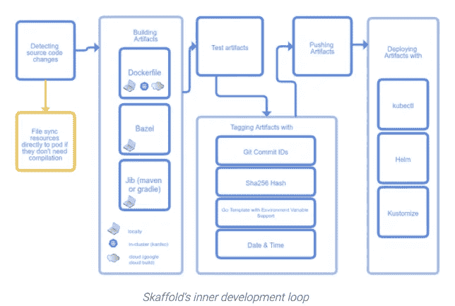
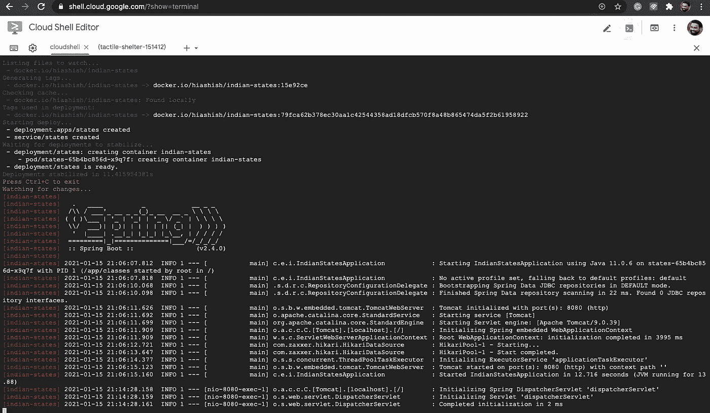
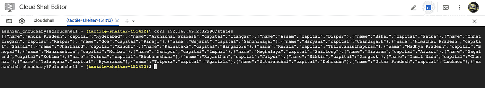

# Kubernetes via Skaffold 上 Spring Boot 应用的 CI/CD 工作流

> 原文：<https://medium.com/javarevisited/skaffolding-springboot-application-dbfbc463e558?source=collection_archive---------1----------------------->

> 在本文中，我们将学习如何使用 Skaffold 为部署到 Kubernetes 的 Spring Boot 应用程序创建本地 CI/CD 工作流。


图像源 Skaffold

众所周知，用 Kubernetes 开发应用程序很麻烦。这就是围绕它开发一个生态系统的原因，以便开发人员可以专注于对他们最重要的事情，即编写代码。在这篇文章中，我将介绍由谷歌开发的另一个工具 Skaffold。

## 那么斯卡福德到底是什么？

> Skaffold 处理构建、推送和部署应用程序的工作流。

## 它试图解决什么问题？

正如我之前说过的，用 [Kubernetes](/javarevisited/7-free-online-courses-to-learn-kubernetes-in-2020-3b8a68ec7abc) 开发应用程序并不是一件容易的事情，这就是 Skaffold 发挥作用的地方，因为它简化了在 Kubernetes 上运行的应用程序的开发和部署。它管理整个工作流程，当您在本地或远程[Kubernetes](/javarevisited/top-10-free-courses-to-learn-jenkins-docker-and-kubernetes-for-devops-in-2020-best-of-lot-62a0541ffeb3)集群上开发和部署应用程序时，您可以获得即时反馈。



图片来源谷歌

## 斯卡福德福利

以下是使用 Skaffold 的一些好处。

*   **轻量级**

它只是一个客户端实用程序，所以不需要设置集群或维护任何东西。

*   **轻松分享**

在你的团队成员中分享非常容易，因为你只需要做以下事情就可以开始了。

```
git clone
skaffold run
```

*   **易于开发**

要使你的应用程序容器化，甚至在本地，你必须做很多事情。对于您的本地开发，您可能会在 Kubernetes[上构建、推送、然后部署您的应用程序。](/javarevisited/top-15-online-courses-to-learn-docker-kubernetes-and-aws-for-fullstack-developers-and-devops-d8cc4f16e773)

还有一组不同的命令(docker blah，kubectl blah blah，等等。)以及您在工作流程的每个阶段使用的工具。

有了 Skaffold，你只需要一个神奇的命令`skaffold run or skaffold dev`，你就是黄金。这并不意味着你不依赖那些需要你构建和部署应用到 Kubernetes 的工具。只是当您只运行一个命令时，开发要容易得多。

好的。理论到此为止，我们开始吧。

## 剖析 Spring Boot 应用程序

在本教程中，我将使用一个 [SpringBoot](/javarevisited/10-free-spring-boot-tutorials-and-courses-for-java-developers-53dfe084587e?source=collection_home---4------7-----------------------) 应用程序，当通过/states REST 端点访问该应用程序时，它会显示印度各州及其首府。该应用程序使用内存中的 H2 数据库，该数据库在应用程序开始时插入行，并将其保存在内存中。源代码可以在这里[获得。](https://github.com/yrashish/indian-states)

## 先决条件

对于此演示，需要安装以下软件。

1.  安装 [Skaffold](https://skaffold.dev/docs/install/)
2.  为 [Mac](https://docs.docker.com/docker-for-mac/install/) 安装 Docker 桌面
3.  安装 [kubectl](https://v1-18.docs.kubernetes.io/docs/tasks/tools/install-kubectl/)
4.  Minikube(可选)

我用过 macOS，但是你可以自由使用任何你喜欢的或者有经验的操作系统。我提到 Minikube 安装是可选的，因为如果你已经安装了 [Docker](/javarevisited/10-free-courses-to-learn-docker-and-devops-for-frontend-developers-691ac7652cee) desktop，你可以通过以下步骤启用 Kubernetes。

## 使用 Docker Desktop for Mac 启用 Kubernetes

*   前往 Docker 菜单栏中的偏好设置，然后点按 Kubernetes 标签。点击复选框启用 Kubernetes，并将默认编排器切换到 [Kubernetes](https://javarevisited.blogspot.com/2020/06/top-5-courses-to-learn-kubernetes-for-devops-and-certification.html) 。启用 Kubernetes 需要一些时间。
*   一旦它被启用，你会在你的 [Docker](https://javarevisited.blogspot.com/2019/05/top-5-courses-to-learn-docker-and-kubernetes-for-devops.html) 菜单栏上看到如下内容。您还应该将上下文更改为 docker-desktop。


*Kubernetes 启用*


*Kubernetes 运行*


*上下文设置为 docker-desktop*

## 【Skaffold 入门

*   **使用 *skaffold init* 命令**

从 Skaffold 开始，你需要一个`skaffold.yaml`文件。为此，我们可以运行下面的命令。

```
*skaffold init*
```

但是，您将会看到下面的错误消息。

```
skaffold init
one or more valid builder configuration (Dockerfile or Jib configuration) must be present to build images with skaffold; please provide at least one build config and try again or run `skaffold init --skip-build`
```

这个错误似乎是不言自明的，即 Skaffold 正在您的项目中寻找 Dockerfile 或 Jib 配置。

Skaffold 目前支持以下构建器。

1.  [码头工人](https://skaffold.dev/docs/pipeline-stages/builders/docker/)
2.  [三角帆](https://skaffold.dev/docs/pipeline-stages/builders/jib/)(带`--XXenableJibInit`旗)
3.  [构建包](https://skaffold.dev/docs/pipeline-stages/builders/buildpacks/)(带有`--XXenableBuildpacksInit`标志)

因此，为了解决这个错误，我将在 pom.xml 文件中添加 Jib maven 插件。如果你想知道什么是 Jib 及其用法，你可以阅读我以前的文章。您可以通过将以下内容复制/粘贴到 pom.xml 文件来启用 Jib 支持。

```
<plugin>
   <groupId>com.google.cloud.tools</groupId>
   <artifactId>jib-maven-plugin</artifactId>
   <version>2.7.0</version>
   <configuration>
      <from>
         <image>gcr.io/distroless/java:11</image>
      </from>
      <to>
         <image>registry.hub.docker.com/hiashish/indian-states</image>
      </to>
   </configuration>
</plugin>
```

根据官方[文件](https://skaffold.dev/docs/pipeline-stages/init/)。

> `skaffold` init 也能识别 Maven 和 Gradle 项目，并且会自动建议`[jib](https://skaffold.dev/docs/pipeline-stages/builders/#/local#jib-maven-and-gradle)`构建器。目前`jib`伪像检测默认禁用，但可以使用标志`--XXenableJibInit`启用。

现在用`*--XXenableJibInit.*` 运行`skaffold init`，但是，它将再次失败，并显示以下错误。

```
skaffold init --XXenableJibInit
one or more valid Kubernetes manifests are required to run skaffold
```

因为我们还没有创建 Kubernetes 清单(部署、pod、服务等。)Skaffold 有一个已知的[问题](https://github.com/GoogleContainerTools/skaffold/issues/1651)，为了解决这个错误，我们必须使用下面的`kubectl` 命令手动创建它们。

*创建部署*

```
kubectl create deployment states --image=docker.io/hiashish/indian-states --dry-run -oyamlapiVersion: apps/v1
kind: Deployment
metadata:
  creationTimestamp: null
  labels:
    app: states
  name: states
spec:
  replicas: 2
  selector:
    matchLabels:
      app: states
  strategy: {}
  template:
    metadata:
      creationTimestamp: null
      labels:
        app: states
    spec:
      containers:
        - image: docker.io/hiashish/indian-states
          name: indian-states
          resources: {}
status: {}
```

*创建服务*

```
kubectl expose deployment states --type=NodePort --port=8080 --dry-run -oyamlapiVersion: v1
kind: Service
metadata:
  creationTimestamp: null
  labels:
    app: states
  name: states
spec:
  ports:
    - port: 8080
      protocol: TCP
      targetPort: 8080
  selector:
    app: states
  type: NodePort
status:
  loadBalancer: {}
```

我们现在已经创建了部署和服务。请确保将上述命令的输出复制到`k8s`目录下的 YAML 文件中。

现在运行`skaffold init --XXenableJibInit`

```
skaffold init --XXenableJibInitapiVersion: skaffold/v2beta10
kind: Config
metadata:
  name: indian-states
build:
  artifacts:
  - image: docker.io/hiashish/indian-states
    jib:
      project: com.example:indian-states
deploy:
  kubectl:
    manifests:
    - k8s/mydeployment.yaml
    - k8s/myservice.yamlDo you want to write this configuration to skaffold.yaml? [y/n]: y
Configuration skaffold.yaml was written
You can now run [skaffold build] to build the artifacts
or [skaffold run] to build and deploy
or [skaffold dev] to enter development mode, with auto-redeploy
```

最后，`skaffold.yaml`文件被创建。

*   **使用 *skaffold dev* 命令**

现在，我们已经完成了开始持续构建和部署 Kubernetes 应用程序所需的设置。现在，我们可以简单地运行下面的命令，在本地启动我们的 [CI/CD 工作流](https://javarevisited.blogspot.com/2018/09/top-5-jenkins-courses-for-java-and-DevOps-Programmers.html)。

```
skaffold dev
Listing files to watch...
 - docker.io/hiashish/indian-states
Generating tags...
 - docker.io/hiashish/indian-states -> docker.io/hiashish/indian-states:31ff588-dirty
Checking cache...
 - docker.io/hiashish/indian-states: Found Locally
Tags used in deployment:
 - docker.io/hiashish/indian-states -> docker.io/hiashish/indian-states:43f7c470a60b876c7579ed3041b64024b774e9808851ad83b6817701d0188cc5
Starting deploy...
 - deployment.apps/states created
 - service/states created
Waiting for deployments to stabilize...
 - deployment/states is ready.
Deployments stabilized in 2.710870355s
Press Ctrl+C to exit
Watching for changes...
[indian-states] 
[indian-states]   .   ____          _            __ _ _
[indian-states]  /\\ / ___'_ __ _ _(_)_ __  __ _ \ \ \ \
[indian-states] ( ( )\___ | '_ | '_| | '_ \/ _` | \ \ \ \
[indian-states]  \\/  ___)| |_)| | | | | || (_| |  ) ) ) )
[indian-states]   '  |____| .__|_| |_|_| |_\__, | / / / /
[indian-states]  =========|_|==============|___/=/_/_/_/
[indian-states]  :: Spring Boot ::                (v2.4.0)
[indian-states] 
[indian-states] 2020-12-07 17:43:54.919  INFO 1 --- [           main] c.e.i.IndianStatesApplication            : Starting IndianStatesApplication using Java 11.0.6 on states-6f5bb746b6-9sglw with PID 1 (/app/classes started by root in /)
[indian-states] 2020-12-07 17:43:54.938  INFO 1 --- [           main] c.e.i.IndianStatesApplication            : No active profile set, falling back to default profiles: default
[indian-states] 2020-12-07 17:43:57.607  INFO 1 --- [           main] .s.d.r.c.RepositoryConfigurationDelegate : Bootstrapping Spring Data JDBC repositories in DEFAULT mode.
[indian-states] 2020-12-07 17:43:57.670  INFO 1 --- [           main] .s.d.r.c.RepositoryConfigurationDelegate : Finished Spring Data repository scanning in 35 ms. Found 0 JDBC repository interfaces.
[indian-states] 2020-12-07 17:44:00.130  INFO 1 --- [           main] o.s.b.w.embedded.tomcat.TomcatWebServer  : Tomcat initialized with port(s): 8080 (http)
[indian-states] 2020-12-07 17:44:00.189  INFO 1 --- [           main] o.apache.catalina.core.StandardService   : Starting service [Tomcat]
[indian-states] 2020-12-07 17:44:00.196  INFO 1 --- [           main] org.apache.catalina.core.StandardEngine  : Starting Servlet engine: [Apache Tomcat/9.0.39]
[indian-states] 2020-12-07 17:44:00.387  INFO 1 --- [           main] o.a.c.c.C.[Tomcat].[localhost].[/]       : Initializing Spring embedded WebApplicationContext
[indian-states] 2020-12-07 17:44:00.388  INFO 1 --- [           main] w.s.c.ServletWebServerApplicationContext : Root WebApplicationContext: initialization completed in 5249 ms
[indian-states] 2020-12-07 17:44:01.673  INFO 1 --- [           main] com.zaxxer.hikari.HikariDataSource       : HikariPool-1 - Starting...
[indian-states] 2020-12-07 17:44:02.375  INFO 1 --- [           main] com.zaxxer.hikari.HikariDataSource       : HikariPool-1 - Start completed.
[indian-states] 2020-12-07 17:44:03.216  INFO 1 --- [           main] o.s.s.concurrent.ThreadPoolTaskExecutor  : Initializing ExecutorService 'applicationTaskExecutor'
[indian-states] 2020-12-07 17:44:04.050  INFO 1 --- [           main] o.s.b.w.embedded.tomcat.TomcatWebServer  : Tomcat started on port(s): 8080 (http) with context path ''
[indian-states] 2020-12-07 17:44:04.095  INFO 1 --- [           main] c.e.i.IndianStatesApplication            : Started IndianStatesApplication in 10.782 seconds (JVM running for 12.991)
```

如您所见，应用程序现在已经构建并部署到本地 Kubernetes 集群。我们首先必须使用`kubectl` 命令检查我们的应用程序的`NodePort`,以便在本地访问应用程序。

```
kubectl get allNAME                          READY   STATUS    RESTARTS   AGEpod/states-7c55b8d5b6-vx5hq   1/1     Running   0          5m47sNAME                 TYPE        CLUSTER-IP       EXTERNAL-IP   PORT(S)          AGEservice/kubernetes   ClusterIP   10.96.0.1        <none>        443/TCP          21hservice/states       NodePort    10.110.135.236   <none>        8080:30925/TCP   5m47sNAME                     READY   UP-TO-DATE   AVAILABLE   AGEdeployment.apps/states   1/1     1            1           5m48sNAME                                DESIRED   CURRENT   READY   AGEreplicaset.apps/states-7c55b8d5b6   1         1         1       5m48s
```

`NodePort`分配给我们的申请是 30925。让我们调用应用程序的/states REST 端点，看看会发生什么。

```
curl localhost:30925/states[{"name":"Andra Pradesh","capital":"Hyderabad"},{"name":"Arunachal Pradesh","capital":"Itangar"},{"name":"Assam","capital":"Dispur"},{"name":"Bihar","capital":"Patna"},{"name":"Chhattisgarh","capital":"Raipur"},{"name":"Goa","capital":"Panaji"},{"name":"Gujarat","capital":"Gandhinagar"},{"name":"Haryana","capital":"Chandigarh"},{"name":"Himachal Pradesh","capital":"Shimla"},{"name":"Jharkhand","capital":"Ranchi"},{"name":"Karnataka","capital":"Bangalore"},{"name":"Kerala","capital":"Thiruvananthapuram"},{"name":"Madhya Pradesh","capital":"Bhopal"},{"name":"Maharashtra","capital":"Mumbai"},{"name":"Manipur","capital":"Imphal"},{"name":"Meghalaya","capital":"Shillong"},{"name":"Mizoram","capital":"Aizawi"},{"name":"Nagaland","capital":"Kohima"},{"name":"Orissa","capital":"Bhubaneshwar"},{"name":"Rajasthan","capital":"Jaipur"},{"name":"Sikkim","capital":"Gangtok"},{"name":"Tamil Nadu","capital":"Chennai"},{"name":"Telangana","capital":"Hyderabad"},{"name":"Tripura","capital":"Agartala"},{"name":"Uttaranchal","capital":"Dehradun"},{"name":"Uttar Pradesh","capital":"Lucknow"},{"name":"West Bengal","capital":"Kolkata"},{"name":"Punjab","capital":"Chandigarh"}]
```

这看起来棒极了！！！

让我们做一个小的代码更改，看看 Skaffold 能否重新触发整个工作流。我将把部署 YAML 文件中的`replicas`从 1 改为 2，看看 Skaffold 是否可以用增加的`replicas`重新部署应用程序。

*应用程序重新部署*

```
Tags used in deployment:
 - docker.io/hiashish/indian-states -> docker.io/hiashish/indian-states:43f7c470a60b876c7579ed3041b64024b774e9808851ad83b6817701d0188cc5
Starting deploy...
 - deployment.apps/states configured
Waiting for deployments to stabilize...
 - deployment/states is ready.
Deployments stabilized in 4.109550864s
Watching for changes...
[indian-states] 
[indian-states]   .   ____          _            __ _ _
[indian-states]  /\\ / ___'_ __ _ _(_)_ __  __ _ \ \ \ \
[indian-states] ( ( )\___ | '_ | '_| | '_ \/ _` | \ \ \ \
[indian-states]  \\/  ___)| |_)| | | | | || (_| |  ) ) ) )
[indian-states]   '  |____| .__|_| |_|_| |_\__, | / / / /
[indian-states]  =========|_|==============|___/=/_/_/_/
[indian-states]  :: Spring Boot ::                (v2.4.0)
[indian-states]
```

现在再次检查我们使用 kubectl 的应用程序的`replicaset`。

```
kubectl get all
NAME                          READY   STATUS    RESTARTS   AGEpod/states-7c55b8d5b6-br9zx   1/1     Running   0          20spod/states-7c55b8d5b6-vx5hq   1/1     Running   0          16mNAME                 TYPE        CLUSTER-IP       EXTERNAL-IP   PORT(S)          AGEservice/kubernetes   ClusterIP   10.96.0.1        <none>        443/TCP          21hservice/states       NodePort    10.110.135.236   <none>        8080:30925/TCP   16mNAME                     READY   UP-TO-DATE   AVAILABLE   AGEdeployment.apps/states   2/2     2            2           16mNAME                                DESIRED   CURRENT   READY   AGEreplicaset.apps/states-7c55b8d5b6   2         2         2       16m
```

如您所见，在重新部署后，副本数量增加到了预期的 2 个。

*   **使用 *skaffold run* 命令**

这与`skaffold dev`相似，但主要区别在于`skaffold.yaml`中描述的工作流只执行一次。建议在您的生产工作流程中使用。

## 使用云壳

如果您已经在本地安装了所有需要的依赖项(docker、minikube、skaffold ),那么就可以了，否则您可以跳过安装部分，正如我在前面的先决条件部分所描述的，使用 Google 的 Cloud [Shell](https://cloud.google.com/shell) 来复制您的本地 Kubernetes 环境。

云壳提供了一个基于浏览器的终端/CLI 和编辑器，它预装了 Skaffold、Minikube 和 Docker，并且是免费的。

只需运行以下命令就可以了。确保 docker 和 minikube 在云壳环境中启动并运行。

```
git clone [https://github.com/yrashish/indian-states](https://github.com/yrashish/indian-states`)
skaffold dev
```

以下是来自云壳的截图。



云壳



输出

正如你在上面看到的，我们也能够用云壳运行我们的 Spring Boot 应用程序，并得到预期的输出。

## 结论

在本文中，我只是介绍了 Skaffold 提供的一些特性。还有许多其他值得关注的特性，比如用于调试的端口转发、健康检查和模板化部署配置等。对于 Kubernetes 应用程序的持续部署，值得考虑 Skaffold。

## 支持我

如果你喜欢你刚刚读到的，你可以给我买杯咖啡。

[](https://www.buymeacoffee.com/meashish)

## **延伸阅读**

也可以看看我之前的一些[文章](https://ashish-choudhary.medium.com/containerizing-springboot-application-with-jib-716daa3e0850)。