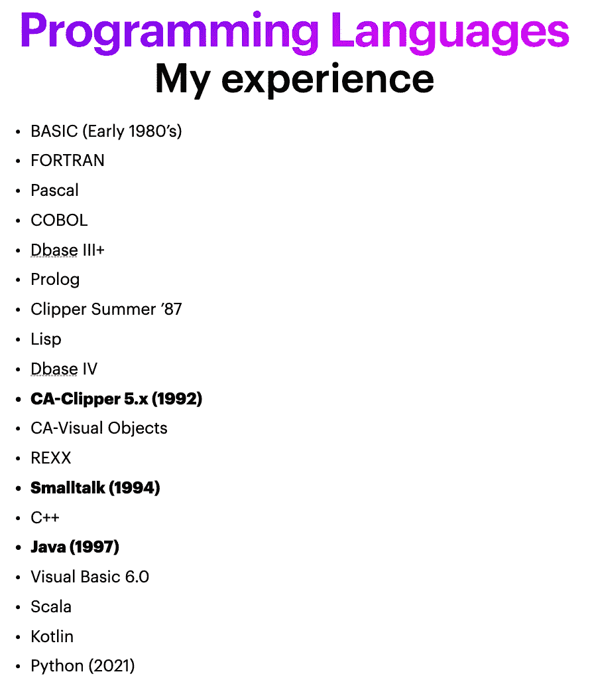
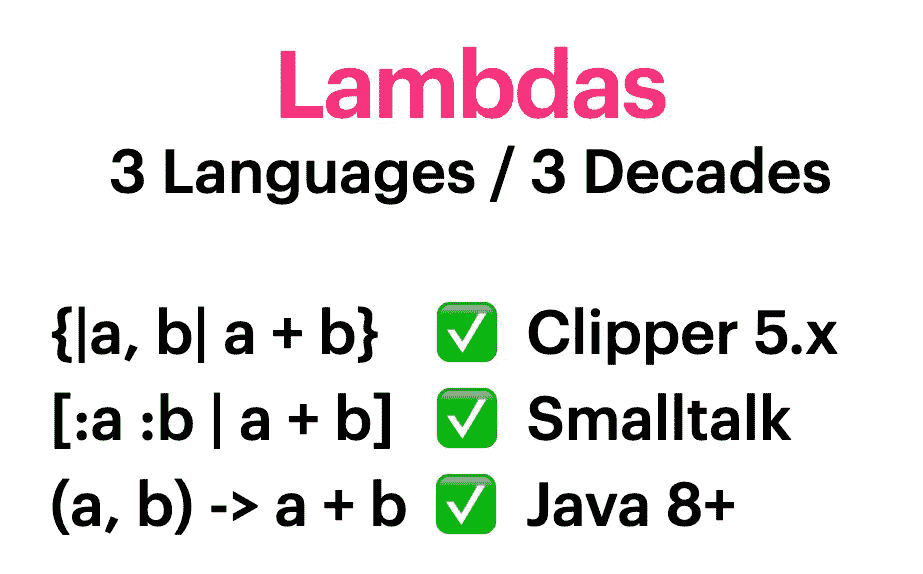
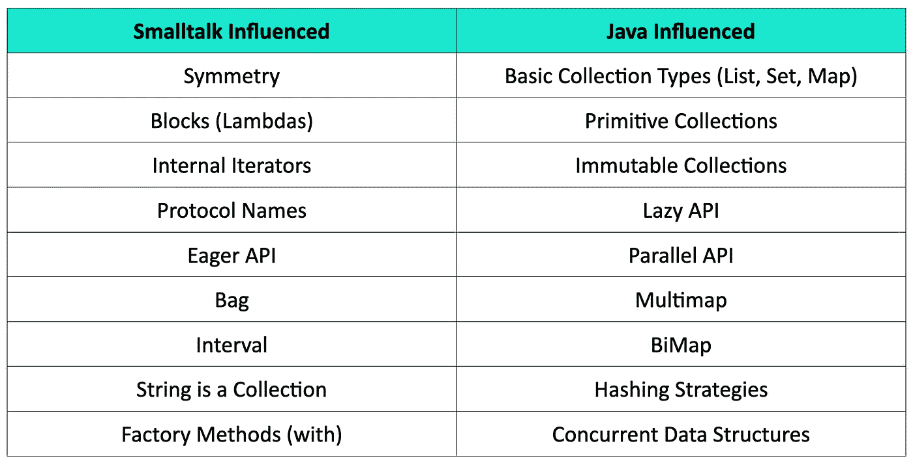
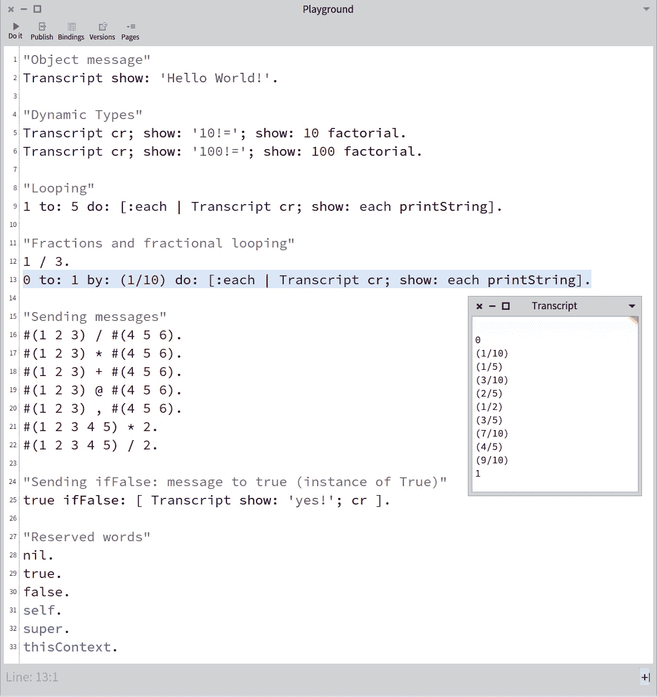

# Smalltalk 还是 Java？为什么不能两者兼得！

> 原文：<https://medium.com/javarevisited/smalltalk-or-java-why-not-both-5564abd17f1a?source=collection_archive---------0----------------------->

了解 Smalltalk 和 Java 如何影响了 [Eclipse 集合](https://github.com/eclipse/eclipse-collections),以及如何帮助您成长为一名开发人员。

Pharo 10.0 和 Intellij IDEA 2022.1

# 与 Smalltalk 一起散步

2022 年 5 月 12 日，我做了一个题为“Smalltalk 还是 Java？为什么不两者兼得！”匹兹堡 Java 用户组。见面会由 [Sirisha Pratha](https://medium.com/u/8fe7c47c374f?source=post_page-----5564abd17f1a--------------------------------) 和 [Rinat Gatyatullin](https://medium.com/u/6578859a4ea6?source=post_page-----5564abd17f1a--------------------------------) 主持。这个演讲被录了下来，现在可以在 Pittsburgh JUG YouTube 频道上看到(视频链接如下)。我使用 [Pharo 10.0](https://pharo.org/) 和 [IntelliJ IDEA 2022.1](https://www.jetbrains.com/idea/) 演示了一些在 Smalltalk 和 Java/ [Eclipse 集合](https://github.com/eclipse/eclipse-collections)代码示例之间来回切换的语言和库特性。

这个演讲对我来说很有趣。我专业地在 [Smalltalk](https://en.wikipedia.org/wiki/Smalltalk) 中编程已经 22 年了。一位与会者问我之前使用的是哪种 Smalltalk。我回答说我用 IBM [VisualAge](https://en.wikipedia.org/wiki/VisualAge) 为 Smalltalk 编程。我还提到我是用 IBM VisualAge for Java 开始学习 Java 的，它是用 VisualAge for Smalltalk 实现的。VisualAge for Java 最终会发展成 Eclipse IDE，这是 IBM 在 20 多年前开源的。

# 四十年来，作为一名开发人员

我已经编程 40 年了。这是我编程时使用的大多数语言的列表。

从 20 世纪 80 年代早期到 21 世纪 20 年代早期的编程经验

# 三十年，三种语言和三种 Lambda 语法

在过去的 30 年里，我用三种不同的语言进行专业编程，这三种语言对我作为一名开发人员的思维过程产生了持久的影响。这三种语言都支持 lambdas。

Clipper 5.x、Smalltalk 和 Java 8+的 Lambda 语法

在演讲中，我解释说我再也无法想象自己用一种不支持 lambdas 的语言编程了。

# 博客参考

我在演讲中引用了以下博客链接。我在现场编码会议中分享的代码可以在博客中找到。我还详细解释了如何使用 Pharo Smalltalk IDE。

## 闲聊

<https://blog.devgenius.io/a-little-smalltalk-for-the-soul-b12051b709d1>  <https://donraab.medium.com/exploring-the-smalltalk-collections-api-in-unit-tests-using-pharo-8-0-2f62cfc8410d>  

## 带有 Eclipse 集合的 Java

</javarevisited/blog-series-the-missing-java-data-structures-no-one-ever-told-you-about-17f34cc4b7e2>  </javarevisited/my-25-favorite-eclipse-collections-apis-a51589ee5c4a>  

## Smalltalk 和 Java

</javarevisited/java-streams-are-great-but-its-time-for-better-java-collections-42d2c04235d1>  <https://donraab.medium.com/comparing-my-smalltalk-and-eclipse-collections-wordle-kata-solutions-4058ac7d8ca0>  

# Eclipse 集合= Smalltalk + Java

Eclipse Collections 是两个令人惊叹的编程世界之间的桥梁。下面的表格解释了这两种编程语言对现已有 18 年历史的开源 Java 库的影响。

Eclipse 系列中两个世界的最佳产品

# 我的 Pharo 游乐场

下面是 Pharo playground 的快照，我用它作为 REPL 来突出显示和执行代码。图像中`Transcipt`的输出是执行高亮代码的结果。我注意到了`Interval`在 Smalltalk 中的包容性，当您使用分数步进时，Smalltalk 会尽可能地自动减少分数。我提到过[月食系列](https://github.com/eclipse/eclipse-collections)中有`Interval`、`IntInterval`和`LongInterval`。

Pharo Smalltalk 游乐场

# 学习多种语言

学习多种语言可以帮助我们成长为开发人员。有很多编程语言需要学习。我相信学习像 Lisp 和 Smalltalk 这样的经典语言和学习闪亮的新编程语言一样有价值。像 Lisp 和 Smalltalk 这样的经典语言继续发展并解决新的问题。在准备这次演讲的过程中，我了解了一些我不知道的关于 Smalltalk 的新东西，以及 Pharo Smalltalk IDE 中一些很酷的特性。Pharo Smalltalk 中的 Collections API 似乎在继续发展。我希望通过举办更多这样的讲座，Java 和 Smalltalk 社区能够了解我们在 Eclipse 集合中实现的新东西。

我希望将来能为 Pharo Smalltalk 实现一个 Lazy Iterable 库。当然，一旦我有时间，我会开源这个库。

分享是关怀。

一旦视频在 YouTube 上发布，我会在这里发布一个链接。敬请期待！

# 更新:视频

*我是*[*Eclipse Collections*](https://github.com/eclipse/eclipse-collections)*OSS 项目在*[*Eclipse Foundation*](https://projects.eclipse.org/projects/technology.collections)*的项目负责人。* [*月食收藏*](https://github.com/eclipse/eclipse-collections) *是开投* [*投稿*](https://github.com/eclipse/eclipse-collections/blob/master/CONTRIBUTING.md) *。如果你喜欢这个库，你可以在 GitHub 上让我们知道。*