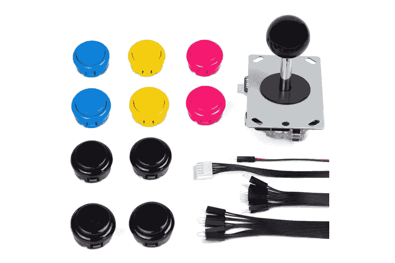
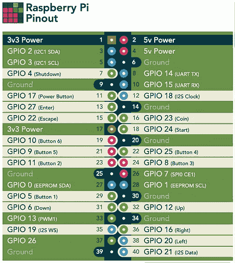
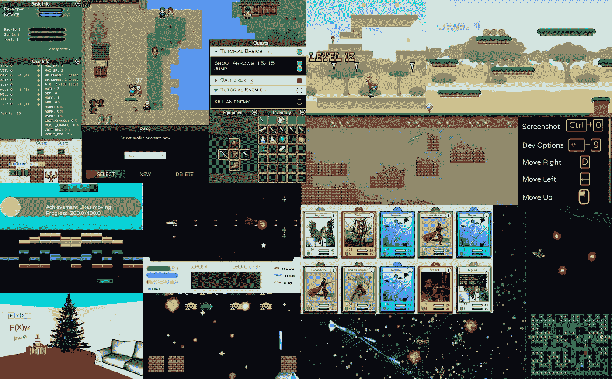

# 在三个结对编程会话中使用 JavaFX FXGL 的贪吃蛇游戏

> 原文：<https://medium.com/javarevisited/snake-game-with-javafx-fxgl-in-three-pair-programming-sessions-a42af8458360?source=collection_archive---------1----------------------->

在本文中， [Almas](https://twitter.com/AlmasBaim) 和我将向您展示如何从一个游戏创意开始，并在原型应用程序中实现它。然后，我们将修改应用程序，使其在 Raspberry Pi 和移动设备上运行。

给你一些背景知识，不久前我 10 岁的儿子挑战我用表情符号创造一个类似蛇的游戏。他选择了表情符号图像，我“只”需要做编程部分，简单的部分……幸运的是 Almas 问我是否有关于他的 [YouTube 频道](https://www.youtube.com/channel/UCmjXvUa36DjqCJ1zktXVbUA/videos)的结对编程的话题，他的问题变成了一个由三部分组成的系列。我的儿子很高兴，因为他的想法现在是一个真正的游戏！

# 创建贪吃蛇游戏的基础

对于第一个视频，我们从我准备的最小项目开始，包含我儿子选择的图像和一些基本代码。要解决的第一个挑战是用多种元素制作一条蛇。

通过对蛇头和身体元素的位置使用固定的网格，制作一条成长中的蛇变得非常简单且易于操作。

[游戏代码](https://github.com/FDelporte/JavaFXGameSnake) — [FXGL](https://github.com/AlmasB/FXGL​)

# 在 Raspberry Pi 上使用操纵杆进行控制

用真的操纵杆控制游戏不是很好玩吗？这是我们第二个视频中的挑战，我们使用第一个视频的源代码来扩展它们，并使它们在带有物理控制器的 Raspberry Pi 上运行。

[](https://www.youtube.com/watch?v=dzoMl8zJe_M)

Pi4J 项目为 Java 程序员提供了**友好的面向对象的 I/O API 和实现库，以访问 Raspberry Pi 平台**的**全部 I/O 功能。这使得它成为将它集成到我们的贪吃蛇游戏中的理想起点。**

多亏了 FXGL 提供的一些巧妙的方法，可以像按键一样处理 GPIO(通用输入/输出)的变化。这样，游戏在键盘按键和游戏杆事件下的行为完全相同，这使得在开发 PC 和带有游戏杆和按钮的 Raspberry Pi 上测试和玩游戏变得很容易。

```
import static com.almasb.fxgl.dsl.FXGLForKtKt.getExecutor;var input = pi4j.create(DigitalInput.newConfigBuilder(pi4j)
   .id(id)
   .address(bcm)
   .pull(PullResistance.PULL_UP)
   .debounce(3000L)
   .provider("pigpio-digital-input"));input.addListener(e -> {
   if (e.state() == DigitalState.LOW) {
      console.println("Input change for " + id);
      getExecutor().startAsyncFX(() -> 
         getInput().mockKeyPress(keyCode));
   } else {
      getExecutor().startAsyncFX(() -> 
         getInput().mockKeyRelease(keyCode));
   }
});
```

[源扩展与 Pi4](https://github.com/Pi4J/pi4j-example-fxgl)
[街机套件](https://www.kiwi-electronics.nl/pim-471?search=arcade&description=true) + [帽子](https://www.kiwi-electronics.nl/index.php?route=product/product&search=arcade&description=true&product_id=4337)
[街机帽子 GPIO 编号](https://pinout.xyz/pinout/picade_hat)
[Pi4J 网站:入门](https://pi4j.com/getting-started/)，安装 Visual Studio 代码，示例项目…
[树莓 Pi 4](https://www.raspberrypi.org/products/raspberry-pi-4-model-b/)
[树莓 Pi OS +成像仪工具](https://www.raspberrypi.org/software/)

# 将游戏变成移动应用

在第三个视频中，我们用食物扩展了游戏，并通过集成胶子工具和屏幕操纵杆使其可以在智能手机上玩。GitHub 项目包含为 Mac OS、Windows、 [Linux](/javarevisited/top-10-courses-to-learn-linux-command-line-in-2020-best-and-free-f3ee4a78d0c0?source=collection_home---4------0-----------------------) 和 [Android](/hackernoon/top-5-courses-to-learn-android-for-java-programmers-667e03d995b4) 构建原生应用的工作流。最后一家公司还发布了 Google Play 的新版本。这是受 Foojay 文章[“使用 Gluon Mobile 和 GitHub 操作的单个 JavaFX 项目的多种设备的原生应用程序”](https://foojay.io/today/native-applications-for-multiple-devices-from-a-single-javafx-project-with-gluon-mobile-and-github-actions/)的启发。

[游戏源码用 GitHub actions 构建并部署到 Google Play](https://github.com/FDelporte/JavaFXGameSnakeApp)
[游戏在谷歌 Play 商店](https://play.google.com/store/apps/details?id=be.webtechie.emojisnakegameapp)

# 结论

**游戏开发用 Java？当然啦！**这些视频只向你展示了一些入门技巧，但可能性是无穷的。

查看以下链接了解更多信息:

*   FXGL 游戏:[https://github.com/AlmasB/FXGLGames](https://www.youtube.com/redirect?event=video_description&redir_token=QUFFLUhqa3pZZ0dzQVNaSC1lSlpaNHFsZVNTM3JPRkIyUXxBQ3Jtc0ttRUVnUGdZazFaYkZ2QXlHTENPVVpsNGl0b3JheEJOZlNxSDZZRVNFNTU0VmdJWXBjU0p4V2dCWlh3R1dkWHJHYlRBc2pKWnlCVFgxMkVsY2VUbGFOUnMwQUcxX2k3SHdaQW9TU2J1YldDbmJrNUIwOA&q=https%3A%2F%2Fgithub.com%2FAlmasB%2FFXGLGames)
*   FXGL 游戏引擎:【https://github.com/AlmasB/FXGL 

这都是我们乡亲送的！敬请关注我们未来的游戏开发冒险！



*原载于 2021 年 5 月 4 日*[*https://foojay . io*](https://foojay.io/today/creating-a-snake-game-with-javafx-fxgl-in-three-pair-programming-sessions/)*。*