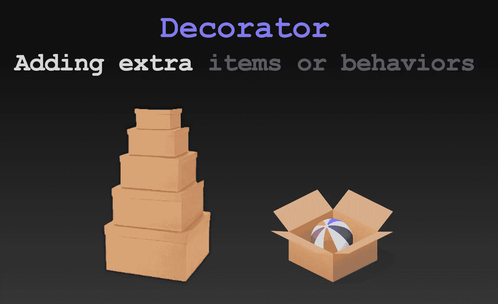
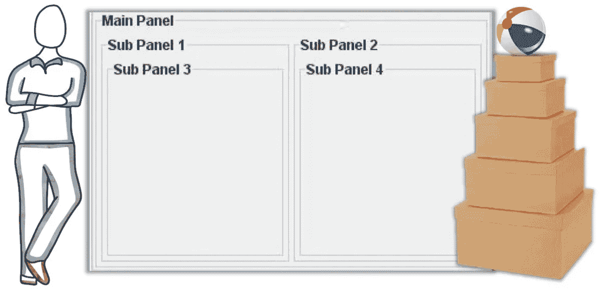
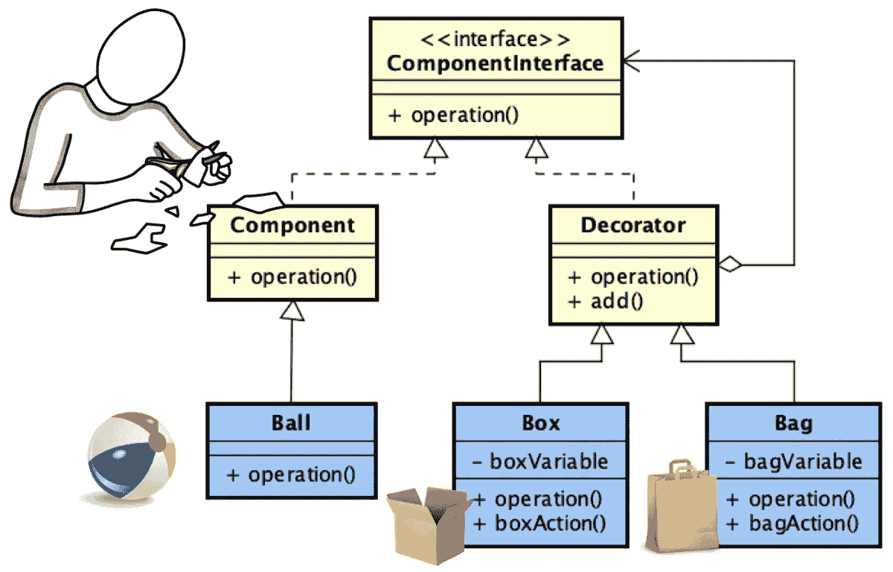
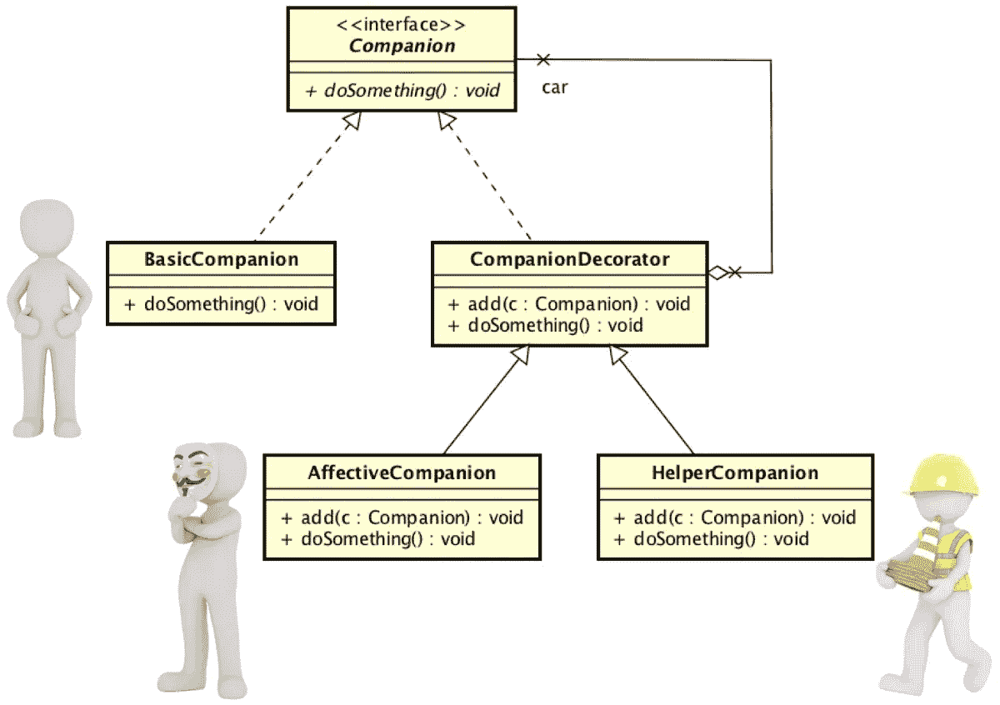

# 软件设计模式:装饰者

> 原文：<https://medium.com/javarevisited/software-design-patterns-decorator-in-a-nutshell-eefd2025ea3c?source=collection_archive---------1----------------------->



我们来谈谈**结构设计模式**。模式帮助我们连接类和对象，以便形成更大的结构。**装饰**是结构类别**中的一种图案。**

# 目标

装饰模式**允许扩展(装饰)一个对象的功能。它是继承的另一种选择。Decorator 在运行时为特定的实例提供新的功能，而继承在编译时添加功能，这种变化会影响新类的所有实例。**

例如，从类 **Person** 中，我们可以扩展类 **Student** ，为 Person 添加功能，然后我们可以选择创建 Person(简单的那个)或 Student(有额外功能的那个)的实例:

```
Person javier = new Person();
Student mary = new Student();
```

装饰器的主要思想是实现类似的结果，但是使用的方法在代码中可能如下所示:

```
Person javier = new Person();
StudentCredential **studentCredential** = new StudentCredential();
javier.**add**(studentCredential);
```

我们通过添加以前没有的来装饰一个 **Person** 实例。我们创建了一个完全独立于的新类，拥有我们想要添加到另一个类中的任何新特性或行为，而不是应用继承和添加东西到新类中。

什么时候使用继承，什么时候使用装饰模式？嗯，要考虑的最重要的因素之一是是否需要多态行为。如果你不需要多态，你可能不应该使用继承。🤔



图一。物品和装饰者可以多次装饰。一个球可以用一个盒子来装饰，这个盒子可以用另一个盒子来装饰，以此类推。因为 UI 元素可以被添加到一个面板，该面板可以被添加到另一个面板，等等。

现在，让我们用另一个特性来改进我们的方法。想象一个有一个类**球**和一个类**盒**的系统。我们想用一个**盒子**对象来装饰一个**球**对象。

这听起来类似于**个人**和**学生凭证**的例子。容易实现。如果我们想把装有球的盒子放在另一个盒子里，或者把一个球和一个盒子放在一起，另一个球放在另一个盒子里，或者你能想象到的任何其他组合。

这听起来熟悉吗？如图 1 所示，只要把我们的类 **Ball** 想象成类 **JButton** (在 Java API 中)，把我们的类 **Box** 想象成类 **JPanel** (在 Java API 中)。Java 中的面板和小部件( **JButton** 、 **JLabel** 等)与装饰范例一起工作。小部件是基本元素。源代码应该是这样的:

```
JPanel p1 = new JPanel();
JPanel p2 = new JPanel();
JPanel p3 = new JPanel();
JButton b1 = new JButton ("one");
JButton b2 = new JButton ("two");
p1.add(b1);
p2.add(b2);
p3.add(p1);
p3.add(p1);
```

# 解决办法

与许多其他模式一样，故事从接口开始。这个接口将是装饰者和项目的公共父接口。让我们称我们的项目为组件，即创建一个类**组件**。我们的类**球**是**组件**的专门化；还有我们班**的包厢**的一个专精**的装潢师**。并且，我们可以添加更多，比如一个类**包**，它也是**装饰**的一个专门化。我们使用继承是因为我们需要多态。🙂



图二。装饰模式的类图

我们的类族如图 2 所示。黄色显示的核心包括接口，它是我们的顶级类**组件**和**装饰器**的父类。并且，我们的**组件**和**装饰器**专门化(**球**、**盒**和**袋**)的示例以蓝色显示。

只需添加一个元素，我们的工作就完成了:一个**装饰器**和**组件接口**之间的*聚合*关系。这是解决方案的核心。我们定义了"**装饰器可以有一个组件接口"*(聚合)。因此，“一个*装饰器可以有一个组件”*或*”**装饰器可以有另一个装饰器”**“新的装饰器可以有一个组件或一个附加的装饰器”*，以此类推。然后，仅仅是因为多态性的魔力:*

*   *一个**盒**可以有一个**球**；*
*   *一个**盒**可以有一个**盒**，盒内可以有一个**球**；*
*   *一个**框**可以为空(因为这是聚合，不是合成)；*

*此外，只需将多重性 *** 添加到聚合关系中，就可以定义:*

*   *一个**箱**可以有一个或多个**球**实例；而且，*
*   *一个**盒子**可以有一个或多个**盒子**实例，每个盒子可以有一个或多个**球**实例。*

*方法 *operation()* 以及类 **Box** 中的具体变量或者类 **Bag** 中的具体方法都只是例子。可以根据需要对它们进行命名和定制。让我们在一个例子的源代码中回顾一下。*

# *例子*

*装饰模式是多重继承的一种特别有趣的替代方式。想象一下一个班**人**专管一个班**老师**和一个班**学生**。然后我们想创建一个继承自老师和学生的类，因为助教是被雇佣来教书的学生。我们已经创建了一个循环依赖。*

*一些语言，比如 Java，不允许多重继承，而其他语言可能容易受到钻石问题的影响。使用 decoration，解决方案就像在基类(组件)Person 中添加两个 decorators(大概是**教学凭据**和**学生凭据**)一样简单。*

**

*图 3。应用装饰模式的另一个例子*

*让我们做一些类似的事情。我们正在开发一个**伴侣**(聊天机器人、虚拟代理或类似的东西)，我们希望定义不同类型的伴侣，包括提供帮助的伴侣(一个**帮助者伴侣**)和提供情感支持的伴侣(一个**情感伴侣**)。*

*使用继承，解决方案看起来很简单。但是，如果我们想有一个伴侣，同时又是情感和帮助者，这种情况就有问题了。一个装饰者用一个优雅的解决方案来解决这种情况，这个方案将一个同伴的核心和它的不同个性分开。图 3 显示了该解决方案的设计。源代码如以下段落所示。*

*首先是界面——我们层次结构的顶端。我们所有的同伴都有一个在名为 *doSomething()的方法中定义的行为。**

*图 4。Companion.java*

*两个类实现接口；因此，该族分为一个核心项目分支和一个可能的装饰品分支。在我们的例子中， **BasicCompanion** 是核心实体的类，而 **CompanionDecorator** 是装饰者的公共父类。我们的基本陪伴是一种行为仅限于打招呼“你好！”*

*图 5。BasicCompanion.java*

*在**company decorator**中，我们有 3 个重要元素:*

*   *属性伴侣(满足聚合关系的那个)；*
*   *一个方法 *add()* ，它将帮助我们稍后为属性提供一个值；而且，*
*   *接口方法的覆盖——关键思想，**装饰器中的动作调用被装饰的项目中的动作。**我们的方法 *doSomething()* 在 **CompanionDecorator** 中调用 doSomething()方法在任何被装饰的项目( **Companion** object)中。*

*图 6。CompanionDecorator.java*

*最后， **CompanionDecorator** 专攻 **HelperCompanion** 和 **AffectiveCompanion** 。注意，艰苦的工作已经在父类中完成了——子类只需要覆盖 *doSomething()* 方法，添加它们自己的行为。 **HelperCompanion** 印*“我是来帮你的”***affective companion**印*“我是来给你加油的”。**

*图 7。HelperCompanion.java*

*图 8。AffectiveCompanion.java*

*将这些部分放在一起，我们可以创建如图 9 中 Main 类所示的同伴。*

*输出会是这样的:*

```
*Hello!
Hello! I am here to help you. 
Hello! I am here to cheer you. I am here to help you.*
```

*没什么特别的，但你已经知道了。其他重要的创建模式包括适配器、桥、复合和代理。他们都是另一个故事的素材。希望你喜欢阅读。请在下面留下您的评论或问题。*