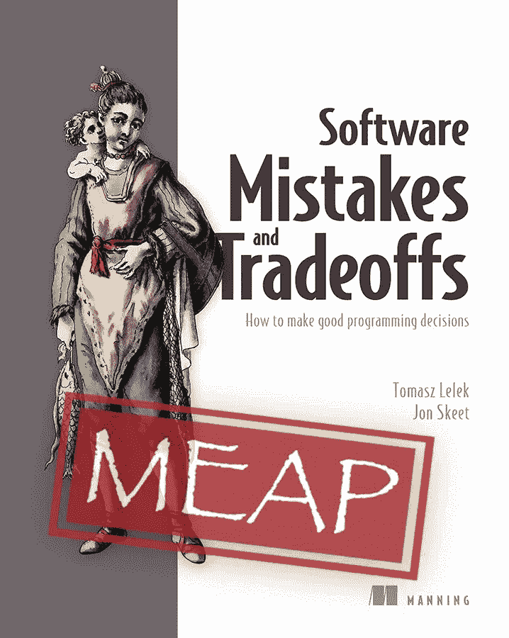

# Jon Skeet 和 Tomasz Lelek 的《软件工程错误和权衡》一书

> 原文：<https://medium.com/javarevisited/software-engineering-mistakes-and-trade-offs-book-by-jon-skeet-and-tomasz-lelek-d435aaf131c8?source=collection_archive---------2----------------------->

伙计们，你们好吗？如果你正在寻找一本有趣的软件开发书籍，那么你来对地方了。

在本文中，我将与您分享一本非常棒的软件开发书籍，它可以帮助您通过避免常见的软件开发错误来做出良好的编程决策。

是的，你猜对了？我说的是[软件工程错误和权衡](https://www.manning.com/books/software-mistakes-and-tradeoffs?a_aid=javarevisited)。托马斯·勒莱克和乔恩·斯基特关于曼宁出版。

Tomasz Lelek 和 Jon Skeet 写了一本书，讲述了参与交付软件的每个人的工作，其中充满了权衡。

我们中的许多人都在有限的时间、预算和有限的知识下工作。因此，今天关于我们正在创建的软件的决定将对未来产生影响。

后果可能包括维护成本、当需要改变时软件的不灵活性、当我们需要扩展时有限的性能等等。

重要的是要注意，每一个决定都是在特定的背景下做出的。在不完全了解决策背景的情况下，很容易对过去的决策做出判断。

然而，我们在决策时了解的越多，分析的越深入，我们就越能意识到我们的决策所带来的权衡。

这本书的作者参与并观察了许多软件决策，并了解了他们在职业生涯中强加的权衡。

一路走来，托马什开始写个人决策日志，记录做出具体决策的环境。它的背景是什么？有哪些选择？我们如何评估一个特定的解决方案，最后，它是如何结束的。

我们是否预计到了特定解决方案的所有可能的权衡？还是我们被什么东西惊到了？事实证明，这个个人的经验教训清单是非常通用的，因为这些问题和决策需要由许多工程师来解决。

此时，托马斯认为这是一个与世界分享知识的绝佳时机。这就是这本书的想法是如何诞生的。

作者希望分享他们从各种软件系统中获得的经验教训:单片、微服务、大数据处理、库等等。

*这本书将讲述现实生产系统中的决策、权衡和错误，并试图深入分析它们*。通过展示这些模式、错误和教训，作者希望拓宽你的背景，让你拥有更好的工具。当你需要在日常工作中做出这些决定时，这些知识将会帮助你。

提前看到设计的潜在问题和局限性可以在未来为您节省大量时间和金钱。这本书不会试图给你明确的答案。

当问题很复杂时，通常可以通过多种方法来解决。作者将提出一些具有挑战性的问题，并提出没有明确答案的问题。

每个解决方案都有利弊，他们会分析这些利弊。每种解决方案都会有其利弊，由您来决定哪一种最适合您的环境。

本书包含 13 章——每一章都聚焦于您在生产系统中可能遇到的实际问题。它试图分析各种背景下的每一种情况，并考虑所有的权衡。它还展示了一些不明显的错误，这些错误可能会从各种角度(不仅仅是正确性)严重影响您的系统。

*   本书涉及的一些主题有:
*   为什么代码复制并不总是坏事？代码复制与灵活性。
*   [Java 异常](https://www.java67.com/2019/06/top-25-java-exception-interview-questions-answers.html)与其他处理代码错误的模式
*   如何优化代码:过早优化与优化热路径—影响代码性能的决策
*   有效处理日期/时间数据
*   如何为你的项目选择一个合适的第三方库？
*   了解如何利用数据局部性设计您的大数据处理
*   分布式系统中如何处理交付语义？
*   对您的 API 和数据进行版本控制，使您的系统保持兼容性

还有很多。有关所有涵盖主题的列表，请查看目录。

总的来说，这是一门通过学习错误和权衡来学习你的[软件开发技能](https://dev.to/javinpaul/11-essential-skills-software-developers-should-learn-in-2020-1bio)的伟大课程。如果你对作者有任何意见或反馈，请在这里分享。这将是高度赞赏！如果决定购买，可以使用*七五折代码:* ***jrlelek35***

<https://www.manning.com/books/software-mistakes-and-tradeoffs?a_aid=javarevisited> 