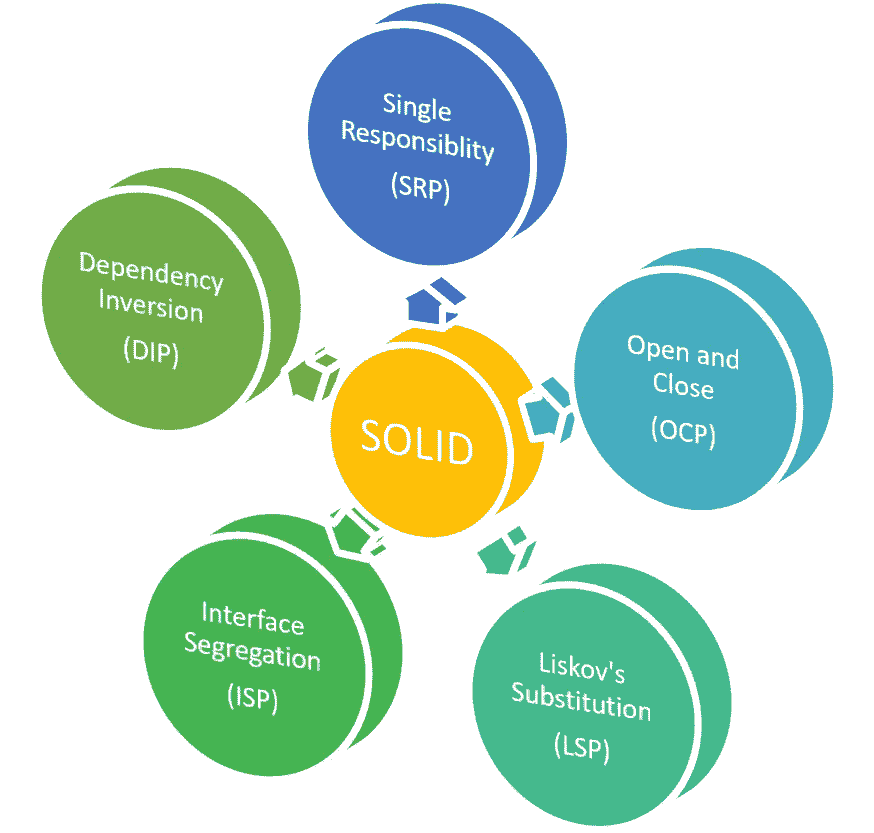
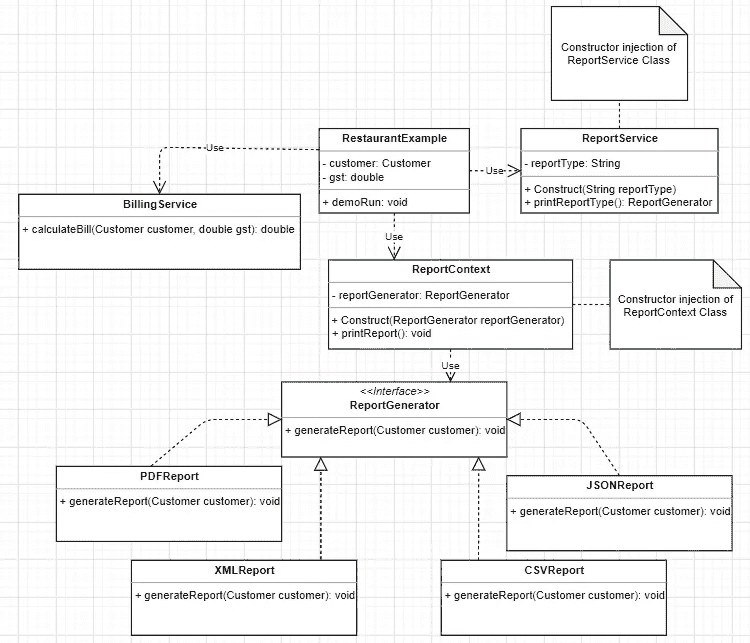
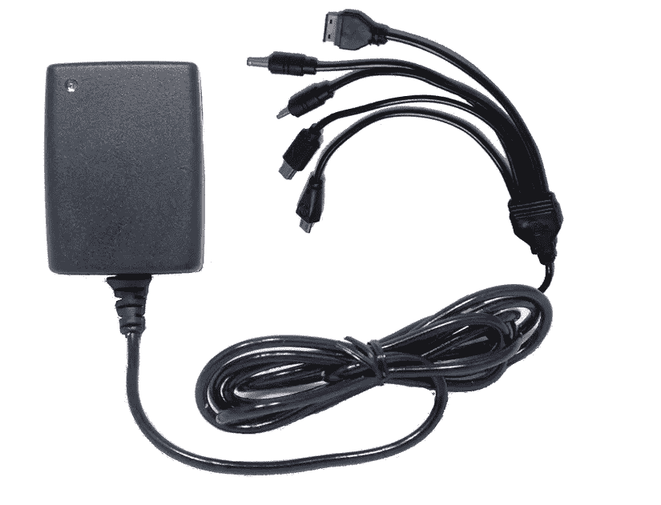

# 解释了坚实的原则

> 原文：<https://medium.com/javarevisited/solid-principle-explained-de634c6a754?source=collection_archive---------3----------------------->

坚实的原则

坚实的原则最初是由 ***Robert C Martin*** 在 2000 年的论文[设计原则和设计模式](https://fi.ort.edu.uy/innovaportal/file/2032/1/design_principles.pdf)中概念化的。尽管是迈克尔·费哲提出了固体这个缩写词。

> 在面向对象编程中，SOLID 是五个设计原则的首字母缩写，主要是为了使软件设计更容易理解、更灵活、更易维护。—维基百科

该原则是下图中给出的五个原则的缩写。

这些原则将帮助我们减少类之间的紧密耦合。意味着一组应该避免的高度相互依赖的类。

## 每个原则的详细概念都有示例

让我们以一位顾客为例，他去了一家餐馆，想要付款。在这里，客户需要什么？

1.  账单金额。
2.  生成的报告/详细报表。

让我们看看，如果账单计算和发票生成在同一个类中，RestaurantExample 类是什么样子的。

## 上面例子中的代码有味道

在上面的代码中，有不同类型的报告或详细报表，餐馆可以生成客户请求。如果将来餐馆可以生成新类型的报告(EXCEL 报告),那么将在`RestaurantExample` 类中添加一个名为 *generateReportExcel* 的新方法。这将导致整个类的重新测试，维护一个新的方法和类中的代码行数是值得关注的。

下面提到的上述代码的**类图**:

餐馆类图示例

类图应用 [**后的稳固原理**](/javarevisited/10-oop-design-principles-you-can-learn-in-2020-f7370cccdd31) 在给出的问题语句上提到如下:

餐馆类图示例，Post SOLID 原理

现在，`BillingService` 类的作用:

BillingService 类只有**一个** **职责和一个改变**的原因，那就是为客户计算账单。

因此，它可以被称为单一责任原则。

**注:**生成报表不是“开单服务”责任，而是“T2”责任。我们将进一步讨论这个问题。

# 单一责任

单一责任原则规定:

> "一个类应该只有一个改变的理由."

每个类都有一个**单一职责**的好处是**很少的测试用例、** **更少的功能、更少的依赖性、**和**易于调试。**

## 接下来，报告服务、报告生成器接口和报告上下文。

餐馆支持一组报告格式，如 PDF、XML、JSON 和 CSV。

现在，Restaurant 希望在不影响现有行为和代码的情况下，通过引入名为 excelReport 的新报告生成特性来增强现有功能。

仅通过引入一个名为`ExcelReport`的新类，就可以轻松实现这种需求变化。因此，它减少了开发、单元测试和系统测试的时间。

这意味着模块的行为可以根据需求的变化进行扩展。但是，扩展模块的行为不会导致模块的源代码或二进制代码发生变化。

# 开闭原理

开闭原则规定:

> “软件实体(类、模块、函数等)。)应该对扩展开放，但对修改关闭。”

开闭原理

# 界面分离原理

界面分离原则规定:

> "具体的类不应该被强制实现不需要的接口."

界面分离原理

如上面的类图所示，ReportGenerator 接口的工作是提供一个抽象，根据餐馆的请求生成各种报告。`ExcelReport` 类可以直接实现 ReportGenerator 接口的抽象，而不是拥有自己的行为。此外，BillingService 类可以独立于 ReportGenerator 接口而存在。

# 从属倒置原则

依赖性反转原则声明:

> 较高级别的模块不应该直接依赖于较低级别的模块，反之亦然。但是，模块应该总是依赖于它的抽象。”

依赖注入原理

参考上面的类图显示，ReportGenerator 接口上下文是通过构造函数注入到 ReportContext 类中的。ReportGenerator 保存报告抽象的类型。

# 利斯科夫替代原理

利斯科夫的替代原理指出:

> "在面向对象的编程中，某个类的任何对象都可以用子类的对象来代替。"

示例的链接可以在下面提到的 GitHub 中找到:

<https://github.com/naveenkulkarni029/solid-priniciples>  

**或**

[点击此处](https://github.com/naveenkulkarni029/solid-priniciples)进入。

# 结论

可靠的编程是开发高度可伸缩、可维护的应用程序的基本原则，它可以避免代码味道。在这些原则的帮助下，开发人员不应该试图重新发明轮子，而应该用已经可用且经过验证的解决方案来实现它。