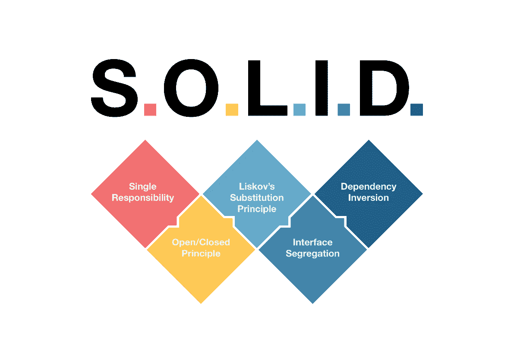
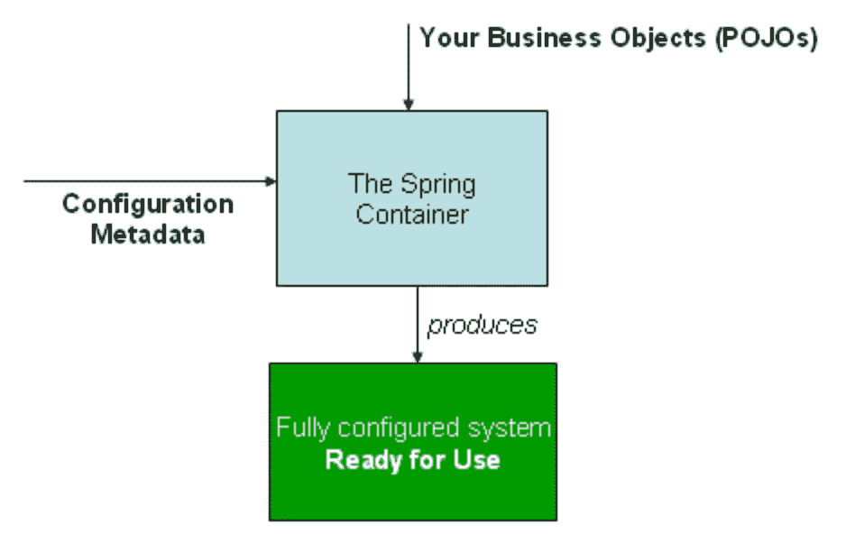

# 坚实的原则

> 原文：<https://medium.com/javarevisited/solid-principles-9693dc6b73b8?source=collection_archive---------0----------------------->

## 用代码示例复习。

# 介绍

SOLID 是一个软件开发原则，它是构建软件时要遵循的指导方针，以使软件更容易扩展和维护。他们因罗伯特·c·马丁而出名。

[](https://javarevisited.blogspot.com/2018/07/10-object-oriented-design-principles.html)

这些原则概述了设计软件的最佳实践，同时考虑了项目的长期维护和扩展。采用这些技术还可以帮助一个人避免代码味道，重构自己的代码，并设计敏捷或适应性软件。

实心代表:

*   S —单一责任原则( [SRP](https://javarevisited.blogspot.com/2017/04/single-responsibility-principle-example.html)
*   O —开闭原理( [OCP](https://javarevisited.blogspot.com/2015/07/strategy-design-pattern-and-open-closed-principle-java-example.html) )
*   李斯科夫替代原理
*   I —接口隔离原则(ISP)
*   d——依赖性反转原理(DIP)

> 扎实的原则相辅相成，共同努力，达到设计良好的软件的共同目的。

# 单一责任原则

> 每个软件组件应该有且只有一个职责。

这里的组件可以是 Java 类、方法或模块。如果我们考虑瑞士刀和普通刀，传统刀坚持 SRP，因为它只有一个责任。

## 内聚力

内聚性是一个软件组件的各个部分是如何相互关联的。更高的凝聚力有助于更好地坚持单一责任原则

Below Circle 类的 calculateArea()方法和 calculatePerimeter()方法的内聚性很高，而它与 drawCircle()和 fillCircle()方法的内聚性很低。

```
public class Circle {
    private int radius;

    public int calculateArea(){}

    public int calculatePerimeter(){}

    public void drawCircle(){}

    public void fillCircle(){}
}
```

因此，需要将这些方法放在不同的类中，如下所示。

```
// Responsibility - Measurements of the Circlepublic class Circle {
    private int radius;

    public int calculateArea(){}

    public int calculatePerimeter(){}
}

// Responsibility - Rendering the circlepublic class CircleUI {
    public void drawCircle(){}

    public void fillCircle(){}
}
```

## 连接

耦合被定义为各种软件组件之间的相互依赖程度。松散耦合有助于更好地坚持单一责任原则。

## 鲍勃大叔对 SRP 的最新定义

每个软件组件都应该有且只有一个改变的理由。

改变的理由更多→未来的改变更多 bugs 数量更多→花的钱更多。

# 开闭原则(OCP)

> 软件组件对于修改应该是封闭的，但是对于扩展应该是开放的。

## 关闭以进行修改

软件组件中增加了新的特性；您不必修改现有的代码。

## 开放供扩展

一个软件组件应该是可扩展的，可以添加新的特性或新的行为。

如果我们不遵循开闭原则，我们需要修改现有的代码，然后 QE 团队需要用完全回归测试新老特性。它也可能在当前特性中引入错误。

# 利斯科夫替代原理

> 对象应该可以用它们的子类型替换，而不影响程序的正确性。

未实现的方法几乎总是被认为是设计缺陷。有两种方法可以解决这个问题:

1.  打破等级制度
2.  告诉，不要问。

## 打破等级制度

传统上，继承是用“是-A”的思维方式来处理的。Liskov 希望摆脱创建接口的“是-A”方法。

f1 赛车是汽车的一种。因此，在实现一级方程式赛车时，应该能够扩展赛车类。

```
public class Car {

    public double getCabinWidth() {
        // Implementation
    }
}

public class F1Car extends Car {

    @Override
    public double getCabinWidth() {
        // UNIMPLEMENTED
    }

    public double getCockpitWidth() {
        // Return Cockpit width
    }
}

public class CarUtils {
    public static void main(String [] args) {
        Car Audi = new Car();
        Car Merc = new Car();
        Car FerrariF1 = new F1Car();

        List <Car> cars = new ArrayList<>();
        cars.add(Audi);
        cars.add(Merc);
        cars.add(FerrariF1);

        for(Car car : cars) {
            car.getCabinWidth();
        }
    }
}
```

上面的代码片段不起作用，因为 F1Car 没有实现 getCabinWidth()方法。它只有 getCockpitWidth()。利斯科夫的测试失败了。这个问题可以通过 ***打破层级*** 用更抽象的 getInteriorWidth()方法引入车辆接口来解决。

```
public interface Vehicle {
    public double getInteriorWidth();
}

public class Car implements Vehicle {

    private double getCabinWidth() {
        // Implementation
    }

    @Override
    public double getInteriorWidth() {
        return this.getCabinWidth();
    }
}

public class F1Car implements Vehicle{

    private double getCockpitWidth() {
        // Return Cockpit width
    }

    @Override
    public double getInteriorWidth() {
        return this.getCockpitWidth();
    }
}
```

## 告诉，不要问

下面的代码片段 ***询问*** 对象类型。相反，它应该 ***告诉*** 获取 interiorWidth()的方法。如果一个人能像上面的代码那样重构，他/她就能遵守里斯科夫替代原则。

```
public class CarUtils {
    public static void main(String [] args) {
        Car Audi = new Car();
        Car Merc = new Car();
        Car FerrariF1 = new F1Car();

        List <Car> cars = new ArrayList<>();
        cars.add(Audi);
        cars.add(Merc);
        cars.add(FerrariF1);

        for(Car car : cars) {
            if (car instanceof F1Car) {
                ((F1Car) car).getCockpitWidth();
            } else {
                car.getCabinWidth();
            }
        }
    }
}
```

# 接口隔离原则(ISP)

> 不应该强迫任何客户端依赖它不使用的方法

下面的代码片段有许多未实现的方法。

```
public interface MultiFuncMachine {

    public void print();
    public void scan();
    public void copy();
    public void fax();
    public void reset();
}

public class Scanner implements MultiFuncMachine{

    @Override
    public void print() {
        // UNIMPLEMENTED
    }

    @Override
    public void scan() {
    }

    @Override
    public void copy() {
        // UNIMPLEMENTED
    }

    @Override
    public void fax() {
        // UNIMPLEMENTED
    }

    @Override
    public void reset() {
    }
}
```

这个问题的解决方案是如下隔离接口。

```
public interface IScan {
    public void scan();
}

public class Scanner implements IScan{

    @Override
    public void scan() {

    }
}
```

## 识别违反 ISP 的技术

1.  胖接口
2.  低内聚力的界面
3.  空方法实现

# 从属倒置原则

> 高级模块不应该依赖于低级方法。两者都应该依赖于抽象。
> 
> 抽象不应该依赖于细节。细节应该依赖于抽象。

[](https://javarevisited.blogspot.com/2012/12/inversion-of-control-dependency-injection-design-pattern-spring-example-tutorial.html)

上图显示，无论是高层方法 ProductCatalog 还是低层方法 SQLProductRepository，都依赖于抽象— ProductRepository。此外，它表明细节依赖于抽象。

## 依赖注入

理想情况下，上面的 productCatalog 不需要担心何时何地实例化对象。因此，主程序会将依赖项注入到 productCatalog 中，而不是 productCatalog 实例化依赖项。注入可以使用构造函数来完成。

## 控制反转(IOC)

这不是依赖倒置原则的一部分。然而与之息息相关。通常，[依赖注入](https://javarevisited.blogspot.com/2022/02/how-to-fix-autowired-no-qualifying-bean.html)是通过主控制线程完成的。我们需要将依赖注入到一个独立于主控制线程的线程中。这可以通过框架来实现。 [Spring 框架](/javarevisited/10-best-online-courses-to-learn-spring-framework-in-2020-f7f73599c2fd)用 Spring IoC 容器做这件事。

[](https://javarevisited.blogspot.com/2011/09/spring-interview-questions-answers-j2ee.html)

Spring IoC 容器

这涵盖了坚实原则背后的概念和基本原理。

感谢阅读。
编码快乐！