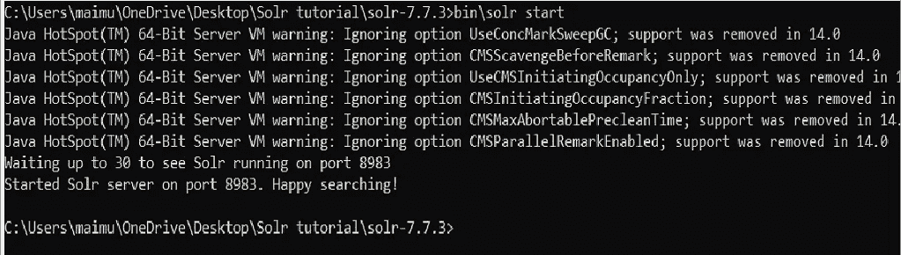
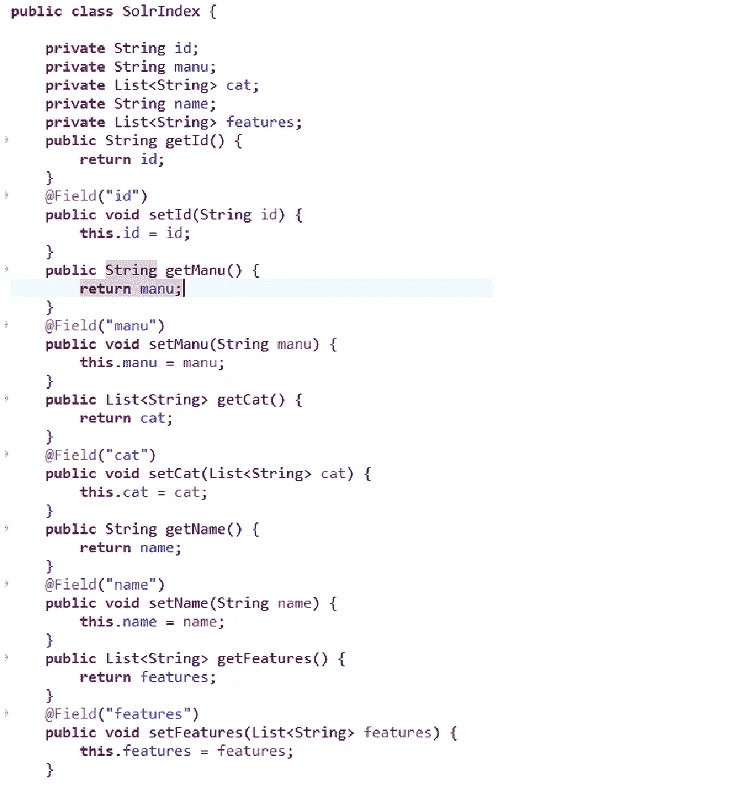

# 使用 Java Spring Boot 应用程序进行 Solr 搜索和查询

> 原文：<https://medium.com/javarevisited/solr-search-querying-using-java-spring-boot-application-81e4acf0ec?source=collection_archive---------3----------------------->


任何电子商务 web 应用程序的成功都依赖于快速可靠的搜索解决方案。Solr 搜索是市场上最好的搜索解决方案。

让我们来探索 Solr 以及与 Spring Boot 应用程序的集成，它使您能够为您的网站设计一个有效的搜索功能。

## ***什么是 Solr？***

Solr 是 Apache Lucene 的一个开源搜索平台，它用于支持全球许多大型互联网网站的搜索和过滤功能，包括苹果、网飞、思科、Chegg、NASA 和 Goldmansachs。它的流行主要是由于它的高可靠性和容错特性。

Solr 通过为搜索查询提供分布式索引、复制、自动故障和恢复以及非常具体的过滤结果来提供高维护性。

## ***启动 Solr 并与网站整合***

*   启动 Solr 之前的先决条件:机器上最新的 JRE。
*   Solr 可以通过解包并归档到您选择的目录来下载和启动。
*   启动 Solr:通过终端导航到 Solr 主文件夹

```
bin/solr start(Unix based machines)bin\solr.cmd start(windows machines)bin\solr start(windows machines)
```



此外，您可以在云模式下启动 Solr，通过 ZooKeeper 集成获得更灵活的分布式搜索，从而实现集群配置和维护以及高可用性

```
bin/solr start -e cloud
```

上面的命令在云模式下启动 Solr，使用 Solr 的内部 Zookeeper 来维护云节点

## ***带 Solr 的外部动物园管理员***

当在终端中启动 Solr 时，您可以通过定义 zookeeper 主机来使用外部 zookeeper 启动 Solr

```
bin/solr start -e cloud -z <zookeeperIP>:<Port>
```

此外，您可以使用多个 zoo keeper 启动 Solr，通过用逗号将 zoo keeper 分隔成一个集合来实现高维护性和容错性。

```
bin/solr start -e cloud -z <zookeeperIP1>:<Port>,<zookeeperIP2>:<Port>,<zookeeperIP3>:<Port>
```

使用示例配置集(在索引网站之前测试 Solr 的示例):

```
bin/solr -e techproducts
```

这里，Solr 给出的一个示例配置集中的 techproducts 用来理解 Solr 中的查询

## ***整合 Solr 与 Spring Boot***

*   使用带有依赖项的 spring 工具套件创建一个 Spring 启动的项目

*   使用@Field 注释从 Solr 索引中获取字段:



这里，features 和 cat 是 Solr 中的多值字段，因此我们将类型声明为字符串列表

*   使用 solrj 在后端连接到 Solr 的控制器

```
SolrClient client = new HttpSolrClient
        .Builder(“http://localhost:8983/solr/techproducts").build();
```

SolrClient 是 solrJ 的一个类，它允许用户使用 IP 地址和端口在后端连接到 Solr。

要更好地了解控制器如何映射 Solr 并检索搜索查询，请访问:

[https://www . udemy . com/course/Solr-search-query-using-Java-spring-boot-application/？referral code = 2509 ba 79 BD 800947 e57f](https://www.udemy.com/course/solr-search-querying-using-java-spring-boot-application/?referralCode=2509BA79BD800947E57F)