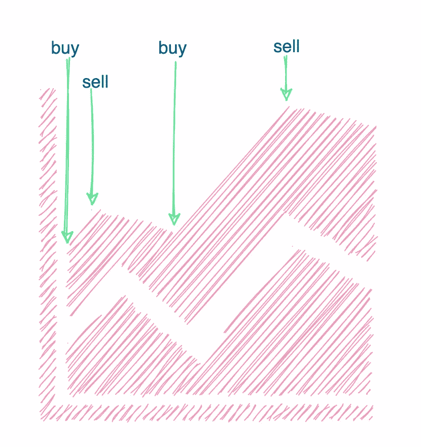

# 解决买卖股票的最佳时机问题

> 原文：<https://medium.com/javarevisited/solve-the-best-time-to-buy-and-sell-stock-problem-8ab9c9ff895e?source=collection_archive---------3----------------------->


图片由 [FreePik](https://www.freepik.com/free-photo/capital-tablet-exchange-screen-skyscraper_1088871.htm#page=1&query=stock&position=5)

# 1.问题陈述

给你一个价格的整数数组，其中 prices[i]是给定股票在第 I 天的价格。设计一个算法，求最大利润。

一些限制如下:

*   您最多可以完成 k 笔交易。
*   您不得同时进行多项交易(即，您必须先卖出股票，然后才能再次买入)。

示例 1:

```
Input: k = 2, prices = [2,4,1]
Output: 2
Explanation: Buy on day 1 (price = 2) and sell on day 2 (price = 4), profit = 4-2 = 2.
```

示例 2:

```
Input: k = 2, prices = [3,2,6,5,0,3]
Output: 7
Explanation: Buy on day 2 (price = 2) and sell on day 3 (price = 6), profit = 6-2 = 4\. Then buy on day 5 (price = 0) and sell on day 6 (price = 3), profit = 3-0 = 3.
```

# 2.解决办法

问题是找出你在某段时间内，对一只股票能获得的最大利润。

## 州

一只股票一天有两种状态(I):

> 买入:
> *股票的最后一个交易动作是买入。
> *该**发起**一笔交易，冲高交易数。
> 
> 卖出:
> *股票的最后一个交易动作是卖出。
> *此**关闭**交易。

## 行动

因此，你可以在第一天采取 3 种可能的行动:

> 行动 1。如果前一天没有买入，就买入股票。
> 动作二。如果前一天有买入，卖出股票。
> 动作 3。什么都不做。

## 状态和操作

我们把上面的重新整理成动作和状态。
目标是计算最大利润，同时确保当天的状态(买入或卖出)不变，并且没有交易重叠。

> 第(I)天|买入:
> *操作 1:什么都不做=从第(i-1)天的买入状态保持盈利
> 或
> *操作 2:从第(i-1)天的卖出状态买入盈利的股票
> 【确保在启动另一笔交易之前完成前一笔交易】
> 
> 第(I)天|卖出:
> *动作 1:什么都不做=在第(i-1)天保持卖出状态的利润
> 或
> *动作 2:卖出股票并增加第(i-1)天买入状态的利润
> 【卖出之前买入的股票】

## 状态&动作&交易

现在让我们添加事务计数约束。
目标是计算最大利润，同时确保状态(买入或卖出)在当天保持不变，没有交易重叠，并且交易计数在限制范围内。

> Day(I)|**Transaction(t)**| Buy:
> * Action 1:什么都不做=从第(i-1)天的买入状态获利&**Transaction(t)**
> 或
> * Action 2:从第(i-1)天的卖出状态获利买入股票&
> **Transaction(t-1)**
> 【确保在开始另一笔交易和**进行买入之前先完成前一笔交易**
> 
> 日(i) | **交易(t)** |卖出:
> *动作 1:什么都不做=从日(i-1) & **的卖出状态中获利交易(t)**
> 或
> *动作 2:卖出股票并从日(i-1) & **的买入状态中获利交易(t)**
> 【卖出之前买入的股票】

如果我们计算所有天数和交易计数的上述状态，我们将最终找出具有卖出状态的最后一天的最大利润。卖出应该是最后一种状态，因为我们希望交易在接近结束时结束，因为在结束时买入是一种浪费金钱的损失。

## 时间和空间复杂性

*   时间复杂度:O(n * k)其中 n 是最大天数，k 是允许的最大事务数。这是因为我们必须为所有可能的天数和交易计数组合计算 2 个州的利润。
*   空间复杂度:O(k ),其中 k 是允许的最大事务。

# 3.最佳化

如果 k 小于可能的最大事务数，上述 O(n * k)解决方案工作得非常好。

但是，如果事务计数是无限的，或者换句话说，大于那些日子里可能的互斥事务的最大数量，那该怎么办呢？我们能做得更好吗？

对于这种情况，一个更简单的解决方案是迭代几天，每当我们看到一个本地的低谷时就开始交易，并在本地的高峰时卖出。

[](https://www.java67.com/2018/06/data-structure-and-algorithm-interview-questions-programmers.html)

**买卖**

# 4.代码(Java)

下面的代码用 Java 实现了上面解释的逻辑。
买入状态用 1 表示，卖出状态用 0 表示。

```
**public int maxProfit(int k, int[] prices) {**
    int days = prices.length;
    if (days<=0 || k<= 0) {
      return 0;
    }

    **// If transactions allowed are max possible ...**
    if (k >= (days/2)) {
      int maxProfit = 0;
      int min = prices[0];
      for (int i=1; i<days; i++) {
        if (prices[i] < min) {
          min = prices[i];
        } else {
          maxProfit += (prices[i] — min);
          min = prices[i];
        }
      }
      return maxProfit;
    } **// Find max profit for additional day with 0-k transactions.** int dp[][] = new int[k+1][2];
    **// Assigning negative values for cases which are not applicable**.   
    for (int t = 0; t <= k; t++) {
      dp[t][0] = -10000;
      dp[t][1] = -10000;
    }
    dp[0][0] = 0;
    dp[1][1] = -prices[0];
    for (int d=1; d<days; d++) {
      int dpNew[][] = dp.clone();
      for (int t=0; t<=k; t++) { 
        dpNew[t][0] = Math.max(dp[t][0], dp[t][1] + prices[d]); 
        if (t==0) {
          continue;
        }
        dpNew[t][1] = Math.max(dp[t][1], dp[t-1][0] — prices[d]); 
      }
    }

    **// Find the max profit for the last day.**
    int maxProfit = 0;
    for (int t=0; t<=k; t++) {
      maxProfit = Math.max(maxProfit, dp[t][0]);
    }
    return maxProfit;
 **}**
```

如果你觉得这篇文章有用，**请帮助我接触更多的开发学习者！**

通过“鼓掌”来展示一些❤👏在页面的左边距(在桌面上)或底部(在手机上)。通过连续点击，您可以这样做多达 **50** 次！

# 阿努姆·马利克

在 Twitter[上关注 NMTechBytes](https://twitter.com/anumsarmadmalik)获取我的每日技术信息:)

# 特别感谢:

*   [LeetCode 库存问题](https://leetcode.com/problems/best-time-to-buy-and-sell-stock-iv/submissions/)