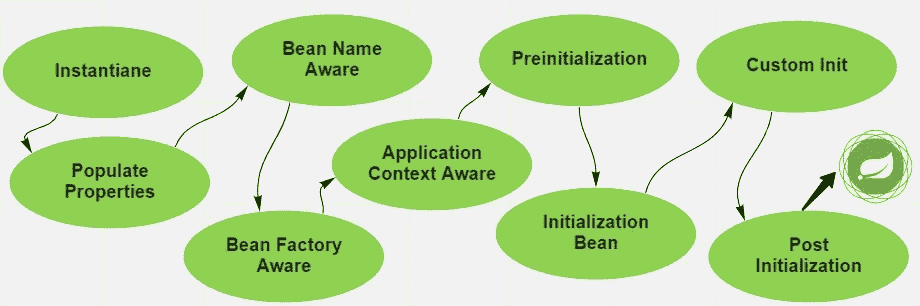

# 春豆生命周期

> 原文：<https://medium.com/javarevisited/spring-bean-life-cycle-6c20411d717a?source=collection_archive---------1----------------------->


在这个故事中，我们将讨论春豆的生命周期。任何对象的生命周期都意味着它何时以及如何出生，在其生命周期中如何表现，何时以及如何死亡。在 spring 中创建的对象实例也有生命周期。

> 春豆是什么意思？
> Spring bean 是由 Spring IoC 容器管理的 java 类的对象实例。

[](https://www.java67.com/2021/10/pring-bean-example-what-does-bean-annotation-does.html)

比恩的具体化过程

容器通过调用 bean 的构造函数来实例化 bean，然后填充其属性。Aware 超级接口通过回调指定 bean 是否有资格被声明。Aware 接口通常被框架使用，很少被 spring 开发者使用。

BeanNameAware:使对象知道容器中的 bean 定义。这个接口可以应用于希望知道 bean 名称的 bean。

BeanFactoryAware:为 bean 实例提供所属工厂的回调。这样我们就可以访问创建该对象的 BeanFactory。

***让我们在练习中使用 Aware 接口***

```
public class AwareInterfaceImpl implements BeanNameAware, BeanFactoryAware *{* @Override
  public void setBeanFactory*(*BeanFactory beanFactory*)* throws BeansException *{* System.*out*.println*(*"beanInstance is singleton : " + beanFactory.isSingleton*(*"beanInstance"*))*;
  *}* @Override
  public void setBeanName*(*String beanName*) {* System.*out*.println*(*"bean name is " + beanName*)*;
  *}
}*
```

我们可以用两种方式执行 bean 配置。可以是 xml 文件，也可以是 java 类。

```
*<?*xml version="1.0" encoding="UTF-8"*?>

<*beans 
       xmlns:xsi="http://www.w3.org/2001/XMLSchema-instance"
       xsi:schemaLocation="http://www.springframework.org/schema/beans
     http://www.springframework.org/schema/beans/spring-beans-3.0.xsd"*>

    <*bean id="beanInstance" class="com.beanlifecycle.springbeanlifecycle.bean.AwareInterfaceImpl"*>
    </*bean*>
</*beans*>*
```

```
@Configuration
public class BootConfiguration *{* // if no name is assigned, it uses the method name by default.
  @Bean*(*name = "beanInstance"*)* public AwareInterfaceImpl beanInstance*() {* return new AwareInterfaceImpl*()*;
  *}

}*
```

最后，让我们编写将加载 bean.xml 的 spring root main 类。Spring IoC 用 [@Configuration](http://twitter.com/Configuration) 类为我们做到了这一点。

```
@SpringBootApplication
public class SpringBeanLifeCycleApplication *{* public static void main*(*String*[]* args*) {* SpringApplication.*run(*SpringBeanLifeCycleApplication.class, args*)*;

   AbstractApplicationContext context1 =
    new ClassPathXmlApplicationContext*(*"beans.xml"*)*;
AwareInterfaceImpl springBean = *(*AwareInterfaceImpl*)* context1.getBean*(*"beanInstance"*)*;
context1.close*()*;

  *}
}*
```

> 控制台输出:
> bean 名称为 beanInstance
> beanInstance 为 singleton : true

**预初始化(BeanPostProcessor)**

它允许与在 Spring 容器调用初始化方法之前或之后创建的 bean 实例进行交互。BeanPostProcessor 接口包含两个方法。

***postprocessbeforeininitial ization****:*Spring 在感知接口之后，任何 bean 的初始化回调之前调用此方法。

***postProcessAfterInitialization***:Spring 在任何 bean 初始化回调后调用此方法。

首先，我们开始创建一个名为 ProductBean 的 bean。

```
public class ProductBean implements InitializingBean *{* private String productName;

  public ProductBean*() {* System.*out*.println*(*"ProductBean constructor called."*)*;
  *}* public String getProductName*() {* return productName;
  *}* public void setProductName*(*String productName*) {* this.productName = productName;
  *}* @Override
  public String toString*() {* return "ProductBean{" +
        "productName='" + productName + '\'' +
        '}';
  *}* @Override
  public void afterPropertiesSet*()* throws Exception *{* System.*out*.println*(*"ProductBean.afterPropertiesSet() method"*)*;
  *}
}*
```

接下来，我们将创建 BeanPostProcessorImpl

```
public class BeanPostProcessorImpl implements BeanPostProcessor *{* @Override
  public Object postProcessBeforeInitialization*(*Object bean, String beanName*)* throws BeansException *{* System.*out*.println*(*"Post Process Before Initialization method is called : Bean Name " + beanName*)*;
    return bean;
  *}* @Override
  public Object postProcessAfterInitialization*(*Object bean, String beanName*)* throws BeansException *{* System.*out*.println*(*"Post Process After Initialization method is called : Bean Name " + beanName*)*;
    return bean;
  *}
}*
```

ProductBean 实现了 BeanPostProcessor 接口，并覆盖了 postprocessbeforeininitialization()和 postProcessAfterInitialization()方法。

*beans.xml*

```
*<?*xml version="1.0" encoding="UTF-8"*?>

<*beans 
       xmlns:xsi="http://www.w3.org/2001/XMLSchema-instance"
       xsi:schemaLocation="http://www.springframework.org/schema/beans
     http://www.springframework.org/schema/beans/spring-beans-3.0.xsd"*>

    <*bean id="productBean" class="com.beanlifecycle.springbeanlifecycle.bean.ProductBean"*>
    <*property name="productName" value="product name"*></*property*>
</*bean*>

<*bean id="productBeanPostProcessor" class=
"com.beanlifecycle.springbeanlifecycle.bean.BeanPostProcessorImpl"*/>
</*beans*>*
```

主类

```
@SpringBootApplication
public class SpringBeanLifeCycleApplication *{* public static void main*(*String*[]* args*) {* SpringApplication.*run(*SpringBeanLifeCycleApplication.class, args*)*;

    AbstractApplicationContext context2 =
        new ClassPathXmlApplicationContext*(*"beans.xml"*)*;
    ProductBean productBean = *(*ProductBean*)* context2.getBean*(*"productBean"*)*;
    context2.registerShutdownHook*()*;
  *}
}*
```

> 控制台输出:
> 调用了 ProductBean 构造函数。
> 初始化方法调用前的后处理:Bean 名称 productBean
> product Bean . afterpropertiesset()方法
> 初始化方法调用后的后处理:Bean 名称 product Bean

**初始化 Bean 和 DisposableBean 回调接口**

这里我们可以提到几种方法。我们可以调用自定义的 init 和/或 destroy 方法，或者实现以编程方式进行 init 和 destroy 的接口。

**通过编程方式**

Spring 提供了以下两个回调接口:

initializing bean:initializing bean 接口包括 afterPropertiesSet()方法来编写初始化逻辑。设置属性后，容器调用此方法。

DisposableBean:它包含 destroy()方法。在 Spring 容器释放 bean 后工作。

```
public class BeanInstance implements InitializingBean,     DisposableBean *{* private String var;

  public String getVar*() {* return var;
  *}* public void setVar*(*String var*) {* this.var = var;
  *}* @Override
  public void destroy*()* throws Exception *{* System.*out*.println*(*"BeanInstance.destroy() method called"*)*;
  *}* @Override
  public void afterPropertiesSet*()* throws Exception *{* System.*out*.println*(*"BeanInstance.afterPropertiesSet() method called"*)*;
  *}
}*
```

beans.xml

```
*<*bean id="beanInstance" class="com.beanlifecycle.springbeanlifecycle.bean.BeanInstance"*>
    <*property name="var" value="BeanInstance Starting"*/>
</*bean*>*
```

主类

```
@SpringBootApplication
public class SpringBeanLifeCycleApplication *{* public static void main*(*String*[]* args*) {* SpringApplication.*run(*SpringBeanLifeCycleApplication.class, args*)*;

ApplicationContext context3 =
  new ClassPathXmlApplicationContext*(*"beans.xml"*)*;
BeanInstance beanInstance = *(*BeanInstance*)* context3.getBean*(*"beanInstance"*)*;
System.*out*.println*(*"BeanInstance.getVar()" + beanInstance.getVar*())*;
*((*AbstractApplicationContext*)* context3*)*.registerShutdownHook*()*;

  *}
}*
```

> 控制台输出:
> bean instance . afterpropertiesset()方法调用
> bean instance . getvar()bean instance 启动
> BeanInstance.destroy()方法调用

> 不推荐使用 InitializingBean 和 DisposableBean 接口，因为这将使您的代码与 Spring 紧密耦合。更好的方法是在 bean 配置文件中指定 init-method 和 destroy-method 属性。

**自定义初始化和销毁方法**

```
public class CustomBean *{* private String var;

  public CustomBean*() {* System.*out*.println*(*"CustomBean constructor called"*)*;
  *}* public String getVar*() {* return var;
  *}* public void setVar*(*String var*) {* this.var = var;
  *}* public void destroy*() {* System.*out*.println*(*"Custom destroy method called"*)*;
  *}* public void init*() {* System.*out*.println*(*"Custom init method called"*)*;
  *}* @Override
  public String toString*() {* return "CustomBean{" +
        "var='" + var + '\'' +
        '}';
  *}
}*
```

beans.xml

```
*<*bean id="customBean"
      class="com.beanlifecycle.springbeanlifecycle.bean.CustomBean"
      init-method="init"
      destroy-method="destroy"*>
    <*property name="var" value="Hello world! "*/>
</*bean*>*
```

主类

```
@SpringBootApplication
public class SpringBeanLifeCycleApplication *{* public static void main*(*String*[]* args*) {* SpringApplication.*run(*SpringBeanLifeCycleApplication.class, args*)*;

    AbstractApplicationContext context4 =
    new ClassPathXmlApplicationContext*(*"beans.xml"*)*;
CustomBean customBean = *(*CustomBean*)* context4.getBean*(*"customBean"*)*;
context4.registerShutdownHook*()*;

  *}
}*
```

> 控制台输出:
> 自定义 Bean 构造函数调用
> 自定义 init 方法调用
> 自定义 destroy 方法调用

**使用注释**

我们可以在 spring 容器启动时调用自定义 init()方法，在关闭容器时调用自定义 destroy()方法。

首先创建您的 java bean 类。

```
public class SpringBean *{* public SpringBean*() {* System.*out*.println*(*"SpringBean instance created"*)*;
  *}* // works automatically when the bean is instantiated
  @PostConstruct
  public void init*()* throws Exception *{* System.*out*.println*(*"init() method that executed @PostConstruct"*)*;
  *}* // works automatically after Spring Container releases the bean(when Spring container is closed)
  @PreDestroy
  public void destroy*()* throws Exception *{* System.*out*.println*(*"destroy() method that executed @PreDestroy"*)*;
  *}* public void close*() {* System.*out*.println*(*"Closing resources"*)*;
  *}
}*
```

配置类

```
@Configuration
public class BootConfiguration *{* @Bean
  @Scope*(*value = "singleton"*)* public SpringBean myBean*() {* return new SpringBean*()*;
  *}

}*
```

我们不需要显式地将我的 bean 指定为 singleton，因为默认范围是 singleton。但是我这样指定是为了简单地展示原型作用域之间的区别。

主类

```
AnnotationConfigApplicationContext ctx = new AnnotationConfigApplicationContext*()*;
ctx.register*(*BootConfiguration.class*)*;
ctx.refresh*()*;

SpringBean obj1 = ctx.getBean*(*SpringBean.class*)*;
System.*out*.println*(*obj1.hashCode*())*;

SpringBean obj2 = ctx.getBean*(*SpringBean.class*)*;
System.*out*.println*(*obj2.hashCode*())*;

ctx.close*()*;
```

> 控制台输出:
> SpringBean 实例创建的
> init()方法执行了[@ post construct](http://twitter.com/PostConstruct)
> 1924802798
> 1924802798
> destroy()方法执行了 [@PreDestroy](http://twitter.com/PreDestroy)
> 关闭资源

Bean 初始化后调用 [@PostConstruct](http://twitter.com/PostConstruct) 方法。上下文关闭时也会调用 [@PreDestroy](http://twitter.com/PreDestroy) 方法。beans 的哈希代码是相同的，是单例范围导致了这种情况。

让我们通过尝试用 prototype 作用域初始化和销毁注释来结束我们的文章。我们只需要在配置类中将 bean 范围值更新为原型。

```
@Bean
@Scope*(*value = "prototype"*)* public SpringBean myBean*() {* return new SpringBean*()*;
*}*
```

> 控制台输出:
> SpringBean 实例创建了执行[@ post construct](http://twitter.com/PostConstruct)
> 332498651
> spring bean 实例创建了执行[@ post construct](http://twitter.com/PostConstruct)
> 1869177530 的
> init()方法

> 总结一下 spring 中 bean 的生命周期，当程序运行时，Spring 容器启动，然后根据请求创建 bean。当 spring 容器关闭时，bean 被销毁。这个循环由 Spring IoC 管理。

[源代码链接](https://github.com/yunusbgrynk/spring-bean-life-cycle)

【参考资料:
[geeksforgeeks.org](https://www.geeksforgeeks.org/)
[spring framework . guru](https://springframework.guru/spring-bean-lifecycle/)
[docs . spring . io](https://docs.spring.io/)