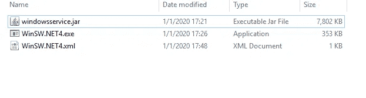
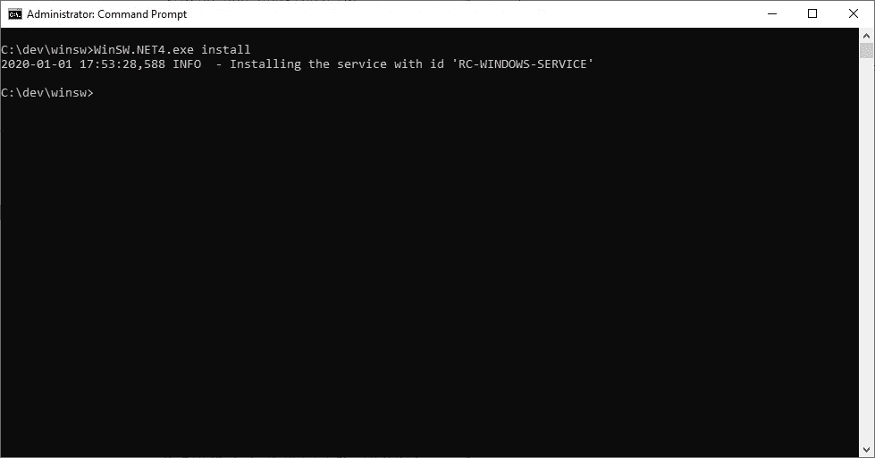
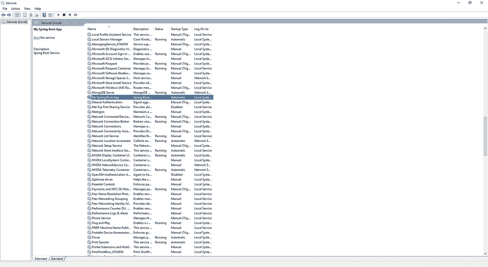

# 作为 Windows 服务的 Spring Boot 应用程序

> 原文：<https://medium.com/javarevisited/spring-boot-application-as-a-windows-service-4c775556518e?source=collection_archive---------1----------------------->

在这篇文章中，我将与你分享如何运行 Spring Boot 应用程序作为一个 Windows 服务。

这些情况对于 Spring Boot 应用程序来说非常罕见，但是你可以像这样面对。要做到这一点，你应该仔细阅读我写的东西；).


卡斯帕·卡米尔·鲁宾在 [Unsplash](https://unsplash.com?utm_source=medium&utm_medium=referral) 上的照片

要将您的应用程序作为 Windows 服务运行，您应该执行几个步骤。

# Maven 配置

您可以将应用程序打包成 JAR 或 WAR。这是由 ***pom.xml*** 文件配置的，如下图。对于这个主题，我们继续讨论 JAR 打包。

```
<packaging>jar</packaging>
```

之后你应该添加***spring-boot-maven-plugin***工件到你的 ***pom.xml*** 。

```
<build>
    <plugins>
        <plugin>
            <groupId>org.springframework.boot</groupId>
            <artifactId>spring-boot-maven-plugin</artifactId>
            <configuration>
                <executable>true</executable>
            </configuration>
        </plugin>
    </plugins>
</build>
```

pom.xml

如上所示，`<executable>`参数为真。 ***昭然若揭。MF*** 文件用此参数添加到 JAR 包中。这个清单包含一个 *Main-Class* 条目，指定哪个类定义了应用程序的 Main 方法。如果你不了解 Maven，想了解一下，也可以看看这些 [Maven 课程](https://dev.to/javinpaul/10-free-devops-courses-to-learn-jenkins-docker-and-maven-for-programmers-ohp)

[](https://javarevisited.blogspot.com/2019/03/top-5-course-to-learn-apache-maven-for.html) [## Java 开发人员学习 Apache Maven 的前 5 门课程——最好的

### Apache Maven 或通常称为“Maven”，是 Java 程序员的一个基本工具。它允许您构建…

javarevisited.blogspot.com](https://javarevisited.blogspot.com/2019/03/top-5-course-to-learn-apache-maven-for.html) 

完成这些配置后，您应该编写下面的命令来将您的应用程序打包成 JAR。

```
$ mvn clean package
```

现在，您可以用下面的命令测试您的应用程序的 JAR 包。

```
$ java -jar yourApp.jar
```

# Windows 服务包装程序(WinSW)

为了将 Java 应用程序作为 Windows 服务运行，我们需要一个名为 Windows 服务包装器(WinSW)的工具。你可以从这个[链接](https://github.com/kohsuke/winsw/releases/tag/winsw-v2.1.2)下载这个工具。也**。对于 WinSW，您的计算机中必须安装. Net Framework 4** 。

下载 WinSW 后，必须按照以下步骤操作。

*   将 JAR 文件、WinSW 可执行文件和配置文件放在同一个文件夹中。
*   WinSW-xxx.xml 文件需要正确配置，如下所示。



WinSW 目录

*   最后两个标签可以保持不变。出于我们的目的，我们只想执行 java -jar。/XXX.jar。

```
<configuration>
<!-- ID of the service. It should be unique accross the Windows system-->
<id>RC-XXX-SERVICE</id>
<!-- Display name of the service -->
<name>My Spring Boot App</name>
<!-- Service description -->
<description>Spring Boot Service</description>

<!-- we need to execute java -jar ./XXX.jar -->
<executable>java</executable>
<arguments>-jar "%BASE%\YOUR-APP.jar</arguments>
</configuration>
```

# 将 Spring Boot 应用程序作为 Windows 服务安装

*   配置 XML 文件后，您必须以管理员身份打开 Windows CLI。您连续运行以下两个命令。



作为 Windows 服务安装的应用程序

```
$ winsw-2.2.0-net4.exe install
$ net start RC-XXX-SERVICE
```



作为 Windows 服务的 Spring Boot 应用

*   我们用第一个命令安装应用程序。第二个命令启动应用程序。此外，您可以从 Windows 服务启动该应用程序。

# 感谢您的阅读！🙏你的想法对我很有价值。请随意分享。😄

您可能喜欢的其他 **Java 和 Spring 文章**

*   每个 Java 开发者都应该知道的 5 个 Spring Boot 特性([特性](https://javarevisited.blogspot.com/2018/11/top-5-spring-boot-features-java.html#axzz5YFjHrt5j))
*   学习春天和 Spring Boot 的五大免费课程([课程](http://www.java67.com/2017/11/top-5-free-core-spring-mvc-courses-learn-online.html))
*   掌握 Spring Boot 在线课程([课程](https://javarevisited.blogspot.com/2018/05/top-5-courses-to-learn-spring-boot-in.html))
*   Java 开发人员应该学习的 10 件事([目标](https://javarevisited.blogspot.com/2017/12/10-things-java-programmers-should-learn.html#axzz5atl0BngO))
*   Java 开发人员在日常生活中使用的 10 个工具([工具](http://javarevisited.blogspot.sg/2017/03/10-tools-used-by-java-programming-Developers.html#axzz55lrMRnNC))
*   成为更好的 Java 开发人员的 10 个技巧
*   学习 Java 微服务的 Top 5 课程？([课程](/javarevisited/top-5-courses-to-learn-microservices-in-java-and-spring-framework-e9fed1ba804d))
*   Java 程序员可以从 Spring 学习的 3 个最佳实践([最佳实践](https://javarevisited.blogspot.com/2018/06/3-best-practices-java-programmers-can-learn-from-spring-framework.html#axzz5K0PIOpHD))
*   学习 Spring Boot 和春云的 5 门课程([门课程](https://javarevisited.blogspot.com/2018/07/top-5-books-to-learn-spring-boot-and-spring-cloud-java.html))
*   改变 Spring Boot Tomcat 端口的 3 种方法([教程](https://www.java67.com/2019/07/spring-boot-3-ways-to-change-port-of-tomcat.html))
*   Java 程序员的 10 门高级 Spring Boot 课程([课程](/javarevisited/10-advanced-spring-boot-courses-for-experienced-java-developers-5e57606816bd))
*   Java 开发者应该学习的 10 个 Spring MVC 注解([注解](https://www.java67.com/2019/04/top-10-spring-mvc-and-rest-annotations-examples-java.html))
*   15 Spring Boot Java 程序员面试问题([问题](https://www.java67.com/2018/06/top-15-spring-boot-interview-questions-answers-java-jee-programmers.html))

感谢您阅读本文。如果你觉得这篇文章有用，那么请与你的朋友和同事分享。如果您有任何问题或反馈，请留言。