# Spring Boot — AWS

> 原文：<https://medium.com/javarevisited/spring-boot-aws-8cf2f1df84a6?source=collection_archive---------2----------------------->

如何部署 spring boot 应用程序的简单指南。我用过 AWS 的免费层。你可以去 AWS 网站注册。一年内免费。

如果你有任何建议或者如果你觉得有什么需要，你可以给你的意见。

让我们开始一步一步地在 aws 中上传 spring boot 应用程序

# **创建 EC2 实例**

步骤 1:创建一个 EC2 实例。登录 AWS 控制台。我们将使用 AWS 的免费层。

https://signin.aws.amazon.com/

步骤 2:登录后，单击服务并选择 EC2

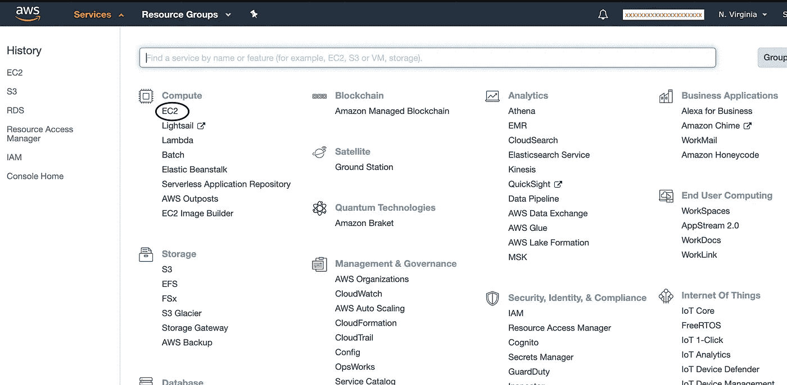

步骤 3:单击启动实例

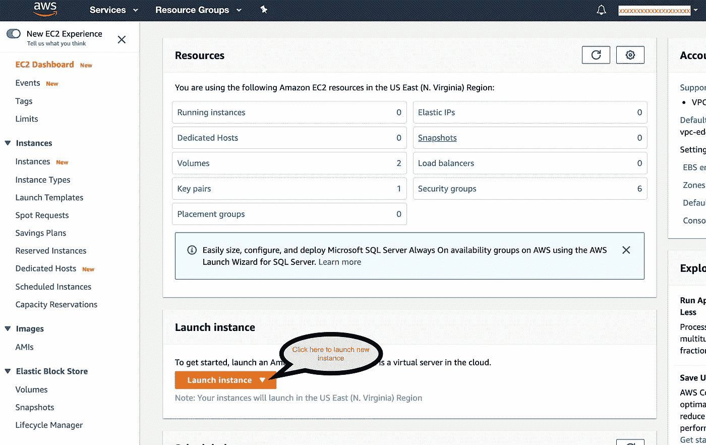

步骤 4:创建 [EC2 实例](https://javarevisited.blogspot.com/2020/08/top-5-courses-to-learn-amazon-aws-ec-2.html)总共有 7 个步骤。

***第一步:选择 AMI。***

***第二步:选择实例类型***

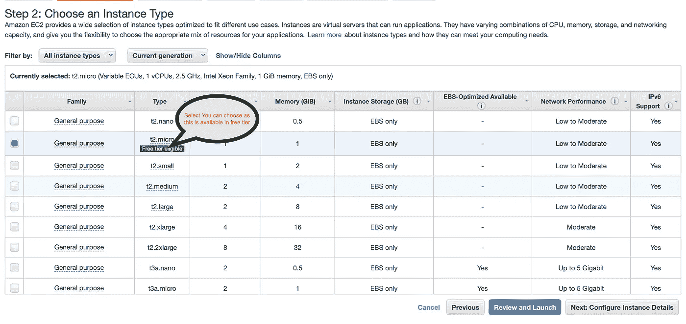

单击下一步:配置实例详细资料

***第三步:选择实例明细。***

现在不要做任何更改，只需进入下一步。

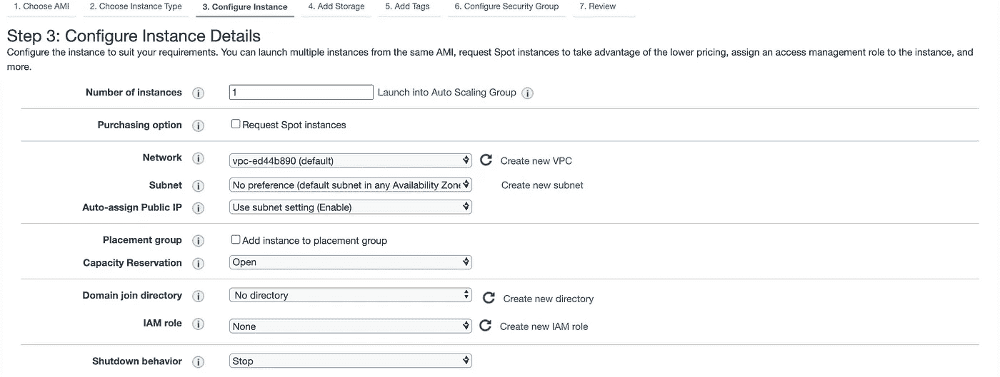

单击下一步添加存储。

***第四步:添加存储明细***

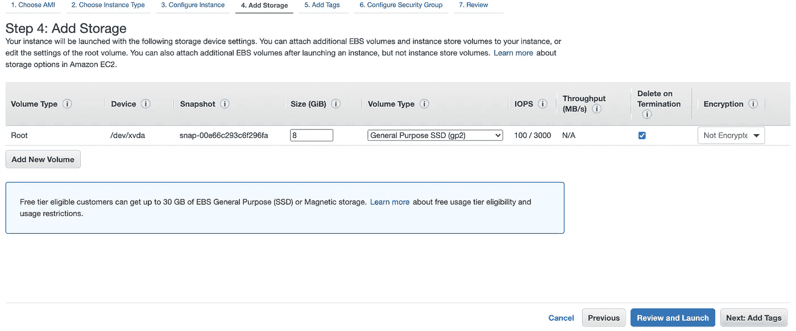

不要更改任何内容，单击下一步:添加标签

***第五步:*** 我们这里可以有多个标签。

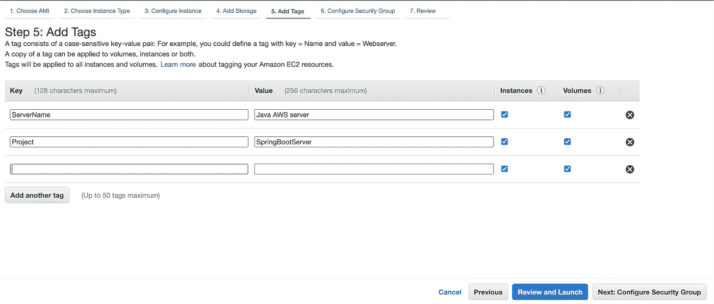

在这里，您可以存储名称值对。

**需要创建一个安全组**

*您可以创建新的安全组，也可以选择现有的安全组。我已经创建了名为 webdmz 的安全组。*

*安全组用于允许访问 SSH、HTTP 和自定义 TCP 端口等端口，我们将通过这些端口访问我们的 URL*

***创建安全组*** 的步骤如下

单击服务中的 EC2。右手边是网络和安全

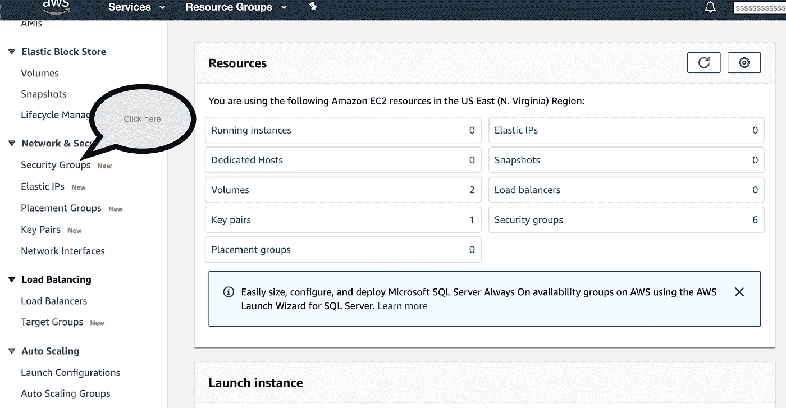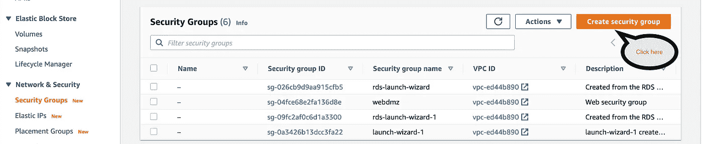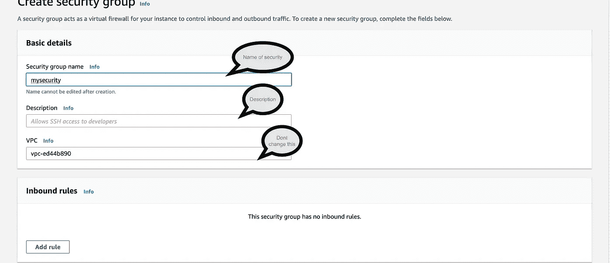

我们需要创建入站规则，即允许访问哪个端口。对于出站规则，我们不会改变任何东西，因为我们将允许每一个访问。

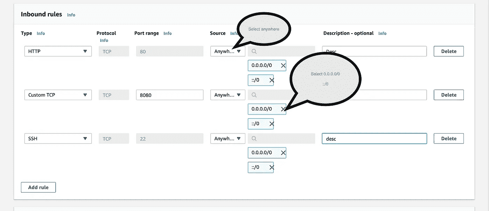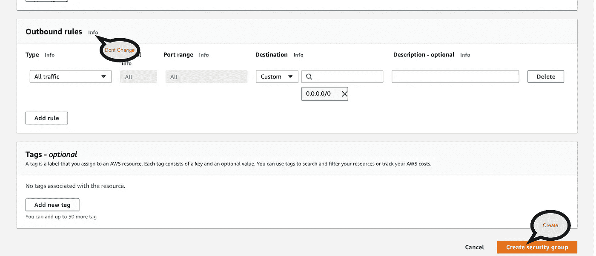

我们创建了一个名为 webdmz 的安全组。

***第六步:现在配置安全组***

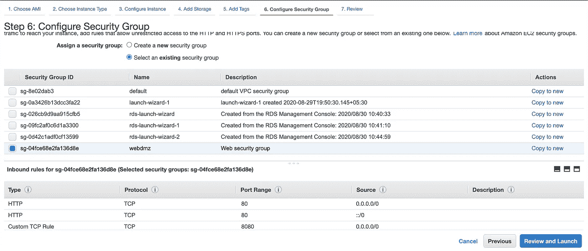

选择 webdmz 安全组。

***第七步:复习一切，启动。***

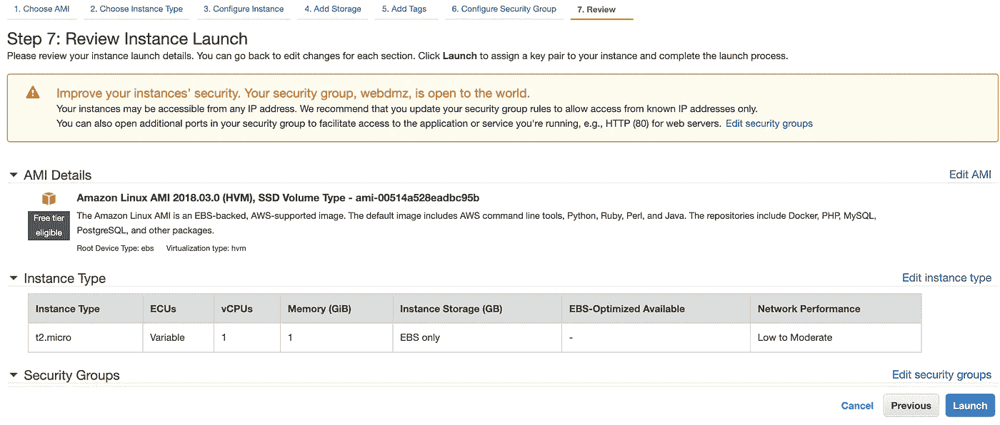

这是启动 EC2 实例所需的 7 个步骤。

第 5 步:一旦你点击启动，你会得到以下屏幕

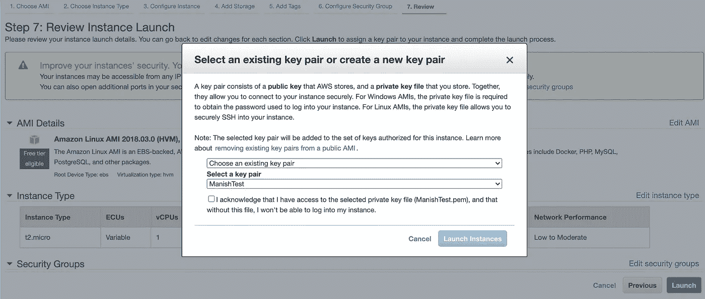

我们需要创建密钥对，一旦生成，我们可以在下一个应用程序中使用它。如果您是第一次从下拉列表中创建新的一对。

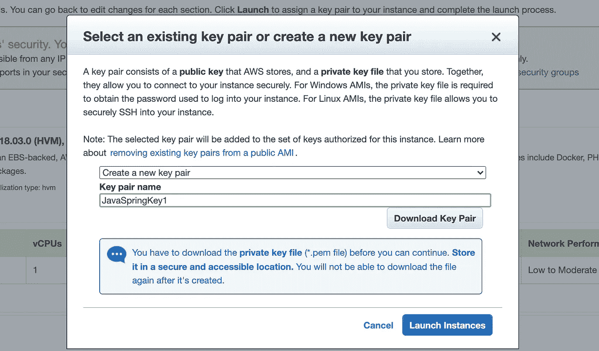

给它起个名字，然后下载。现在单击启动实例。

第 6 步:你会得到以下信息。

现在你可以点击查看实例

第七步:如果一切正常。您将看到以下状态为正在运行的屏幕

第 8 步:现在我们需要登录，我们可以用 putty 或终端(mac)来完成。我会通过麦克向你解释。

打开“终端”并转到您的文件夹。

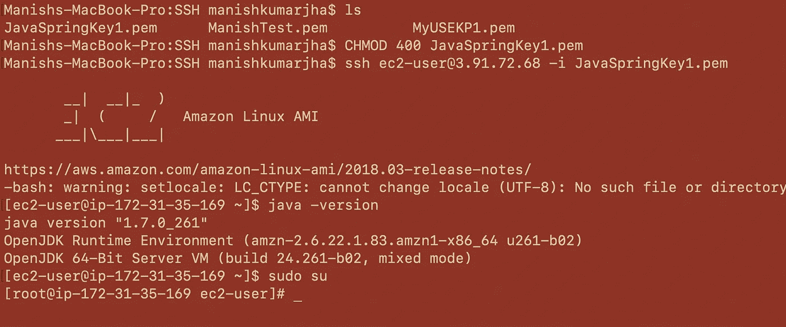

我们将密钥文件保存在 SSH 文件夹中。使用上述命令登录 ec2

cmd 1:CHMOD 400 javaspringkey 1 . PEM***【您的密钥文件名】***

CMD 2:ssh ec2-user @[**public IP]**-I[keyFile]。脉冲编码调制

恭喜您，您已经登录了您的第一个 EC2 实例。

# 我们将在 eclipse 中创建一个简单的 Spring Boot 应用程序

步骤 1:在 eclipse 中创建新的 spring 项目

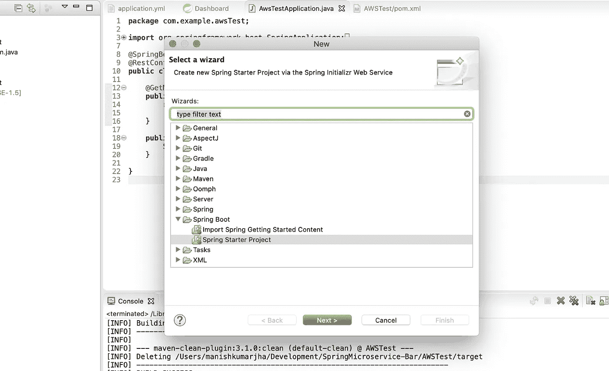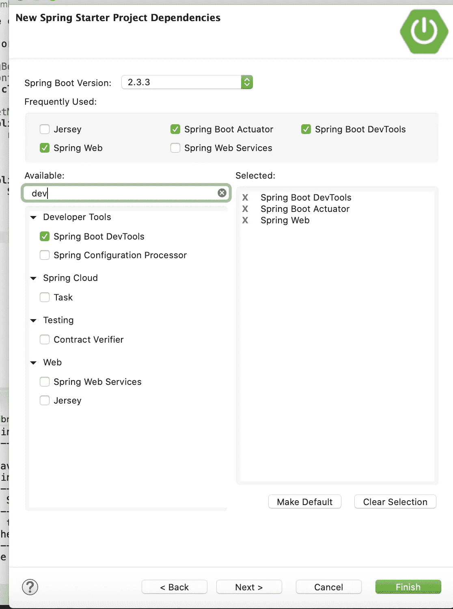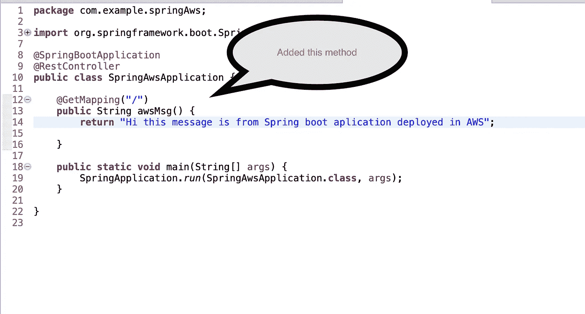

只需添加这个方法和 [@RestTemplate](https://www.java67.com/2019/04/top-10-spring-mvc-and-rest-annotations-examples-java.html)

在 pom.xml 中添加以下内容

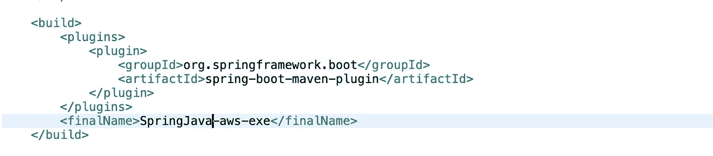

做 maven 清洁和安装。一旦这个过程完成。将在目标文件夹中创建一个 jar 文件。

现在我们已经创建了 EC2 实例，我们的 spring boot 应用程序也准备好了。现在，我们将在 [AWS](/javarevisited/top-10-courses-to-learn-amazon-web-services-aws-cloud-in-2020-best-and-free-317f10d7c21d) 上部署这个应用程序，并执行 URL

现在，我们将登录 EC2 实例并部署应用程序

1:我们将登录 EC2 实例。

2:我们将检查 java 的版本。它应该与用于编译的相同。

3:我们不能直接将我们的 jar 转移到 ec2 实例。首先，我们将我们的文件传输到 S3 桶，从 S3 桶，我们将部署到 EC2。

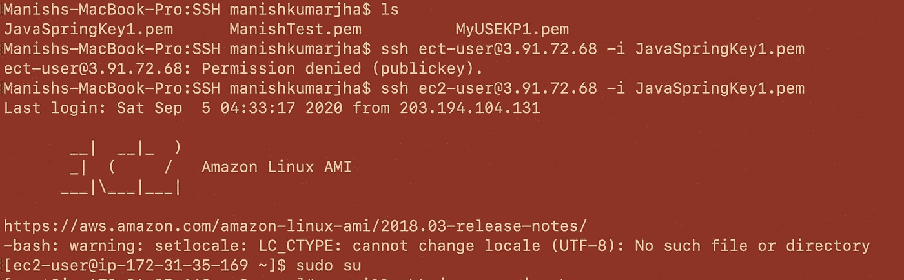

要安装 java 1.8，请使用以下命令

*百胜安装 java-1.8.0-openjdk*

并按照说明进行操作。当你检查版本时，一旦安装了 java

*java 版本*将显示 1.7 我们需要使用以下命令设置 java 1.8

*备选方案—配置 java*

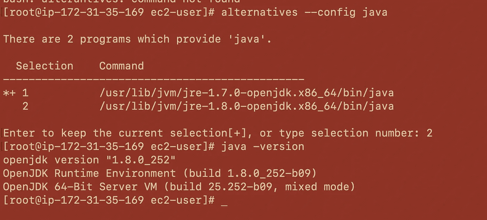

现在我们将 jar 文件复制到 [S3 桶](https://www.java67.com/2020/08/top-5-courses-to-learn-aws-s3-and-dynamoDB-in-depth.html)，我们将创建 1 个桶

[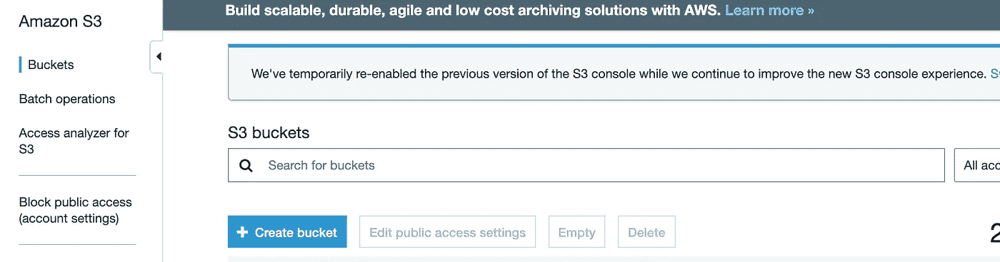](https://www.youtube.com/watch?v=30YWIPQtW10)[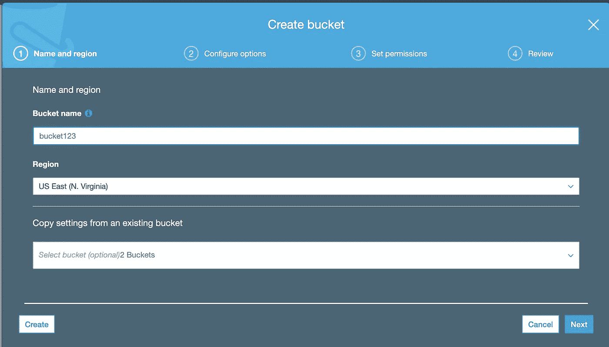](https://www.youtube.com/watch?v=YP4zNBdUlos)

存储桶的名称应该是唯一的。

一旦创建了 bucket，我们需要在这个 bucket 中上传我们的 jar 文件

将 jar 文件从目标上传到此桶

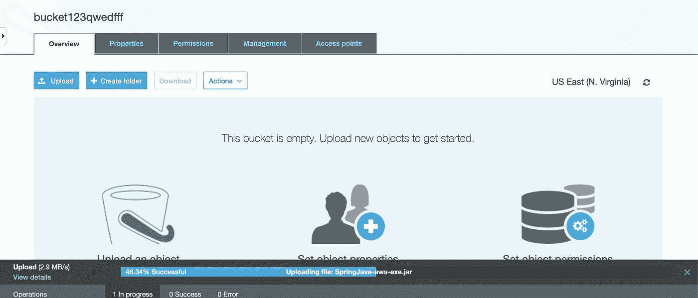

只需点击这个文件并复制对象 url

[https://[ ***桶名***]. S3 . amazonaws . com/<https://bucket123qwedfff.s3.amazonaws.com/SpringJava-aws-exe.jar>***文件名*** ]

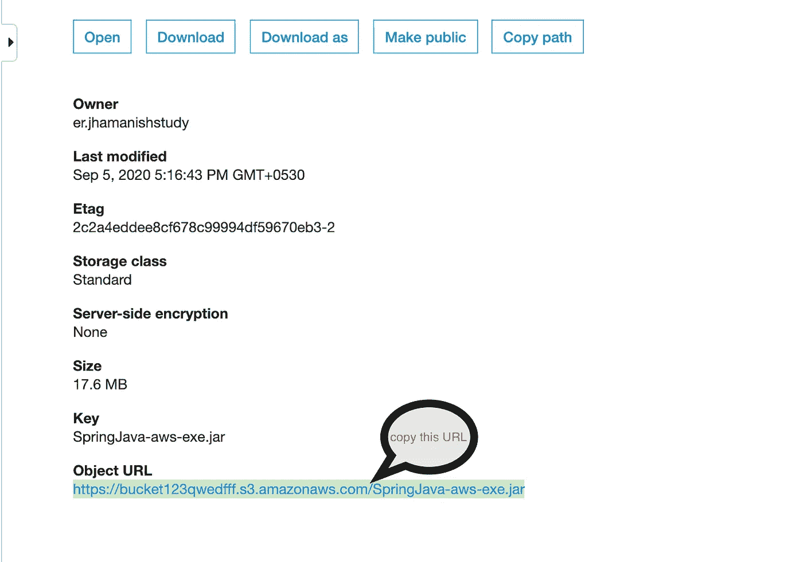

在终端使用中

wget [url 已复制]

现在我们将运行命令来启动我们的应用程序。

*Java-jar spring Java-AWS-exe . jar*

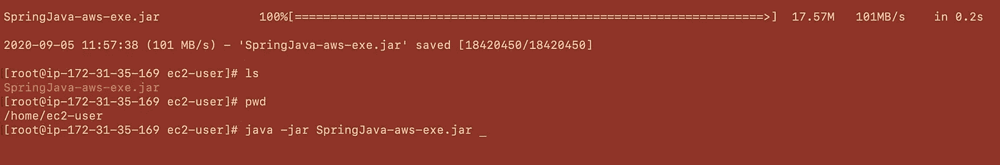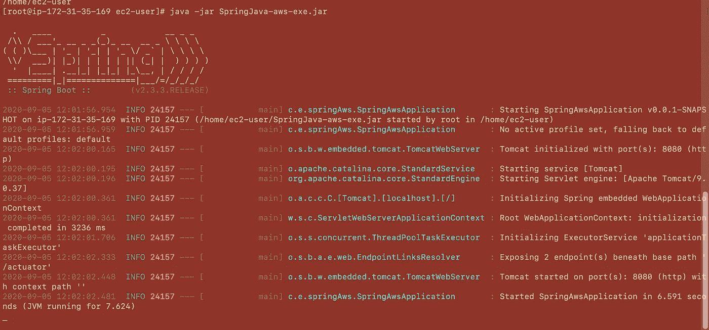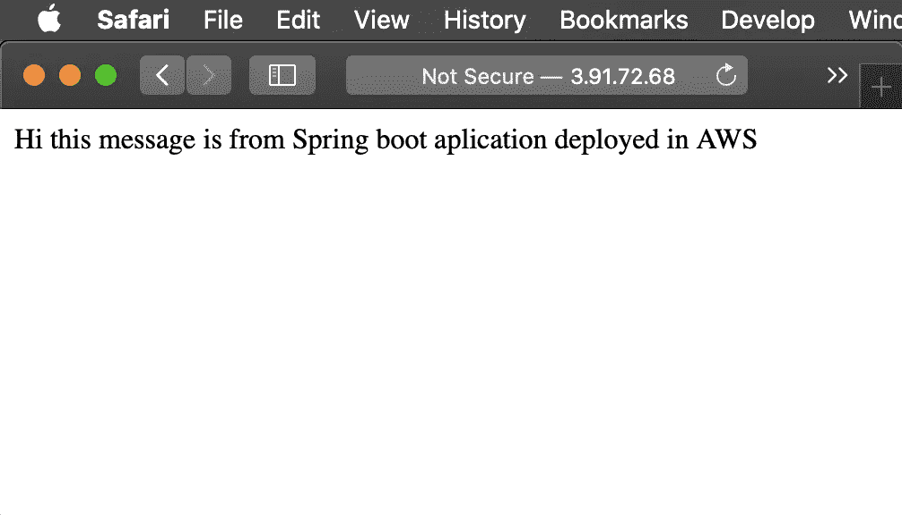

恭喜您，您已经在 AWS 中部署了您的应用程序。