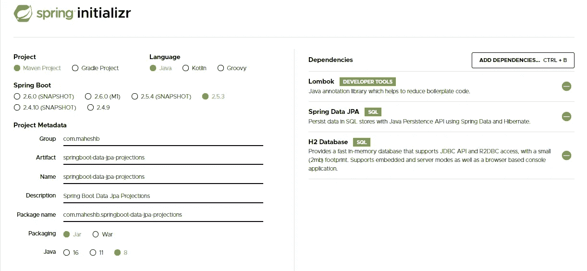

# Spring Boot 数据 JPA —第四部分(预测)

> 原文：<https://medium.com/javarevisited/spring-boot-data-jpa-part-iv-projections-9d25a5637dd9?source=collection_archive---------0----------------------->

[第一部分(入门)](https://maheshbonagiri.medium.com/getting-started-with-spring-data-jpa-7e949e0c5f2b) | [第二部分(分页&排序)](https://maheshbonagiri.medium.com/spring-boot-data-jpa-part-ii-pagination-and-sorting-bec179029978) | [第三部分(审核)](https://maheshbonagiri.medium.com/spring-boot-data-jpa-part-iii-auditing-1fa5d9595eb2)

在之前的帖子中，我解释了如何开始使用 Spring boot Data JPA 的、[分页&排序](https://maheshbonagiri.medium.com/spring-boot-data-jpa-part-ii-pagination-and-sorting-bec179029978)和[审计](https://maheshbonagiri.medium.com/spring-boot-data-jpa-part-iii-auditing-1fa5d9595eb2)。在本帖中，我们将讨论如何对 Spring 数据使用投影。

当使用 [Spring Data JPA](https://javarevisited.blogspot.com/2021/08/top-5-spring-data-jpa-courses-for-java.html) 时，存储库通常会返回根类的一个或多个实例。可能有这样的情况，我们不需要查询方法中的整个实体，而只对该实体的几个属性或该实体的子集感兴趣，其中有一些操作。这就是投影派上用场的地方。

**我们开始:**

我们将使用 [Spring Initializer](https://start.spring.io/) 为我们的项目生成基础，在我之前的[帖子](https://maheshbonagiri.medium.com/getting-started-with-spring-boot-eclipse-d3a297ca90a0)中，我已经解释了如何从 [Spring Boot](/javarevisited/top-10-courses-to-learn-spring-boot-in-2020-best-of-lot-6ffce88a1b6e?source=---------39------------------) + [日蚀](/javarevisited/6-free-best-eclipse-ide-courses-for-java-programmers-1229ee9e5d87)开始。

# 定义一个简单的实体

让我们创建一个名为 **BookEntity** 的实体，如下所示(我们可以重用在之前的 [post](https://maheshbonagiri.medium.com/spring-boot-data-jpa-part-iii-auditing-1fa5d9595eb2) 中创建的实体)。

我们的每个 *Book* 实例都有一个惟一的标识符: *id* ，它的*名称、作者、价格*和审计信息，比如 created date/modified date/createdBy/modified by

# 存储库接口:

让我们来看看我们的 BookRepoisitory，它扩展了 JpaRepository。

# 基于界面的投影

在这种类型中，我们创建一个接口，该接口只包含我们希望从实体类中获得的属性的 getter 方法。这个接口将是我们在 Spring Data JPA 的 Repository 接口中编写的查询方法的返回类型。

**近距离投影:**

在封闭投影中，接口的 getter 方法与实体属性的 getter 方法完全匹配。查看 Book 实体，我们可以看到它有许多属性，但并不是所有的属性都有用。例如，并不是所有时候都需要审计信息。

让我们为 Book 实体声明一个投影接口，如下所示。

如下所示更新 BookRepository。

用一个投影接口和[实体类](https://javarevisited.blogspot.com/2016/01/why-jpa-entity-or-hibernate-persistence-should-not-be-final-in-java.html#axzz5SmuS0lnR)定义一个存储库方法是非常相似的。唯一不同的是基于接口的投影接口中的被用作返回集合中的元素类型。

# 创建应用程序类

创建如下所示的`SpringbootDataJpaProjectionsApplication` 类。使用 CommandLineRunner，我们将首先保存一些记录，然后再获取这些记录。

当您运行应用程序时，您应该会看到类似如下的输出:

正如您在上面看到的，生成的 SQL 语句只选择由接口映射的列。

**打开投影:**

在 Open Projection 中，我们将创建一个接口，只使用选择性属性的 getter 方法，但除此之外，我们还使用 SpEL 表达式。SpEL 表达式将帮助我们从现有属性中定义一个新属性。就像上面的例子一样，如果我们想要一个属性“图书和作者姓名”，那么我们可以使用 SpEL 表达式和 [@Value](http://twitter.com/Value) 注释来定义它。

如下所示更新 BookView.java。

在 spring boot datajpaprojectionapplication 之上运行，您应该会看到类似如下的输出

如上所述，开放式投影有一个缺点。Spring Data 无法优化查询执行，因为它事先不知道将使用哪些属性。因此，当封闭投影不能处理我们的需求时，我们应该只使用开放投影。

# 基于类别的预测:

在基于类的投影中，我们使用类而不是接口。我们创建投影类，它只包含我们对实体类及其类层次结构感兴趣的那些属性。

让我们为 Book 实体声明一个投影类，如下所示。

现在，让我们更新 BookRepository，如下所示。

更新 springbootdatajpaprojectionapplication，如下所示。

在 spring boot datajpaprojectionapplication 之上运行，您应该会看到类似如下的输出

如您所见，基于实体的投影提取了所有字段，基于类/接口的投影仅提取了我们定义的字段。

# 动态预测:

一个实体类可能有许多投影。在某些情况下，我们可能使用某种类型，但在其他情况下，我们可能需要另一种类型。有时候，我们也需要使用实体类本身。

仅仅为了支持多种返回类型而定义单独的存储库接口或方法是很麻烦的。为了解决这个问题，Spring Data 提供了一个更好的解决方案:动态预测。

我们可以通过用一个*类*参数:声明一个存储库方法来应用动态投影

现在，让我们更新 BookRepository，如下所示。

让我们更新 springbootdatajpaprojectionapplication，如下所示。

在 spring boot datajpaprojectionapplication 之上运行，您应该会看到类似如下的输出

# 奖励积分:

在某些情况下，我们的投影类包含大量的属性，我们可能希望对需要不同属性集的不同需求使用相同的类。为所有这些需求创建一个带有多个参数的新构造函数可能不是一个好的做法。在这种情况下，我们在带有地图的投影类中添加一个构造函数。映射包含所选属性的别名作为键(字符串)及其值。虽然我们使用相同的投影类，但是这里只设置感兴趣的属性。

添加 CustomBook，如下所示

如下所示更新 BookRepository。

更新 springbootdatajpaprojectionapplication，如下所示。

在 spring boot datajpaprojectionapplication 之上运行，您应该会看到类似如下的输出

# 结论:

如果你想参考完整的代码，请查看 https://github.com/projectk-user1/Springboot-learning.git 的

请务必参考我关于弹簧靴的其他文章。

<https://maheshbonagiri.medium.com/getting-started-with-spring-data-jpa-7e949e0c5f2b>  <https://maheshbonagiri.medium.com/spring-boot-data-jpa-part-ii-pagination-and-sorting-bec179029978>  <https://maheshbonagiri.medium.com/spring-boot-data-jpa-part-iii-auditing-1fa5d9595eb2>  <https://maheshbonagiri.medium.com/getting-started-with-spring-boot-eclipse-d3a297ca90a0>  <https://maheshbonagiri.medium.com/spring-boot-restfull-web-service-aa46fcd81d29>  <https://maheshbonagiri.medium.com/spring-boot-and-content-negotiation-183b20eaa425> 