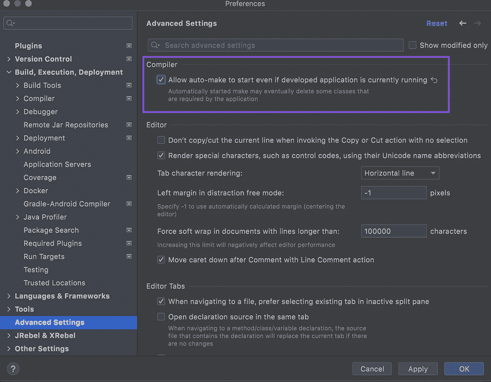
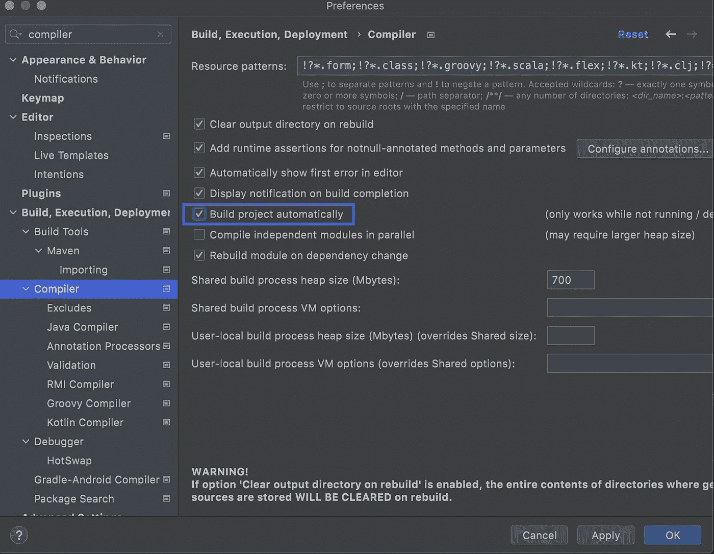

# Spring Boot 开发者工具和 IntelliJ

> 原文：<https://medium.com/javarevisited/spring-boot-developer-tools-and-intellij-b16c7e5f39e4?source=collection_archive---------1----------------------->

*如何在 Intellij 中使用 Spring Developer Tools 启用自动重启*

[丹尼尔](https://unsplash.com/@grounded?utm_source=medium&utm_medium=referral)在 [Unsplash](https://unsplash.com?utm_source=medium&utm_medium=referral) 上拍照

> 使用**spring**-**boot**-**dev tools**的应用程序会在类路径上的文件发生变化时自动重启。

如果您使用 [IntelliJ](/javarevisited/7-best-courses-to-learn-intellij-idea-for-beginners-and-experienced-java-programmers-2e9aa9bb0c05?source=---------9------------------) 作为您的 IDe，并且您的项目不自动刷新，尽管您已经在您的项目中添加了 Spring Boot 开发者工具依赖项(spring-boot-dev tools ),您可能必须执行这些额外的步骤。

转到 IntelliJ IDEA /首选项/高级设置。
选中“编译器”部分下的“即使开发的应用程序当前正在运行，也允许自动生成开始”。

## 启用自动构建

进入 IntelliJ IDEA / Preferences，搜索“编译器”。
选择“自动构建项目”并单击“应用”(如果您不想选中此选项，可以在每次更改项目时按`CTRL+F9it` )。

**参考资料*:***
[https://mkyong . com/spring-boot/intellij-idea-spring-boot-template-reload-is-not-working/](https://mkyong.com/spring-boot/intellij-idea-spring-boot-template-reload-is-not-working/)
[https://youtrack.jetbrains.com/issue/IDEA-274903](https://youtrack.jetbrains.com/issue/IDEA-274903)

编码快乐！