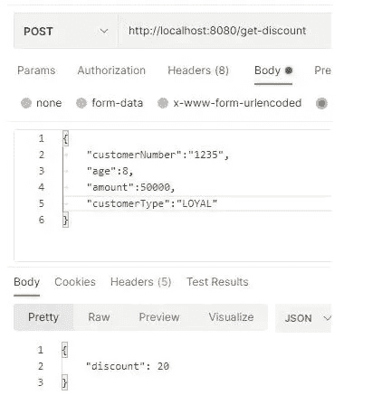
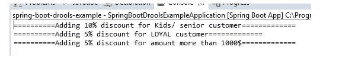
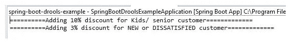

# Spring Boot Drools 规则引擎示例

> 原文：<https://medium.com/javarevisited/spring-boot-drools-rule-engine-example-965eea437ee9?source=collection_archive---------0----------------------->

[](https://javarevisited.blogspot.com/2018/02/top-5-spring-microservices-courses-with-spring-boot-and-spring-cloud.html)

**规则引擎**可以用来实现复杂的业务规则。Drools 是一个开源的业务规则管理系统，可以很容易地与 spring boot 应用程序集成。

KIE 项目支持 drools 与 spring boot 框架等其他技术的集成。

在本文中，我们将学习如何集成 Drools 规则引擎，并使用 spring boot 实现一个简单的规则引擎服务。我们将使用 DRL 规则来创建。spring boot 应用程序中的 drl 文件。

**文章中使用的*技术:*文章中使用的**

*   春季开机版本:2.5.5
*   流口水
*   Java 版本 1.8

# 创建一个弹簧引导应用程序

使用所需的依赖项创建一个 spring boot 应用程序。添加 spring boot starter web 依赖项。此外，将 drools 依赖项包含到 spring boot 应用程序的 pom XML 配置文件中。

下面是 pom.xml 文件的完整内容。

***pom.xml***

```
 <?xml version="1.0" encoding="UTF-8"?>
<project ae lx" href="http://maven.apache.org/POM/4.0.0" rel="noopener ugc nofollow" target="_blank">http://maven.apache.org/POM/4.0.0" xmlns:xsi="[http://www.w3.org/2001/XMLSchema-instance](http://www.w3.org/2001/XMLSchema-instance)"
    xsi:schemaLocation="[http://maven.apache.org/POM/4.0.0](http://maven.apache.org/POM/4.0.0) [https://maven.apache.org/xsd/maven-4.0.0.xsd](https://maven.apache.org/xsd/maven-4.0.0.xsd)">
    <modelVersion>4.0.0</modelVersion>
    <parent>
        <groupId>org.springframework.boot</groupId>
        <artifactId>spring-boot-starter-parent</artifactId>
        <version>2.5.5</version>
        <relativePath/> <!-- lookup parent from repository -->
    </parent>
    <groupId>com.demo.example</groupId>
    <artifactId>spring-boot-drools-example</artifactId>
    <version>0.0.1-SNAPSHOT</version>
    <name>spring-boot-drools-example</name>
    <description>spring-boot-drools-example</description>
    <properties>
        <java.version>1.8</java.version>
        <maven-jar-plugin.version>3.1.1</maven-jar-plugin.version>
        <drools.version>7.59.0.Final</drools.version>
    </properties>
    <dependencies>
        <dependency>
            <groupId>org.springframework.boot</groupId>
            <artifactId>spring-boot-starter-web</artifactId>
        </dependency>

        <dependency>
            <groupId>org.projectlombok</groupId>
            <artifactId>lombok</artifactId>
            <optional>true</optional>
        </dependency>
        <dependency>
            <groupId>org.springframework.boot</groupId>
            <artifactId>spring-boot-starter-test</artifactId>
            <scope>test</scope>
        </dependency>

        <dependency>
            <groupId>org.drools</groupId>
            <artifactId>drools-core</artifactId>
            <version>${drools.version}</version>
        </dependency>
        <dependency>
            <groupId>org.drools</groupId>
            <artifactId>drools-compiler</artifactId>
            <version>${drools.version}</version>
        </dependency>
        <dependency>
            <groupId>org.drools</groupId>
            <artifactId>drools-decisiontables</artifactId>
            <version>${drools.version}</version>
        </dependency>
    </dependencies>
    <build>
        <plugins>
            <plugin>
                <groupId>org.springframework.boot</groupId>
                <artifactId>spring-boot-maven-plugin</artifactId>
                <configuration>
                    <excludes>
                        <exclude>
                            <groupId>org.projectlombok</groupId>
                            <artifactId>lombok</artifactId>
                        </exclude>
                    </excludes>
                </configuration>
            </plugin>
        </plugins>
    </build>
</project>
```

# 配置 drools 应用程序

创建一个名为 **DroolsConfig** 的配置 java 类。

将以下配置添加到 java 类中。

***DroolsConfig.java***

```
package com.demo.example.config;

import org.kie.api.KieServices;
import org.kie.api.builder.KieBuilder;
import org.kie.api.builder.KieFileSystem;
import org.kie.api.builder.KieModule;
import org.kie.api.runtime.KieContainer;
import org.kie.internal.io.ResourceFactory;
import org.springframework.context.annotation.Bean;
import org.springframework.context.annotation.Configuration;

[@Configuration](http://twitter.com/Configuration)
public class DroolsConfig {

    private static final String RULES_CUSTOMER_RULES_DRL = "rules/customer-discount.drl";
    private static final KieServices kieServices = KieServices.Factory.get();

    [@Bean](http://twitter.com/Bean)
    public KieContainer kieContainer() {
        KieFileSystem kieFileSystem = kieServices.newKieFileSystem();
        kieFileSystem.write(ResourceFactory.newClassPathResource(RULES_CUSTOMER_RULES_DRL));
        KieBuilder kb = kieServices.newKieBuilder(kieFileSystem);
        kb.buildAll();
        KieModule kieModule = kb.getKieModule();
        KieContainer kieContainer = kieServices.newKieContainer(kieModule.getReleaseId());
        return kieContainer;
    }
}
```

配置类定义了一个 spring bean**kie container**。KieContainer 用于通过加载应用程序的 **/resources** 文件夹下的规则文件来构建规则引擎。

我们创建了 **KieFileSystem** 实例，配置了规则引擎，并从应用程序的资源目录中加载了 DRL 文件。

此外，我们可以使用 **KieBuilder** 实例来构建 drools 模块。我们可以使用 **KieSerive** singleton 实例来创建 KieBuilder 实例。

最后，我们使用 KieService 创建一个 KieContainer，并将其配置为一个 spring bean。

# 添加模型类

创建一个名为 **OrderRequest** 的 Pojo 类，并定义以下字段。

我们接收这个类作为规则引擎的请求对象，我们还将这些字段作为输入发送给定义的规则，以计算给定客户订单的折扣金额。

***OrderRequest.java***

```
package com.demo.example.model;

import lombok.Getter;
import lombok.Setter;

[@Getter](http://twitter.com/Getter)
[@Setter](http://twitter.com/Setter)
public class OrderRequest {

    private String customerNumber;
    private Integer age;
    private Integer amount;
    private CustomerType customerType;
}
```

另外，定义一个名为 **CustomerType** 的 java 枚举，如下所示。枚举保存客户类型，规则引擎根据该值计算客户订单折扣百分比。

***CustomerType.java***

```
package com.demo.example.model;

public enum CustomerType {
    LOYAL, NEW, DISSATISFIED;

    public String getValue() {
        return this.toString();
    }
}
```

最后，创建一个名为 OrderDiscount 的响应 POJO 类，如下所示。

***OrderDiscount.java***

```
package com.demo.example.model;

import lombok.Getter;
import lombok.Setter;

[@Getter](http://twitter.com/Getter)
[@Setter](http://twitter.com/Setter)
public class OrderDiscount {

    private Integer discount = 0;
}
```

我们将使用上述响应对象返回计算出的折扣。

# 定义 drools 规则

在名为 **customer-discount.drl** 的文件中创建 drools 规则。将文件添加到目录**/src/main/resources/rules**下。

```
import com.demo.example.model.OrderRequest;
import com.demo.example.model.CustomerType;
global com.demo.example.model.OrderDiscount orderDiscount;

dialect "mvel"

rule "Age based discount"
    when
        OrderRequest(age < 20 || age > 50)
    then
        System.out.println("==========Adding 10% discount for Kids/ senior customer=============");
        orderDiscount.setDiscount(orderDiscount.getDiscount() + 10);
end

rule "Customer type based discount - Loyal customer"
    when
        OrderRequest(customerType.getValue == "LOYAL")
    then
        System.out.println("==========Adding 5% discount for LOYAL customer=============");
        orderDiscount.setDiscount(orderDiscount.getDiscount() + 5);
end

rule "Customer type based discount - others"
    when
        OrderRequest(customerType.getValue != "LOYAL")
    then
        System.out.println("==========Adding 3% discount for NEW or DISSATISFIED customer=============");
        orderDiscount.setDiscount(orderDiscount.getDiscount() + 3);
end

rule "Amount based discount"
    when
        OrderRequest(amount > 1000L)
    then
        System.out.println("==========Adding 5% discount for amount more than 1000$=============");
        orderDiscount.setDiscount(orderDiscount.getDiscount() + 5);
end
```

我们需要导入 DRL 文件中使用的模型。

我们还使用了一个名为 **orderDiscount** 的全局参数。全局参数可以在多个规则之间共享。

DRL 文件可以包含一个或多个规则。我们可以使用 [mvel](http://mvel.documentnode.com/) 语法来指定规则。同样，每个规则都可以用使用**规则**关键字的描述来描述。

我们可以使用 **when-then** 语法来定义规则的条件。

基于订单请求的输入值，我们将折扣添加到结果中。如果规则表达式匹配，每个规则都会向全局结果变量添加额外的折扣。

# 添加服务层

创建一个名为 **OrderDiscountService** 的服务 java 类，并添加以下内容。

```
package com.demo.example.service;

import org.kie.api.runtime.KieContainer;
import org.kie.api.runtime.KieSession;
import org.springframework.beans.factory.annotation.Autowired;
import org.springframework.stereotype.Service;

import com.demo.example.model.OrderDiscount;
import com.demo.example.model.OrderRequest;

[@Service](http://twitter.com/Service)
public class OrderDiscountService {

    [@Autowired](http://twitter.com/Autowired)
    private KieContainer kieContainer;

    public OrderDiscount getDiscount(OrderRequest orderRequest) {
        OrderDiscount orderDiscount = new OrderDiscount();
        KieSession kieSession = kieContainer.newKieSession();
        kieSession.setGlobal("orderDiscount", orderDiscount);
        kieSession.insert(orderRequest);
        kieSession.fireAllRules();
        kieSession.dispose();
        return orderDiscount;
    }
}
```

我们正在注入 **KieContainer** 实例并创建一个 **KieSession** 实例。

我们还设置了一个类型为 **OrderDiscount** 的全局参数，它将保存规则的执行结果。

要将请求对象传递给 DRL 文件，我们可以使用 **insert()** 方法。

然后我们通过调用 **fireAllRules()** 方法来触发所有的规则。最后通过调用 KieSession 的 **dispose()** 方法终止会话。

# 添加 REST API

创建一个名为**order discountcontroller**的 REST API 类，并添加以下内容。

控制器使用端点 **/get-discount** 公开一个 POST API。端点需要一个 OrderRequest 对象，并返回计算的 OrderDiscount 响应。

```
package com.demo.example.controller;

import org.springframework.beans.factory.annotation.Autowired;
import org.springframework.http.HttpStatus;
import org.springframework.http.ResponseEntity;
import org.springframework.web.bind.annotation.PostMapping;
import org.springframework.web.bind.annotation.RequestBody;
import org.springframework.web.bind.annotation.RestController;

import com.demo.example.model.OrderDiscount;
import com.demo.example.model.OrderRequest;
import com.demo.example.service.OrderDiscountService;

[@RestController](http://twitter.com/RestController)
public class OrderDiscountController {

    [@Autowired](http://twitter.com/Autowired)
    private OrderDiscountService orderDiscountService;

    [@PostMapping](http://twitter.com/PostMapping)("/get-discount")
    public ResponseEntity<OrderDiscount> getDiscount([@RequestBody](http://twitter.com/RequestBody) OrderRequest orderRequest) {
        OrderDiscount discount = orderDiscountService.getDiscount(orderRequest);
        return new ResponseEntity<>(discount, HttpStatus.OK);
    }
}
```

# 测试应用程序

运行 spring boot 应用程序，并通过发送客户订单请求 JSON 来访问 REST API 端点。

对于年龄< 20 and amount > 1000 的忠诚客户类型，根据我们定义的规则，我们应该获得 20%的折扣。

[](https://javarevisited.blogspot.com/2018/05/top-5-courses-to-learn-spring-boot-in.html)

我们还可以观察输入请求的应用折扣。

[](https://javarevisited.blogspot.com/2020/05/top-20-spring-boot-interview-questions-answers.html)

现在，尝试不同的值，如下所示。

[](https://javarevisited.blogspot.com/2018/02/top-5-restful-web-services-with-spring-courses-for-experienced-java-programmers.html)

我们可以观察到这次只应用了 2 个规则。

[](https://www.java67.com/2021/02/spring-boot-actuator-interview-questions-answers-java.html)

# 结论

在本文中，我们学习了如何使用 spring boot 框架创建 drools 规则引擎。

我们还学习了如何使用 DRL 文件来定义业务规则。

快乐编码..