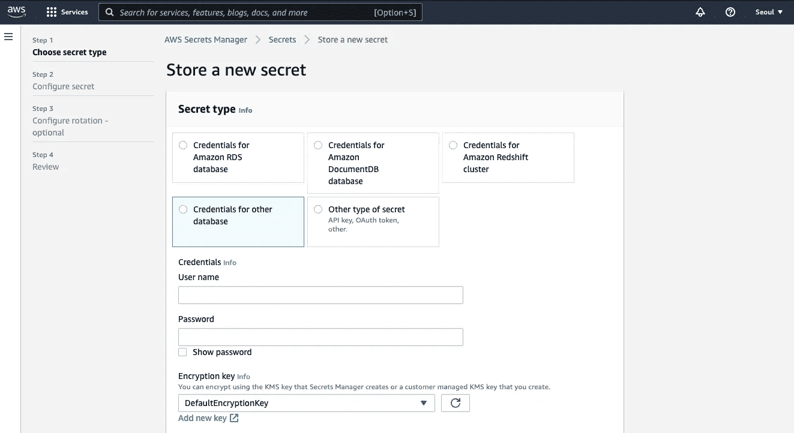
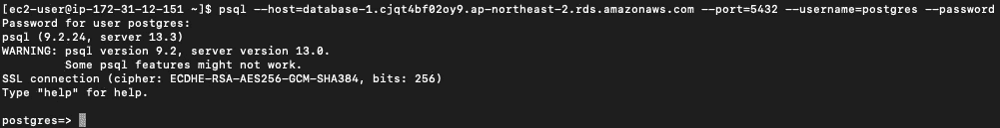
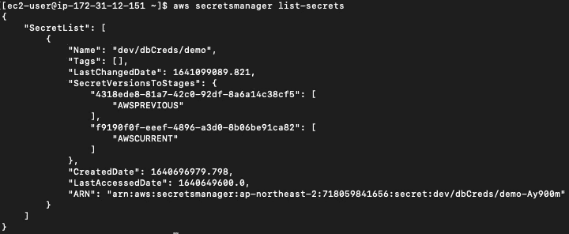
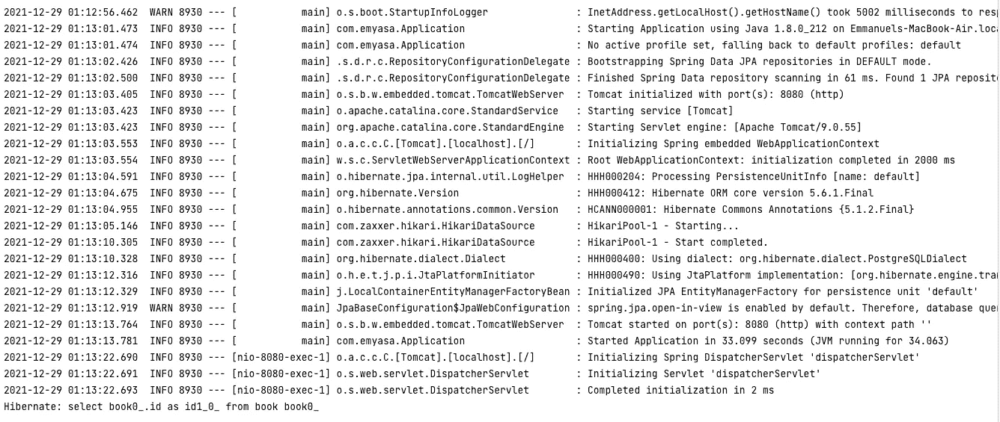

# 使用 AWS Secrets Manager 的 Spring Boot 外部化数据库配置

> 原文：<https://medium.com/javarevisited/spring-boot-externalized-database-configuration-with-aws-secrets-manager-605f5ea3006a?source=collection_archive---------0----------------------->

实现高可用性、可扩展性和简单性

巴勃罗·阿罗约在 [Unsplash](https://unsplash.com?utm_source=medium&utm_medium=referral) 上的照片

## **简介**

在本教程中，我们将逐步完成 Spring Boot 的数据库配置与 AWS Secrets Manager 的集成。

在深入实现细节之前，让我们先讨论一些上下文。

## 语境

众所周知，设置 Spring Boot 数据库配置的最常见方法之一是使用应用程序属性。对一些人来说，更改数据库密码可能很少；然而，为了安全起见，定期做总是更好。

传统上，更改数据库密码意味着在应用了对应用程序属性的更改之后重新启动服务(对于环境变量也是可能的)。我们做得越频繁，就越有可能给用户带来服务中断。

幸运的是，通过集成 AWS Secrets Manager，无论何时我们更改数据库密码，都不需要重新启动服务。它甚至提供了自动定期密码轮换选项。

## 步骤 1:在 AWS Secrets Manager 中创建数据库凭据

前往 AWS 控制台，搜索“秘密管理器”然后，继续执行后续步骤，直到创建了秘密。

## 步骤 2:在 pom.xml 中添加必要的依赖项

**注意:*spring-boot-starter-data-JPA*依赖关系可以与*spring-boot-starter-JDBC*互换。**根据您的设置随意更改。

## 步骤 3:相应地配置应用程序属性文件

首先，对于*驱动程序类名*属性，我们使用 awssecretsmanagerpostgresql driver 类。注意，它来自于*AWS-secrets manager-JDBC*依赖关系。

接下来，对于*spring . JPA . database-platform*属性，我们使用了来自 *postgresql* 依赖项的*PostgreSQL diaclet*。

接下来，值得指出的是*数据源 url* 前缀的变化，现在是 *jdbc-secretsmanager。*

最后，对于*数据源用户名，*我们使用来自 AWS Secret Manager 的*秘密名*。

## **步骤 4:检查服务器的数据库和 Secrets Manager 连接**

对于*数据库连接*，尝试使用 *psql* 命令进行连接:

下面是我们可能会遇到的一些错误:

*   **psql 未安装:**请使用您的实例包管理器**安装它。**
*   **连接超时:确保 EC2 实例和数据库在同一 VPC 上。此外，将数据库的安全组附加到 EC2 实例** —这将允许访问服务器以连接到数据库。

对于机密管理器连接，再次使用 aws-cli，尝试列出机密:

下面是我们可能会遇到的一些错误:

*   ***区域*未定义:使用 aws configure 进行设置。**与此同时，人们可能会跳过与密钥相关的部分，因为将密钥存储在服务器的实例中通常是不安全的。
*   ***EC2 实例*无权访问 *AWS Secrets Manager* :** 为了获得更安全的方法，与其直接在 EC2 中配置密钥，**不如创建一个具有 Secrets Manager 读访问策略的角色；然后，将其附加到 EC2 实例。**

## **最后，运行应用程序并测试其数据库连接**

根据日志，我们可以确认与数据库的成功连接。此外，如果我们尝试轮换密码，由于 AWS Secrets Manager 中的缓存机制，我们仍然能够连接到数据库，而不会出现任何停机。

就是这样！和往常一样，您可以在 Github 上查看这个演示的源代码。