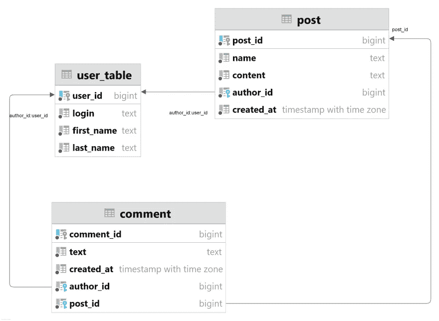
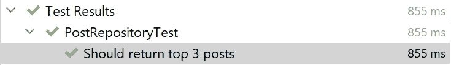
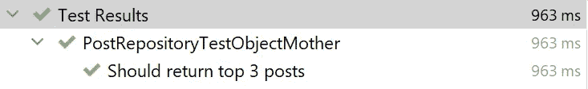
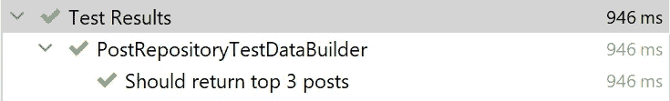

# Spring Boot + JPA —清除测试

> 原文：<https://medium.com/javarevisited/spring-boot-jpa-clear-tests-95804529863b?source=collection_archive---------2----------------------->

我写过几篇关于测试 Spring Boot 应用程序的文章。我们特别讨论了[与数据库](https://dev.to/kirekov/spring-boot-testing-data-and-services-288f)和[测试容器库](https://dev.to/kirekov/spring-boot-testing-testcontainers-and-flyway-2jpd)的集成测试。但是今天我想谈一个更重要的话题。你看，测试对于构建健壮的软件是必不可少的。但是写得不好的测试就不是这样了。它们会减慢开发过程，使代码难以更改和维护。

当涉及到测试时，必须声明测试数据。它可以是中的项、数据库中的记录或分布式队列中的消息。没有数据就无法测试行为。

所以，今天我们讨论使用 [Spring Boot](/javarevisited/top-10-courses-to-learn-spring-boot-in-2020-best-of-lot-6ffce88a1b6e?source=---------39------------------) + [Spring 数据](/javarevisited/5-best-spring-data-jpa-courses-for-java-developers-45e6438be3c9) + [JPA 在数据库中创建测试行的模式。](/javarevisited/top-5-hibernate-online-training-courses-for-beginners-and-advance-java-programmers-469460596b2b)

您可以在[库](https://github.com/SimonHarmonicMinor/spring-boot-testing-data-patterns)中找到所有代码片段。

# 领域模型

假设我们正在开发[中型](/)服务。人们可以发表帖子和评论。下面是数据库模式。

[](https://javarevisited.blogspot.com/2021/08/top-5-spring-data-jpa-courses-for-java.html)

数据库模式

下面是相应的 Hibernate 实体。

## 邮政

## 评论

## 用户

# 商业案例

假设我们应该显示排名前 N 位的帖子，按带有评论的降序排列。

> 为了简洁起见，我们省略了实现细节，因为这不是本文的主题。您可以在[库](https://github.com/SimonHarmonicMinor/spring-boot-testing-data-patterns)中找到完整的工作解决方案。

是时候写一些测试了。假设我们有 10 个帖子。每个帖子有 2 条评论。我们想要检索前 3 个帖子。这就是测试的样子。

[](https://javarevisited.blogspot.com/2019/04/top-5-junit-and-unit-testing-courses-java-programmers.html)

这个测试通过了。它工作正常。反正有些问题是要提的。

1.  这个阶段太复杂了
2.  测试有太多的依赖项
3.  断言含糊不清

在执行查询之前，我们需要在数据库中插入一些记录。在这种情况下，实体通过构造函数被实例化。看起来是个不错的设计选择。所有必需的属性都可以作为参数传递。如果稍后出现另一个字段，它也可以包含在构造函数中。因此，我们可以保证所有的`non-null`字段都存在。

细节决定成败。

1.  测试代码变得与构造函数定义过于耦合。你看，可能有大量的测试需要创建帖子、评论和用户。如果这些实体的构造函数中的任何一个通过另一个属性得到增强，那么直接实例化对象的所有代码部分都不会编译。
2.  并非所有的实体字段在每个测试用例中都是必要的。例如，在测试`findTopPosts`方法时，我们只对`Post`实体的`rating`值感兴趣。
3.  这些论点不是不言自明的。`Post`实体构造函数有 5 个位置参数。每次查看测试套件时，您都必须停下来分析将要分配的目标值。
4.  测试用例是*命令式的*而不是*声明式的*。为什么这是个问题？因为测试是 API 契约。写得好的测试就像完美的类文档。

我们可以用[对象母模式](https://martinfowler.com/bliki/ObjectMother.html)来解决。具有多个创建策略的简单工厂。这就是我们如何实例化新的`Post`对象。

可以为所有实体创建类似的工厂。所以，现在测试看起来像这样。



的确，这样更容易理解流程。它可以用于简单的场景。但是我们假设有几种创建新职位的情况。这将需要添加许多重载方法。

如果`Post`实体有更多的字段会怎样？如果这些属性中有一些是可选的呢？想象一下，我们需要多少个`createPost`声明来涵盖所有这些情况。

对象母模式通过减少参数的数量部分解决了参数名的问题。无论如何，解决方案远非完美。

# 测试数据生成器

[测试数据生成器](https://www.javacodegeeks.com/2014/06/test-data-builders-and-object-mother-another-look.html)是对象母模式的一个替代方案。是典型的 [GoF 模式](https://refactoring.guru/design-patterns/builder)。但是我们为我们的测试用例做了一些改进。

看一看`PostTestBuilder`。

它看起来像一个普通的建造者，但有一些细微的不同。

首先，该类实现了提供单个`build`方法的`Builder`接口。你可能会认为这是一个过度的复杂，但很快你就会意识到它的好处。

其次，关系属性。构建者持有`Builder<User>`而不是`User`本身(其他关系也是如此)。这有助于减少客户端代码的冗长。

最后是变异子(`withName`、`withContent`等)。)返回一个新的生成器，而不是改变当前生成器的状态。当我们想要创建许多相似的对象，它们只有特定的参数不同时，这是一个有用的特性。

重写后的测试如下所示。

你注意到测试看起来有多干净了吗？我们正在创建 10 个评分为`i`的帖子。每个帖子有 2 条评论。太神奇了！

但可悲的是，它不起作用。

```
org.hibernate.TransientPropertyValueException: Not-null property references a transient value - transient instance must be saved before current operation
```

`Post.author`保存不传播。它可以通过使用`CascadeType.PERSIST`选项来修复。但是也许我们不需要在应用程序中级联作者持久性。所以，仅仅为了让测试“绿色”而改变它是错误的。

# 持久包装

在调用`build`方法时，将创建`Post`实体及其所有关系(作者和评论)。因此，当相应的构建器处理实例化时，我们需要持久化子对象。还记得附加的`Builder`接口吗？它现在会帮助我们。

`persisted`回调返回相同的构建器，该构建器将过早地持久化结果实体。

现在我们需要将`TestDBFacade`注入到我们的测试套件中。这可以通过使用`@ContextConfiguration`注释来完成。

通过声明自定义注释，我们可以做得更好。

所以，这就是结果测试。

> 我们不必用`persisted`回调包装注释，因为`Post.comments`关系已经用`CascadeType.PERSIST`属性标记了。

现在成功了。



我想你已经猜到了，并不是所有的东西都调好了。如果打开 SQL 日志记录，您会注意到这一点。

我们期望只有一个用户。但实际上，每个帖子和评论都创建了一个新的。这意味着我们有 30 个用户。

谢天谢地，有一个变通办法。

持久性仅在第一次调用时被处理。后面的调用返回保存的实体。

> 此方法不是线程安全的。然而，在大多数情况下这是可以接受的。因为通常情况下，每个测试场景都是一个按顺序运行的独立操作。

我们要做的就是用`persistedOnce`的用法来改变`persisted`。

现在只有一个持久用户。

另一个需要重构的是`PostRepository`的用法。我们不需要在特定的 Spring 数据仓库上添加额外的依赖。我们可以将`save`方法直接添加到`TestDBFacade`中。

# 明确的主张

我想讨论的最后一件事是断言的用法。再看一下现在的测试。

`size`断言是正确的。排序和评论计数检查呢？它们不是透明的。当您浏览代码时，您应该特别注意弄清楚这些断言的目的。

无论如何，这不是唯一的问题。如果他们失败了呢？我们会在日志中看到类似这样的内容。

```
Posts should be sorted in by rating in descending order
Expected : [posts list]
Actual   : [posts list]

Each post should have 2 comments
Expected : true
Actual   : false
```

没那么描述性。但是有一个更好的选择。

# 哈姆克雷斯特

[Hamcrest](http://hamcrest.org/) 是一个断言库，帮助构建*匹配器*的声明管道。例如，这就是如何验证帖子计数的方法。

与最初的尝试没有太大的不同。另外两个呢？这些断言是面向领域的。Hamcrest 不为特定的商业案例提供实用程序。但让 Hamrest 强大的是定制匹配器。这是一个评论计数验证。

`matchesSafely`方法执行断言本身。在这种情况下，我们检查排序的是否等于初始的。
`describeTo`方法给断言分配一个标签。
和`describeMismatchSafely`记录测试失败时的输出。

断言的用法很简单。

假设收到的帖子没有预期的评论数。这是失败的测试输出。

```
Expected: 2 comments in each post
     but: PostView[10] with 3 comments ; PostView[9] with 3 comments ; PostView[8] with 3 comments
```

现在意图很明显了。我们预计每个帖子会有 2 个评论，但它是 3 个。比简单的`expected true but was false`表现力强多了。

是时候为帖子排序顺序验证编写匹配器了。

这是一个断言。

> `Matchers.is`是一个装饰器，让测试看起来更有表现力。尽管它可以被省略。

这是失败的测试输出。

```
Expected: is sorted posts by rating in desc order
     but: [7.0, 8.0, 9.0]
```

同样，用户的意图很明显。我们期望收到`[9, 8, 7]`，但收到的是`[7, 8, 9]`。

# 摘要

我们做了一些重构。我们来对比一下最初的尝试和最终的版本。

## 第一次尝试

## 最终版本

第一个选项是一组命令。很难理解我们到底在测试什么。而第二种方法告诉我们更多关于行为的信息。它更像是描述类的契约的文档。

# 结论

曾经听过一句至理名言。

> 测试是没有测试的代码部分。

测试业务逻辑至关重要。但是更重要的是确保测试不会成为可维护性的负担。

这就是我想告诉你的关于编写清晰测试的全部内容。如果你有任何问题，请在下面留下你的评论。感谢阅读！

# 资源

1.  [Spring Boot 测试—数据和服务](/javarevisited/spring-boot-testing-data-and-services-bc8b4c62ee8f?source=friends_link&sk=86148a772616274202776f4515c078e4)
2.  [Spring Boot 测试——测试集装箱和飞行路线](/javarevisited/spring-boot-testing-testcontainers-and-flyway-df4a71376db4?source=friends_link&sk=1d0ffcd36bb4265c2d0120520bc8a567)
3.  [带有代码示例的知识库](https://github.com/SimonHarmonicMinor/spring-boot-testing-data-patterns)
4.  [对象母模式](https://martinfowler.com/bliki/ObjectMother.html)
5.  [测试数据生成器](https://www.javacodegeeks.com/2014/06/test-data-builders-and-object-mother-another-look.html)
6.  [构建器模式](https://refactoring.guru/design-patterns/builder)
7.  [汉克莱斯特](http://hamcrest.org/)