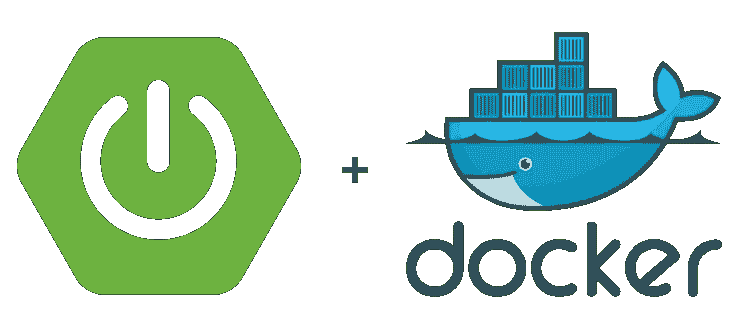
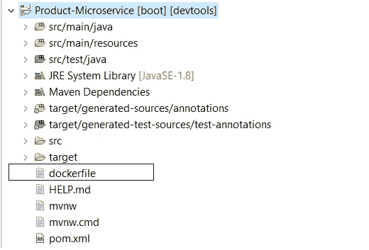
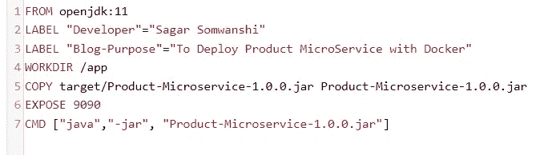
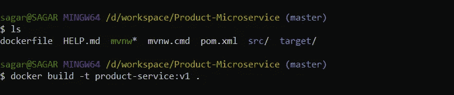
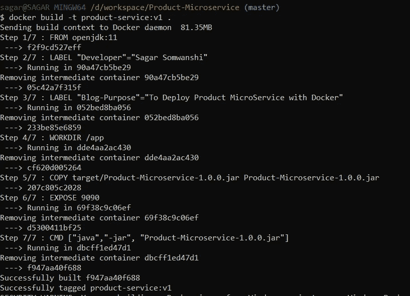
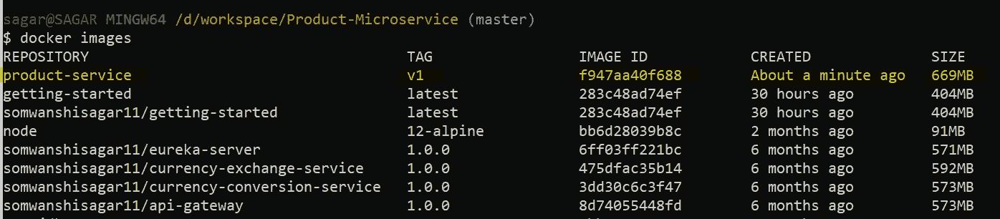
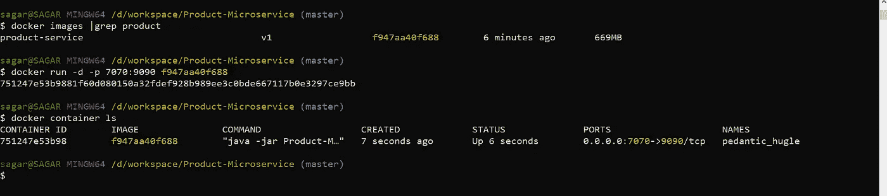
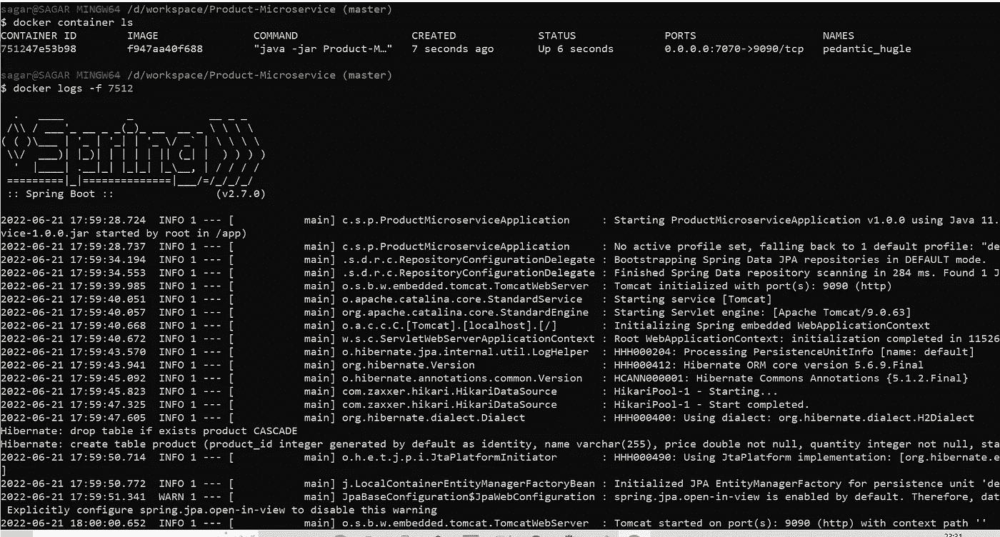
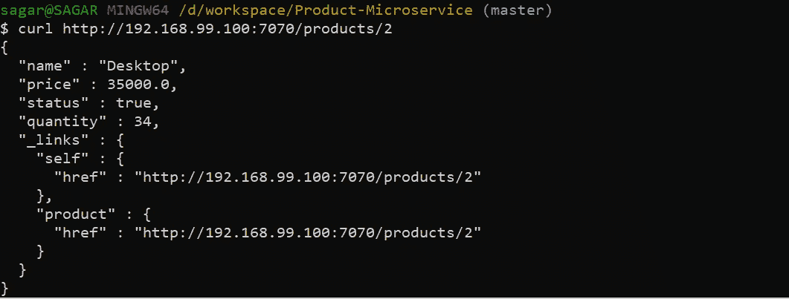
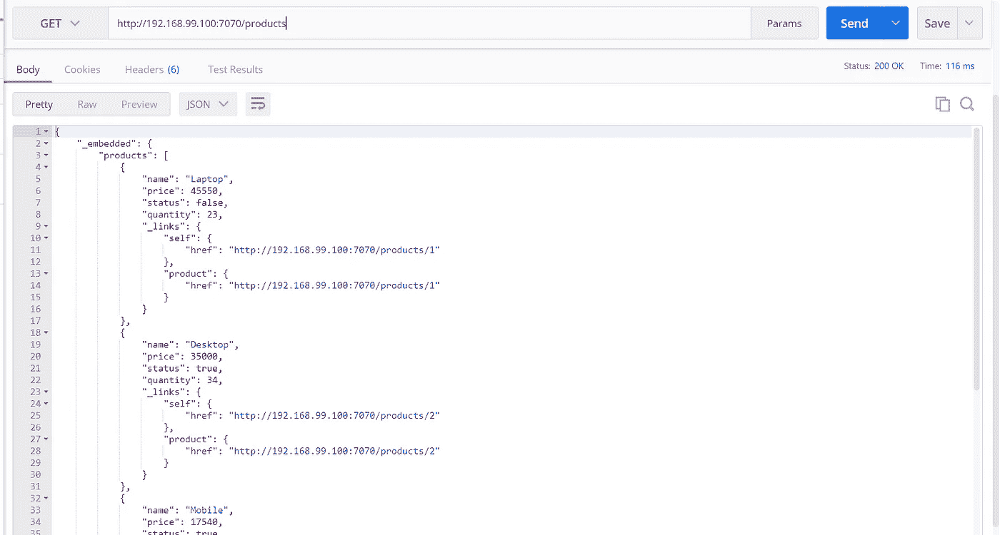

# Spring Boot-Docker 微服务部署

> 原文：<https://medium.com/javarevisited/spring-boot-microservice-deployment-with-docker-28f539928ce7?source=collection_archive---------1----------------------->

在本教程中，我们将在 Docker 的帮助下部署基于 Spring boot 的微服务。

弹簧靴罐的对接(复制图像)

我们将使用以前教程中编写的产品微服务进行 dockering。

[在不到 2 分钟的时间内编写微服务..(比 Maggi 快)](/@somwanshisagar11/write-microservice-in-less-than-2-mins-faster-than-maggi-b5b0d65a058)

**先决条件:**

*   弹簧靴 2.7.0
*   Maven 3.6 以上
*   Java 8 或更高版本
*   Docker 或与 Docker 一起玩
*   用于服务测试的邮递员

如果你想知道在你的机器上安装 docker 的步骤，请点击[了解更多详情。](https://docs.docker.com/engine/install/)

不浪费时间，让我们开始[整理春季启动应用](/javarevisited/5-best-docker-courses-for-java-and-spring-boot-developers-bbf01c5e6542) …

**第一步**:在项目的根路径下创建 dockerfile(指我们存放 pom.xml 文件的路径)。请参考下面的屏幕截图。

项目目录中 Dockerfile 的位置

让我们假设您已经在机器上安装了 docker。如果你在安装 docker 时遇到了麻烦，那么我们可以选择其他选项 [***来使用 Docker***](https://labs.play-with-docker.com/) ***。***

***注意*** : *要使用 Play with docker，您需要在 Docker hub 中创建帐户。这是一个完全免费的 docker 动手工具。*

**步骤 2:创建 Docker 文件:**

让我们在 maven 项目目录中定义的路径下创建 Dockerfile。请不要在 docker 文件中添加任何扩展名。文本文件（textfile）

Dockerfile 文件

***来自:*** *要构建码头工人形象我们需要一个基础形象。我们正在对接基于 java 的项目，所以基本图像将被打开。* ***标签:*** *标签是关于图像或容器的元数据。它们不会影响应用程序的功能。* ***WORKDIR:****设置一个* [*Docker 容器*](/javarevisited/top-5-free-courses-to-learn-docker-for-beginners-best-of-lot-b2b1ad2b98ad) *的工作目录。* ***复制:*** *将指定的文件复制到镜像中。在我们的例子中，我们将产品微服务 jar 从目标文件夹复制到容器内的 app 文件夹。* ***EXPOSE:****公开容器内特定端口上的服务。* ***CMD:****容器一启动就执行命令。*

**第三步:构建 Docker 映像:**

要构建 docker 映像，请转到我们放置 docker 文件的路径并运行下面的命令

*docker build -t <图像名称/图像 ID > : <版本>*

用标签构建 docker 图像

一旦 docker 映像在 docker CLI 上成功构建，您将在命令提示符下获得成功消息。

建立码头形象

**第四步:在 Docker 中列出图像:**

*docker images* 或*docker images ls*命令可用于列出本地存储库中的图像。

docker 图像列表

**步骤 5:在 Docker 引擎上运行 Docker 映像:**

*docker run -d -p 7070:9090 <图像 Id >*

**选项 d :** 在后台运行容器并打印容器 Id。以分离模式运行。

**选项 p :** 向主机发布容器的端口。在我们的例子中，容器将在 9090 端口上运行，外部系统或主机可以在 7070 端口上访问应用程序。

例如-p <external port="">:<internal port=""></internal></external>

*码头集装箱 ls*

该命令将显示 docker 引擎中所有正在运行的容器。

运行 docker 图像

要查看正在运行的容器的日志，我们可以使用下面的命令

*docker logs -f <集装箱 Id>*

查看容器日志

**步骤 6:测试服务**

现在让我们在控制台上测试服务，并查看服务的输出。我们可以使用 [Curl](https://javarevisited.blogspot.com/2015/10/how-to-send-http-request-from-unix-or-linux-curl-wget-example.html) 或 [Postman](/javarevisited/7-best-courses-to-learn-postman-tool-for-web-service-and-api-testing-f225c138fa5a) 来启动请求。

***注:*** *我在 Docker 工具箱上测试过应用，默认主机 IP 是 192.168.99.100。您可以使用以下命令获取主机 IP。*

*docker -machine ip 默认*

以下是呼叫服务的选项。

*   使用 curl 命令调用服务:

*   使用[邮递员](https://javarevisited.blogspot.com/2020/02/top-5-postman-tutorials-and-courses-for-web-developers.html)呼叫服务:

我们已经完成了基于 Spring boot 的微服务的 Docker 部署。

快乐学习…

</javarevisited/13-topics-you-should-prepare-for-your-next-spring-boot-interview-5f2993a04ff5> 