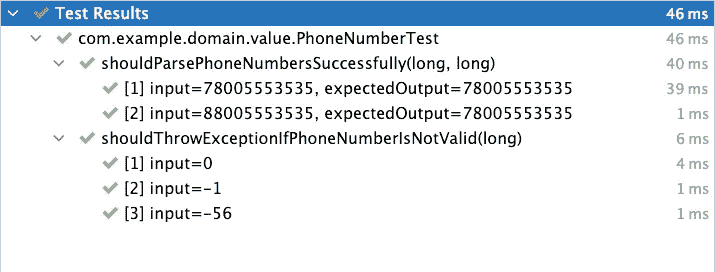

# Spring Boot——价值对象的力量

> 原文：<https://medium.com/javarevisited/spring-boot-power-of-value-objects-a98831cfe4b8?source=collection_archive---------0----------------------->

在这篇文章中，我告诉你:

1.  什么是价值对象，为什么它们如此重要？
2.  如何在 Spring Boot 控制器中应用这些模式，使代码更安全、更易于维护。

我从这个库的[中获取代码示例。您可以克隆它来查看整个项目的运行情况。](https://github.com/SimonHarmonicMinor/spring-boot-value-objects-example)

[](https://www.java67.com/2021/02/spring-boot-actuator-interview-questions-answers-java.html)

迷因封面

# 领域

这个领域相当简单。我们只有一个实体。无论如何，你会看到即使一个类也可能产生歧义和数据损坏。

> *我使用 Hibernate 作为持久性框架。因此，域实体* `*User*` *也是一个 Hibernate 实体。但是，即使您根本不使用 Hibernate，我向您提出的想法也是一样的。*

首先，让我们从数据库模式开始。有一张桌子。所以，不会很难。

假设我们想要存储用户的电话号码。下面是 SQL 表的定义:

```
CREATE TABLE users
(
    id           UUID   PRIMARY KEY,
    phone_number VARCHAR(200) NOT NULL UNIQUE
);
```

这些类型非常简单。现在让我们定义相应的 Hibernate 实体。请看下面的代码示例。

```
@Entity
@Table(name = "users")
@Getter
public class User {
    @Id
    private UUID id;

    @Column(name = "phone_number")
    private String phoneNumber;
}
```

看起来不错，不是吗？电话号码是`String`类型。这些字段直接映射到数据库列。什么会出错？你很快就会看到，很多事情。

# 电话号码完整性问题

每个可能的`String`值都是有效的电话号码吗？当然不是。这就是问题所在。用户可以将`0`、负值、甚至`some-unknown-value-string`作为电话号码。

假设在注册过程中，某个用户将其电话号码设置为`-78005553535`。很明显，有一个错别字，应该是`+`符号，而不是`-`符号。反正用户还没注意到错误，应用了设置。稍后，另一个用户想要找到之前的人，并向该群发送邀请。他或她只知道电话号码。突然`+78005553535`搜索没有返回结果。尽管查询输入绝对正确。现在假设您的应用程序服务于成千上万的人。即使 1%的人在他们的电话号码中犯了一个错误，在数据库中修复这些值也将是乏味的。

你如何克服这个问题？答案是[值对象](https://martinfowler.com/bliki/ValueObject.html)。这个想法很简单:

1.  值对象必须是不可变的。
2.  值对象应该是可比较的(即实现`equals/hashCode`)。
3.  值对象保证它总是保存正确的值。

看下面`PhoneNumber`宣言的第一次尝试。

```
@Value
public class PhoneNumber {
    String value;

    public PhoneNumber(String value) {
        this.value = value;
    }
}
```

> *将* `[*@Value*](https://projectlombok.org/features/Value)` [*龙目标注*](https://projectlombok.org/features/Value) *生成*`*equals*`*`*hashCode*`*`*toString*`*方法，并将所有字段定义为* `*private final*` *。***

**`PhoneNumber`类解决了我们定义的第一个和第二个需求。但是，您仍然可以用无效的电话号码构造类(例如，`0`、`-123`、`abc`)。这意味着我们应该在构造函数内部继续验证过程。看看下面固定的代码片段。**

```
**@Value
public class PhoneNumber {
    private static final PhoneNumberUtil PHONE_NUMBER_UTIL = PhoneNumberUtil.getInstance();

    String value;

    public PhoneNumber(String value) {
        this.value = value;
        validatePhoneNumber(value);
    }

    private static void validatePhoneNumber(String value) {
        try {
            if (Long.parseLong(value) <= 0) {
                throw new PhoneNumberParsingException("The phone number must be positive: " + value);
            }
            PHONE_NUMBER_UTIL.parse(String.valueOf(value), "RU");
        } catch (NumberParseException | NumberFormatException e) {
            throw new PhoneNumberParsingException("The phone number isn't valid: " + value, e);
        }
    }
}**
```

> ***我正在使用*[*Google Libphonenumber*](https://github.com/google/libphonenumber)*库来验证输入。***

**似乎我们解决了问题。我们总是在对象构造期间验证该值。然而，一个微小的细节仍然没有被触及。而且叫*数据规范化*。**

**如果用户`A`将他们的电话号码设置为`88005553535`，用户`B`将不会在搜索栏中找到他或她键入的`+78005553535`值。尽管俄罗斯人对这些电话号码一视同仁。**

> ***这仅适用于本地电话。无论如何，一些用户可以基于此做出假设。***

**事实上，我们应该始终将从业务角度来看相等的有效输入值转换为相同的输出结果，以消除可能的歧义。看看下面最后的`PhoneNumber`类声明。**

```
**@Value
public class PhoneNumber {
    private static final PhoneNumberUtil PHONE_NUMBER_UTIL = PhoneNumberUtil.getInstance();

    String value;

    public PhoneNumber(String value) {
        this.value = validateAndNormalizePhoneNumber(value);
    }

    private static String validateAndNormalizePhoneNumber(String value) {
        try {
            if (Long.parseLong(value) <= 0) {
                throw new PhoneNumberParsingException("The phone number cannot be negative: " + value);
            }
            final var phoneNumber = PHONE_NUMBER_UTIL.parse(value, "RU");
            final String formattedPhoneNumber = PHONE_NUMBER_UTIL.format(phoneNumber, E164);
            // E164 format returns phone number with + character
            return formattedPhoneNumber.substring(1);
        } catch (NumberParseException | NumberFormatException e) {
            throw new PhoneNumberParsingException("The phone number isn't valid: " + value, e);
        }
    }
}**
```

**让我们也写一些单元测试来验证行为。**

```
**class PhoneNumberTest {
    @ParameterizedTest
    @CsvSource({
        "78005553535,78005553535",
        "88005553535,78005553535",
    })
    void shouldParsePhoneNumbersSuccessfully(String input, String expectedOutput) {
        final var phoneNumber = assertDoesNotThrow(
            () -> new PhoneNumber(input)
        );
        assertEquals(expectedOutput, phoneNumber.getValue());
    }

    @ParameterizedTest
    @ValueSource(strings = {
        "0", "-1", "-56"
    })
    void shouldThrowExceptionIfPhoneNumberIsNotValid(String input) {
        assertThrows(
            PhoneNumberParsingException.class,
            () -> new PhoneNumber(input)
        );
    }
}**
```

**这是执行结果。**

**[](https://www.java67.com/2020/04/how-to-validate-phone-number-in-java.html)

测试执行结果** 

**最后一步是将值对象放到`User` Hibernate 实体中。在这种情况下，[属性转换器](https://www.baeldung.com/jpa-attribute-converters)就派上了用场。请看下面的代码块。**

```
**@Converter
public class PhoneNumberConverter implements AttributeConverter<PhoneNumber, String> {
    @Override
    public String convertToDatabaseColumn(PhoneNumber attribute) {
        return attribute.getValue();
    }

    @Override
    public PhoneNumber convertToEntityAttribute(String dbData) {
        return new PhoneNumber(dbData);
    }
}

@Entity
@Table(name = "users")
@Getter
public class User {
    @Id
    private UUID id;

    @Column(name = "phone_number")
    @Convert(converter = PhoneNumberConverter.class)
    @NotNull
    private PhoneNumber phoneNumber;
}**
```

**与使用原始类型相比，值对象有什么好处？他们在这里:**

1.  **如果您收到了`PhoneNumber`实例，那么您肯定知道它是有效的，并且您不需要重复验证。**
2.  **快速失效模式。如果电话号码无效，您很快就会得到一个异常。**
3.  **代码更安全。如果您根本不使用原始类型作为业务值，那么您可以保证所有的输入值都通过了定义的检查。**
4.  **如果你是 Hibernate 用户，那么 [JPQL](https://thorben-janssen.com/jpql/) 查询将返回`PhoneNumber`值对象，而不仅仅是上下文无关的`String`属性。**
5.  **您将所有检查封装在一个类中。如果必须根据新的业务需求对它们进行调整，应该只在一个地方进行。**

# **类型化实体的 id**

**您的项目中可能会有不止一个实体。并且它们中的大多数很有可能共享相同类型的 ID(在本例中，是`UUID`类型)。**

**那有什么问题？假设您有一个将`User`分配给某个`UserGroup`的服务。它接受两个 id 作为输入参数。请看下面的代码示例。**

```
**public void assignUserToGroup(UUID userId, UUID userGroupId) { ... }**
```

**我打赌你已经看过很多类似的片段了。无论如何，让我们假设有人写了这行代码。**

```
**assignUserToGroup(userGroup.getId(), user.getId());**
```

**你能发现这里有窃听器吗？我们不小心交换了身份。如果您犯了这样的错误，那么您将很幸运在语句执行时得到[外键](https://www.w3schools.com/sql/sql_foreignkey.asp)违例。但是如果表上没有外键，或者赋值已经成功进行，而业务操作结果不正确，那么您就有大麻烦了。**

**我对`assignUserToGroup`方法声明做了一点小小的改动。看下面的固定选项。**

```
**public void assignUserToGroup(User.ID userId, UserGroup.ID userGroupId) { ... }**
```

**现在交换 IDs bug 是不可能的了。因为这会导致编译时错误。更好的是，您可以轻松地实现 Hibernate 实体的方法。**

```
**@Entity
@Table(name = "users")
@Getter
public class User {
    @EmbeddedId
    private User.ID id;

    @Column(name = "phone_number")
    @Convert(converter = PhoneNumberConverter.class)
    @NotNull
    private PhoneNumber phoneNumber;

    @Data
    @Setter(PRIVATE)
    @Embeddable
    @AllArgsConstructor
    @NoArgsConstructor(access = PROTECTED)
    public static class ID implements Serializable {
        @Column(updatable = false)
        @NotNull
        private UUID id;
    }
}**
```

**所有的`findBy` Spring 数据查询，所有的定制 JPQL 语句都与`User.ID`一起工作，但不是原始的`UUID`类型。此外，它还有助于方法重载。如果您是一个原始的 IDs 用户，并且您需要相同的方法来接受不同实体的 id，那么您必须用不同的方式命名它们。但是对于类型化的 id，情况就不一样了。看看下面的例子。**

```
**public class RoleOperations {

    // doesn't compile
    public boolean hasAnyRole(UUID userId, Role... role) {...}

    public boolean hasAnyRole(UUID userGroupId, Role... role) {...}
}

public class RoleOperations {

    // compiles successfully
    public boolean hasAnyRole(User.ID userId, Role... role) {...}

    public boolean hasAnyRole(UserGroup.ID userGroupId, Role... role) {...}
}**
```

> ***不幸的是，您不能用值对象平滑地包装基于序列的 id。有解决办法，但是比较繁琐。我把* [*留了下来，建议给 Hibernate types 项目的*](https://github.com/vladmihalcea/hibernate-types/issues/522) *增加对这个特性的支持。您已经看到了用户定义类型的好处。所以，你可以评价我的问题，让它更受欢迎。但是，您仍然可以在客户端生成号码 id。例如，* [*TSID 库*](https://github.com/f4b6a3/tsid-creator) *就做了这项工作。***

# **REST 端点参数**

**我已经指出，在所有应用程序级别使用值对象降低了代码的复杂性，并使其更加安全。然而，当涉及到 REST 端点时，事情就没那么简单了。假设我们需要两个操作:**

1.  **用给定的`PhoneNumber`创建新的`User`。**
2.  **通过提供的`PhoneNumber`搜索已有的`User`。**

**看看下面可能的实现。**

```
**@RestController
class UserController {

    @PostMapping("/api/user")
    void createUser(@RequestParam String phoneNumber) {
        ...
    }

    @GetMapping("/api/user")
    UserResponse getUserByPhoneNumber(@RequestParam String phoneNumber) {
        ...
    }

    record UserResponse(UUID id, String phoneNumber) {
    }
}**
```

**正如您所看到的，我们又回到了原始类型用法(例如，`UUID`作为 id，`String`作为电话号码)。如果我们简单地将`@RequestParam`类型替换为`PhoneNumber`，我们将在运行时得到一个异常。`UserResponse`序列化可能不会产生任何错误，但是客户端将接收到意外格式的数据。因为[Jackson](https://www.baeldung.com/jackson)(Spring Boot 默认的序列化库)不知道如何处理自定义类型。**

**谢天谢地，有一个解决方案。首先，让我们定义一个`SerdeProvider`接口。**

```
**public interface SerdeProvider<T> {
    JsonDeserializer<T> getJsonDeserializer();
    JsonSerializer<T> getJsonSerializer();
    Formatter<T> getTypedFieldFormatter();
    Class<T> getType();
}**
```

**然后我们需要两个注册为 Spring beans 的实现。`PhoneNumberSerdeProvider`和`UserIdSerdeProvider`。看下面的宣言。**

```
**@Component
class PhoneNumberSerdeProvider implements SerdeProvider<PhoneNumber> {
    @Override
    public JsonDeserializer<PhoneNumber> getJsonDeserializer() {
        return new JsonDeserializer<>() {
            @Override
            public PhoneNumber deserialize(JsonParser p, DeserializationContext ctxt) throws IOException {
                final var value = p.getValueAsString();
                if (value == null) {
                    return null;
                }
                return new PhoneNumber(value);
            }
        };
    }

    @Override
    public JsonSerializer<PhoneNumber> getJsonSerializer() {
        return new JsonSerializer<>() {
            @Override
            public void serialize(PhoneNumber value, JsonGenerator gen, SerializerProvider serializers) throws IOException {
                if (value == null) {
                    gen.writeNull();
                } else {
                    gen.writeString(value.getValue());
                }
            }
        };
    }

    @Override
    public Formatter<PhoneNumber> getTypedFieldFormatter() {
        return new Formatter<>() {
            @Override
            public PhoneNumber parse(String text, Locale locale) {
                return new PhoneNumber(text);
            }

            @Override
            public String print(PhoneNumber object, Locale locale) {
                return object.getValue();
            }
        };
    }

    @Override
    public Class<PhoneNumber> getType() {
        return PhoneNumber.class;
    }
}**
```

> ***`*UserIdSerdeProvider*`*实现类似。可以在* *资源库中找到* [*源代码。*](https://github.com/SimonHarmonicMinor/spring-boot-value-objects-example/blob/master/src/main/java/com/example/config/UserIdSerdeProvider.java)***

**现在我们只需要将这些定制提供者注册到`ObjectMapper`实例中。看下面的弹簧`@Configuration`。**

```
**@Slf4j
@Configuration
@RequiredArgsConstructor
@SuppressWarnings({"unchecked", "rawtypes"})
class WebMvcConfig implements WebMvcConfigurer {
    private final List<SerdeProvider<?>> serdeProviders;

    @Override
    public void addFormatters(FormatterRegistry registry) {
        for (SerdeProvider<?> provider : serdeProviders) {
            log.info("Add custom formatter for field type '{}'", provider.getType());
            registry.addFormatterForFieldType(provider.getType(), provider.getTypedFieldFormatter());
        }
    }

    @Bean
    public ObjectMapper objectMapper() {
        return new ObjectMapper()
            .registerModule(new Jdk8Module())
            .registerModule(new JavaTimeModule())
            .registerModule(customSerDeModule())
            .disable(SerializationFeature.WRITE_DATES_AS_TIMESTAMPS);
    }

    public com.fasterxml.jackson.databind.Module customSerDeModule() {
        final var module = new SimpleModule("Custom SerDe module");
        for (SerdeProvider provider : serdeProviders) {
            log.info("Add custom serde for type '{}'", provider.getType());
            module.addSerializer(provider.getType(), provider.getJsonSerializer());
            module.addDeserializer(provider.getType(), provider.getJsonDeserializer());
        }
        return module;
    }
}**
```

**之后，我们可以重构初始的 REST 控制器。看看下面的最终版本。**

```
**@RestController
class UserController {

    @PostMapping("/api/user")
    void createUser(@RequestParam PhoneNumber phoneNumber) {
        ...
    }

    @GetMapping("/api/user")
    UserResponse getUserByPhoneNumber(@RequestParam PhoneNumber phoneNumber) {
        ...
    }

    record UserResponse(User.ID id, PhoneNumber phoneNumber) {
    }
}**
```

**因此，我们不必再在应用程序中处理原始类型。框架将输入值转换成相应的值对象，反之亦然。因此，Spring 会在值对象创建期间自动对其进行验证。因此，如果输入无效，您可以在不触及业务逻辑的情况下尽早获得异常。太神奇了！**

# **结论**

**值对象非常强大。一方面，它使代码更容易维护，并有助于阅读它几乎像一个简单的英语文本。此外，这也使它更安全，因为您总是在值对象实例化上验证输入。我还可以推荐你阅读[这本关于价值对象和领域原语的精彩书籍](https://www.amazon.com/Secure-Design-Daniel-Deogun/dp/1617294357)。通过阅读这篇文章，我获得了写这篇文章的灵感。**

**如果您有任何问题或建议，请在下面留下您的评论。感谢阅读！**

# **资源**

1.  **[带有代码示例的知识库](https://github.com/SimonHarmonicMinor/spring-boot-value-objects-example)**
2.  **[值对象定义](https://martinfowler.com/bliki/ValueObject.html)**
3.  **`[@Value](https://projectlombok.org/features/Value)` [龙目标注](https://projectlombok.org/features/Value)**
4.  **[谷歌 Libphonenumber 库](https://github.com/google/libphonenumber)**
5.  **[JPA 属性转换器](https://www.baeldung.com/jpa-attribute-converters)**
6.  **[JPQL](https://thorben-janssen.com/jpql/)**
7.  **[数据库外键定义](https://www.w3schools.com/sql/sql_foreignkey.asp)**
8.  **[我提议在 Hibernate types 项目中实现类型化序列 id](https://github.com/vladmihalcea/hibernate-types/issues/522)**
9.  **[杰克森库](https://www.baeldung.com/jackson)**
10.  **[由设计书保护](https://www.amazon.com/Secure-Design-Daniel-Deogun/dp/1617294357)**
11.  **[TSID 图书馆](https://github.com/f4b6a3/tsid-creator)**