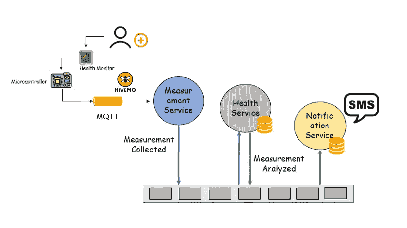
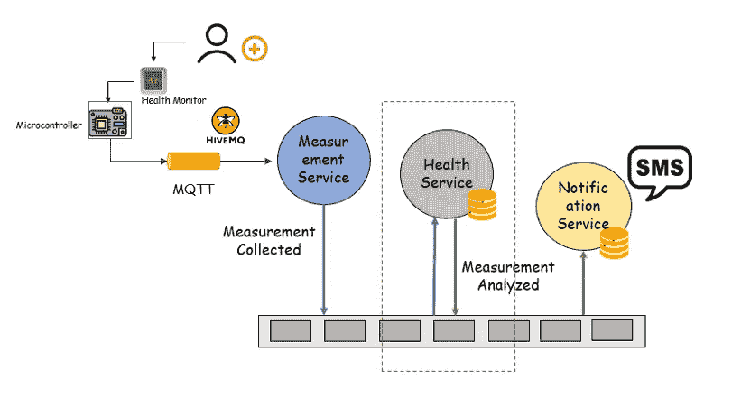
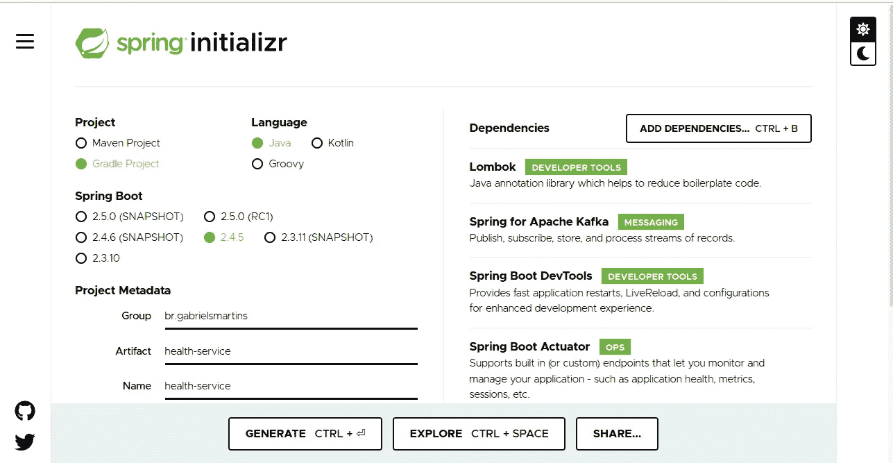
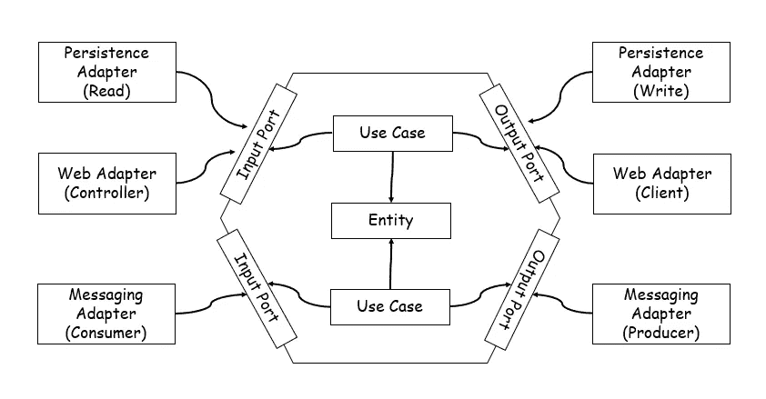

# 使用卡夫卡和 R2DBC 的 Spring Boot 项目(上)

> 原文：<https://medium.com/javarevisited/spring-boot-project-using-kafka-and-r2bc-part-i-a460627d308c?source=collection_archive---------6----------------------->

本教程是关于使用 Spring Boot 和 Spring Kafka 以及 R2DBC 创建一个简单的应用程序。

我们需要:

*   JDK 11
*   [格拉德](/javarevisited/5-best-gradle-courses-and-books-to-learn-in-2021-93f49ce8ff8e)
*   [龙目岛](https://javarevisited.blogspot.com/2021/08/how-to-use-lombok-library-in-java.html)
*   [春联](/javarevisited/7-best-webflux-and-reactive-spring-boot-courses-for-java-programmers-33b7c6fa8995)
*   [春天的卡夫卡](/javarevisited/top-10-apache-kafka-online-training-courses-and-certifications-621f3c13b38c)
*   春天 R2DBC
*   [PostgreSQL 驱动程序](/javarevisited/7-best-free-postgresql-courses-for-beginners-to-learn-in-2021-3bf369d73794)
*   [码头工人](/javarevisited/5-best-docker-courses-for-java-and-spring-boot-developers-bbf01c5e6542)

想象一下下面的场景:

有人想使用健康监测器(如心率传感器等)存储测量值。).收集数据并通过 MQTT 发送给代理(例如 HiveMQ)。

之后，测量服务订阅主题并将读取的测量值发送到健康服务，健康服务将分析信号是正常、高还是低。

最后，如果某些迹象看起来很严重，通知服务可以向该人或医生发送 SMS(或其他类型的通知)。

因此，在本教程中，我们将只开发健康服务，该服务将接收测量结果并发布分析数据的事件。

本教程将分为 4 个部分:

1.  [设置项目](https://gasmartins.medium.com/spring-boot-project-using-kafka-and-r2bc-part-i-a460627d308c)
2.  [建模领域类](https://gasmartins.medium.com/spring-boot-project-using-kafka-and-r2bc-part-ii-967810ac4fb0)
3.  [建模持久性类](https://gasmartins.medium.com/spring-boot-project-using-kafka-and-r2bc-part-iii-in-construction-b3a11422899)
4.  [建模 Web 类](https://gasmartins.medium.com/spring-boot-project-using-kafka-and-r2bc-part-iii-f19fccb409a8)
5.  [建模事件类](https://gasmartins.medium.com/spring-boot-project-using-kafka-and-r2bc-part-v-3bff5053a7a9)
6.  [使用 docker 运行应用和服务](https://gasmartins.medium.com/spring-boot-project-using-kafka-and-r2bc-part-vi-426477276072)

现在，让我们设置我们的项目！！！

# 设置项目

转到 Spring initial Zr([https://start.spring.io/](https://start.spring.io/))并选择以下依赖项:

*   龙目岛
*   阿帕奇卡夫卡的春天
*   Spring Boot 执行器(可选)
*   侦察(可选)
*   春季数据 R2DBC
*   [弹簧反应网](https://javarevisited.blogspot.com/2021/04/best-reactive-spring-and-webflux-courses-for-java-developers.html)

创作实例

**注意:**不要使用 **spring-boot-devtools** ，你可能会遇到 avro 反序列化的问题。参见[https://github.com/spring-projects/spring-kafka/issues/1665](https://github.com/spring-projects/spring-kafka/issues/1665)

**build.gradle** 文件将类似于:

而 **settings.gradle** 应该是这样的:

# **应用架构**

我们可以使用基于多模块的方法，但是我们将使用一个基本的包组织。

对于这个应用程序，我相信六边形架构看起来是一个不错的选择。

下图显示了这是如何工作的:

六边形结构的例子

**相关链接**

下一个教程:[教程第二部分](https://gasmartins.medium.com/spring-boot-project-using-kafka-and-r2bc-part-ii-967810ac4fb0)