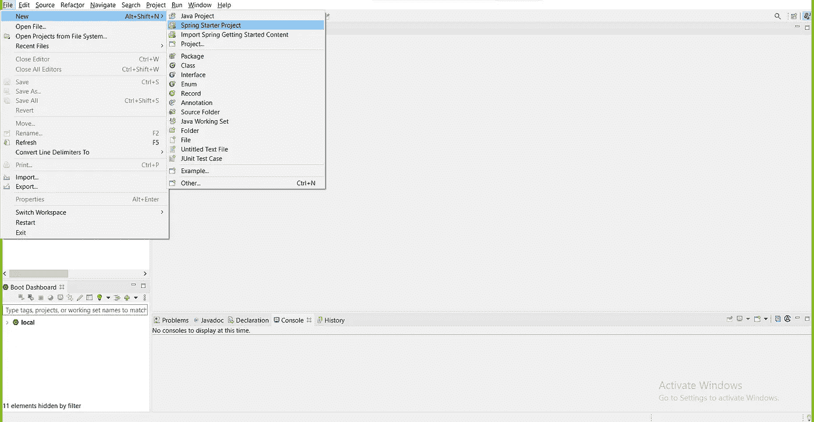
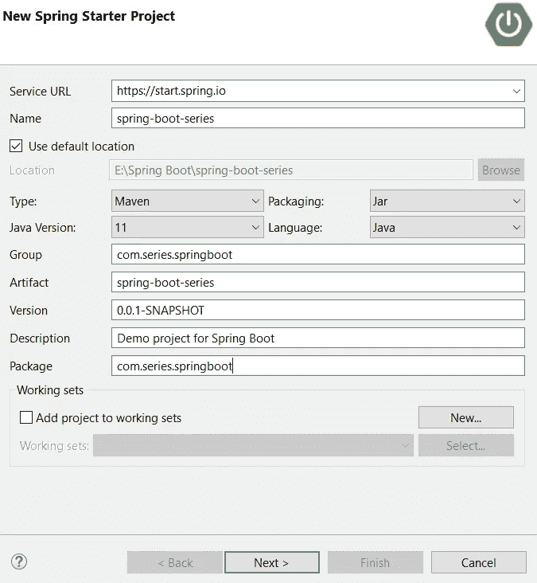
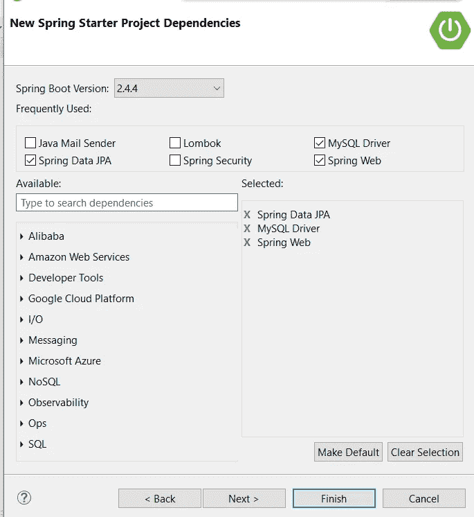
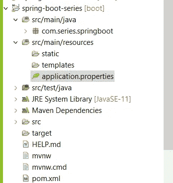
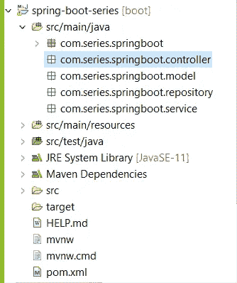

# Spring boot 系列-1 项目设置和 CRUD 操作

> 原文：<https://medium.com/javarevisited/spring-boot-series-1-project-setup-and-crud-operations-eb297d39ba22?source=collection_archive---------4----------------------->


在这个 spring boot 系列中，我将向大家展示如何从 basic 开发一个 spring boot 项目。在本文中，我们将关注如何启动一个 spring boot 项目，并使用一个表完成所有四个 CRUD(创建、读取、更新和删除)操作。在这里，我将使用 spring 工具套件和 [Maven](/javarevisited/6-best-maven-courses-for-beginners-in-2020-23ea3cba89) 和 [MySQL databas](/javarevisited/top-5-courses-to-learn-mysql-in-2020-4ffada70656f) e 来实现。

1.  **项目设置**

[](https://javarevisited.blogspot.com/2020/05/top-20-spring-boot-interview-questions-answers.html)

转到文件→新建→ Spring Starter 项目

[](https://javarevisited.blogspot.com/2018/02/top-5-spring-microservices-courses-with-spring-boot-and-spring-cloud.html)

更改名称、组和包

[](https://www.java67.com/2018/06/5-best-courses-to-learn-spring-boot-in.html)

选择依赖项 Spring web、spring Data JPA、MySQL 驱动程序



转至 application.properties

```
spring.datasource.driver-class-name = com.mysql.cj.jdbc.Driver
spring.datasource.url = jdbc:mysql://localhost:3306/your_database_name
spring.datasource.username = root
spring.datasource.password = root
spring.jpa.show-sql = true
spring.jpa.hibernate.ddl-auto = update
spring.jpa.properties.hibrnate.dialect =
org.hibernate.dialect.MySQL5Dialect
```

将上述代码粘贴到应用程序中。properties 根据您的 MySQL 设置更改用户名和密码。

**2。创建包**

[](https://www.java67.com/2018/06/a-beginners-guide-to-package-in-java.html)

为模型、存储库、服务和控制器创建包

**3。创建模型类**

在 com.series.springboot.model 中创建模型类

```
package com.series.springboot.model;import javax.persistence.Entity;
import javax.persistence.GeneratedValue;
import javax.persistence.GenerationType;
import javax.persistence.Id;
import javax.persistence.Table;[@Entity](http://twitter.com/Entity)
[@Table](http://twitter.com/Table)
public class Student {[@Id](http://twitter.com/Id)
 [@GeneratedValue](http://twitter.com/GeneratedValue)(strategy = GenerationType.IDENTITY)
 private int id;
 private String name;
 private String email;
 private String contactNo;

 public Student(int id, String name, String email, String contactNo) {
 super();
 this.id = id;
 this.name = name;
 this.email = email;
 this.contactNo = contactNo;
 }public Student() {
 super();
 }public int getId() {
 return id;
 }public void setId(int id) {
 this.id = id;
 }public String getName() {
 return name;
 }public void setName(String name) {
 this.name = name;
 }public String getEmail() {
 return email;
 }public void setEmail(String email) {
 this.email = email;
 }public String getContactNo() {
 return contactNo;
 }public void setContactNo(String contactNo) {
 this.contactNo = contactNo;
 }
}
```

**4。创建存储库接口**

在 com . series . spring boot . Repository 中创建存储库接口，并从 [JPARepository](https://www.java67.com/2021/01/spring-data-jpa-interview-questions-answers-java.html) 中扩展。

```
package com.series.springboot.repository;import org.springframework.data.jpa.repository.JpaRepository;import com.series.springboot.model.Student;public interface StudentRepository extends JpaRepository<Student, Integer> {}
```

**5。创建服务类别**

在 com.series.springboot.service 中创建服务类

```
package com.series.springboot.service;import org.springframework.beans.factory.annotation.Autowired;
import org.springframework.stereotype.Service;import com.series.springboot.model.Student;
import com.series.springboot.repository.StudentRepository;[@Service](http://twitter.com/Service)
public class StudentService {[@Autowired](http://twitter.com/Autowired)
 private StudentRepository repository;

 public Student createStudent(Student student) {
 return repository.save(student);
 }

 public Student getStudentById(int sid) {
 return repository.findById(sid).orElse(null);
 }

 public String deleteStudentrById(int sid) {
 repository.deleteById(sid);
 return “deleted”;
 }

 public Student updateStudent(Student student) {
 Student existingStudent = repository.findById(student.getId()).orElse(null);

 existingStudent.setContactNo(student.getContactNo());
 existingStudent.setEmail(student.getEmail());
 existingStudent.setName(student.getName());

 repository.save(existingStudent);

 return existingStudent;
 }
}
```

**6。创建控制器类**

在 com . series . spring boot . Controller 中创建[控制器](https://javarevisited.blogspot.com/2017/11/difference-between-component-service.html)类

```
package com.series.springboot.controller;import org.springframework.beans.factory.annotation.Autowired;
import org.springframework.web.bind.annotation.DeleteMapping;
import org.springframework.web.bind.annotation.GetMapping;
import org.springframework.web.bind.annotation.PathVariable;
import org.springframework.web.bind.annotation.PostMapping;
import org.springframework.web.bind.annotation.PutMapping;
import org.springframework.web.bind.annotation.RequestBody;
import org.springframework.web.bind.annotation.RestController;import com.series.springboot.model.Student;
import com.series.springboot.service.StudentService;[@RestController](http://twitter.com/RestController)
public class StudentController {[@Autowired](http://twitter.com/Autowired)
 private StudentService service;

 [@PostMapping](http://twitter.com/PostMapping)(“/create_student”)
 public Student createStudent([@RequestBody](http://twitter.com/RequestBody) Student student) {
 return service.createStudent(student);
 }

 [@GetMapping](http://twitter.com/GetMapping)(“get_student/{sid}”)
 public Student getStudent([@PathVariable](http://twitter.com/PathVariable) int sid) {
 return service.getStudentById(sid);
 }

 [@DeleteMapping](http://twitter.com/DeleteMapping)(“/delete_student/{uid}”)
 public String deleteStudent([@PathVariable](http://twitter.com/PathVariable) int sid) {
 return service.deleteStudentrById(sid);
 }

 [@PutMapping](http://twitter.com/PutMapping)(“/update_student”)
 public Student updateStudent([@RequestBody](http://twitter.com/RequestBody) Student student) {
 return service.updateStudent(student);
 }
}
```

希望这篇文章对你有用。让我们在下一篇文章中继续这个春装系列