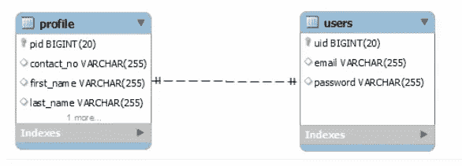
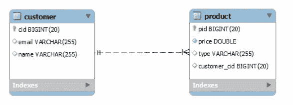

# Spring boot 系列-2 一对一和一对多映射

> 原文：<https://medium.com/javarevisited/spring-boot-series-2-one-to-one-and-one-to-many-mapping-530ea0865917?source=collection_archive---------2----------------------->


这是我关于春靴系列的第二篇文章。如果你没有看过第一篇文章，点击[https://mhdrazan 7 . medium . com/spring-boot-series-1-project-setup-and-crud-operations-EB 297d 39 ba 22](https://mhdrazan7.medium.com/spring-boot-series-1-project-setup-and-crud-operations-eb297d39ba22)

在本文中，我将向您展示如何在 [Spring boot](/hackernoon/top-5-spring-boot-and-spring-cloud-books-for-java-developers-75df155dcedc) 中使用 hibernate 实现一对一和一对多映射。

# 一对一映射

[](https://www.java67.com/2016/02/top-20-hibernate-interview-questions.html)

用户和配置文件之间的一对一关系

用户实体

```
package com.series.springboot.model;import javax.persistence.CascadeType;
import javax.persistence.Entity;
import javax.persistence.GeneratedValue;
import javax.persistence.GenerationType;
import javax.persistence.Id;
import javax.persistence.JoinColumn;
import javax.persistence.OneToOne;
import javax.persistence.Table;@Entity
@Table(name = "users")
public class User {@Id
@GeneratedValue(strategy = GenerationType.IDENTITY)
private long uid;private String email;
private String password;
@OneToOne(cascade = CascadeType.ALL)@JoinColumn(name = "profile_id", referencedColumnName = "pid")
private Profile profile;// Standard constructors, getters and setters}
```

配置文件实体

```
package com.series.springboot.model;import javax.persistence.CascadeType;
import javax.persistence.Entity;
import javax.persistence.GeneratedValue;
import javax.persistence.GenerationType;
import javax.persistence.Id;
import javax.persistence.OneToOne;
import javax.persistence.Table;@Entity
@Table
public class Profile {@Id
@GeneratedValue(strategy = GenerationType.IDENTITY)
private long pid;private String firstName;
private String lastName;
private String contactNo;@OneToOne(cascade = CascadeType.ALL, mappedBy = "profile")
private User user;// Standard constructors, getters and setters}
```

# 一对多映射

[](https://javarevisited.blogspot.com/2018/01/top-5-hibernate-and-jpa-courses-for-java-programmers-learn-online.html)

客户和产品之间的一对多关系

客户实体

```
package com.series.springboot.model;import java.util.Set;
import javax.persistence.CascadeType;
import javax.persistence.Entity;
import javax.persistence.GeneratedValue;
import javax.persistence.GenerationType;
import javax.persistence.Id;
import javax.persistence.OneToMany;
import javax.persistence.Table;@Entity
@Table
public class Customer {@Id
@GeneratedValue(strategy = GenerationType.IDENTITY)
private long cid;private String name;
private String email;@OneToMany(cascade = CascadeType.ALL, mappedBy = "customer")
private Set<Product> products;// Standard constructors, getters and setters}
```

产品实体

```
package com.series.springboot.model;import javax.persistence.CascadeType;
import javax.persistence.Entity;
import javax.persistence.GeneratedValue;
import javax.persistence.Id;
import javax.persistence.ManyToOne;
mport javax.persistence.Table;@Entity
@Table
public class Product {@Id
@GeneratedValue
private long pid;private String type;
private double price;@ManyToOne(cascade = CascadeType.ALL)
private Customer customer;// Standard constructors, getters and setters}
```

希望这篇文章对你有用。在下一篇文章中，我将向您展示如何在 [Spring boot](/javarevisited/top-10-courses-to-learn-spring-boot-in-2020-best-of-lot-6ffce88a1b6e) 中实现多对多映射。