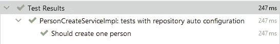
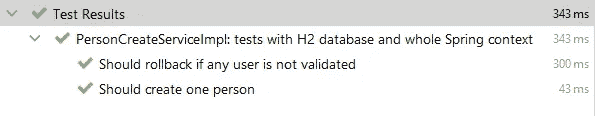
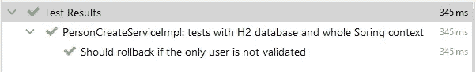

# Spring Boot 测试—数据和服务

> 原文：<https://medium.com/javarevisited/spring-boot-testing-data-and-services-bc8b4c62ee8f?source=collection_archive---------1----------------------->

# 章

1.  [Spring Boot 测试—数据和服务](/javarevisited/spring-boot-testing-data-and-services-bc8b4c62ee8f?source=friends_link&sk=86148a772616274202776f4515c078e4)
2.  [Spring Boot 测试—测试容器和飞行路线](/javarevisited/spring-boot-testing-testcontainers-and-flyway-df4a71376db4?source=friends_link&sk=1d0ffcd36bb4265c2d0120520bc8a567)

我认为测试是软件开发中必不可少的事情。我不是唯一一个。如果你问任何开发人员测试是否重要，他们可能会告诉你同样的事情。

但现实并不那么光明。我见过的几乎所有项目要么缺乏测试，要么缺乏测试质量。不只是一个案例。问题是系统性的。

为什么会这样？我认为开发人员通常没有足够重视提高测试框架使用的知识。因此，当涉及到验证业务逻辑时，程序员不知道如何去做。

让我们来填补空白，看看春考为我们准备了什么。


代码片段取自这个[库](https://github.com/SimonHarmonicMinor/spring-boot-test-example)。您可以克隆它并运行测试，看看它是如何工作的。

# 服务层+模拟

模仿在测试环境中变得如此普遍，以至于 [*模仿*](https://javarevisited.blogspot.com/2014/04/difference-between-stub-and-mock-object-java-junit.html) 和 [*测试*](/javarevisited/6-best-appium-and-mobile-testing-courses-for-android-and-ios-developers-80f6cd51e375) 几乎被认为是同义词。

假设我们有`PersonCreateService`。

PersonCreateService:创建人员

`PersonValidateService`是我们的自定义界面。`PersonRepository`是一个简单的[春季数据 JpaRepository](https://www.baeldung.com/the-persistence-layer-with-spring-data-jpa) 。

让我们用模拟写一个单元测试。

PersonCreateServiceTest:shouldFailUserCreation

好吧，这个很简单。让我们考虑一些更复杂的事情。一个用户的创作通过了怎么办？这需要更多的决心。

首先，我们需要模仿`PersonRepository`，因此`saveAndFlush`返回新的`Person`实例，其中填充了`id`字段。其次，我们需要测试结果`PersonDTO`是否包含预期的信息。

PersonCreateServiceTest:shodCreateNewUser

事情变得棘手了。但是还没到休息的时候。假设已经用`createFamily`方法增强了`PersonCreateServiceImpl`。

person create service:create family

它也需要测试。我们试着写一个。

PersonCreateServiceTest:shouldCreateFamily

当我看这段代码时，我看到的只是一派胡言。数据流如此复杂，以至于几乎不可能得到测试真正在做什么。更重要的是，没有*测试*，而是*验证*一些特定的方法被称为定义的时间。“有什么区别？”你可能会问。假设`saveAndFlush`方法的执行被定制的方法所取代，定制的方法更新实体并在存档表中保存以前的状态(例如`saveWithArchiving`)。尽管业务逻辑是相同的，但是测试会失败，因为新方法没有被模仿。

也许最后一句话还不够有说服力。让我们看看`Person`实体的声明。

个人实体

它有一个`PrePersist`回调函数，在数据库中插入新记录之前设置创建日期。问题是它不能用模拟来测试。该逻辑正在被 JPA 提供者调用。模仿不能模仿这种行为。

所以，我们来下结论。模拟非常适合测试那些你可以控制的功能。这些通常是用户定义的服务(例如`PersonValidateService`)。 [Spring Data 和 JPA](https://www.java67.com/2021/01/spring-data-jpa-interview-questions-answers-java.html) 在运行时会生成很多东西。模拟不会帮助你测试它。

# 服务层+ H2 数据库

如果您有一个应该与数据库交互的服务，那么真正测试它的唯一方法是在真实的数据库实例上运行它。[首先想到的是 H2 DB](https://www.h2database.com/html/main.html) 。

谢天谢地，我们不需要任何复杂的配置和复杂的 beans 声明来在测试环境中运行数据库。Spring Boot 会处理这件事。

## DataJpaTest

我们从哪里开始？首先，我们需要声明测试套件。

测试套件声明

`@DataJpaTest`这里的注释确实神奇。具体来说，有 4 点。

1.  启动 H2 数据库的嵌入式实例。
2.  根据声明的实体类创建数据库模式。
3.  将所有存储库 beans 添加到应用程序上下文中。
4.  用`@Transactional`注释包装整个测试套件。因此，每个测试执行变得独立。

你可能已经注意到了`@MockBean`注释。这就是 [Spring 特性](https://javarevisited.blogspot.com/2018/11/top-5-spring-boot-features-java.html#axzz6CwWzuI40)，它不仅模仿接口，还将它添加到应用程序上下文中。因此，在测试运行期间，它可以被其他 beans 自动连接。

现在我们需要实例化将要测试的服务。

PersonCreatesService 声明

在我看来，最灵活的解决方案提供了`@TestConfiguration`注解。它允许我们修改现有的应用程序上下文。当`PersonCreateService`加入后，可以很容易的注射`@Autowire`。

好了，先来一个简单的`createFamily`方法的快乐路径测试。

PersonCreatesServiceTest:“创建家庭”快乐之路



试验结果

正如您所看到的，这个测试比使用模拟的测试更干净、更简短、更容易理解。不仅如此，我们现在能够测试 [Hibernate](/javarevisited/top-5-books-to-learn-hibernate-for-java-developers-b2cb4b16ccd6?source=---------14------------------) 回调(例如`@PrePersist`)。

嗯，这个是蛋糕。但是如果`ValidationFailedException`发生了呢？这意味着事务应该回滚。让我们找出答案。

PersonCreateServiceTest:" shouldRollbackIfAnyUserIsNotValidated "

创建`"John"`时执行应该会失败。这意味着总人数必须等于 0，因为抛出异常会回滚事务。


试验结果

```
expected: <0> but was: <2>
Expected :0
Actual   :2
```

出事了。似乎由于某种原因，事务没有回滚。这是真的。

我提到过`@DataJpaTest`用`@Transactional`包装套件。因此，测试套件和服务都是事务性的。注释的默认传播级别是`REQUIRED`。这意味着调用另一个事务方法**不会启动新的事务。相反，它继续执行当前语句中的 SQL 语句。`ValidationFailedException`发生不会回滚事务，因为异常没有离开它的作用域。因此，计数返回 2 而不是 0。**


我在我的文章[“春季数据—交易警告”](https://levelup.gitconnected.com/spring-data-transactional-caveats-f6edd41d6785?source=friends_link&sk=684542cba1a8de7233c974f25e500ede)中描述了这种现象。

我们能做些什么呢？实际上，习惯不允许我们做任何事情。我们可以将`PersonCreateService.createFamily`事务传播标记为`REQUIRES_NEW`。这解决了当前测试的问题，但增加了新的问题。您可以在我在文章开头标记的库中找到更多的例子。

如果`@DataJpaTest`导致如此怪异的问题，那么它的目的是什么？嗯，它的名字描述了目标。它应该与*存储库测试*一起使用。

人员信息库

PersonRepositoryDataJpaTest

看到了吗？非常合适。该测试执行一条 SQL 语句。在这种情况下，`@DataJpaTest`的交易行为就变得方便了。但是服务层要复杂得多。我们需要一个不同的工具。

## 跳趾试验

让我们稍微重写一下测试声明。

personcreateserviceimplspringboottest 声明

与`@DataJpaTest`备选方案有一些不同。

`@SpringBootTest`注释启动整个 Spring 上下文，而不仅仅是 JPA 存储库。另一件重要的事情是，它**没有**用`@Transactional`包装测试套件。`webEnvironment = WebEnvironment.NONE`是一个轻微的优化。在测试用例中，我们不需要 web 层。因此，没有必要在这方面花费资源。

`@AutoConfigureTestDatabase`注释配置嵌入式 H2 数据库，并根据定义的实体创建模式。`@DataJpaTest`已经包含了它，所以声明它们是多余的(除非我们想参数化`@AutoConfigureTestDatabase`，但这超出了范围)。

你可能也注意到了，我们只是自动连线了`PersonCreateService`，没有任何额外的配置。由于默认情况下`@SpringBootTest`实例化每个 bean，服务已经存在于应用程序上下文中。

需要在`@BeforeEach`回调中重置数据库，因为`@SpringBootTest`不提供事务行为。但是我们需要在测试运行之间保持桌子干净。

所以，让我们把来自`@DataJpaTest`例子的测试放进去，看看它是如何工作的。

personcreateserviceimplspringboottest



试验结果

一切都像魔咒一样管用。

我们所有的测试用例都假设`PersonValidateService.checkUserCreation`有一个检查输入参数的简单逻辑。但在现实中，这可能不是真的。该服务也可以与数据库交互，以便检查先决条件。所以，我们来模仿一下行为。

假设验证器不允许创建一个新的人，如果有一个人同名的话。为了测试这个场景，我们需要适当模拟`PersonValidateService`，并在调用`PersonCreateService.createFamily`方法之前提前插入一个家庭成员。

PersonCreateServiceImplSpringBootTest



试验结果

有用！另外，这里剧透一下。无论您应用什么配置，它都无法与`@DataJpaTest`一起工作。你可以在[资源库](https://github.com/SimonHarmonicMinor/spring-boot-test-example)中找到这个例子。

> *2021 年 7 月 14 日编辑*
> 
> 实际上，`@DataJpaTest` **可以**非事务运行。你只需要将`@Transactional(propagation = NOT_SUPPORTED)`添加到测试类中。雷南·弗兰卡谢谢你的提示！

```
@DataJpaTest
@Transactional(propagation = Propagation.*NOT_SUPPORTED*)
class PersonCreateServiceImplTestH2 {

  @Autowired
  private PersonRepository personRepository;
  @MockBean
  private PersonValidateService personValidateService;
  @Autowired
  private PersonCreateService personCreateService;

  @BeforeEach
  void beforeEach() {
    personRepository.deleteAll();
  }

  @TestConfiguration
  static class Config {

    @Bean
    public PersonCreateService personCreateService(
        PersonRepository personRepository,
        PersonValidateService personValidateService
    ) {
      return new PersonCreateServiceImpl(personValidateService, personRepository);
    }
  } // test cases...
}
```

# 结论

感谢您的阅读！那是一篇相当长的文章，我很高兴你能看完。下次我们将讨论 [Testcontainers](https://www.testcontainers.org/) 与 [Spring Test](https://javarevisited.blogspot.com/2021/02/-spring-boot-testing-interview-questions-answers-java.html) 的集成。如果您有任何问题或建议，请在下面留下您的评论。下次见！