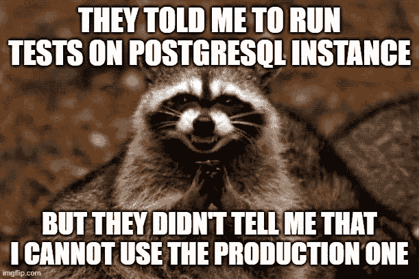
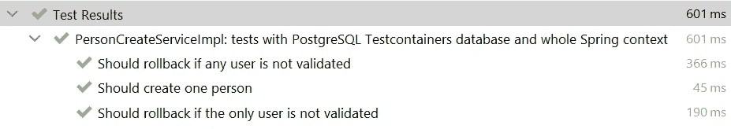
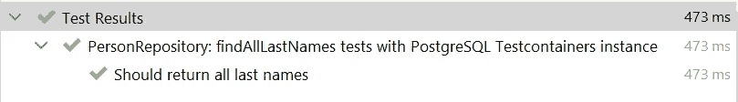
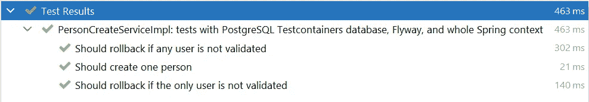

# Spring Boot 测试——测试容器和飞行路线

> 原文：<https://medium.com/javarevisited/spring-boot-testing-testcontainers-and-flyway-df4a71376db4?source=collection_archive---------0----------------------->

这是 Spring Boot 测试文章系列的第二部分。代码片段取自这个[库](https://github.com/SimonHarmonicMinor/spring-boot-test-example)。您可以克隆它并运行测试，看看它是如何工作的。

# 章

1.  [Spring Boot 测试—数据和服务](/javarevisited/spring-boot-testing-data-and-services-bc8b4c62ee8f?source=friends_link&sk=86148a772616274202776f4515c078e4)
2.  [Spring Boot 测试—测试容器和飞行路线](/javarevisited/spring-boot-testing-testcontainers-and-flyway-df4a71376db4?source=friends_link&sk=1d0ffcd36bb4265c2d0120520bc8a567)

因此，我们已经了解了如何使用 H2 数据库测试服务层(T7)和存储库层(T9)。这种测试有一些好处。例如，它们非常快，不需要在本地机器或 CI/CD 环境中进行复杂的配置。然而，H2 不是通常在生产中运行的数据库。如果我们使用一个数据库的一些供应商特定的功能，H2 可能不会帮助我们。因此，今天我们将讨论如何在真正的数据库服务器上运行测试用例。



# 自动模式创建

我们如何用真实的数据库运行测试？嗯，我们可以在本地创建一个新实例，并通过编辑`src/test/resources/application.yml`来配置测试环境。它确实可以工作，但是它使得构建很难复制。每个从事该项目的开发人员都必须确保他们有两个独立的数据库。一个用于开发，另一个用于测试运行。此外，这使得在 [CI/CD](/javarevisited/7-best-courses-to-learn-jenkins-and-ci-cd-for-devops-engineers-and-software-developers-df2de8fe38f3?source=---------15------------------) 环境中执行构建成为一个真正的挑战。

所以， [Testcontainers](https://www.testcontainers.org/) 来拯救我们了！它是一个 Java 库，在 [Docker](https://www.docker.com/) 容器中启动服务，运行测试，并最终销毁容器。您不需要担心任何事情，框架会完成工作。只要确保你已经安装了 Docker，然后你就可以开始了。该库支持数十种不同的数据库和模块( [PostgreSQL](https://www.testcontainers.org/modules/databases/postgres/) 、 [MySQL](https://www.testcontainers.org/modules/databases/mysql/) 、 [MongoDB](https://www.testcontainers.org/modules/databases/mongodb/) 、 [Kafka](https://www.testcontainers.org/modules/kafka/) 、 [Elasticsearch](https://www.testcontainers.org/modules/elasticsearch/) 、 [Nginx](https://www.testcontainers.org/modules/nginx/) 、 [Toxiproxy](https://www.testcontainers.org/modules/toxiproxy/) 以及许多其他数据库和模块)。即使你没有找到你需要的，你也可以使用[通用容器创建](https://www.testcontainers.org/features/creating_container/)。

第一步是添加所需的依赖项。

```
testImplementation 'org.testcontainers:junit-jupiter'
testImplementation 'org.testcontainers:postgresql'
runtimeOnly 'org.postgresql:postgresql'
```

然后我们需要在`src/test/resources`中创建一个单独的配置文件。 [Spring Boot](/javarevisited/top-10-courses-to-learn-spring-boot-in-2020-best-of-lot-6ffce88a1b6e?source=---------39------------------) 能够通过[配置文件](https://www.baeldung.com/spring-profiles)区分不同的配置文件。配置文件名应该像`application-PROFILE_NAME.yml`一样作为后缀。例如，名为`application-test-containers.yml`的文件仅在`test-containers`轮廓激活时应用。

应用程序测试容器

你注意到 JDBC 连接字符串中的后缀`tc`了吗？这就是伴随着 [JUnit 5](/javarevisited/5-courses-to-learn-junit-and-mockito-in-2019-best-of-lot-f217d8b93688) 和测试容器结合而来的魔力。事情是你根本不需要任何程序化的配置！当[框架](/javarevisited/5-essential-frameworks-every-java-developer-should-learn-6ed83315f1fb)发现`url`包含`tc`后缀时，它会在内部运行所有必要的 Docker 命令。你可以在这里找到更多的例子[。](https://www.testcontainers.org/modules/databases/jdbc/)

> 我们设置了`spring.jpa.hibernate.ddl-auto=create`属性，这样数据库模式将根据实体类的定义自动创建。下一节将描述 Flyway 集成。

现在让我们再来看看`PersonCreateService.createFamily`法及其 H2 检验。

PersonCreateService:createfamly

personcreateserviceimplspringboottest

我们如何用 test containers[PostgreSQL](/javarevisited/7-best-free-postgresql-courses-for-beginners-to-learn-in-2021-3bf369d73794)实例运行测试？我们要做的就是添加两个注释。`@AutoConfigureTestDatabase`虽然应该去掉。

1.  `@ActiveProfiles("test-containers")` —激活`test-containers`配置文件，这样 Spring 可以读取之前描述的配置文件
2.  `@Testcontainers` —告诉自动运行 [Docker](/javarevisited/10-free-courses-to-learn-docker-and-devops-for-frontend-developers-691ac7652cee?source=---------94------------------) [中的 PostgreSQL 实例](https://www.testcontainers.org/modules/databases/jdbc/)

PersonCreateServiceImplTestContainers



测试运行结果

看到了吗？小菜一碟！

# 知识库测试

测试存储库层怎么样？让我们再看看 H2 的例子。

PersonRepositoryDataJpaTest

规则是一样的，但有一点点不同。`[@DataJpaTest](https://javarevisited.blogspot.com/2021/02/-spring-boot-testing-interview-questions-answers-java.html)`是用`@AutoConfigureTestDatabase`本身标注的。默认情况下，该注释用 H2 实例替换任何数据源。因此，我们需要通过添加`replace=Replace.NONE`属性来覆盖这种行为。

PersonRepositoryTestContainers



试验结果

一切仍然正常。

# 飞行路线整合

[进化数据库设计](https://martinfowler.com/articles/evodb.html)原理很久以前就已经描述过了。如今，使用实现这种模式的工具已经成为标准惯例。Flyway 和 [Liquibase](https://www.liquibase.org/) 是 Java 世界中最流行的。我们将把 Testcontainers 与 Flyway 集成在一起。

首先，需要飞行路径依赖。

```
implementation "org.flywaydb:flyway-core"
```

其次，需要禁用`application-test-containers.yml`中的 Flyway，因为会有一个单独的配置文件。

禁用 flyway 的 application-test-containers . yml

然后我们要创建`application-test-containers-flyway.yml`。该库提供了许多自动配置。所以，实际上，我们什么都不需要调。

应用程序-测试-容器-飞行路线. yml

现在是时候添加 SQL 迁移了。默认目录是`resources/db/migration`。

V1 _ _ 创建 _ 个人 _ 表格. sql

最后，我们需要用`test-containers-flyway`配置文件替换`test-containers`配置文件。

PersonCreateServiceImplTestContainersFlyway



Flyway 模式创建的测试结果

# CI/CD 测试正在运行

尽管 Testcontainers 的目的是使测试易于运行，但在 CI/CD 环境构建中有一些注意事项。一些供应商透明地集成了 Testcontainers。例如， [Travis-CI](https://travis-ci.com/) 发现了自动运行容器的需求，并在内部完成了这项工作。但是其他一些工具可能需要额外的配置，例如 [Jenkins](/javarevisited/top-10-free-courses-to-learn-jenkins-docker-and-kubernetes-for-devops-in-2020-best-of-lot-62a0541ffeb3?source=---------30----------------------------) 。

## Docker 虫洞

在 CI 运行期间，将整个应用程序构建打包到 Docker 映像中是一种常见的方法。Testcontainers 可以处理它，并在主机 Docker 服务器上运行定义的容器。在这种情况下，我们需要将`/var/run/docker.sock`绑定为一个卷。不仅如此，容器中的目录应该与容器启动时的目录相同。

例如，这是一个使用`[gradle](/javarevisited/5-best-gradle-courses-and-books-to-learn-in-2021-93f49ce8ff8e)`在 CI 环境中运行测试的假设命令。

```
docker run -it   \
           --rm  \
           -v $PWD:$PWD \
           -w $PWD  \
           -v /var/run/docker.sock:/var/run/docker.sock gradle:7.1-jdk8 \
           gradle test
```

你可以在官方 Testcontainers 指南页面上找到更多信息。

# 结论

今天我们讨论了如何用 Testcontainers 和 Flyway 测试数据和服务层。下次我们将测试 API(控制器)级别。如果您有任何问题或建议，请在下面留下您的评论。感谢阅读！