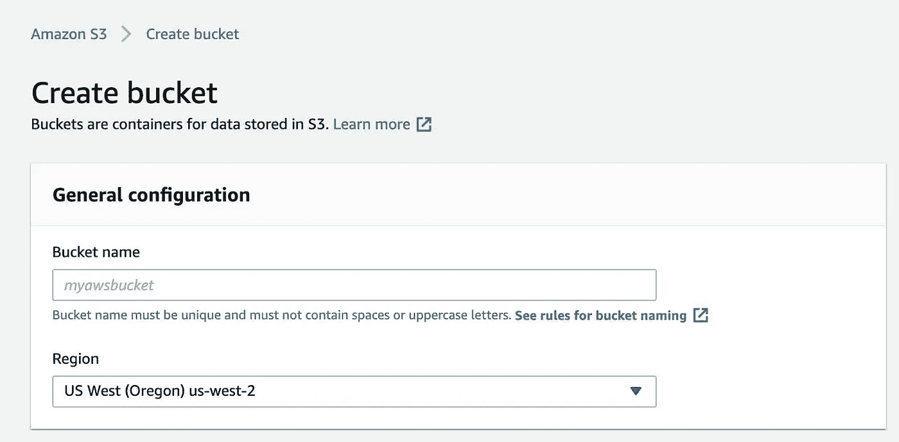
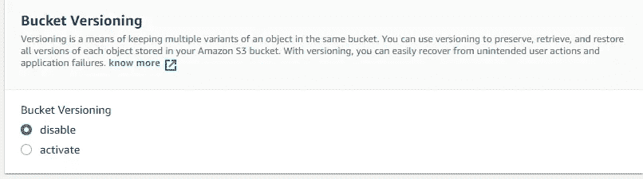

# Spring Boot 用 AWS S3 斗从零到有用

> 原文：<https://medium.com/javarevisited/spring-boot-with-aws-s3-bucket-from-zero-to-useful-c0895ab26aaa?source=collection_archive---------0----------------------->

创建和读取的实用实现。AWS 云中的 txt 文件


你好，今天我会留下一个关于亚马逊 S3 服务以及如何结合 [Spring Boot](/javarevisited/10-advanced-spring-boot-courses-for-experienced-java-developers-5e57606816bd) 使用的总结。这个想法是做一个关于服务和一些实际例子使用的可能性的演示。

## 亚马逊 s3 概述

亚马逊简单存储服务是一个无限规模的对象存储服务。

在谈论[亚马逊 S3](/javarevisited/7-best-aws-s3-and-dynamodb-courses-for-beginners-in-2021-a8a44b6066da) 时有一些概念:

*   桶:这些是目录，有一个全局唯一的名字
*   对象:这些文件有一个键，这个键是完整的路径。例如 s3://my-bucket/my-file.txt

对象的最大大小为 5TB，如果上载大于 5GB，则必须使用多部分上载。

*   版本控制:在时段层启用。同一个键覆盖并递增版本:1，2，3…这是对文件进行版本控制的最佳实践。
    在木桶的“属性”下，你可以启用这个。
*   S3 还可以维护静态网站，并使它们在互联网上可用。如果返回的是 HTTP 403(禁止的)，最好查看一下策略，确保它允许公共访问。

## S3 存储类

**亚马逊 S3 标准**

*   该类用于一般用途；
*   跨多个可用性区域的 99.99999999%的对象弹性；
*   用于经常访问的数据。

**亚马逊 S3 标准版—不常访问**

*   用于访问频率较低但需要快速访问的数据；
*   99.99%可用性；
*   与 S3 标准相比，成本更低；
*   用于灾难恢复备份。

**亚马逊 S3 一区**

*   用于不经常访问的数据；
*   它在单个 AZ(可用性区域)中具有 99.999999999%的耐久性；
*   用于存储本地数据副本或可重新创建的数据的辅助备份。

**亚马逊 S3 冰川即时检索**

*   类用来归档东西，所以成本低；
*   此处的数据存储时间必须至少为 90 天；
*   毫秒级恢复非常适合每季度访问一次的数据。

**亚马逊 S3 冰川灵活检索**

*   也是用来存档东西的类，所以成本低；
*   这里的数据存储时间也必须至少为 90 天；
*   适合一年访问 1 ~ 2 次，异步检索的数据；
*   恢复时间从几分钟到几小时不等。

**亚马逊 S3 冰川深层档案**

*   它具有长达 12 小时的数据恢复时间，适用于每年可访问 1 至 2 次的数据；
*   跨多个可用性区域提供 99.999999999%的对象弹性；
*   数据恢复可能需要 12 个小时。

**亚马逊 S3 智能分层**

这是一个非常有趣的案例。此存储类别通过根据访问频率自动将数据移动到最经济高效的层，自动降低存储成本。

例如，由于日常生活中的低访问权限，可以将对象移动到低访问权限层。如果以后访问该对象，它将被移回频繁访问的层。

*   多个可用性区域中 99.999999999%的对象的持久性；
*   它有一个小的监测和自动水平每月收费；

## 通过 AWS 控制台创建 S3

是时候创建一个桶了，非常简单，只需搜索“s3”，然后点击“创建桶”。

有些数据是必需的，名称字段在整个 AWS 中必须是唯一的，而不仅仅是您的帐户。该字段标记如下:

[](https://www.youtube.com/watch?v=30YWIPQtW10)

关于我上面提到的版本控制，在创建时可以激活:

[](https://www.youtube.com/watch?v=YP4zNBdUlos)

创建 bucket 的另一种方法是使用 AWS SDK(软件开发工具包),它提供了使用程序创建资源的工具。下面我将展示一些使用 [Java](/javarevisited/10-best-places-to-learn-java-online-for-free-ce5e713ab5b2) 和 [Spring Boot](/javarevisited/10-free-spring-boot-tutorials-and-courses-for-java-developers-53dfe084587e) 的简单方法。

## 正在生成访问凭据

第一步是创建用于访问 [AWS 服务](/javarevisited/5-best-aws-courses-for-beginners-and-experienced-developers-to-learn-in-2021-563212409fbd)的安全凭证。

为此，查找 IAM 服务，并在用户(不要用 root)中使用“安全凭证”选项


## 设置 Spring Boot 项目

在这里，我将创建一个项目来创建和维护。亚马逊 s3 上的 txt 文件。

我首先将 AWS 依赖关系放在项目上:

```
<dependency>
   <groupId>com.amazonaws</groupId>
   <artifactId>aws-java-sdk</artifactId>
   <version>1.11.163</version>
</dependency>
```

这样，我们将可以访问一系列的类和方法来与 AWS 服务进行交互。

我将通过创建如下配置类来开始配置客户端访问:

```
@Configuration
public class AWSConfig {

    public AWSCredentials credentials() {
        AWSCredentials credentials = new BasicAWSCredentials(
                "accesskey",
                "secretKey"
        );
        return credentials;
    }

    @Bean
    public AmazonS3 amazonS3() {
        AmazonS3 s3client = AmazonS3ClientBuilder
                .*standard*()
                .withCredentials(new AWSStaticCredentialsProvider(credentials()))
                .withRegion(Regions.*US_EAST_1*)
                .build();
        return s3client;
    }

}
```

在“accesskey”和“secretkey”中，每个用户将把他们在 IAM 中生成的安全凭证放入其中。

这样做之后，一些动作是可能的，我为它们创建了一个服务类。

**桶级操作:**

创建存储桶:

```
public void createS3Bucket(String bucketName) {
    if(amazonS3Client.doesBucketExist(bucketName)) {
        *log*.info("Bucket name already in use. Try another name.");
        return;
    }
    amazonS3Client.createBucket(bucketName);
}
```

列表存储桶:

```
public List<Bucket> listBuckets(){
    return amazonS3Client.listBuckets();
}
```

删除存储桶:

```
public void deleteBucket(String bucketName){
    try {
        amazonS3Client.deleteBucket(bucketName);
    } catch (AmazonServiceException e) {
        *log*.error(e.getErrorMessage());
        return;
    }
}
```

**对象级动作:**

将物体放入桶中:

```
public void putObject(String bucketName, BucketObjectRepresentaion representation, boolean publicObject) throws IOException {

    String objectName = representation.getObjectName();
    String objectValue = representation.getText();

    File file = new File("." + File.*separator* + objectName);
    FileWriter fileWriter = new FileWriter(file, false);
    PrintWriter printWriter = new PrintWriter(fileWriter);
    printWriter.println(objectValue);
    printWriter.flush();
    printWriter.close();

    try {
        var putObjectRequest = new PutObjectRequest(bucketName, objectName, file).withCannedAcl(CannedAccessControlList.*PublicRead*);
        amazonS3Client.putObject(putObjectRequest);
    } catch (Exception e){
        *log*.error("Some error has ocurred.");
    }

}
```

列出所有对象的名称:

```
public List<S3ObjectSummary> listObjects(String bucketName){
    ObjectListing objectListing = amazonS3Client.listObjects(bucketName);
    return objectListing.getObjectSummaries();
}
```

下载一个对象:

```
public void downloadObject(String bucketName, String objectName){
    S3Object s3object = amazonS3Client.getObject(bucketName, objectName);
    S3ObjectInputStream inputStream = s3object.getObjectContent();
    try {
        FileUtils.*copyInputStreamToFile*(inputStream, new File("." + File.*separator* + objectName));
    } catch (IOException e) {
        *log*.error(e.getMessage());
    }
}
```

对于上面的下载，我使用了 Apache 依赖项，这使得 I/O 更加容易:

删除对象:

```
public void deleteObject(String bucketName, String objectName){
    amazonS3Client.deleteObject(bucketName, objectName);
}
```

删除多个对象:

```
public void deleteMultipleObjects(String bucketName, List<String> objects){
    DeleteObjectsRequest delObjectsRequests = new DeleteObjectsRequest(bucketName)
            .withKeys(objects.toArray(new String[0]));
    amazonS3Client.deleteObjects(delObjectsRequests);
}
```

在两个桶之间移动物体:

```
public void moveObject(String bucketSourceName, String objectName, String bucketTargetName){
    amazonS3Client.copyObject(
            bucketSourceName,
            objectName,
            bucketTargetName,
            objectName
    );
}
```

最后，我创建了一个控制器来测试这段代码:

```
@RestController
@RequestMapping(value = "/buckets/")
@RequiredArgsConstructor
public class ControllerTests {

    private final S3Service s3Service;

    @PostMapping(value = "/{bucketName}")
    public void createBucket(@PathVariable String bucketName){
        s3Service.createS3Bucket(bucketName);
    }

    @GetMapping
    public List<String> listBuckets(){
        var buckets = s3Service.listBuckets();
        var names = buckets.stream().map(Bucket::getName).collect(Collectors.toList());
        return names;
    }

    @DeleteMapping(value = "/{bucketName}")
    public void deleteBucket(@PathVariable String bucketName){
        s3Service.deleteBucket(bucketName);
    }

    @PostMapping(value = "/{bucketName}/objects")
    public void createObject(@PathVariable String bucketName, @RequestBody BucketObjectRepresentaion representaion) throws IOException {
        s3Service.putObject(bucketName, representaion);
    }

    @GetMapping(value = "/{bucketName}/objects/{objectName}")
    public File downloadObject(@PathVariable String bucketName, @PathVariable String objectName) throws IOException {
        s3Service.downloadObject(bucketName, objectName);
        return new File("./" + objectName);
    }

    @PatchMapping(value = "/{bucketName}/objects/{objectName}/{bucketSource}")
    public void moveObject(@PathVariable String bucketName, @PathVariable String objectName, @PathVariable String bucketSource) throws IOException {
        s3Service.moveObject(bucketName, objectName, bucketSource);
    }

}
```

**测试**
到目前为止我们有以下操作:

**发布**:[http://localhost:8080/buckets/bucket-name](http://localhost:8080/buckets/bucket-name)创建一个桶。

**删除**:[http://localhost:8080/buckets/bucket-name](http://localhost:8080/buckets/bucket-name)删除一个桶。

**GET**:[http://localhost:8080/buckets/](http://localhost:8080/buckets/)列出所有桶。

**POST**:[http://localhost:8080/buckets/bucket-name/objects](http://localhost:8080/buckets/bucket-name/objects)用下面的正文创建一个对象:

```
{
    "objectName": "object-name.txt",
    "text": "value of object"
}
```

**GET**:[http://localhost:8080/buckets/bucket-name/objects/object-name . txt](http://localhost:8080/buckets/bucket-name/objects/object-name.txt)按名称取对象并下载。

**GET**:[http://localhost:8080/buckets/bucket-name/objects/](http://localhost:8080/buckets/bucket-name/objects/)列出已有的对象。

**删除**:[http://localhost:8080/bucket/bucket-name/objects/object-name](http://localhost:8080/buckets/bucket-name/objects/object-name)删除一个对象。

**删除**:[http://localhost:8080/buckets/bucket-name/objects/](http://localhost:8080/buckets/bucket-name/objects/)用以下正文一次删除多个对象:

```
["nome-objeto-1.txt", "nome-objeto-2.txt"]
```

**打补丁**:[http://localhost:8080/buckets/bucket-name/objects/object-name . txt/bucket-name 2](http://localhost:8080/buckets/bucket-name/objects/object-name.txt/bucket-name2)在两个桶之间移动一个对象。

**公有 vs 私有**

到目前为止，您可能已经注意到，bucket 和对象都是通过公共访问创建的，对吗？

但是可以通过私人访问来创建它们。CannedAccessControlList 枚举可用于此目的:

```
public enum CannedAccessControlList {
    *Private*("private"),
    *PublicRead*("public-read"),
    *PublicReadWrite*("public-read-write"),
    *AuthenticatedRead*("authenticated-read"),
    *LogDeliveryWrite*("log-delivery-write"),
    *BucketOwnerRead*("bucket-owner-read"),
    *BucketOwnerFullControl*("bucket-owner-full-control"),
    *AwsExecRead*("aws-exec-read");

    private final String cannedAclHeader;

    private CannedAccessControlList(String cannedAclHeader) {
        this.cannedAclHeader = cannedAclHeader;
    }

    public String toString() {
        return this.cannedAclHeader;
    }
}
```

在这里，我将只使用 public 和 private，实现可能如下所示:

```
public void putObject(String bucketName, BucketObjectRepresentaion representation, boolean publicObject) throws IOException {

    String objectName = representation.getObjectName();
    String objectValue = representation.getText();

    File file = new File("." + File.*separator* + objectName);
    FileWriter fileWriter = new FileWriter(file, false);
    PrintWriter printWriter = new PrintWriter(fileWriter);
    printWriter.println(objectValue);
    printWriter.flush();
    printWriter.close();

    try {
        if(publicObject) {
            var putObjectRequest = new PutObjectRequest(bucketName, objectName, file).withCannedAcl(CannedAccessControlList.*PublicRead*);
            amazonS3Client.putObject(putObjectRequest);
        } else {
            var putObjectRequest = new PutObjectRequest(bucketName, objectName, file).withCannedAcl(CannedAccessControlList.*Private*);
            amazonS3Client.putObject(putObjectRequest);
        }
    } catch (Exception e){
        *log*.error("Some error has ocurred.");
    }

}
```

与此同时，我还改变了[控制器](https://javarevisited.blogspot.com/2022/05/how-to-return-json-xml-or-thymeleaf-.html)用于测试:

```
@PostMapping(value = "/{bucketName}")
public void createBucket(@PathVariable String bucketName, @RequestParam boolean publicBucket){
    s3Service.createS3Bucket(bucketName, publicBucket);
}
```

这样，我就可以选择创建一个具有[公共或私有访问权限](https://javarevisited.blogspot.com/2012/10/difference-between-private-protected-public-package-access-java.html)的对象。我在创建桶时做了同样的事情:

```
public void putObject(String bucketName, BucketObjectRepresentaion representation, boolean publicObject) throws IOException {

    String objectName = representation.getObjectName();
    String objectValue = representation.getText();

    File file = new File("." + File.*separator* + objectName);
    FileWriter fileWriter = new FileWriter(file, false);
    PrintWriter printWriter = new PrintWriter(fileWriter);
    printWriter.println(objectValue);
    printWriter.flush();
    printWriter.close();

    try {
        if(publicObject) {
            var putObjectRequest = new PutObjectRequest(bucketName, objectName, file).withCannedAcl(CannedAccessControlList.*PublicRead*);
            amazonS3Client.putObject(putObjectRequest);
        } else {
            var putObjectRequest = new PutObjectRequest(bucketName, objectName, file).withCannedAcl(CannedAccessControlList.*Private*);
            amazonS3Client.putObject(putObjectRequest);
        }
    } catch (Exception e){
        *log*.error("Some error has ocurred.");
    }

}
```

测试用的[控制器](https://javarevisited.blogspot.com/2022/05/how-to-validate-incoming-payload-on-spring-.html):

```
@PostMapping(value = "/{bucketName}/objects")
public void createObject(@PathVariable String bucketName, @RequestBody BucketObjectRepresentaion representaion, @RequestParam boolean publicObject) throws IOException {
    s3Service.putObject(bucketName, representaion, publicObject);
}
```

这些请求看起来像这样:

**POST**:[http://localhost:8080/buckets/bucket-name/objects？publicObject=true](http://localhost:8080/buckets/bucket-name/objects?publicObject=true) 用下面的主体创建一个对象:

```
{
    "objectName": "object-name.txt",
        "text": "value of object"
}
```

**帖子**:[http://localhost:8080/bucket/bucket-name？publicBucket=true](http://localhost:8080/buckets/bucket-name?publicBucket=true) 创建一个存储桶。

此代码是功能性的概念证明，可在此处参考:[https://github.com/mmarcosab/s3-example](https://github.com/mmarcosab/s3-example)

</javarevisited/21-spring-mvc-rest-interview-questions-answers-for-beginners-and-experienced-developers-21ad3d4c9b82>  </javarevisited/top-22-skills-professional-java-programmers-can-learn-in-2022-to-upgrade-themselves-bc3da73d7491>  </javarevisited/the-java-programmer-roadmap-f9db163ef2c2> 