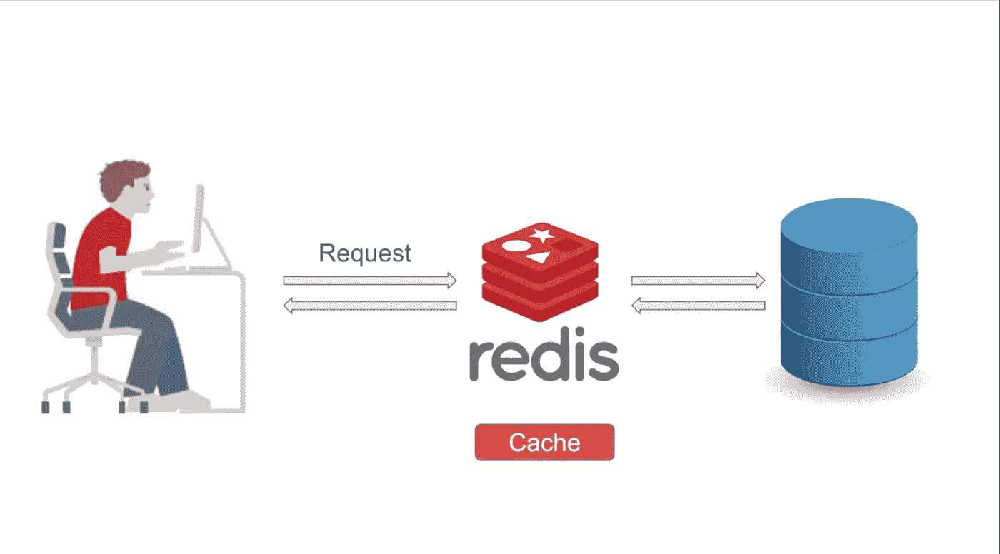

# Redis 的 Spring 缓存

> 原文：<https://medium.com/javarevisited/spring-caching-with-redis-dc1e3bdcc552?source=collection_archive---------0----------------------->

## Redis 是什么？我们如何在 Spring Boot 使用 Redis 进行缓存？

嘿，程序员们，
很久没有写文章了，对此我深表歉意
这篇文章主要关注 Redis，以及为什么 Redis 是 Spring Boot 应用程序缓存数据库的完美选择。