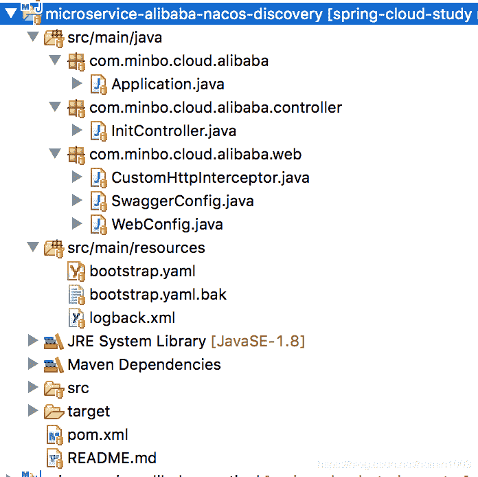
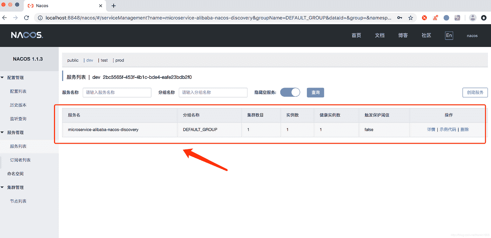
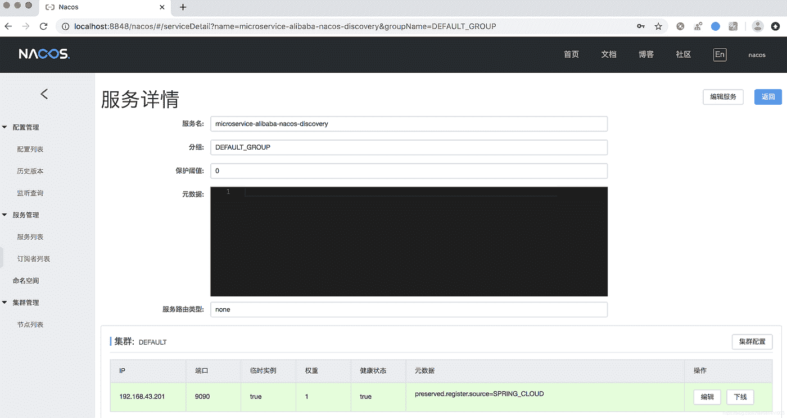
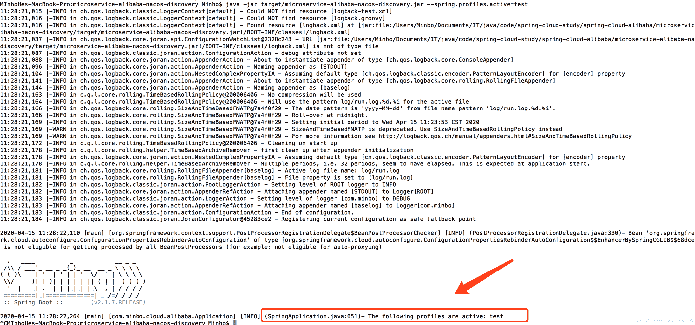

# 春云阿里巴巴从入门到精通的教程(二)——Nacos 服务注册发现功能

> 原文：<https://medium.com/javarevisited/spring-cloud-alibaba-from-fresh-to-profession-tutorial-2-quick-integration-configuration-1aecb16bae5d?source=collection_archive---------6----------------------->

## 项目中的快速集成配置中心 Nacos 服务注册发现功能


自己在[https://www.instagram.com/keith00751/](https://www.instagram.com/keith00751/)的照片

## **需求背景**

项目中的快速集成配置中心 Nacos 服务注册发现功能

**提示技术要点**

1.  [@EnableDiscoveryClient 注释](https://www.java67.com/2018/12/top-5-spring-cloud-annotations-for-java.html)

*   启用 Nacos 服务注册发现功能

2.区分不同环境，实现服务注册发现功能

*   登录 Nacos 控制台，添加三个不同的环境，dev / test / prod，对应:开发环境/测试环境/生产环境
*   不熟悉控制台，看教程:

[](/javarevisited/spring-cloud-alibabas-tutorial-from-getting-started-to-a-master-1-introduction-to-nacos-954598300a01) [## 春云阿里巴巴从入门到精通教程(一)Nacos 入门

### Configuration Center 服务器启动安装中的 Nacos 快速入门介绍

medium.com](/javarevisited/spring-cloud-alibabas-tutorial-from-getting-started-to-a-master-1-introduction-to-nacos-954598300a01) [](https://www.java67.com/2021/01/spring-cloud-interview-questions-with-answers-java.html)

## 代码演示

1.  项目目录结构

[](https://javarevisited.blogspot.com/2020/05/top-20-spring-boot-interview-questions-answers.html)

2.pom.xml 相关组件

3.bootstrap.yaml 配置文件

这里的名称空间值是:对应于 dev 环境的名称空间 id 值

4.启动类

添加 [@EnableDiscoveryClien](http://twitter.com/EnableDiscoveryClien) t 注释

5.服务注册是否成功

启动项目后，可以在 dev 名称空间中发现这个服务，这意味着服务注册发现功能生效。

[](https://www.java67.com/2018/06/top-15-spring-boot-interview-questions-answers-java-jee-programmers.html)

您可以点击“详细信息”查看更多信息。它还可以执行“离线”操作功能等。

[](https://www.java67.com/2021/02/microservices-interview-questions-answers-java-spring.html)

## 区分不同的环境

1.  使用配置文件:bootstrap.yaml.bak

将上面的 bootstrap.yaml 重命名为 bootstrap.yaml2，将 bootstrap.yaml.bak 重命名为 bootstrap.yaml

2.通过配置文件激活不同的环境配置

如果您使用:test，您可以看到服务已经在这个名称空间下注册，并且在 dev 下消失了

[](https://javarevisited.blogspot.com/2022/03/spring-boot-redis-example-in-java.html)

3.启动服务包的脚本

不同的环境使用不同的配置，并通过指定启动参数来使用不同的配置文件，例如:

*   开发环境:Java-jar XXX . jar—spring . profiles . active = dev
*   生产环境:Java-jar XXX . jar—spring . profiles . active = prod

您可以转到该项目的根目录并执行:

```
java -jar target/microservice-alibaba-nacos-discovery.jar --spring.profiles.active=test
```

[](https://javarevisited.blogspot.com/2022/01/spring-boot-reactjs-example-for-java.html)

可以看到 profiles.active=test 配置已经生效，还可以看到这个服务已经在 test 名称空间下成功注册了

注意:这些值也可以通过[环境变量](https://javarevisited.blogspot.com/2012/08/how-to-get-environment-variables-in.html)导入，比如 server-addr 值、名称空间值等。

[](https://javarevisited.blogspot.com/2022/04/how-to-use-environment-variables-in.html) [## 如何在 Spring Boot 的 application.properties 文件中使用环境变量？示例教程

### 如何在 Spring boot 的 application.properties 中使用环境变量是一个主要问题

javarevisited.blogspot.com](https://javarevisited.blogspot.com/2022/04/how-to-use-environment-variables-in.html)