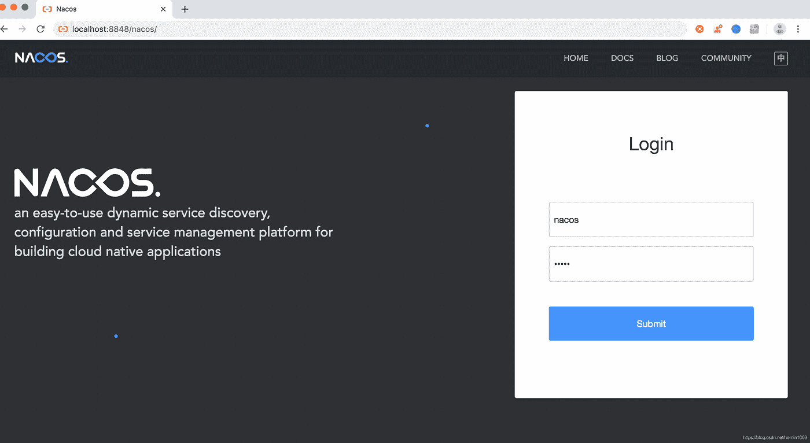
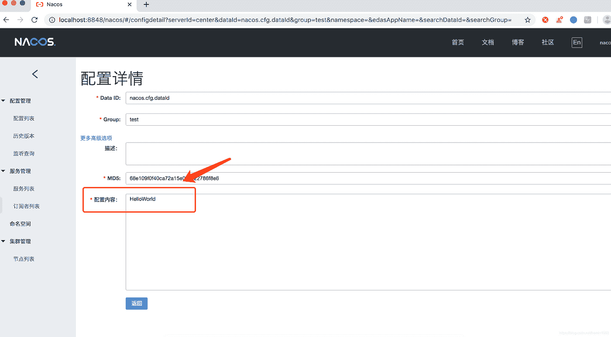

# 春云阿里巴巴从入门到精通教程(一)Nacos 入门

> 原文：<https://medium.com/javarevisited/spring-cloud-alibabas-tutorial-from-getting-started-to-a-master-1-introduction-to-nacos-954598300a01?source=collection_archive---------2----------------------->

## Configuration Center 服务器启动安装中的 Nacos 快速入门介绍


自己在[https://www.instagram.com/keith00751/](https://www.instagram.com/keith00751/)的照片

Nacos 致力于帮助我们发现、配置和管理微服务。Nacos 提供了一组易于使用的功能集，帮助我们快速实现动态服务发现、服务配置、服务元数据和流量管理。Nacos 可以帮助我们更敏捷、更轻松地构建、交付和管理微服务平台。Nacos 是一个服务基础设施，用于构建以“服务”为中心的现代应用架构(如微服务和云原生范式)。

**naco 的关键特性包括:**

1.  服务发现和服务健康监控
2.  动态配置服务
3.  动态 DNS 服务
4.  服务及其元数据管理

**快速启动**

## 1.服务器启动安装

1.  准备环境

Nacos 依靠 [Java 环境](https://javarevisited.blogspot.com/2012/08/how-to-get-environment-variables-in.html)来运行。如果您正在从代码构建和运行 Nacos，您还需要配置一个 [Maven 环境](/javarevisited/6-best-maven-courses-for-beginners-in-2020-23ea3cba89)为此，请确保在以下版本环境中安装和使用它:

*   64 位 OS 支持 Linux/Unix/Mac/Windows，推荐使用[Linu](/javarevisited/7-best-linux-courses-for-developers-cloud-engineers-and-devops-in-2021-7415314087e1)x/Unix/[Mac](https://javarevisited.blogspot.com/2022/02/top-5-macos-courses-for-beginners-in.html)。
*   64 位 JDK 1.8 以上
*   maven 3.2 . x+；

2.下载源代码或安装包

您可以通过源代码和发行包获得 Nacos。

**从 Github 下载源代码**

```
git clone [https://github.com/alibaba/nacos.git](https://github.com/alibaba/nacos.git)
cd nacos/
mvn -Prelease-nacos -Dmaven.test.skip=true clean install -U  
ls -al distribution/target/

cd distribution/target/nacos-server-${version}/nacos/bin
```

**下载并编译压缩包**

您可以从最新的稳定版本下载 nacos-server-$version.zip 包。

```
unzip nacos-server-$version.zip or tar -xvf nacos
server-$version.tar.gz
cd nacos/bin
```

3.启动服务器

Linux/Unix/Mac

启动命令(独立意味着以独立模式运行，而不是集群模式):

```
sh startup.sh -m standalone
```

如果你正在使用 [Ubuntu 系统](https://javarevisited.blogspot.com/2022/03/top-5-free-courses-to-learn-linux-ubuntu.html)，或者如果你运行脚本并得到一个错误消息[[symbol not found]，你可以尝试运行它如下:

```
bash startup.sh -m standalone
```

Windows 操作系统

Windows 启动命令:

```
cmd startup.cmd
```

或者双击 startup.cmd 运行该文件。

4.测试 Nacos 服务是否通常

a.“服务注册”功能:执行后输出“ok”结果

```
curl -X POST '[http://127.0.0.1:8848/nacos/v1/ns/instance?serviceName=nacos.naming.serviceName&ip=20.18.7.10&port=8080'](http://127.0.0.1:8848/nacos/v1/ns/instance?serviceName=nacos.naming.serviceName&ip=20.18.7.10&port=8080')
```

b.“服务发现”功能:执行后输出相应的数据

```
curl -X GET '[http://127.0.0.1:8848/nacos/v1/ns/instance/list?serviceName=nacos.naming.serviceName'](http://127.0.0.1:8848/nacos/v1/ns/instance/list?serviceName=nacos.naming.serviceName')
```

c.“发布配置”功能:执行后输出“真”结果

```
curl -X POST "[http://127.0.0.1:8848/nacos/v1/cs/configs?dataId=nacos.cfg.dataId&group=test&content=HelloWorld](http://127.0.0.1:8848/nacos/v1/cs/configs?dataId=nacos.cfg.dataId&group=test&content=HelloWorld)"
```

d.“获取配置”功能:执行后输出“HelloWorld”结果

```
curl -X GET "[http://127.0.0.1:8848/nacos/v1/cs/configs?dataId=nacos.cfg.dataId&group=test](http://127.0.0.1:8848/nacos/v1/cs/configs?dataId=nacos.cfg.dataId&group=test)"
```

5.关闭服务器

Linux/Unix/Mac

```
sh shutdown.sh
```

或者双击 shutdown.cmd 运行该文件。

## 2.控制台管理功能

1.  默认的 Nacos 系统提供了一个控制台界面

登录地址为:[http://localhost:8848/nacos/](http://localhost:8848/nacos/)(默认监听端口 8848)，默认账号密码为:nacos/nacos

[](https://javarevisited.blogspot.com/2021/10/top-5-courses-to-learn-kali-linux-in.html)

成功登录后

在公共界面，可以看到我们之前的“发布配置函数”设置的数据 Id:nacos . CFG . dataid

点击“细节”，你可以看到值:HelloWorld

[](https://javarevisited.blogspot.com/2021/06/5-websites-to-learn-linux-command-line.html)

这样就意味着 Nacos 服务器已经部署成功，安装成功，启动成功，可以开始访问应用服务了。