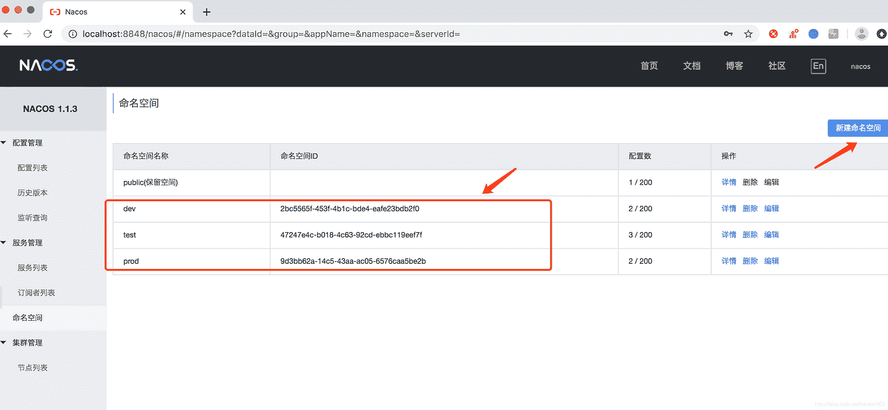
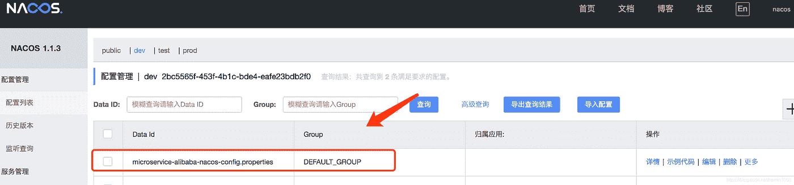
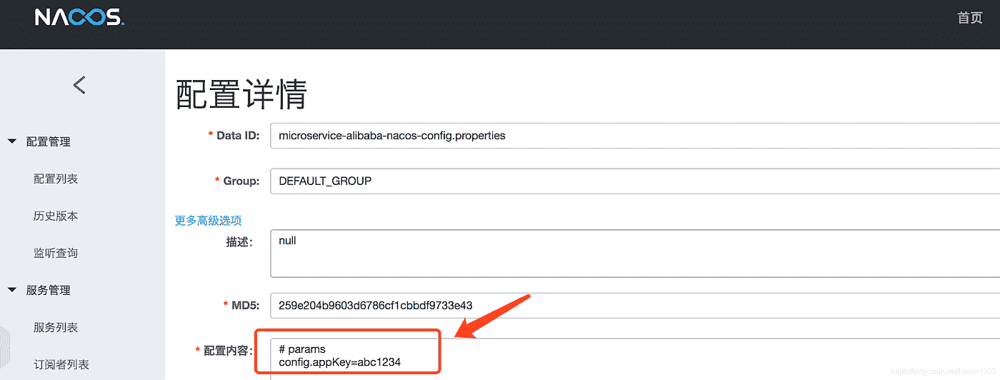
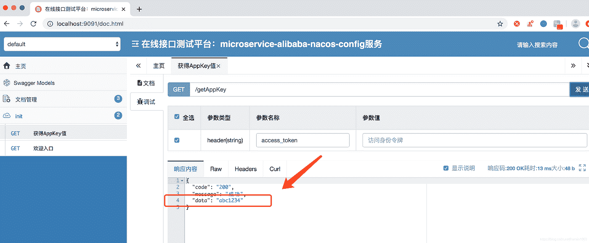
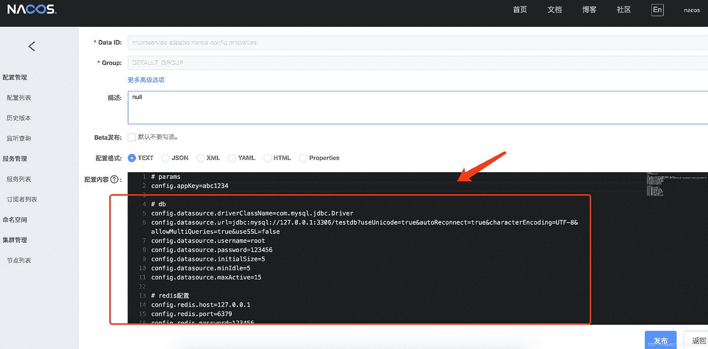

# 春云阿里巴巴从入门到精通教程(三)——Nacos 配置中心

> 原文：<https://medium.com/javarevisited/spring-cloud-alibabas-tutorial-from-getting-started-to-a-master-3-nacos-configuration-center-395a7f837910?source=collection_archive---------2----------------------->

## 将配置中心快速集成到项目 Nacos 配置中心管理功能中

我自己的照片在

## **需求背景**

在项目中快速集成配置中心 Nacos 配置中心管理功能

## 提示技术要点

1.  @值注释

*   值绑定

2.区分不同的环境，对应不同的配置中心管理功能

*   登录 Nacos 控制台，添加三个不同的环境，dev / test / prod，对应:开发环境/测试环境/生产环境
*   不熟悉控制台，看教程:

 [## 中等

### 编辑描述

medium.com](/@xuezhongyu01/954598300a01) 

## 代码演示

1.  项目目录结构

2.pom.xml 相关组件

3.bootstrap.yaml 配置文件

这里的名称空间值是:对应于 dev 环境的名称空间 id 值

点击+号，添加一个配置，数据 Id 对应应用名称(数据 Id 名称完全对应 yaml 配置文件:microservice-Alibaba-nacos-config . properties)

然后，点击“编辑”，添加“config.appKey=abc1234”，最后点击“发布”

4.访问接口类

获取该值:

注: [@RefreshScope](http://twitter.com/RefreshScope) 注释支持实时修改配置值，无需重启项目

5.启动类

6.是否成功获取该值

启动后访问地址:[http://localhost:9091/doc . html](http://localhost:9091/doc.html)

## 区分不同的环境

1.  支持 DB 和 [Redis](https://javarevisited.blogspot.com/2022/02/top-5-courses-to-learn-redis.html) 配置中心的分发

bootstrap.yaml .巴克

2.支持具有不同配置的多种环境

bootstrap.yaml2.bak

3.通过配置文件激活不同的环境配置

关于这种用法的更多信息(不同环境的配置用法):

 [## 春云阿里巴巴从入门到精通教程(二)——Nacos 服务注册…

### 项目中的快速集成配置中心 Nacos 服务注册发现功能

medium.com](/javarevisited/spring-cloud-alibaba-from-fresh-to-profession-tutorial-2-quick-integration-configuration-1aecb16bae5d) 

不再重复

 [## 2022 年 5 个最佳春季云和微服务课程、教程和培训班

### 大家好，如果你正在学习 Spring Cloud 以开发基于云的 Java 微服务，并且正在寻找一些好的…

medium.com](/javarevisited/5-best-courses-to-learn-spring-cloud-and-microservices-1ddea1af7012)  [## 2022 年 Spring Boot 和 Spring Cloud 的 11 个最佳 Java 微服务课程

### 我最喜欢的在线课程 2022 年用 Spring Boot 和 Spring Cloud 为初学者学习 Java 微服务从…

medium.com](/javarevisited/10-best-java-microservices-courses-with-spring-boot-and-spring-cloud-6d04556bdfed)