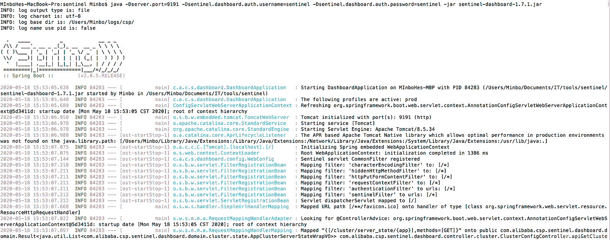
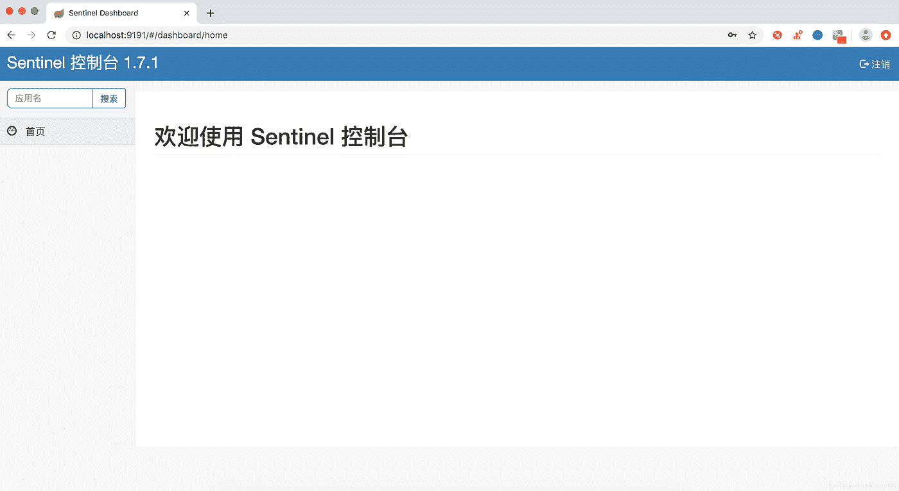
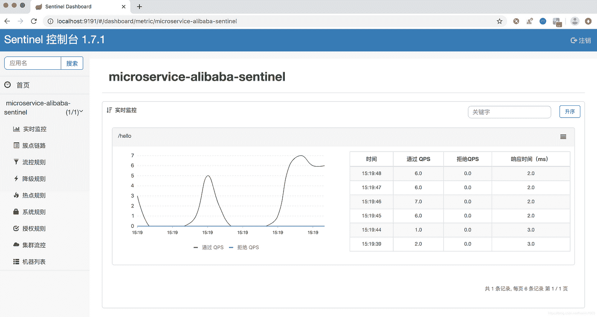

# 春云阿里巴巴从入门到精通教程(四)——流量控制组件 Sentinel Server 快速入门介绍

> 原文：<https://medium.com/javarevisited/spring-cloud-alibabas-tutorial-from-getting-started-to-a-master-4-introduction-to-quick-de65eddf9714?source=collection_archive---------1----------------------->

## 流量控制组件 Sentinel 服务器启动安装快速入门介绍


哨兵是什么？

> 分布式系统的流量守卫

W 随着微服务的流行，服务与服务之间的稳定性变得越来越重要。Sentinel 以流量为切入点，从流量控制、断路器降级、系统负载保护等多个维度保障服务的稳定性。

哨兵具有以下特征:

1.  丰富的应用场景:Sentinel 在过去 10 年承担了阿里巴巴双十一的核心场景，如尖峰(即突发流量控制在系统容量可以承受的范围内)、消息削峰填谷、集群流量控制、实时融合下游不可用应用等。
2.  完整的实时监控:Sentinel 还提供实时监控功能。在控制台中，您可以看到连接到应用程序的单机的二级数据，甚至是规模小于 500 的集群的聚合操作。
3.  广泛的开源生态系统:Sentinel 提供了与其他开源框架/库的现成集成模块，如与 [Spring Cloud](/javarevisited/5-best-courses-to-learn-spring-cloud-and-microservices-1ddea1af7012) 、Dubbo、 [gRPC](/javarevisited/5-best-google-protocol-buffer-and-gprc-courses-for-beginners-22633658983e) 的集成。你只需要引入相应的依赖项，进行简单的配置就可以快速访问 Sentinel。
4.  完整的 SPI 扩展点:Sentinel 提供易于使用的完整 SPI 扩展接口。您可以通过实现扩展接口来快速定制逻辑。例如，自定义规则管理、动态数据源的改编等。

哨兵分为两部分:

1.  核心库(Java 客户端)不依赖任何框架/库，可以在所有 Java 运行时环境下运行，对 Dubbo / [Spring Cloud](/hackernoon/top-5-spring-boot-and-spring-cloud-books-for-java-developers-75df155dcedc) 等框架也有很好的支持。
2.  控制台(Dashboard)基于 [Spring Boot](/javarevisited/top-10-courses-to-learn-spring-boot-in-2020-best-of-lot-6ffce88a1b6e) 开发，打包后可以直接运行，不需要额外的应用容器如 [Tomcat](https://javarevisited.blogspot.com/2016/10/2-ways-to-find-tomcat-java-version-in-Linux-Windows.html) 。

**快速启动**

## **1。服务器启动安装**

1.  准备环境

Sentinel 依赖于 Java 环境来运行。如果您正在从代码构建和运行 Sentinel，您还需要为此配置一个 Maven 环境，请确保安装和使用以下版本的环境:

1.  64 位 OS，支持[Linux](/javarevisited/6-best-websites-to-learn-linux-4861ac21bfdf)/Unix/[Mac](https://javarevisited.blogspot.com/2022/02/top-5-macos-courses-for-beginners-in.html)/Windows， [Linux](/javarevisited/7-best-linux-courses-for-developers-cloud-engineers-and-devops-in-2021-7415314087e1) /Unix/Mac 推荐。
2.  64 位 JDK 1.8+；
3.  maven 3.2 . x+；

2.下载源代码或安装包(本文中使用的方法)

您可以通过源代码和分发包获得 Sentinel

> 本文使用的版本是:sentinel-dashboard-1.7.1.jar，默认情况下包含控制台模块

3.启动服务器

开始命令:

```
java -Dserver.port=9191 -Dsentinel.dashboard.auth.username=sentinel -Dsentinel.dashboard.auth.password=sentinel -jar sentinel-dashboard-1.7.1.jar
```

> 监听端口:
> 
> server.port=9191
> 
> 设置控制台登录的用户名和密码(稍后使用):
> 
> 1.sentinel.dashboard.auth .用户名=sentinel
> 
> 2 . sentinel . dashboard . auth . password = sentinel

启动输出日志:

[](https://javarevisited.blogspot.com/2022/03/spring-boot-redis-example-in-java.html)

成功启动

## 2.登录:控制台管理功能

1.  默认哨兵系统提供控制台界面，登录地址: [http://localhost:9191/](http://localhost:9191/) ，使用之前设置的用户名和密码登录

[](https://javarevisited.blogspot.com/2020/05/top-20-spring-boot-interview-questions-answers.html)

2.成功登录后



这样就意味着 Sentinel Server 已经部署成功，安装成功，启动成功，可以开始访问应用服务了。

3.当应用程序访问 Sentinel 时，它可以实时监控当前的接口请求和其他信息

