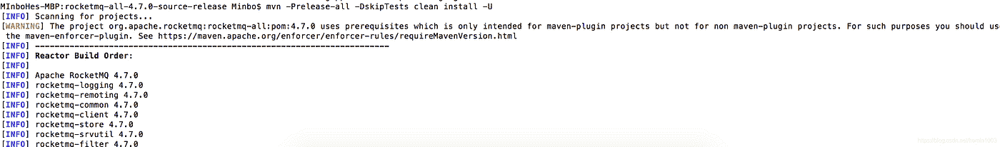
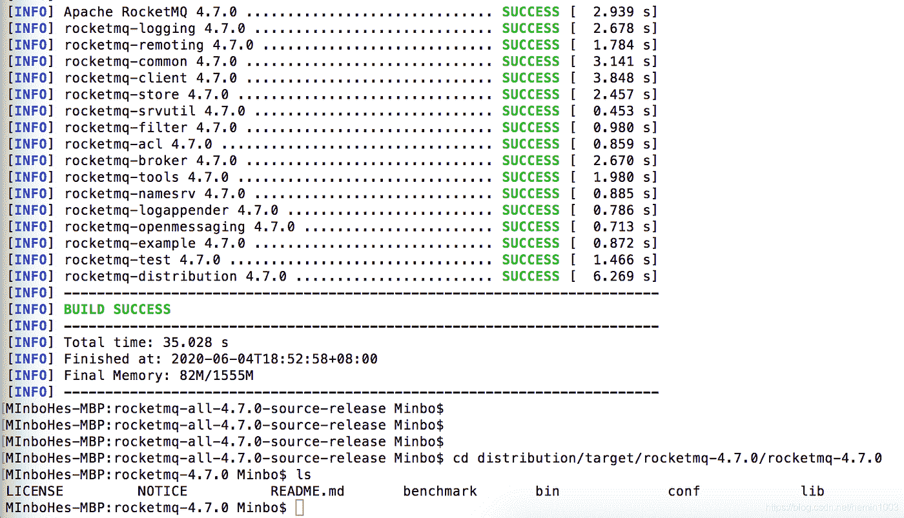

# 春云阿里巴巴从入门到精通教程(六)——消息组件 RocketMQ

> 原文：<https://medium.com/javarevisited/spring-cloud-alibabas-tutorial-from-getting-started-to-a-master-6-message-component-rocketmq-bd95ff607442?source=collection_archive---------3----------------------->

## 消息组件 RocketMQ 服务器启动安装快速入门介绍


**什么是 RocketMQ？**

RocketMq 是阿里巴巴开源的消息中间件。它在设计上借鉴了[卡夫卡](/javarevisited/top-10-apache-kafka-online-training-courses-and-certifications-621f3c13b38c)。2012 年开源，2017 年成为顶级 Apache 项目。

基本概念:

*   RocketMQ 主要由三部分组成:生产者、代理和消费者。生产者负责产生消息，消费者负责消费消息，代理负责存储消息。
*   代理对应于实际部署过程中的服务器。每个代理可以存储多个主题的消息，并且每个代理也可以存储在不同的代理分片中。
*   消息队列用于存储消息的物理地址，每个主题中的消息地址存储在多个消息队列中。
*   ConsumerGroup 由多个使用者实例组成。

技术架构:主要分为四个部分

1.  生产者:消息发布的角色，支持分布式集群部署。生产者通过 MQ 负载平衡模块为消息传递选择相应的代理集群队列。交付过程支持快速故障和低延迟。
2.  消费者:消息消费的角色，支持分布式集群部署。支持两种模式的消息消费:推和拉。同时还支持集群模式和广播模式下的消费。它提供了实时消息订阅机制，可以满足大多数用户的需求。
3.  名称服务器:名称服务器是一个非常简单的主题路由注册中心。它的作用类似于 Dubbo 中的 zookeeper，支持经纪人的动态注册和发现。主要包括两个功能:代理管理，NameServer 接受代理集群的注册信息并保存为路由信息的基础数据。然后提供心跳检测机制，检查代理是否还活着；路由信息管理，每个名称服务器将保存关于代理集群的整个路由信息和队列信息，以供客户端查询。那么[生产者](https://javarevisited.blogspot.com/2015/06/java-lock-and-condition-example-producer-consumer.html)和[消费者](https://javarevisited.blogspot.com/2022/03/spring-boot-kafka-example-single-and-multiple-consumers.html)就可以通过名称服务器知道整个代理集群的路由信息，从而进行消息的传递和消费。名称服务器通常部署在一个集群中，每个实例之间不进行通信。Broker 向每个名称服务器注册它自己的路由信息，因此每个名称服务器实例保存一段完整的路由信息。当一个名称服务器由于某种原因离线时，代理仍然可以将其路由信息与其他名称服务器同步，生产者和消费者仍然可以动态感知代理的路由信息。
4.  BrokerServer: Broker 主要负责消息的存储、交付和查询，以及服务高可用性保障。为了实现这些功能，Broker 包括以下重要的子模块。

通用 [MQ](https://javarevisited.blogspot.com/2014/03/top-10-websphere-mq-series-interview-questions-answers-active-rabbit.html) 适用场景:

1.  流量调峰:提高系统的高并发处理能力，比如尖峰场景
2.  异步处理:提高系统吞吐量
3.  应用程序解耦:减少系统模块之间的耦合

快速启动

## 1.服务器启动安装

1.  准备环境

RocketMQ 依赖于 [Java 环境](https://javarevisited.blogspot.com/2012/08/how-to-get-environment-variables-in.html)来运行。如果您正在从代码构建和运行 RocketMQ，您还需要为此配置一个 [Maven](/javarevisited/top-10-free-courses-to-learn-maven-jenkins-and-docker-for-java-developers-51fa7a1e66f6) 环境，确保在以下版本环境中安装和使用:

1.  64 位 OS，支持 Linux/Unix/Mac/Windows，[推荐 Linux](/javarevisited/6-best-websites-to-learn-linux-4861ac21bfdf) /Unix/Mac。
2.  64 位 JDK 1.8+；下载和配置。
3.  maven 3.2 . x+；下载和配置。
4.  [饭桶](/javarevisited/11-best-online-places-to-learn-git-for-beginners-in-2021-6dc2b7c6ef48)
5.  4G 或更多可用硬盘空间

2.下载源代码或安装包(本文中使用的方法)

本文使用的版本是:源码包 rocket MQ-all-4 . 7 . 0-source-release . zip

3.下载后，解压缩并构建包

```
unzip rocketmq-all-4.7.0-source-release.zip
cd rocketmq-all-4.7.0-source-release/
mvn -Prelease-all -DskipTests clean install -U
```

[](https://javarevisited.blogspot.com/2019/03/top-5-course-to-learn-apache-maven-for.html)[](https://javarevisited.blogspot.com/2017/06/10-maven-tips-java-developer-should-know.html)

输入目录:

```
cd distribution/target/rocketmq-4.7.0/rocketmq-4.7.0
```

4.启动名称服务器服务

开始命令:

```
nohup sh bin/mqnamesrv &
```

查看日志:

```
tail -f ~/logs/rocketmqlogs/namesrv.log
```

5.启动代理服务

开始命令:

```
nohup sh bin/mqbroker -n localhost:9876 &
```

查看日志:

```
tail -f ~/logs/rocketmqlogs/broker.log
```

6.测试发送和接收消息(演示)以验证成功

“发送消息”测试:

```
> export NAMESRV_ADDR=localhost:9876
 > sh bin/tools.sh org.apache.rocketmq.example.quickstart.Producer
 SendResult [sendStatus=SEND_OK, msgId= ...
```

“接收消息”测试:

```
sh bin/tools.sh org.apache.rocketmq.example.quickstart.Consumer
ConsumeMessageThread_%d Receive New Messages: [MessageExt...
```

7.停止服务

停止代理服务:

```
> sh bin/mqshutdown broker
The mqbroker(36695) is running...
Send shutdown request to mqbroker(36695) OK
```

停止名称服务器服务:

```
> sh bin/mqshutdown namesrv
The mqnamesrv(36664) is running...
Send shutdown request to mqnamesrv(36664) OK
```