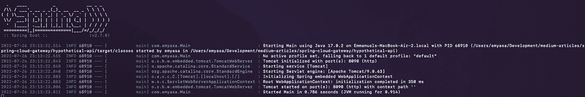
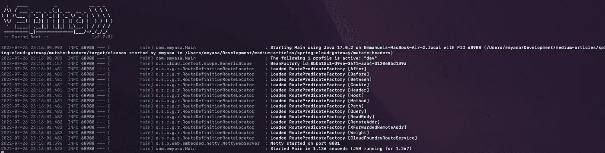
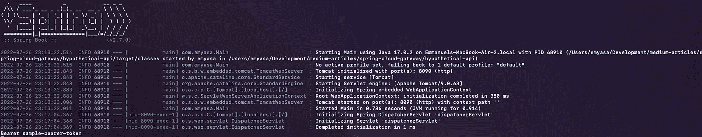

# Spring Cloud Gateway:路由和变更请求头

> 原文：<https://medium.com/javarevisited/spring-cloud-gateway-route-and-mutate-request-headers-e44a843b7437?source=collection_archive---------3----------------------->

## 从内部隐藏和利用与安全相关的标题。

[糖人乔](https://unsplash.com/@sugarman_joe?utm_source=medium&utm_medium=referral)在 [Unsplash](https://unsplash.com?utm_source=medium&utm_medium=referral) 上的照片

## **简介**

如今，应用程序使用基于令牌的授权并不罕见；然而，虽然这通常没有什么错，但尽可能地限制这些令牌的暴露几乎总是好的。

既然如此，我们何不去看看*春云网关*？**让我们利用它的路由机制，从内部处理请求头的变化。**

所以，不再多说——让我们启动并运行一个简单的网关服务。

## **项目设置**

首先，假设我们有一个内部 API，假设它需要一个必须保持安全和私有的头——可能是 API 密钥、客户端凭证等等。虽然实现其中的任何一项都很有趣，但在本文中，我们不会深入探讨这些细节；相反，我们将有一个假设的 API 来专门关注 [Spring Cloud Gateway](/javarevisited/5-best-courses-to-learn-spring-cloud-and-microservices-1ddea1af7012) 。

现在，让我们来看看`pom.xml`中的必要依赖项:

这个 pom.xml 几乎不言自明；然而，我想指出`netty-resolver-dns-native-macos`依赖性——我们可以用它来解决 M1 芯片中的 netty 兼容性错误。

接下来，通过一个`application.yml`文件—让我们为一个假设的服务配置路由:

从上面的片段中，我们可以看出前缀为/hypothetic-path(在谓词下)的请求将被直接路由到 [URI](http://www.java67.com/2013/01/difference-between-url-uri-and-urn.html) 。另外，请注意，我们在 filters 下使用了 StripPrefix 这使得可以将请求路由到我们假设的服务，而不使用尾随前缀。

最后，让我们实现一个定制的 GlobalFilter，在请求路由发生之前将一个头包含到请求中:

## **启动并运行**

我们就要到了——所以首先，让我们确保我们有一个正在运行的服务来路由来自网关服务的请求。在我们的例子中，我们可以使用假设的 api。

现在，剩下的就是运行并尝试通过网关服务发送请求:

`curl -v [http://localhost:8081/hypothetical-path](http://localhost:8081/hypothetical-path)`

如果我们要检查日志，我们可以看到我们已经成功地路由并添加了一个请求头:

所以，我们有它。有了 *Spring Cloud Gateway* ，我们可以用最少的配置和一个过滤器来路由和改变请求。

像往常一样，完整的源代码总是可以在 [GitHub](https://github.com/emyasa/medium-articles/tree/master/spring-cloud-gateway) 上获得。