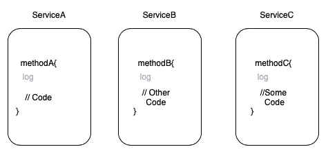
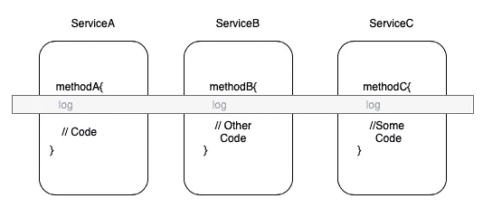
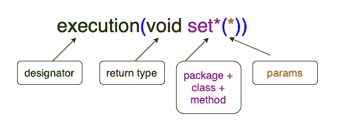
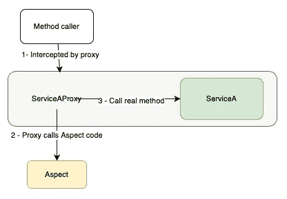
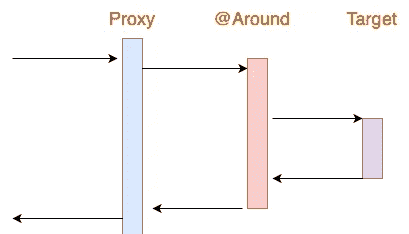

# Spring Core:在你的技能中包含面向方面编程

> 原文：<https://medium.com/javarevisited/spring-core-including-aspect-oriented-programming-in-your-skills-2c37eaa75c2a?source=collection_archive---------1----------------------->

## 理解 Spring 如何在幕后工作——第三章


在前两章中，我们介绍了所有你需要知道的 Spring 核心基础知识，探索了 IoC 是如何工作的，以及依赖注入背后的所有科学。如果你错过了这个，看看第一章和第二章的[。](/javarevisited/spring-core-ioc-and-container-c01608b527a1)

本章将从 Spring Core 的角度介绍面向方面的编程范式，解释它是如何工作的，并使用案例来应用它。

# AOP 和代理

让我们开始定义 AOP 的缩写:

> *面向方面编程* ( [AOP](https://javarevisited.blogspot.com/2021/03/spring-aop-interview-questions-answers.html#axzz6t8XhPyPu) )通过提供另一种思考程序结构的方式来补充面向对象编程(OOP)。在 OOP 中模块化的关键单元是类，而在 AOP 中模块化的单元是方面。方面支持关注点的模块化，比如跨越多种类型和对象的事务管理。—春季文档。

将其翻译成一种更常见的语言，我们可以将 AOP 定义为我们日常工作的补充，有助于解决*横切*关注用例及事务管理。正如我们常说的，有了榜样，一切都会变得更好:

假设您已经有了自己的 [Spring 应用程序](https://www.java67.com/2019/10/spring-helloworld-example-in-Java-eclipse.html)并正在运行。您有一些服务、存储库，为了向您的服务添加一些监控，您开始添加日志。例如，您的方法结构将如下所示:

```
void serviceMethodA(String param) {
  log.info("Starting method A with param: ", param);
  // Business code
  ...
}
```

同样，您的其他服务方法看起来也非常相似:

```
void serviceMethodB() {
  log.info("Starting method B");
  // Business code
  ...
}
```

现在，我需要你注意一件事:现在每个方法都有两个职责。

*   [测井](https://javarevisited.blogspot.com/2011/05/top-10-tips-on-logging-in-java.html)
*   执行业务操作

所有的业务操作都是(或者应该是)独立的，对于每个方法都是唯一的，但是日志记录适用于所有方法，没有任何改变。记录器的目标只是提供关于方法内部发生了什么的信息，而不干扰方法执行本身，并在所有应用程序中复制。

[](https://javarevisited.blogspot.com/2018/02/how-to-fix-exception-in-thread-main.html)

如您所见，日志是我们所有服务中重复使用的相同方法。通常，在[面向对象设计](/javarevisited/7-best-online-courses-to-learn-object-oriented-design-pattern-in-java-749b6399af59)中，你习惯于在垂直视图中看到类。这意味着，开始读取类，方法，并垂直组织代码。现在，当您将所有的服务类放在一起时，是时候横向查看它了。在这里，我们将找到我们的**交叉关注点**。

[](https://javarevisited.blogspot.com/2018/08/5-object-oriented-programming-and-design-courses-for-Java-programmers.html#axzz6fvDCikIM)

日志记录是最常见的例子，但是还可能有其他例子，比如警告一些外部服务、将数据保存到数据库、缓存等等。让我们保持简单，使用日志示例。现在我们已经确定了我们的横切用例，现在，把日志记录的东西从我们的方法中分离出来不是很好吗？

[](https://www.java67.com/2020/04/how-to-send-logger-messages-to-syslog-using-log4j-java-linux.html)

这种方法有两个主要好处:

*   日志责任分离
*   所有方法现在只有业务代码，易于阅读和维护。

这是 AOP 的基础。你的系统的另一个观点，在这里你开始将横向交叉的案例隔离到类中，以截取你的业务类。这就是我们所说的`Aspect`。

在我们的项目中，我们有两种实现 AOP 的选择:

*   AspectJ:一种完整的 AOP 语言，在字节码级别实现方面。
*   Spring AOP:与 AOP 集成的 Java 框架。

可以想象，我们将使用第二个选项。

## 关于 AOP 的一些基本概念

你需要熟悉以下表达方式:

*   **连接点**:程序执行的具体点。
*   **点切割**:分组一个或多个连接点的表达式。
*   **建议**:要在某个连接点执行的代码
*   **方面**:封装连接点和通知的模块。
*   **编织**:方面和业务代码的结合。

现在，让我们看看这些元素在 Java 类中是如何表示的:

这里要注意两点:

*   切入点。用表达式`execution(void set*(*))`表示。
*   `@Before`的建议。这意味着`trackMethod()`将在业务方法代码之前执行。

切入点表达式在开始时可能很难理解，所以让我们更详细地解释一下:

*   `execution(<method-pattern>)`语句定义了切入点。
*   方法模式工作如下:`designator (returnType +package + class + method (params)`
*   您可以使用逻辑操作符如`||`或 `&&`或`!`在同一个通知中链接更多的切入点

因此，看这个例子，我们可以识别切入点部分:



切入点部分详细信息

翻译成人类语言就是:执行所有从 **set** 开始的 **void** 方法，只接受一个参数。

有一系列规则来编写切入点表达式，你可以在本文中找到关于它的更多细节和一些更复杂的例子[。](https://www.baeldung.com/spring-aop-pointcut-tutorial)

开始的时候听起来可能有点棘手，但是通过一些练习，你会很快掌握所有这些概念。继续读我的朋友！

## 方法代理

现在，让我们看看建议注释。我们已经说过`@Before`通知意味着`trackMethod()`将在切入点中定义的被拦截的方法之前执行。让我们用图表来表示它:


建议前的图表

代理？是的。下面是 Spring AOP 背后的所有秘密。我们之前说过，Spring 不是魔法，我们来解释一下代理是如何工作的。

正如您已经知道的，一旦创建了 Spring 上下文，Spring 就会扫描所有标记为`@Bean`、`[@Component](https://javarevisited.blogspot.com/2017/11/difference-between-component-service.html)`等的类。对于`@Aspect`，Spring 将采用不同的方法。

*   Spring 将基于截取的类创建一个代理类。比如我们在拦截`ServiceA`，Spring 就会创建`ServiceAProxy`。这个类只在 Spring 上下文中创建，我们无法看到或操作它。
*   一旦代理被创建， [Spring](/javarevisited/10-best-online-courses-to-learn-spring-framework-in-2020-f7f73599c2fd) 将拦截所有使用代理的方法调用。一旦执行了方面方法，代理将返回到原来的方法。

[](https://javarevisited.blogspot.com/2018/06/top-6-spring-framework-online-courses-Java-programmers.html)

代理过程的表示

正如您所看到的，代理根据给定的通知编排调用方面方法和目标方法之间的所有过程。我们有 4 种类型的建议:

*   `Before`:目标方法执行前。
*   `After`:方法执行后，无论成功与否。
*   `AfterThrowing`:异常抛出后触发。
*   `AfterReturning`:当执行方法成功完成，我们得到了想要的输出。
*   最强大的，让我们完全控制所有目标方法的生命周期。

举个例子，让我们用图表展示一下 around 建议是如何工作的:

[](https://www.java67.com/2017/11/top-5-free-core-spring-mvc-courses-learn-online.html)

代表建议的图表

作为实践，您可以开始为`@After`、`@AfterThrowing`和`@AfterReturning`建议创建图表，以便更好地理解它。

关于 Spring AOP 你需要知道的就这些吗？当然不是，这里我们只从零开始解释了 AOP 是如何在幕后工作的，但是可以肯定的是，您现在已经有了理解更高级主题的基本概念，例如:

*   [代理机制:动态 JDK vs CGLib](https://docs.spring.io/spring-framework/docs/3.0.0.M3/reference/html/ch08s06.html)
*   [AspectJ 支持](https://docs.spring.io/spring-framework/docs/4.3.15.RELEASE/spring-framework-reference/html/aop.html#aop-aspectj-support)
*   [使用 Spring AOP 获取方法信息](https://www.baeldung.com/spring-aop-get-advised-method-info)

我们已经完成了我将在这个月发布的 Spring Core 系列的第三章。如果你觉得有用，请关注我，继续关注下一篇:

*   [弹簧芯:IoC 和容器](/javarevisited/spring-core-ioc-and-container-c01608b527a1)
*   [Spring Core:关于依赖注入你需要知道的一切](/javarevisited/spring-core-all-you-need-to-know-about-dependency-injection-2048d80340af)
*   Spring Core:在您的技能中包含面向方面的编程
*   [Spring Core:有效管理事务](/javarevisited/spring-core-managing-transactions-effectively-781bba6c47e8)
*   [Spring Core:使用 REST 和 Spring MVC](/javarevisited/spring-core-using-rest-and-spring-mvc-cef35acbec8e)

还有，不要犹豫，把你的疑惑贴出来。我非常乐意在这个奇妙的旅程中帮助你。