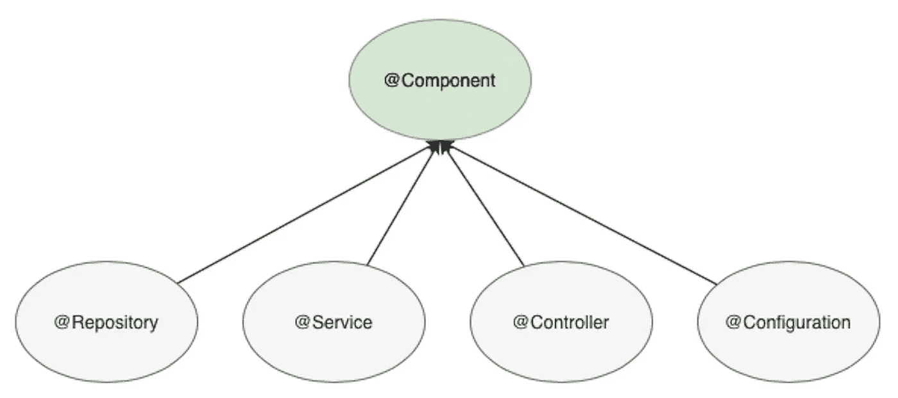

# Spring 核心:使用 REST 和 Spring MVC

> 原文：<https://medium.com/javarevisited/spring-core-using-rest-and-spring-mvc-cef35acbec8e?source=collection_archive---------1----------------------->

## 理解 Spring 如何在幕后工作——第五章


大多数面试过程要求你能够从头开始创建一个应用程序。如果您已经阅读了之前的文章，那么您将非常熟悉所有的 Spring 核心基础知识，例如[容器](/javarevisited/spring-core-ioc-and-container-c01608b527a1)、[依赖注入](/javarevisited/spring-core-all-you-need-to-know-about-dependency-injection-2048d80340af)、 [AOP](/javarevisited/spring-core-including-aspect-oriented-programming-in-your-skills-2c37eaa75c2a) 和[事务管理](/javarevisited/spring-core-managing-transactions-effectively-781bba6c47e8)，所以现在，我们将把所有这些放在一起，创建一个非常简单但可扩展的 API，并通过 REST 公开我们的 web 服务。

# 探索 MVC

模型视图控制器是 web 应用程序的架构设计。不仅与 Java 生态系统相关，而且几乎可以应用于任何编程语言。可以想象，Spring 有自己的模块，以非常简单的方式在应用程序中实现 MVC。

*   模型:数据层，在这里您可以配置和执行您的业务逻辑。
*   视图:最终用户的响应。您通过 web 模板、 [JSON](https://javarevisited.blogspot.com/2017/02/how-to-consume-json-from-restful-web-services-Spring-RESTTemplate-Example.html) 对象、XML……
*   控制器:负责处理和创建对浏览器的响应。

因此，让我们开始定义我们的应用程序架构:

*   存储库层，用于数据访问管理
*   服务层，用于业务逻辑
*   控制器层，用于公开我们的 API 方法并返回输出。

如果您熟悉 Spring 原型，也许您已经注意到层名与那些原型注释相同。那是因为 [Spring](/javarevisited/10-best-online-courses-to-learn-spring-framework-in-2020-f7f73599c2fd) 帮助你明确地组织你的应用层，同时，将它们标记为 Spring 组件。所以，翻译成普通语言，`@Repository`、`@Service`、`@Controller`不过是`@Component`的名义上的延伸。

[](https://javarevisited.blogspot.com/2017/11/difference-between-component-service.html)

> 记住，在 Spring 上下文中，所有标记的类都被认为是组件，所以为了组织代码，原型明确地划分了每个应用层。如果您用`@Component`替换任何原型，行为不会改变，但是不容易识别它属于哪个应用层。

因此，记住你在前面章节中学到的，我们将开始组织我们的项目结构并注入依赖关系。`@Repository`类应该注入到`@Services`中，`@Services`应该由`@Controller`类使用。

```
@Repository
public class ArticleRepository { // Repository methods 
```

因此，一旦这个类准备好被 Spring 扫描，我们就可以把它注入服务类。

```
@Service
public class ArticleService {     
   private ArticleRepository articleRepository;        public ArticleService(ArticleRepository articleRepository) {          
      this.articleRepository = articleRepository;    
   } // Service methods
}
```

> 从 [Spring Boot 1.4](https://docs.spring.io/spring-boot/docs/current/reference/html/using.html#using.spring-beans-and-dependency-injection) 开始，构造函数注入是自动连接的，不需要显式使用@Autowired 注释。

因此，一旦我们有了我们的项目结构，让我们探索更多关于控制器本身。

# 控制器操作

Spring 控制器负责接收处理后的数据，并以预定的格式将输出返回给最终用户。所以，和另一层一样，我们可以用`@Controller,`来标记我们的控制器类，但是控制器里面到底应该有什么呢？带有已定义端点的公开方法。

例如，我们需要在我们的 API 中为 Articles 模型提供 CRUD 操作，并公开这些操作供我们的客户使用。因此，遵循 RESTful 最佳实践，我们必须提供:

具有以下 HTTP 方法的端点:

*   **发布** `/articles`用于创建新文章
*   **获取** `/articles`用于检索所有文章
*   **获取** `/articles/{id}`用于检索特定的文章
*   **放**和`/articles/{id}`用于更新现有文章
*   **删除** `/articles/{id}`

还有其他的 HTTP 方法，但是不会在这个例子中使用。好的一面是你现在将学到的东西对其他方法也是有用的，所以让我们继续吧！

那么，我们如何通知控制器类我们想要公开那些 REST 操作呢？Spring 用`@RequestMapping`解决。这个注释将把`/articles`路径解析成控制器中的目标方法。例如，对于 GET 操作，我们可以提供以下方法:

```
@RequestMapping(value = "/articles", method = RequestMethod.GET)    
public ResponseEntity<Article> findArticles() {        
   return ResponseEntity.ok(service.getAllArticles());    
}
```

解释代码:

*   当使用`GET`方法时，`@RequestMapping` 将在 `/articles`路径中公开 findArticles 方法。
*   `ResponseEntity<>`包装器用于将我们的输出格式定义为正确的 JSON 响应(状态代码、主体、标题)。您可以直接返回对象，Spring 会为您包装它，但是使用包装器是一个很好的实践，因为您可以完全控制响应。

同样，我们可以实现其他方法:

```
@RequestMapping(value = "/articles/{id}", method = RequestMethod.GET)    
public ResponseEntity<Article> findArticlesByID(@PathVariable Long id) {        
   return ResponseEntity.ok(service.getById(id));    
}
```

解释代码:

*   `/articles/{id}`资源现在有一个显式的路径参数来检索特定的文章。
*   `@PathVariable`将把`{id}`参数映射到我们的方法变量`Long id`。

如果变量名与路径不同，我们必须在`[@PathVariable](https://javarevisited.blogspot.com/2017/10/differences-between-requestparam-and-pathvariable-annotations-spring-mvc.html#axzz5jtleVQXB)`注释中指定路径名。

```
@RequestMapping(value = "/articles/{id}", method = RequestMethod.GET)    
public ResponseEntity<Article> findArticlesByID(@PathVariable("id") Long articleID) {        
   return ResponseEntity.ok(service.getById(id));    
}
```

在 [POST 和 PUT 操作](https://www.java67.com/2016/09/when-to-use-put-or-post-in-restful-web-services.html)的情况下，方法是相同的，唯一的区别是我们在请求中接收一个主体，它将被映射到某个 Java 对象并持久存储到我们的数据库中。为此，我们将使用`@RequestBody`注释。

```
@RequestMapping(value = "/articles", method = RequestMethod.POST)    
public ResponseEntity<Article> save(@RequestBody Article article) {
   Article saved = service.save(article);        
   return new ResponseEntity<>(saved, prepareHeader(saved.getId()), CREATED);    
}
```

解释代码:

*   现在使用的请求方法是 POST，所以我们期望请求中有一个主体。
*   Spring 提取主体并将其映射到 Java 对象的方式是通过`@RequestBody`注释。
*   我们正在利用来自`ResponseEntity`包装器的好处来创建一个带有标题和状态码`CREATED`的适当的 Restful 响应。

正如您可能注意到的，所有端点的`@RequestMapping`代码几乎相同:

*   根资源`/articles`对所有人都一样
*   唯一改变的是方法和请求参数。

因此，通过改进我们的代码，我们可以将`/articles` 资源移动到类级别的注释中。这样，我们将控制器定义为负责整个资源。然后，我们可以从控制器方法中移除`/articles`路径，如果需要，只使用参数路径`/{id}`。现在，当请求到来时，类映射将被用作根，并用方法映射来完成。

此外，为了避免在控制器上重复相同的注释，Spring 创建了更多有用的注释，以使我们的代码更容易阅读:`@PostMapping`、`@GetMapping`、`@PutMapping`和`@DeleteMapping`，这取决于您需要使用的 HTTP 方法。

现在，让我们运行应用程序并调用`/articles`端点。也许响应不是您所期望的，这是因为我们使用了`@Controller`注释，而没有通知 Spring 我们想要返回 JSON 对象而不是 web 模板(默认配置)。怎么解决？`@ResponseBody`注释为您处理这项工作，并且可以在类级或方法级使用，这取决于您的需要。在大多数情况下，当您创建 API 方法时，您不需要返回 web 模板，因此您必须在所有控制器类中使用带有`@ResponseBody`的`@Controller`注释。再一次，Spring 通过合并`@RestController`中的这两个注释使这项工作变得更加容易。

对我们的代码进行一些更改，控制器将如下所示:

现在，我们的应用程序已经准备好处理请求，并将处理后的数据以 JSON 格式返回给客户机。当然，我们可以将输出格式修改为 XML、文本或任何我们需要的格式。

这只是 Spring MVC 模块的第一步。我们有更多有趣的话题，如:

*   [异常处理程序](https://spring.io/blog/2013/11/01/exception-handling-in-spring-mvc)
*   [返回模型、模型图和模型视图](https://www.baeldung.com/spring-mvc-model-model-map-model-view)

这个例子基于我几年前为一次面试创建的现有应用程序。如果你想看看它在现实生活中是如何工作的，[这里是 GitHub 库](https://github.com/Darguelles/upd-articles-api)。此外，我强烈建议您阅读更多关于 MVC 的内容，以了解所有组件如何协同工作。

<https://github.com/Darguelles/upd-articles-api>  

我们已经完成了我将于本月发布的 Spring Core 系列的第五章，也是最后一章。如果您觉得它有用，请关注我并与您的同事分享，同时也请继续关注新内容:

*   [弹簧芯:IoC 和容器](/javarevisited/spring-core-ioc-and-container-c01608b527a1)
*   [Spring Core:关于依赖注入你需要知道的一切](/javarevisited/spring-core-all-you-need-to-know-about-dependency-injection-2048d80340af)
*   [Spring Core:在你的技能中包含面向方面编程](/javarevisited/spring-core-including-aspect-oriented-programming-in-your-skills-2c37eaa75c2a)
*   [Spring Core:有效管理交易](/javarevisited/spring-core-managing-transactions-effectively-781bba6c47e8)
*   Spring 核心:使用 REST 和 Spring MVC

还有，不要犹豫，把你的疑惑贴出来。我非常乐意在这个奇妙的旅程中帮助你。

您可能喜欢的其他 **Spring 和 REST 文章和资源**

</javarevisited/10-best-online-courses-to-learn-spring-framework-in-2020-f7f73599c2fd>  </javarevisited/why-spring-is-the-best-framework-for-developing-rest-apis-in-java-784590e484a4>  </javarevisited/top-5-books-and-courses-to-learn-restful-web-services-in-java-using-spring-mvc-and-spring-boot-79ec4b351d12> 