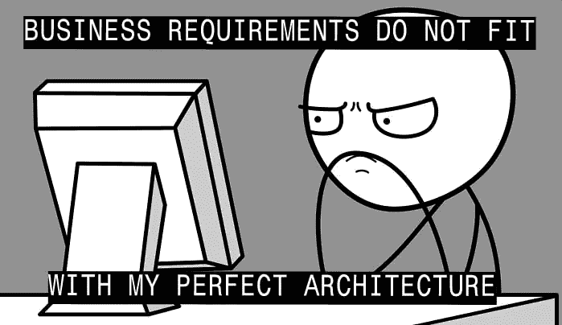
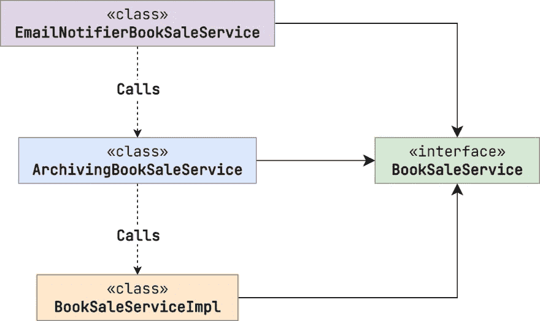
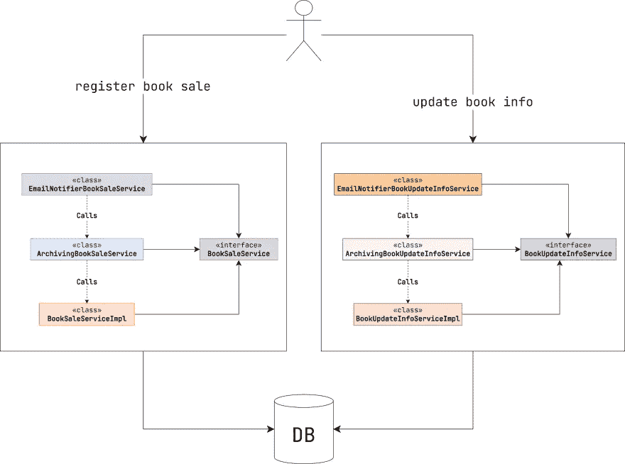
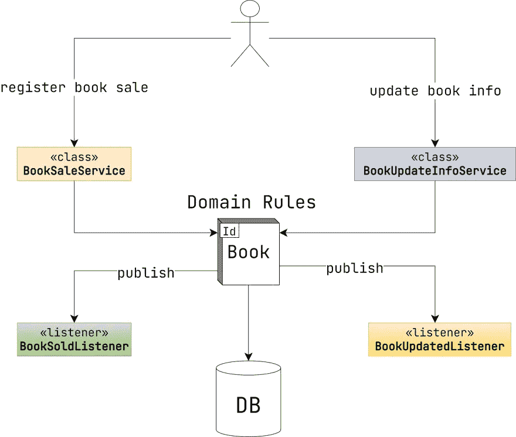

# Spring Data —领域事件的力量

> 原文：<https://medium.com/javarevisited/spring-data-power-of-domain-events-62cb212a42a2?source=collection_archive---------0----------------------->

[领域事件](https://martinfowler.com/eaaDev/DomainEvent.html)是来自[领域驱动设计](https://en.wikipedia.org/wiki/Domain-driven_design)的想法之一。一旦你熟悉了这种技术，你就不会再愿意离开它了。因此，在本文中，我将向您展示一个应用程序开发的示例。随着新需求的出现，我们正在一步一步地进行这个过程。这将使我们清楚地了解领域事件的价值。

我们的栈是 Java 11 + Spring Boot + Hibernate。

假设我们正在创建图书销售服务。作者可以出售他们的书，而顾客可以购买。

让我们定义主要的业务实体。`Book`本身。

而`BookSale`。

一个`Book`实例有名称、作者、创建日期、最后更新日期、价格和所有销售清单。

> *为了简单起见，我们假设书籍只有一个作者，所有的价格都有相同的货币。*

好了，最小畴模型是接地的。是时候实现业务需求了。

# 1.每个图书销售商都应该登记

这就是我们系统的全部想法。

这是第一次尝试。

如果您经常使用 [Spring](/javarevisited/10-best-online-courses-to-learn-spring-framework-in-2020-f7f73599c2fd) ，您可能会多次看到类似的代码片段。我们在这里建立的设计架构可以被描述为[贫血领域模型](https://martinfowler.com/bliki/AnemicDomainModel.html)。

这意味着我们将绝大多数业务逻辑放在服务层内部。而实体只是作为简单的数据结构，带有 getters 和 setters。

许多作者将这种风格归类为反模式。但这是为什么呢？这种方法似乎很自然，不是吗？此外，在我们的案例中，业务逻辑并不复杂。那么，在这样一个原始的例子中没有问题。至少目前是这样。

# 2.每卖出 100 本书，就应该通知作者

我们想让作者知道他们的书正在销售。

我们如何实现这个特性？好吧，天真的方法是将功能放在`sellBook`方法中。

首先出现的是在调用`emailService.send`方法时，仍在处理[事务](https://javarevisited.blogspot.com/2021/08/spring-transactional-example-how-to.html)。首先，这是一种性能损失。第二，事务最终可能会回滚。在这种情况下，我们不想发送任何电子邮件。

我们可以通过应用[程序化事务](https://www.baeldung.com/spring-programmatic-transaction-management)来解决这个问题。

但是还有一个问题。这种方法打破了[单一责任原则(SRP)](https://en.wikipedia.org/wiki/Single-responsibility_principle) 和[开闭原则(OCP)](https://javarevisited.blogspot.com/2015/07/strategy-design-pattern-and-open-closed-principle-java-example.html) 。更好的选择是[装饰图案](https://javarevisited.blogspot.com/2011/11/decorator-design-pattern-java-example.html)。

`EmailNotifierBookSaleService`注入`BookSaleService`接口。在生产环境中，这个将是`BookSaleServiceImpl`实现(限定符注释[指向那个)。但是在测试环境中，我们可以使用 stub 或 mock。](https://www.baeldung.com/spring-qualifier-annotation)

那看起来确实好多了。该功能由两个服务分担。它们中的每一个都可以单独测试。

# 3.每本书的更新都应该存档

分析师已经决定，每一个可能的图书更新(包括图书销售)都应该存档。这里是`BookArchive`实体。

我们如何跟踪图书销售？嗯，我们可以直接将功能添加到`BookSaleServiceImpl`中，但是我们已经指出这是一种糟糕的方式。所以，另一个装修工进来了。

应该指出一些重要的细节。
`sellBook`方法用`@Transactional`包裹。原因是归档记录应该在与`BookSale`本身相同的事务中创建。如果主操作失败，我们不想存储任何档案。

> *在执行过程中，* `*bookRepository.findById(id)*` *方法被调用两次。但是因为有一个事务，*[*Hibernate*](/javarevisited/top-5-hibernate-online-training-courses-for-beginners-and-advance-java-programmers-469460596b2b?source=---------9------------------)*在第二次调用时从持久性上下文返回* [*缓存的实例*](https://vladmihalcea.com/jpa-hibernate-first-level-cache/) *。因此，没有额外的数据库往返。*

第二点是`@ActualBookSaleServiceQualifier`。`EmailNotifierBookSaleService`不启动任何事务。这意味着`origin`必须是`BookSaleServiceImpl`类型。因此，我们必须编辑`EmailNotifierBookSaleService`以避免两次注射`BookSaleServiceImpl`。

这是当前流程的模式。

图书销售请求流程

如果系统不复杂，这种方法可能就足够了。但是图书销售应用程序可以是一个巨大的企业解决方案。你看，我们才开始发展，但已经有两个装饰。此外，包装的顺序也很重要。这就是为什么我们不得不改变限定词。

似乎有点过于复杂了，不是吗？嗯，这还不是结束。

# 4.管理员应该能够更新一本书的名称和描述。应该通过电子邮件通知作者每一次更新

这也很有道理。例如，可能会有错别字。该要求可以分为三个不同的功能:

1.  图书信息更新
2.  图书归档
3.  通过电子邮件通知

但问题是。如果我们继续遵循和以前一样的方法，将会有带有业务逻辑的主服务和两个额外的装饰器。似曾相识，不是吗？每次新的需求到来时，我们都必须用新的装饰者来包装服务层。

有什么问题？嗯，一些先前实现的功能必须重复。比如图书存档。不管这本书到底发生了什么，都应该创建新的档案记录。因为这是分析师需要的。邮件也是如此。不同的是他们发送的频率。

那么，有什么更好的解决办法呢？这就是领域事件出现的时刻。但首先，我们必须做一些重构。

# 没有贫血的领域模型

到目前为止，我们有什么样的要求？只有他们两个。图书销售请求及其信息更新。让我们稍微重写一下`Book`实体。

我想关注一下`sell`和`changeInfo`的方法。第一个注册新书销售。第二个更新了书的名字和描述。

似乎到目前为止什么都没有改变。我们只是组合了可以通过 setters 调用执行的功能。嗯，是真的。但是让我们继续前进。现在让我们重构一下`BookSaleServiceImpl`。

代码看起来不再像命令列表。商业案例现在是*透明的*。此外，`Book.sell`方法可以在不同的应用服务中重用。但是商业规则保持不变。

更新图书信息的服务看起来很熟悉。

# 领域事件介绍

现在让我们跳到图书归档案例。如果每次图书更新都发布一个触发图书归档的事件，会怎么样？嗯， [Spring](/javarevisited/7000-free-pluralsight-courses-to-build-in-demand-tech-skills-without-leaving-your-house-40edb50a8cf2) 确实有`ApplicationEventPublisher` bean，允许通过`[@EventListener](https://www.baeldung.com/spring-events)`用法发布事件和订阅事件。

虽然它有助于我们分离销售和存档过程，但它也迫使我们不要忘记发布任何图书变化。

我们可以提供`ApplicationEventPublisher`作为更新方法的代表。

那更好。但是无论如何，我们必须将这个`ApplicationEventPublisher`实例注入到每个以某种方式与`Book`交互的服务中。

有没有更好的解决办法？当然可以。拥抱`[@DomainEvents](https://www.baeldung.com/spring-data-ddd)`。

# @DomainEvents

每当客户端调用`sell`或`changeInfo`方法时，一个`BookUpdated`事件被添加到`domainEvents`列表中。正如你可能猜到的，没有直接出版。那么，事件如何到达事件侦听器呢？当我们调用`Repository.save`方法[时，Spring](/javarevisited/top-15-java-and-spring-framework-courses-from-udemy-best-of-lot-d7b965b62a9f) 通过寻找`@DomainEvents`注释来收集事件。然后正在进行清理(`@AfterDomainEventPublication`)。

我们可以简化它。 [Spring](/javarevisited/12-advanced-spring-framework-courses-for-java-programmers-a273f6e4448c) 提供了已经包含所需功能的`AbstractAggregateRoot`类。这是一个不太冗长的选项。

我们忘记了电子邮件事件。这可能很容易被称为“T1”或“T2”。但那不会是*面向领域的*。你看，发邮件只是一个实现细节。可能有很多其他的选择。登录、向[卡夫卡](/javarevisited/top-10-apache-kafka-online-training-courses-and-certifications-621f3c13b38c)发送消息、触发作业等。关注业务用例而不是功能行为是很重要的。

所以，正确的做法是宣布`BookSold`和`BookChangedInfo`事件。

# 捕捉事件

`@EventListener`注释是跟踪 Spring 事件的一种简单方便的方式。但是有一个警告。我们不仅仅需要捕捉事件。我们希望监听器在事务生命周期的特定时刻被调用。

例如，归档应该在事务提交之前完成。如果主请求或归档本身出现问题，整个事务都必须回滚。

相反，应该在事务提交后立即发送电子邮件。如果请求没有成功进行，没有必要通知任何人。

注释不够强大，无法满足我们的需求。但是不用担心。`@TransactionalEventListener`来救援了！

不同之处在于注释提供了`phase`属性。它声明了事务生命周期中必须调用我们侦听器的时刻。有四种可能的值。

1.  `BEFORE_COMMIT`
2.  `AFTER_COMMIT` -默认的一个
3.  `AFTER_ROLLBACK`
4.  `AFTER_COMPLETION`

前三个选项不言自明。`AFTER_COMPLETION`是`AFTER_ROLLBACK`和`AFTER_COMMIT`的组合。

例如，这就是图书存档的实现方式。

> `*BookArchive.createNew*` *只是封装了之前已经描述过的创建新的* `*BookArchive*` *实例的逻辑。*

看到了吗？小菜一碟！捕获`BookChangedInfo`和`BookSold`是相似的。

> *关于* `*@TransactionalEventListener*` *还有一个重要的细节。有时您需要在* `*AFTER_COMMIT*` *阶段调用新事务中的命令。如果是这样，请确保您将* `[*@Transactional(propagation = REQUIRES_NEW)*](https://www.baeldung.com/spring-transactional-propagation-isolation)`也设为*。* `*REQUIRES_NEW*` *参数至关重要。因为以前的事务资源可能还没有被清除。所以，我们必须确保春天是一个新的开始。*

现在我们可以摆脱那些装修工了。这是第一次设置和最终架构的对比。

## 第一次尝试

## 最终的建筑

第一种方法将所有业务逻辑放在服务层中，而域类充当简单的数据结构。这种模式称为[事务脚本](https://martinfowler.com/eaaCatalog/transactionScript.html)。如果您的系统很小并且不复杂，那么跨这种模式设计架构是很好的。但是当它成长的时候，就变得难以维持了。

> *顺便说一下，你可能不需要* [*春天数据*](/javarevisited/5-best-spring-data-jpa-courses-for-java-developers-45e6438be3c9) *和* [*冬眠*](/javarevisited/top-5-books-to-learn-hibernate-for-java-developers-b2cb4b16ccd6?source=---------14------------------) *，如果你应用了事务脚本模式。由于所有的业务规则都绑定到服务上，Hibernate 会带来开销，没有那么多好处。相反，你可以试着使用*[*JDBI*](https://jdbi.org/)*[*JOOQ*](https://www.jooq.org/)*甚至普通的*[*JDBC*](/javarevisited/top-5-courses-to-learn-jdbc-and-database-connectivity-for-java-developers-free-and-best-of-lot-7945156fcc3?source=extreme_sidebar---------0-2----------------------)*。**

*最终的架构把它颠倒过来。领域实体封装业务逻辑，服务充当瘦包装器(富领域模型)。无论谁与`Book`实体交互，业务规则都保持不变。所有附加功能都是由域事件驱动的。这让我们可以无限扩展系统。领域事件可以触发各种业务操作。将消息放入队列，执行审计操作，通知用户，应用 [CQRS](https://martinfowler.com/bliki/CQRS.html) 模式，等等。*

# *结论*

*在我看来，Hibernate 结合 [Spring Data](https://javarevisited.blogspot.com/2021/08/top-5-spring-data-jpa-courses-for-java.html) 是为了和域事件一起使用。好处是值得的。我很好奇你是如何在你的项目中应用持久性的？您喜欢贫血的还是丰富的领域模型？请在下面留下你的评论。感谢阅读！*

# *资源*

1.  *[域事件](https://martinfowler.com/eaaDev/DomainEvent.html)*
2.  *[领域驱动设计](https://en.wikipedia.org/wiki/Domain-driven_design)*
3.  *[贫血域模型](https://martinfowler.com/bliki/AnemicDomainModel.html)*
4.  *[程序化交易](https://www.baeldung.com/spring-programmatic-transaction-management)*
5.  *[单一责任原则](https://en.wikipedia.org/wiki/Single-responsibility_principle)*
6.  *[开闭原理(OCP)](https://en.wikipedia.org/wiki/Open%E2%80%93closed_principle#:~:text=In%20object%2Doriented%20programming%2C%20the,without%20modifying%20its%20source%20code.)*
7.  *[装饰图案](https://en.wikipedia.org/wiki/Decorator_pattern)*
8.  *[弹簧限定词注释](https://www.baeldung.com/spring-qualifier-annotation)*
9.  *[休眠一级缓存](https://javarevisited.blogspot.com/2017/03/difference-between-first-and-second-level-cache-in-Hibernate.html)*
10.  *[春季事件监听器](https://www.baeldung.com/spring-events)*
11.  *[春域事件](https://www.baeldung.com/spring-data-ddd)*
12.  *[Spring 事务传播和隔离](https://www.baeldung.com/spring-transactional-propagation-isolation)*
13.  *[交易脚本模式](https://martinfowler.com/eaaCatalog/transactionScript.html)*
14.  *[JDBI](https://jdbi.org/)*
15.  *[JOOQ](https://www.jooq.org/)*
16.  *[CQRS 模式](https://martinfowler.com/bliki/CQRS.html)*