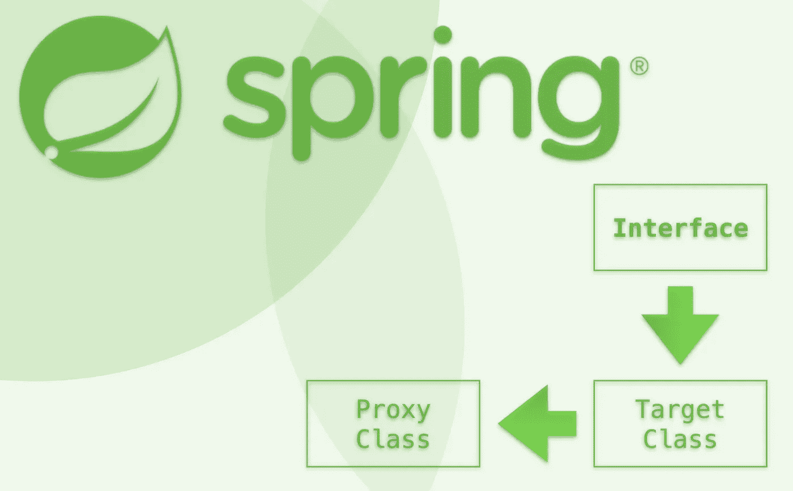
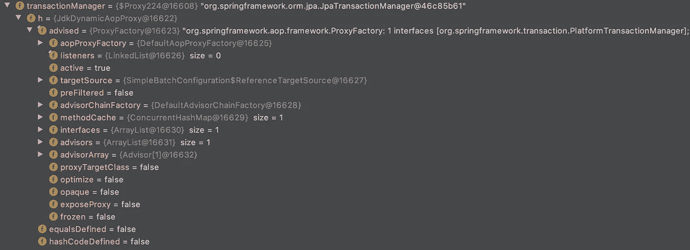

# Spring 依赖注入揭秘第 1 部分:代理

> 原文：<https://medium.com/javarevisited/spring-dependency-injection-demystified-part-1-proxying-7be4fa52bb6c?source=collection_archive---------0----------------------->



弹簧代理细节

将一些 Spring 特性称为“魔法”是很常见的除了一个注释之外，您还能如何在方法级别添加像缓存这样的功能呢？神奇！✨ ✨ ✨

# 🖥 ➡️ 🖥代理技术公司

随着时间的推移，我开始了解一些神奇的✨的名字，这些名字促进了 Spring 的惊人特性，这些特性提高了工程师的生产力，并在开发团队的速度下点燃了一把火。

*JDK 动态代理和 CGLIB。*

Spring 中的代理是代理设计模式的实现，有助于促进[面向方面编程](https://docs.spring.io/spring-framework/docs/5.2.x/spring-framework-reference/core.html#aop)的范例。

**代理➕的好处**

*   提供代理来控制对对象的访问
*   充当包装器，保护真实组件免受复杂性的影响(*，即真实组件只包含核心业务逻辑，而不包含不相关的横切逻辑，如日志*
*   提供一定程度的间接支持分布式、受控或修改的访问
*   可以充当“创建成本高”对象的占位符，以允许延迟创建
*   可用于在允许访问安全对象之前验证权限
*   可以在访问对象时注入额外的功能，如日志记录、缓存、事务管理等。

# 详细代理🔎

**让我们来看一张 GIF 图片，看看代理是如何工作的:**

[](https://javarevisited.blogspot.com/2018/02/top-5-java-design-pattern-courses-for-developers.html)

弹簧代理的作用

没有什么比 GIF 更能引发引人入胜的技术讨论了。

所以让我们从这里开始吧。 [Spring](/javarevisited/top-10-free-courses-to-learn-spring-framework-for-java-developers-639db9348d25) 正在使用你的注释组件(*原始类*)实现的接口来创建一个 JDK 动态代理(*代理类*)，它拦截对你的组件的每个方法调用。每个调用都通过这个代理在进来的路上/出去的路上进行。

**步步🗒 :**

1.  对 read 方法的调用命中代理类
2.  代理类可以在访问控制等实际类之前执行逻辑。
3.  定制组件的实际具体类称为执行定制业务逻辑
4.  然后，自定义组件将结果返回给代理类，允许它注入逻辑，如日志记录
5.  代理类将结果返回给原始调用类。

## JDK 动态代理☕️

这是 Spring AOP 框架包中的一个核心类。你可以在 Github 上查看[源代码。](https://github.com/spring-projects/spring-framework/blob/master/spring-aop/src/main/java/org/springframework/aop/framework/JdkDynamicAopProxy.java)

**从文件上看📖:**

> JdkDynamicAopProxy 是 Spring AOP 框架的 AopProxy 实现，基于 JDK java.lang.reflect.Proxy 动态代理。
> 
> 创建动态代理，实现 AopProxy 公开的接口，这些接口可用于代理接口中定义的方法，而不是类。这种类型的对象应该通过由 AdvisedSupport 类配置的代理工厂*获得。

**JDK 动态代理**比 CGLIB 代理更好，因为它们利用了 JDK 语言的本地功能，而不是依赖字节码操作的 CGLIB。Spring 也推荐 JDK 动态代理。

如果要代理的目标对象实现了至少一个接口，那么将使用 JDK 动态代理。目标类型实现的所有接口都将被代理。

*但是你总是依赖* [*抽象*](https://javarevisited.blogspot.com/2010/10/abstraction-in-java.html) *，而不是具体的实现，你总是注入接口和使用构造函数注入对吗？；)*

如果你不这样做，马丁·福勒会不高兴的。😢

**代理人帮助你坚持**[](https://en.wikipedia.org/wiki/SOLID)****的原则。✅****

## **CGLIB**

**CGLIB 是一个字节码生成库，它公开了一个高级 API 来生成/转换 JDK 字节码。它可以被 AOP、自动化测试、数据访问框架以及其他范例使用。在 Github 上的 [CGLIB Wiki 上阅读更多信息。](https://github.com/cglib/cglib/wiki)**

****一些使用 CGLIB 的常见库有:****

*   **[冬眠](http://hibernate.sourceforge.net/)**
*   **[弹簧](http://www.springframework.org/)**
*   **[指导方针](https://code.google.com/p/google-guice/)**
*   **[模型映射器](http://modelmapper.org/)**
*   **[莫奇托](https://github.com/mockito/mockito)**

**字节码检测允许框架操作或创建 JDK 编译类。Java 类是在运行时动态链接的，所以可以向已经运行的 Java 程序添加新的类。**

**CGLIB 公开了一系列提供功能的类和接口，如[](http://cglib.sourceforge.net/apidocs/net/sf/cglib/proxy/Callback.html)****[**滤镜**](http://cglib.sourceforge.net/apidocs/net/sf/cglib/proxy/CallbackFilter.html)**[**增强器**](http://cglib.sourceforge.net/apidocs/index.html)**[**调度器**](http://cglib.sourceforge.net/apidocs/net/sf/cglib/proxy/Dispatcher.html) **s，** [**因子**](http://cglib.sourceforge.net/apidocs/net/sf/cglib/proxy/Factory.html) **ies，**[](http://cglib.sourceforge.net/apidocs/net/sf/cglib/proxy/InvocationHandler.html)**********

# ********春季 AOP🍀********

******[*面向方面编程* (AOP)](https://docs.spring.io/spring-framework/docs/5.2.x/spring-framework-reference/core.html#aop) 补充了[面向对象编程](/javarevisited/my-favorite-courses-to-learn-object-oriented-programming-and-design-in-2019-197bab351733?source=---------103------------------)。方面支持横切关注点的模块化，比如横切多个类的事务管理或日志记录。******

******这允许您将横切逻辑集中在一个地方，并使您的定制组件专注于它们特定的业务逻辑。******

# ******JDK 动态代理详细信息🔎******

*******如果你在运行的时候调试你的*[*【Spring Boot】应用*](https://javarevisited.blogspot.com/2018/05/the-springbootapplication-annotation-example-java-spring-boot.html) *并检查注入的依赖，你可以看到一个代理在运行。*******

********调试模式下的 JDK 动态代理********

****[](https://javarevisited.blogspot.com/2016/12/top-5-spring-and-hibernate-training-courses-java-jee-programmers.html)

JDK 动态 AOP 代理**** 

****我们可以在上面的调试框架中看到，一个名为 TransactionManager 的自动连线依赖项包含一个 JdkDynamicAopProxy 类。****

## ****JDKDynamicAopProxy 源代码💻****

*****下面我们来详细看看*[*JDKDynamicAopProxy*](https://github.com/spring-projects/spring-framework/blob/master/spring-aop/src/main/java/org/springframework/aop/framework/JdkDynamicAopProxy.java)*的源代码:*****

******代理方法调用******

****当被代理的方法被调用时，我们传入代理对象、被调用的方法和方法参数。****

```
**public Object invoke(Object proxy, Method method, Object[] args) {** 
```

****Spring 执行一些逻辑来设置我们需要的字段，然后我们获得一个方法的拦截链，该方法定义了我们需要使用 AdvisedSupport 类中的[getInterceptorsAndDynamicInterceptionAdvice()方法执行的所有代理逻辑。](https://github.com/spring-projects/spring-framework/blob/master/spring-aop/src/main/java/org/springframework/aop/framework/AdvisedSupport.java#L466)****

```
**// Get the interception chain for this method.
List<Object> chain = this.advised.getInterceptorsAndDynamicInterceptionAdvice(method, targetClass);**
```

****这给了我们一个[*method interceptors*](https://github.com/spring-projects/spring-framework/blob/master/spring-aop/src/main/java/org/aopalliance/intercept/MethodInterceptor.java)*的列表。*****

******方法拦截器******

> ****在接口上截取通往目标的呼叫。这些嵌套在目标的“顶部”。****

****MethodInterceptors 实现 invoke()方法，该方法:****

> ****在调用之前和之后执行额外的处理。****

****这个 MethodInterceptors 列表定义了代理逻辑，例如访问控制、日志记录或事务管理。****

******目标类方法调用******

****在没有更多代理逻辑要执行之后， [AopUtils 类](https://github.com/spring-projects/spring-framework/blob/master/spring-aop/src/main/java/org/springframework/aop/support/AopUtils.java#L344)用于实际调用目标对象(包含业务逻辑的定制组件)上的方法。****

```
**method.invoke(target, args)**
```

******让我们再总结一下这个流程:******

*   ****您的自定义组件由 JDK 动态代理代理****
*   ****方法调用进入代理****
*   ****Spring 获取定义定制代理逻辑的 MethodInterceptors 列表****
*   ****之后，我们调用实际的目标对象方法****
*   ****然后将该值返回给代理，而不是原始调用者****

****这种解释简化了流程，但从高层次上来说，这就是全部了！****

******有问题吗？请贴在下面！❓******

*****查看本系列的下一篇文章，了解即将推出的控制容器的春季反转！🔜*****

******在 java 查看更多精彩的 Java 生态系统文章******

****[](https://medium.com/javarevisited) [## Java 访问

### 更好地学习 Java 和编程的一个不起眼的地方。

medium.com](https://medium.com/javarevisited)**** 

# ******想了解更多关于 Spring 代理的信息吗？🏫******

*   ******Spring AOP 文档:**[https://Docs . Spring . io/Spring-framework/Docs/5.2 . x/Spring-framework-reference/core . html # AOP](https://docs.spring.io/spring-framework/docs/5.2.x/spring-framework-reference/core.html#aop)****
*   ******签出 Spring AOP 开源库:**[https://github . com/Spring-projects/Spring-framework/tree/master/Spring-AOP/src/main/Java/org](https://github.com/spring-projects/spring-framework/tree/master/spring-aop/src/main/java/org)****
*   ******甲骨文 JDK 代理文档:**[https://Docs . Oracle . com/javase/8/Docs/technotes/guides/reflection/proxy . html](https://docs.oracle.com/javase/8/docs/technotes/guides/reflection/proxy.html)****
*   ******CGLIB 维基:**[https://github.com/cglib/cglib/wiki](https://github.com/cglib/cglib/wiki)****

******对用 Spring 进行反应式编程感兴趣？******

****[](/javarevisited/basic-introduction-to-spring-webflux-eb155f501b17) [## Spring WebFlux 的基本介绍

### Spring WebFlux 在一个带注释的…

medium.com](/javarevisited/basic-introduction-to-spring-webflux-eb155f501b17)**** 

# ****对 Spring 上的视频学习有兴趣吗？🏫****

****了解如何使用 Spring Boot 和 Angular 构建全栈应用程序！****

****[](https://linkedin-learning.pxf.io/building-a-full-stack-app-with-angular-2-plus-and-spring-boot) [## 用 Angular 2+和 Spring Boot 在线课堂构建全栈 App | LinkedIn Learning…

### 概述抄本练习文件查看离线 Angular 2 是众所周知的建设丰富，数据驱动，单页…

linkedin-learning.pxf.io](https://linkedin-learning.pxf.io/building-a-full-stack-app-with-angular-2-plus-and-spring-boot) 

**跟随 Spring 开发者学习之路，成为 Spring 专家！**

[](https://linkedin-learning.pxf.io/MXnYX3) [## 成为 Spring 开发者学习路径| LinkedIn Learning，原名 Lynda.com

### Spring 是一个流行的、快速发展的应用程序框架和控制反转(IOC)容器

linkedin-learning.pxf.io](https://linkedin-learning.pxf.io/MXnYX3) 

**在**[**https://chris-anatalio.dev/**](https://chris-anatalio.dev/)查看我所有的其他课程

[](https://chris-anatalio.dev/) [## 主页

### Chris Anatalio -软件工程师

克里斯-阿纳塔利奥.德夫](https://chris-anatalio.dev/)****