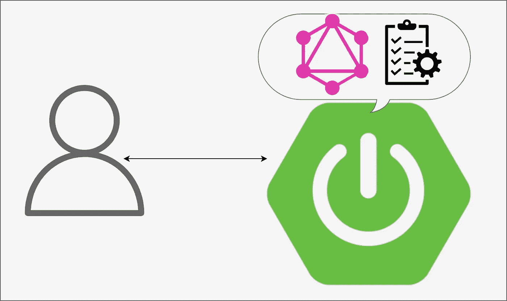

# 使用指令的 Spring for GraphQL 请求验证。

> 原文：<https://medium.com/javarevisited/spring-for-graphql-request-validation-using-directives-719728f16f3d?source=collection_archive---------0----------------------->

## 本教程是关于 GraphQL 的一个强大工具。该工具验证查询输入。它叫做[指令](https://www.graphql-java.com/documentation/sdl-directives/)。我将向您展示如何使用现有的库并实现一个自定义库。

