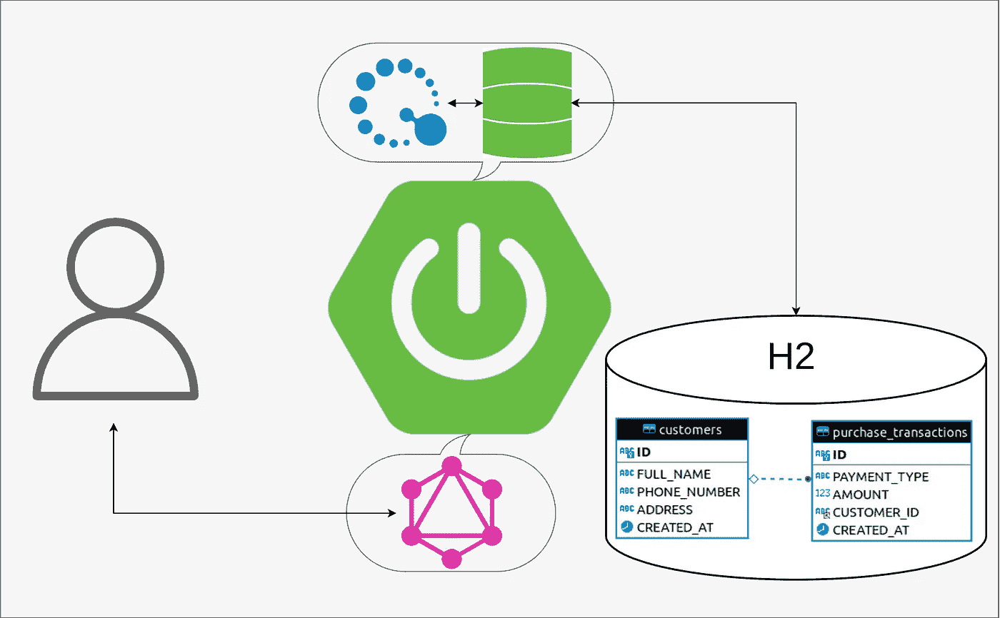

# 带有 Querydsl 的 GraphQL 的 Spring

> 原文：<https://medium.com/javarevisited/spring-for-graphql-with-querydsl-9c4964a225d9?source=collection_archive---------1----------------------->

## Spring team 提供了一个非常强大但易于创建的设置，允许创建一个 API 直接从数据库获取数据。

本教程基于一个负责管理客户及其购买交易信息的应用程序。所有数据都驻留在 SQL 数据库中，该数据库包含…