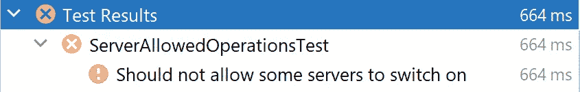
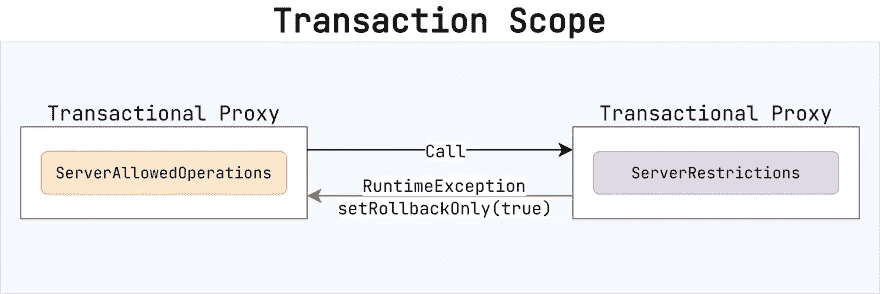
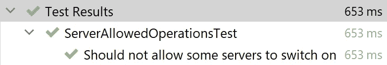
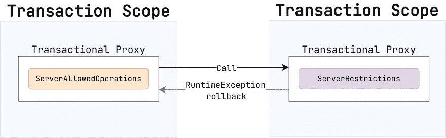
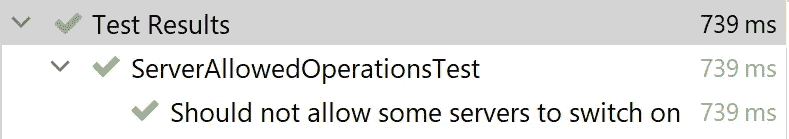
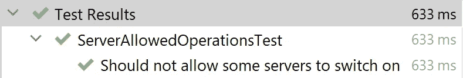
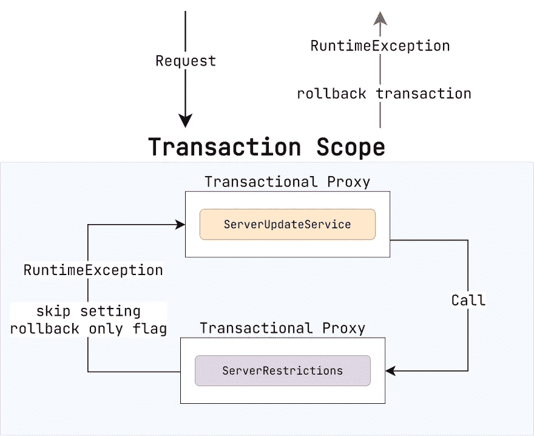

# Spring 数据—从不回滚只读事务

> 原文：<https://medium.com/javarevisited/spring-never-rollback-readonly-transactions-ffc21958b0d0?source=collection_archive---------0----------------------->

当你开发一个后端应用程序时，你必须处理数据。在大多数情况下，关系数据库是一个存储。因此，事务的使用几乎是不可避免的。

所有请求可以分为两类。那些读取数据的(*只读事务*)。以及那些还可以更新数据的(*读写事务*)。Spring Data 提供了一种管理数据库事务的便捷方式。但是它的简单可能隐藏了潜在的问题。例如，不明智地应用`@Transactional(readOnly = true)`注释会降低代码的可重用性，并引入一些意想不到的错误。我这么说是什么意思？让我们深入了解一下。

所有的例子都取自[这个库](https://github.com/SimonHarmonicMinor/spring-boot-readonly-transactions)。您可以克隆它并在本地运行测试。

我们的栈是 Spring Boot+Hibernate+PostgreSQL。

# 领域

假设我们正在开发一个控制远程服务器的系统。这里是`Server`实体。

每台服务器都有名称、运行状态(是否打开)和类型。

# 操作限制

服务器不能随机打开。我们有一个应该遵守的政策。

> *如果服务器已经开机，则不能被触发开机。每种类型的最大开启服务器数量为 3。*

让我们声明一个检查所述需求的服务。

如果`Server`不存在，则`NoSuchElementException`出现。如果不允许合闸操作，则进入`OperationRestrictedException`。

> *`*serverRepository.countAllByTypeAndIdNot*`*方法返回给定类型的服务器数量，不包括具有所提供 ID 的服务器。**

*如果用户试图打开一个服务器(或一组服务器)，那么`checkSwitchOn`可能会被直接调用。任何从事务代理抛出的`RuntimeException`将当前事务设置为[仅回滚](https://docs.spring.io/spring-framework/docs/4.2.x/spring-framework-reference/html/transaction.html)。这在大多数情况下非常有用，它有助于将独立的工作单元组合成一个可靠的业务案例。*

*无论如何，有时这种方法会导致意想不到的问题。你看，`checkSwitchOn`方法没有做任何改变。这就是为什么我们添加了`readOnly = true`属性。但是如果验证没有通过，事务将被回滚。那么，只读事务中的*回滚*和*提交*有什么区别呢？除非您尝试抑制异常，否则没有任何区别。*

# *问题*

*假设用户看到一个可用服务器表。每一行都有一个按钮，用于发送请求来打开特定的服务器。还有一件事。如果服务器无法打开，用户不希望收到错误消息。相反，应该禁用该按钮。因此，我们需要提前检索服务器的状态。*

*下面是可能的解决方案。*

*`getServersSwitchOnStatus`方法接受应该检查的服务器 id 集合。有 3 种可能的状态。*

1.  *`ALLOWED` —服务器可以打开*
2.  *`SERVER_IS_ABSENT` —缺少具有给定 ID 的服务器*
3.  *`RESTRICTED` —服务器无法打开*

*是时候写一些测试了。让我们从一个简单的快乐路径开始。*

> **有 3 台服务器，每台都可以成功开机。**

*[](https://www.java67.com/2018/02/5-free-eclipse-and-junit-online-courses-java-developers.html)*

*那很容易。我们写点更复杂的吧。*

> **有 3 台服务器。第一个是* `*JBOSS*` *并且已经开机。第二个是* `*TOMCAT*` *关闭。第三个是* `*WEB_LOGIC*` *关闭。但是还有另外 3 台* `*WEB_LOGIC*` *类型的服务器处于开启状态。**

*因此，这意味着只能打开`TOMCAT`服务器。另外两个要绑定`RESTRICTED`运行状态。*

*不幸的是，测试没有通过。*

*[](https://javarevisited.blogspot.com/2019/04/top-5-junit-and-unit-testing-courses-java-programmers.html#axzz6ccm5KWKs)*

```
*Transaction silently rolled back 
because it has been marked as rollback-only*
```

> **我在我的文章* [*《春季数据—交易注意事项》*](https://dev.to/kirekov/spring-data-transactional-caveats-19di) *中描述过类似的障碍。你可以在那里找到更多信息。**

*为了揭示问题的原因，我们需要弄清楚 Spring 中的事务是如何管理的。*

*[](https://javarevisited.blogspot.com/2021/08/top-5-spring-data-jpa-courses-for-java.html)*

*默认交易[传播](https://www.baeldung.com/spring-transactional-propagation-isolation)为`REQUIRED`。因此，所有对`ServerRestrictions.checkSwitchOn`的后续调用都在同一个事务中执行。如果任何`RuntimeException`离开了[事务代理](https://spring.io/blog/2012/05/23/transactions-caching-and-aop-understanding-proxy-usage-in-spring)的范围，问题就出现了。当它发生时，Spring 将当前事务标记为*仅回滚*。如果后面的执行尝试提交更改，就会出现我们前面描述的错误。*

> **到* `*ServerAllowedOperations.getServersSwitchOnStatus*` *方法结束时会发生提交尝试。**

*处理这种情况有几种方法。最简单的方法是强制`ServerRestrictions.checkSwitchOn`方法在一个单独的事务中运行。*

*[](https://javarevisited.blogspot.com/2018/06/top-6-spring-framework-online-courses-Java-programmers.html)*

*为什么能解决问题？让我们再来看看这个模式。*

*[](https://javarevisited.blogspot.com/2020/05/top-20-spring-boot-interview-questions-answers.html)*

*当一个`RuntimeException`抛出`ServiceRestrictions.checkSwitchOn`方法时，只影响单独的事务。开始于`ServerAllowedOperations.getServersSwitchOnStatus`调用的那个一直在继续。*

*然而，有一个警告应该提到。每检查一个服务器，就有一个新的事务开始。在我们的例子中，有 3 台服务器。因此，我们有 4 个交易，而不是一个。这可能会降低性能。随着服务器数量的增加，情况会变得更糟。*

*谢天谢地，有一个更好的方法。正如我在文章开头所说的，回滚只读事务是没有意义的。所以，我们来放一些额外的配置。*

*属性`noRollbackFor`告诉 Spring 不要在异常引发时设置*仅回滚*标志。*

**

*现在我们已经达到了既定的目标。*

1.  *该请求正在单个事务中处理。*
2.  *只读块中的异常不会导致回滚。*

*无论如何，我们必须记住在每次声明只读服务方法时添加`noRollBackFor`属性。有没有更好的解决办法？有一个。拥抱[春元注解](https://www.logicbig.com/tutorials/spring-framework/spring-web-mvc/meta-annotation.html)！*

*`ReadTransactional`注释充当`@Transactional(readOnly = true, noRollbackFor = Exception.class)`用法的别名。然而，原始注释具有许多其他属性(`isolation`、`propagation`等)。).如果想要覆盖它们呢？Spring 也有一个解决方案。*

*`AliasFor`注释用法引用了不同注释的属性。*

> **这种图案在春季广泛使用。查看* `*GetMapping*` *或* `*PostMapping*` *申报单。它们不过是通用的* `*RequestMapping*` *注释的别名。**

*这是最终版本。*

**

# *与读写操作相结合*

*这个`ReadTransactional`注释用法如何处理读写查询？如果任何异常被抑制，它会影响更新请求中的提交阶段吗？*

*好吧，如果你应用正确，它不能。执行任何更新的方法都应该用常规的`Transactional`注释来标记。而那些只是用`ReadTransactional`读取数据的。*

*我们举一个微不足道的例子来证明这个想法。如果用户想要打开服务器，验证应该继续进行。如果失败，事务将回滚。*

> **我把* `*checkSwitchOn*` *刷新后手动修改到数据库中。如果一切正常，回滚应该会完全取消请求。**

*是时候创建测试了。让我们来看看这个场景。*

> **关闭* `*JBOSS*` *类型的服务器。但是已经有 3 个* `*JBOSS*` *服务器开启。所以，手术必须失败。**

*[](https://medium.com/javarevisited/5-courses-to-learn-junit-and-mockito-in-2019-best-of-lot-f217d8b93688)*

*服务器保持关闭状态，因为验证没有通过。因此，业务案例的行为正确。*

*具体是怎么运作的？看看下面的模式。*

*[](https://www.java67.com/2017/11/top-5-free-core-spring-mvc-courses-learn-online.html)*

*当`ServerRestrictions.checkSwitchOn`抛出异常时，Spring 跳过设置仅回滚标志。但是当异常离开`ServerUpdateService.switchOnServer`的范围时，Spring 执行回滚而不是提交。因为这个方法没有设置`noRollBackFor`属性。*

# *结论*

*在我看来，这是 Spring 生态系统中处理事务的最佳方式。它帮助我们区分只读和读写请求，最终可以在一个复杂的业务单元中进行组合。如果您有任何问题或建议，请在下面留下您的评论。感谢阅读！*

# *资源*

1.  *[带有示例的存储库](https://github.com/SimonHarmonicMinor/spring-boot-readonly-transactions)*
2.  *[雅加达 EE](https://jakarta.ee/)*
3.  *[春季数据—交易警告](https://dev.to/kirekov/spring-data-transactional-caveats-19di)*
4.  *[仅回滚标志说明](https://docs.spring.io/spring-framework/docs/4.2.x/spring-framework-reference/html/transaction.html)*
5.  *[春季交易传播](https://www.baeldung.com/spring-transactional-propagation-isolation)*
6.  *[了解 Spring 中的代理用法](https://spring.io/blog/2012/05/23/transactions-caching-and-aop-understanding-proxy-usage-in-spring)*
7.  *[弹簧元注释](https://www.logicbig.com/tutorials/spring-framework/spring-web-mvc/meta-annotation.html)*