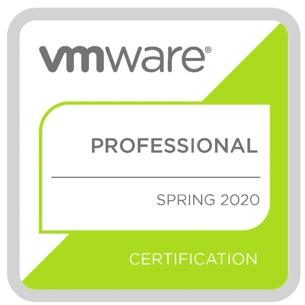
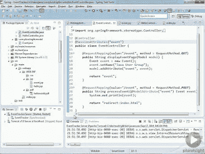
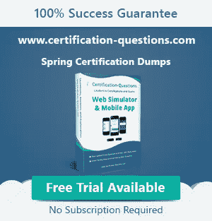

# 春季专业认证(VMware EDU-1202)常见问题和答案

> 原文：<https://medium.com/javarevisited/spring-professional-certification-vmware-edu-1202-questions-answers-ce3fe06eff62?source=collection_archive---------0----------------------->

## 下面是 Java 开发人员在申请 Spring professional 认证之前应该知道的所有事情。

大家好，如果你正在准备春季专业认证，但有问题，那么你来对地方了。前面我已经分享了[如何准备 Spring 认证](/javarevisited/spring-professional-certification-vmware-edu-1202-the-ultimate-guide-to-pass-spring-11dab8d311c3)和必备的 [Spring 认证资源](/javarevisited/top-5-spring-professional-certification-exam-resources-for-java-developers-3ef9fa42fe13?source=---------38------------------)，今天我就来解答大家对 Spring 专业认证的所有常见疑惑。

# 春季专业认证常见问题

以下是一些关于 Spring 认证的常见问题，如 Vmware Certified Spring Professional Certification Exam

这些问题涉及许多领域，例如资格、成本、如何充分准备、资源、书籍、模拟考试、问题类型、问题难度，以及在哪里可以找到 Spring certification dumps 以了解实际考试中的问题。大多数问题都是我的读者通过电子邮件、脸书聊天和其他媒介经常问我的问题，应该可以回答你的许多问题和疑虑，但是，如果你有一个问题没有在这个列表中回答，请随意发表评论，我会尽力回答你的问题。

## 什么是 Spring 专业认证？它测试什么？

Spring 专业认证考试旨在测试和验证您对 Spring 和 Spring Boot 核心方面的理解和熟悉程度，例如:

*   配置，组件扫描，AOP
*   数据访问和交易
*   休息，春季安全
*   自动配置、执行器、Spring Boot 测试

## **Spring 认证的费用是多少？**

这是关于 Spring 认证最常被问到的问题之一。春季认证代金券的费用是 200 美元。所有考试的费用都是一样的，例如春季专业认证。查看[此处](http://javarevisited.blogspot.sg/2017/06/what-is-cost-of-spring-framework-certification-training-India-USA.html)了解全球各种 spring 认证费用的更多信息。

## 如何准备春季认证(VMware EDU-1202)？

准备春季认证的最佳方式是参加 VMware 的核心春季培训，因为大多数问题来自 4 天课程提供的学习材料，但这不是唯一的方式。

不需要训练依然可以以不错的成绩通过 Spring 认证。你所需要的只是几本好书、教程、模拟考试和两个月的时间。

如果你在准备 Spring 专业考试，可以买一个好的学习指南像 Vmware 认证专业 Spring 开发者考试:A 学习指南，上一些免费的 Spring 和 Spring MVC 框架的在线课程像 [**Spring 基础**](https://pluralsight.pxf.io/c/1193463/424552/7490?u=https%3A%2F%2Fwww.pluralsight.com%2Fcourses%2Fspring-fundamentals) 和 [**Spring 专业教程**](https://click.linksynergy.com/deeplink?id=JVFxdTr9V80&mid=39197&murl=https%3A%2F%2Fwww.udemy.com%2Fcourse%2Fspring-certified-tutorial%2F) 课程来自 Pluralsight 和 Udemy。

一旦你对弹簧感到舒适，并能回答官方学习指南中给出的所有问题，你就可以参加像大卫·迈耶[核心弹簧模拟器](https://www.certification-questions.com/practice-exam/spring/professional?affiliateCode=fcff36fd-557a-4713-abf6-973e9924770f&utm_source=Javin&utm_medium=affiliate&utm_campaign=affiliate)这样的好的弹簧认证模拟器。如果你在这次考试中一直获得 80 分，你就可以继续了。

## **Spring 框架培训的费用是多少？**

在美国、欧洲和其他北美国家，像 Spring Core 或 Spring Boot 这样的春季培训的成本约为 3200 美元或等值的当地货币，但在印度，SpringPeople 提供的 4 天课堂培训的成本约为 50K INR。

## **可以在线参加 Spring 框架培训吗？**

是的，Vmware 及其合作伙伴(如 SpringPeople)提供课堂和在线培训。

## **不培训可以考 Spring 认证吗？**

早些时候，Vmware 及其合作伙伴(如印度的 SpringPeople)提供的 Spring 培训是 Spring 认证中必不可少的，但从 2017 年 5 月 10 日起，Pivotal 取消了这一要求(请参见此处的)。现在，培训是可选的，如果你负担得起，那么你只需要注册。与 Java 认证类似，您可以直接购买考试券并出现在 Spring certification 中，而无需 Vmware 或其合作伙伴的任何培训。

**更新:** Vmware 再次强制要求参加培训，因此不参加强制培训就不能参加春季认证考试。你猜怎么着，他们想赚更多的钱。虽然这是一个糟糕的决定，但是如果你的公司能够支付成本，你仍然可以继续或者如果你能够负担得起。

## **你应该给哪个版本的 Spring 认证？**

在 Vmware 的网站上，Spring professional 认证可用于 Spring 5.0，但我建议您提供最新的认证。既然 Spring 5.0 现在也上线了，我预计 Spring 5.0 认证也将很快加入，但是，如果你很着急，最好给 Spring 5.0 考试(VMware EDU-1202)。

## **失败后还能重考吗？**

是的，您可以在 14 天的冷却期后重新参加春季认证考试，但您需要单独购买价值 200 美元的考试代金券。重考不打折。所以，最好尝试一下，第一次就通过考试。

## [**Spring 框架认证有哪些好书？**](https://javarevisited.blogspot.com/2017/06/2-books-to-prepare-for-spring-certification-exam.html)

这里有一些准备春季专业认证的最佳书籍

*   [弹簧动作](https://www.amazon.com/Spring-Action-Craig-Walls/dp/1617294942?tag=javamysqlanta-20)
*   [注册专业 Spring 开发者考试:学习指南](https://www.amazon.com/Pivotal-Certified-Professional-Spring-Developer/dp/1484208129?tag=javamysqlanta-20)
*   [Spring Boot 在行动](https://www.amazon.com/Spring-Boot-Action-Craig-Walls/dp/1617292540?tag=javamysqlanta-20)

这些书足以通过相应的 Spring 认证，但如果你想准备得更详细，我也建议你查看一些免费的在线课程，例如来自 Pluralsight 的[**Spring Framework master class**](https://click.linksynergy.com/fs-bin/click?id=JVFxdTr9V80&subid=0&offerid=323058.1&type=10&tmpid=14538&RD_PARM1=https%3A%2F%2Fwww.udemy.com%2Fspring-tutorial-for-beginners%2F)和[**Spring MVC 简介**](https://pluralsight.pxf.io/c/1193463/424552/7490?u=https%3A%2F%2Fwww.pluralsight.com%2Fcourses%2Fspringmvc-intro) 。

 [## 学习 Spring 框架大师课教程

### Ranga 是 AWS 认证解决方案架构师助理、AWS 认证开发人员助理和 AWS 认证云…

udemy.com](https://click.linksynergy.com/fs-bin/click?id=JVFxdTr9V80&subid=0&offerid=323058.1&type=10&tmpid=14538&RD_PARM1=https%3A%2F%2Fwww.udemy.com%2Fspring-tutorial-for-beginners%2F) 

## Spring 核心认证包括 REST 和 Web 服务吗？

根据官方的 Spring 学习指南，v5.0 绝对是 Spring 核心认证的一部分。除此之外，你甚至可以期待来自微服务的一些问题，但其余的权重并不多，因此 2 到 3 个问题是你所能期待的最大值。

## 为什么要成为 Spring 认证专家？

嗯，认证给你认可，让你在竞争中脱颖而出。这也会帮助你更好地学习 Spring 框架，最终[会在你的工作和职业生涯中帮助你](http://javarevisited.blogspot.sg/2017/07/does-spring-certification-help-in-job-and-career.html)。一旦你完成认证，你会在工作面试中更有信心。

简而言之，以下是成为 Vmware 认证 Spring framework 开发人员的主要优势

*   -行业认可
*   -更好的工作机会
*   -更高的薪水
*   -提高知识和技能

一些公司还鼓励他们的员工获得认证，这样他们就可以向客户展示好的照片。许多财富 500 强公司喜欢看到认证开发人员处理他们的系统和过程。

## **有哪些免费的 Spring Core 专业认证模拟题和 PDF？**

网上有一些免费的 Spring 模拟试题和 PDF，下面是一些最有用的:

*   大卫·梅耶斯免费春季认证转储( [30 个问题](https://www.certification-questions.com/practice-exam/spring/professional?affiliateCode=fcff36fd-557a-4713-abf6-973e9924770f&utm_source=Javin&utm_medium=affiliate&utm_campaign=affiliate))
*   Java & Moie 的 Spring Core v5.0 模拟题( [50 题](http://javaetmoi.com/wp-content/uploads/2016/01/spring-certification-4_2-mock-exam-antoine.pdf))

这些示例问题将让您对真正的 Spring 认证考试有所了解，但是，一般规则是 Spring 认证侧重于概念，而不是如何操作和记住类和接口名称。

## **春季认证有哪些好的模拟考试？**

目前，Spring 认证没有多少好的模拟考试，但最突出的是 David Mayer 的 Spring Web 模拟器。它已经针对 Spring v5.0 进行了更新，包含 300 多个不同考试主题的问题，例如容器、测试、Spring MVC、Spring 安全等。

您也可以从任何地方在线访问模拟器。它还提供了一个带有示例问题的免费 PDF，您可以在购买完整的模拟器之前使用它来评估问题的质量。我还在 Udemy 上创建了 [**春季模拟考试，其中包含 250 多个带解释的问题，您也可以检查这些问题，为您的最终准备做准备。**](https://www.udemy.com/course/spring-professional-practice-test-questions-vmware-edu-certification/?referralCode=7419B0A2C8AB79F0520E)

 [## 实践考试|春季专业认证 2020

### 我们是一个拥有扎实技术技能的团队，对在线教学充满热情。我一直在把我对 Java 的想法写在…

www.udemy.com](https://www.udemy.com/course/spring-professional-practice-test-questions-vmware-edu-certification/?referralCode=7419B0A2C8AB79F0520E) 

以上是关于 Spring 框架认证的一些**常见问题(VMware EDU-1202。**现在没有强制性的培训要求，这是 Java 和 Spring 开发人员在 Spring 框架中获得经验认可的一个非常好的机会。

除了认可之外，你还将学到很多关于 Spring 框架的一些高级特性，比如 Spring with REST 和 Spring Security，它们也将在求职面试中帮助你，并最终帮助你获得一份薪水更高的更好的工作。

面向 Java 开发人员的其他 **Spring 认证资源**

*   [Spring 框架大师班——初学者到专家](https://click.linksynergy.com/deeplink?id=JVFxdTr9V80&mid=39197&murl=https%3A%2F%2Fwww.udemy.com%2Fcourse%2Fspring-tutorial-for-beginners%2F)
*   [第一次尝试如何破解 Spring 认证](https://javarevisited.blogspot.com/2018/08/how-to-crack-spring-core-professional-certification-exam-java-latest.html#axzz5j90KOik7)
*   [Java & Moie 的 Core Spring 4.2 认证考试 PDF](http://javaetmoi.com/wp-content/uploads/2016/01/spring-certification-4_2-mock-exam-antoine.pdf)
*   [Java SE 11 认证书籍和课程](https://javarevisited.blogspot.com/2019/10/top-5-books-courses-to-crack-oracles-java-se-11-certification-OCAJP11.html)
*   [Spring 认证的好处和优势](https://javarevisited.blogspot.com/2017/07/does-spring-certification-help-in-job-and-career.html)
*   [深入了解 Spring Boot 的五大课程](https://hackernoon.com/top-5-online-courses-to-learn-spring-boot-in-2019-c2fd7a0282c2)
*   [春季认证书和 PDF](http://javarevisited.blogspot.sg/2017/06/2-books-to-prepare-for-spring-certification-exam.html)
*   [从零开始学习春云的 5 大课程](https://javarevisited.blogspot.com/2018/04/top-5-spring-cloud-courses-for-java.html#axzz5eGLL7VBt)
*   [用 Spring 学习 RESTful Web 服务的 5 大课程](https://javarevisited.blogspot.com/2018/02/top-5-restful-web-services-with-spring-courses-for-experienced-java-programmers.html)
*   [学习 Spring 微服务的 5 大课程](https://javarevisited.blogspot.com/2018/02/top-5-spring-microservices-courses-with-spring-boot-and-spring-cloud.html)
*   【Udemy 的 250+春季认证问题

感谢您阅读本文，如果您觉得这些 spring 认证问题有用，请与您的朋友和同事分享。如果您有任何有助于准备 Spring 认证的其他资源，请随时与我们分享。

**P.S.** —如果你是一名经验丰富的 Java 开发人员，并且使用 Spring 框架 3 到 5 年，并且希望获得技能认证，我建议你去看看 David Mayer 的[**在线 Spring 模拟测试**](https://www.certification-questions.com/practice-exam/spring/professional?affiliateCode=fcff36fd-557a-4713-abf6-973e9924770f&utm_source=Javin&utm_medium=affiliate&utm_campaign=affiliate)**；**如果你能考到 80%以上，那么你就准备好真正的考试了。

 [## 春季专业实践考试

### 每个问题都有详细的解释。我们的网络模拟器和移动应用程序不仅仅是为了练习，而是…

www.certification-questions.com](https://www.certification-questions.com/practice-exam/spring/professional?affiliateCode=fcff36fd-557a-4713-abf6-973e9924770f&utm_source=Javin&utm_medium=affiliate&utm_campaign=affiliate)