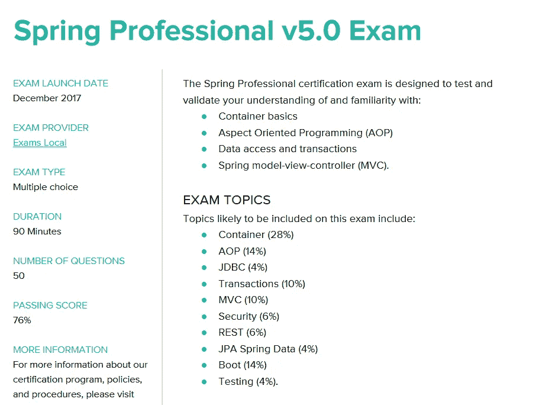
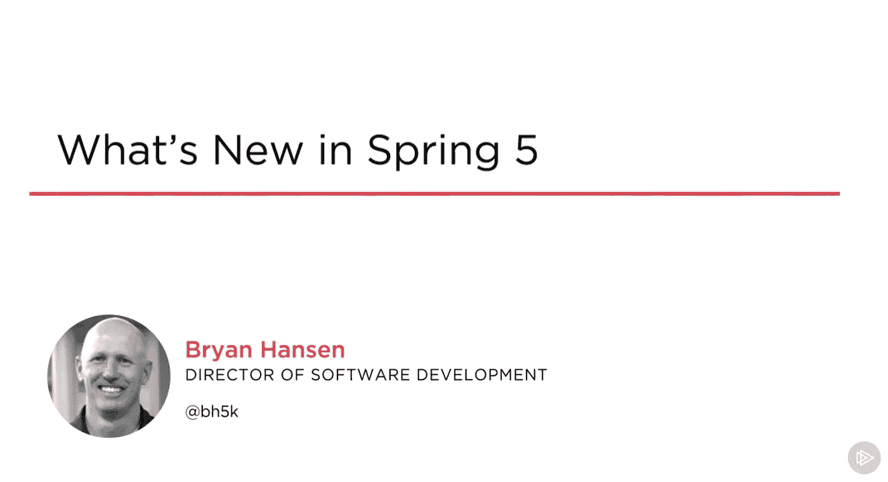
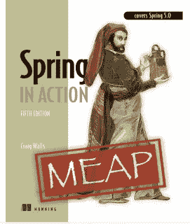
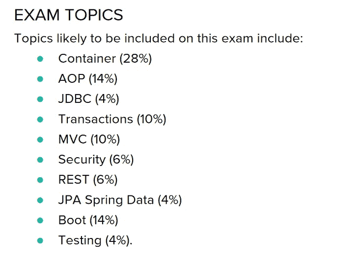

# 通过 2023 年春季专业认证 v5.0 (VMware EDU-1202)考试的终极指南

> 原文：<https://medium.com/javarevisited/spring-professional-certification-vmware-edu-1202-the-ultimate-guide-to-pass-spring-11dab8d311c3?source=collection_archive---------0----------------------->

大家好，如果你的目标是 2023 年的春季认证，并考虑如何准备春季专业认证，那么你来对地方了。前面我已经分享了 [**最佳春季认证资源**](/javarevisited/top-5-spring-professional-certification-exam-resources-for-java-developers-3ef9fa42fe13) ，今天我就为大家展示如何准备 2023 年春季认证的分步指南。

自从 Pivotal(现在是 VMware)，Spring 框架背后的公司将**强制 Spring 培训变成可选的**(见[此处](http://javarevisited.blogspot.sg/2017/05/can-you-take-spring-certification-without-training-course.html#axzz4h1Yk2bWX))以来，我收到了许多有经验的 Java 开发人员的询问，他们对 Spring 认证感兴趣。

Pivotal 的这一举措突然让许多有经验的 [Java](/javarevisited/top-10-online-courses-to-become-a-fullstack-web-developer-in-2020-d608a6b63232) 和 [Spring 开发人员](/javarevisited/top-10-free-courses-to-learn-spring-framework-for-java-developers-639db9348d25)负担得起 Spring 认证，他们早先对 Spring 认证感兴趣，但由于昂贵的强制培训而无法进一步发展。

由于他们中的许多人现在正在通过自学准备 Spring 认证，如 [Spring Core 5](https://javarevisited.blogspot.com/2018/08/how-to-crack-spring-core-professional-certification-exam-java-latest.html#axzz5j90KOik7) 或 [Spring Professional 5](https://www.java67.com/2019/06/core-spring-professional-50-topics-guide-java-developers.html) ，他们越来越多地寻找好的资源来准备考试。收到了很多关于备考、[书籍](http://javarevisited.blogspot.sg/2017/06/2-books-to-prepare-for-spring-certification-exam.html#axzz4jK9IIH4S)、[模拟考试](/javarevisited/top-5-spring-professional-certification-exam-resources-for-java-developers-3ef9fa42fe13?source=---------38------------------)、考试结构、及格分数、有用资源的问题。

在这篇文章中，我已经尝试性地概述了我在这篇文章中清除 Spring Professional 5 认证的一些屡试不爽的策略。老实说，准备像 Spring Core 这样的 Spring 认证和参加像 [OCAJP](http://www.java67.com/2017/05/how-to-prepare-for-java-certifications.html) 和 [OCPJP](http://www.java67.com/2017/05/10-free-java-8-certification-sample-questions-OCAJP8-OCPJP8-Mock-Exams.html) 这样的 Java 认证没有太大区别。

与 Oracle 认证类似，Spring 认证也是选择题，您需要**答对 76%的问题**才能通过考试，即 50 道题中的 38 道。

是的，**通过率比甲骨文 Java 认证**高，但形式相似，因此您可以使用相同的策略准备春季认证，如[阅读一本好书](https://www.java67.com/2017/07/3-spring-certification-books-best-of.html)，[练习大量模拟考试](https://dzone.com/articles/top-5-free-spring-core-professional-certification)，参加培训，准备自己的笔记，参加网络和论坛以保持知识最新并经常复习。

最新的 Spring 框架认证在**Spring Core Professional v 5.0**。它基于最新的 Spring framework 版本 5。如果你正在考虑 Spring 认证，我建议你选择这个，因为它将为你提供相对于其他开发人员的竞争优势，并且帮助你学习和掌握 Spring 5 概念，比如反应式编程。

# 如何准备 2023 年春季专业 5 认证(VMware EDU-1202)

虽然，我分享的所有关于[破解 Java 认证](http://javarevisited.blogspot.sg/2016/12/5-tips-to-prepare-for-oracle-java-certifications-OCAJP-OCPJP-exams.html)的技巧对于通过 Spring 认证同样有用，但这里是我准备 Spring 认证的 6 个基本技巧，如 Spring 专业认证考试 v 5.0 (VMware EDU-1202)

唯一不同于所有三个考试的是考试大纲。

如果你在 Spring 框架方面有不错的工作经验，比如 2 到 3 年从事于 [Spring MVC](http://www.java67.com/2012/08/spring-interview-questions-answers.html) 或者使用 Spring 和 Spring Security 开发 [RESTful Web 应用](http://javarevisited.blogspot.sg/2017/02/how-to-consume-json-from-restful-web-services-Spring-RESTTemplate-Example.html)，那么准备考试不会花太多时间。你只需要把所有的考试题目复习一遍，一本好的学习指南会帮助你。由于您已经熟悉了基本的注释、概念和工作流，大多数时候您只是填补了知识的空白，而不是学习新的东西。

## 1.参加一门好课程

如果你负担得起，那么没有比参加课堂培训更好的准备春季认证的方法了。尽管 Vmware 现在将强制培训设为可选，但它仍然是推荐的，并且是准备 Spring 认证(如 Spring Professional Certification 等)的最佳资源。

说到准备 Spring Core Professional v5.0 认证，由于人们仍在使用较旧的 Spring 版本，因此没有太多的在线课程和课堂培训。

既然这个认证需要了解 Spring 5 的概念，不如像 [**Spring Framework 5:初学者到宗师**](https://click.linksynergy.com/fs-bin/click?id=JVFxdTr9V80&subid=0&offerid=323058.1&type=10&tmpid=14538&RD_PARM1=https%3A%2F%2Fwww.udemy.com%2Fspring-framework-5-beginner-to-guru%2F) 一样，从专注于 Spring 5 的 Spring 课程开始。这不仅有助于学习 Spring，还能为您的认证打下坚实的基础。

Vmware 还为 Spring Core、Spring Web 和 Spring Enterprise 等每个认证提供专门的 4 天培训课程。它和它的培训伙伴一起在世界各地提供课堂和在线培训，比如 SpringPeople 在印度提供培训。

春季认证培训的费用在印度约为 50，000 印度卢比，在美国和欧洲等世界其他地区约为 3200 美元或等值货币。

如果您在 IT 部门工作，并且您的公司提供补贴或报销 Spring 认证培训和代金券的费用，那么您应该参加 Spring 框架培训。

培训不仅可以帮助您准备 Spring 认证，还可以提高您对 Spring 特性及其更高级模块(如 Spring Security 和 Spring REST)的知识和理解。

另一个我极力推荐的 Udemy 课程是 Udemy 上张秀坤·策布拉的 [**春季职业认证考试教程**](https://click.linksynergy.com/deeplink?id=JVFxdTr9V80&mid=39197&murl=https%3A%2F%2Fwww.udemy.com%2Fcourse%2Fspring-certified-tutorial%2F) **。本课程**是专门为 Spring 认证而设计的，目前。这是一个多部分的课程，每个部分涵盖一个模块，有 8 个模块准备春季认证。

<https://click.linksynergy.com/deeplink?id=JVFxdTr9V80&mid=39197&murl=https%3A%2F%2Fwww.udemy.com%2Fcourse%2Fspring-certified-tutorial%2F>  

虽然这两个课程都很棒，但如果你已经知道春天和时间不多了，你可能会觉得有点不知所措。同样，如果你只是对 Spring 5 的新特性感兴趣，那么 Pluralsight 上的[**Spring 5 的新特性**](https://pluralsight.pxf.io/c/1193463/424552/7490?u=https%3A%2F%2Fwww.pluralsight.com%2Fcourses%2Fwhats-new-spring-5) 课程也是一个选择。

顺便说一下，你需要一个 [Pluralsight 会员](https://pluralsight.pxf.io/c/1193463/424552/7490?u=https%3A%2F%2Fwww.pluralsight.com%2Flearn)才能加入这个课程，费用大约是每月 29 美元或每年 299 美元(14%的折扣)。我向所有程序员强烈推荐这个订阅，因为它提供了超过 7000 个在线课程的即时访问，以学习任何技术技能。或者，你也可以使用他们的 [**10 天免费通行证**](https://pluralsight.pxf.io/c/1193463/424552/7490?u=https%3A%2F%2Fwww.pluralsight.com%2Flearn) 免费观看本课程。

<https://pluralsight.pxf.io/c/1193463/424552/7490?u=https%3A%2F%2Fwww.pluralsight.com%2Flearn>  

## 2.选择学习指南和书籍

准备春季认证的第二个重要步骤是买一本好书或认证学习指南。不幸的是，没有太多的 Spring 5 书籍和学习指南可用于 Spring 认证。

如果你正在准备春季职业认证考试，那么你应该读读[春天在行动](https://www.amazon.com/Spring-Action-Covers-4/dp/161729120X?tag=javamysqlanta-20)这本书。这本书的第五版仍在开发中，可能会在一个月左右发布，将涵盖 Spring 5，这是 Spring professional 5.0 考试的要求。

虽然现在还没有，但你仍然可以从这本书的第 4 版开始，涵盖 Spring 4.0，这是 Spring 专业考试 4.2 版和 4.3 版认证的要求，然后用 Pluralsight 上的[**Spring 5 中的新功能**](https://pluralsight.pxf.io/c/1193463/424552/7490?u=https%3A%2F%2Fwww.pluralsight.com%2Fcourses%2Fwhats-new-spring-5) 课程补充你的学习，以学习书中介绍的新概念。

以下是一些准备春季认证的好书和学习指南:

*   [弹簧启动](http://www.java67.com/2016/12/5-spring-framework-books-for-java-programmers.html)
*   [每位有经验的开发人员必读的 5 本春季书籍](https://javarevisited.blogspot.com/2018/04/5-spring-framework-books-experienced-Java-developers-2018.html)
*   [5 本书学 Spring Boot 和云](https://javarevisited.blogspot.com/2018/07/top-5-books-to-learn-spring-boot-and-spring-cloud-java.html)
*   [2019 年 Java 开发者应该读的 10 本书](http://www.java67.com/2018/02/10-books-java-developers-should-read-in.html)

最后一本书对于 Spring Integration Specialist 考试尤为重要，因为 Spring Cloud 培训是基于这本书的，如果您不能参加培训，那么这本书将为您提供通过考试所需的大部分详细信息。

## 3.选择一个 Spring 5 模拟器(模拟测试)

在真实的考试场景中练习对于提高通过春季认证考试的速度和准确性要求非常重要。由于你需要在 90 分钟内解决 50 个问题，并且你必须获得几乎 80%的正确答案，**速度和准确性都非常重要。**

一个好的考试模拟器不仅能帮助你提高速度和准确性，还能填补你知识上的空白，帮助你找到自己的强项和弱项。

通过练习和仔细分析结果，你可以在考试前改善自己的薄弱环节。由于考试券花了你 200 美元，我建议你至少多花 50 美元买一本好书和考试模拟器，以避免重考。

不幸的是，目前没有多少 Spring 5 考试模拟器可用，但 David Mayer 的[**Spring Core Professional v 5.0 模拟器**](https://www.certification-questions.com/practice-exam/vmware/edu-1202?affiliateCode=fcff36fd-557a-4713-abf6-973e9924770f&utm_source=Javin&utm_medium=affiliate&utm_campaign=affiliate) 既好又不太贵，你可以购买它来帮助你的准备。

<https://www.certification-questions.com/practice-exam/vmware/edu-1202?affiliateCode=fcff36fd-557a-4713-abf6-973e9924770f&utm_source=Javin&utm_medium=affiliate&utm_campaign=affiliate>  

它还包含 spring 认证转储，如 spring professional v5.0 转储和以前版本的转储。

如果你需要更多的问题，你也可以查看我在 Udemy 上的[**春季实践考试，我在那里分享了 250 多个问题，涵盖了每个考试主题。**](https://www.udemy.com/course/spring-professional-practice-test-questions-vmware-edu-certification/?referralCode=7419B0A2C8AB79F0520E)

<https://www.udemy.com/course/spring-professional-practice-test-questions-vmware-edu-certification/?referralCode=7419B0A2C8AB79F0520E>  

## 4.考试主题

准备春季认证的第一步也是最重要的一步是了解考试主题或考试大纲。幸运的是，VMware 提供了免费的开发人员指南，其中不仅列出了考试主题，还列出了一些重要的问题，您可以使用它们来检查您对考试主题的了解。

单独考试有单独的考试指南就像你准备 Spring Professional V 5.0 考试或者 Spring Professional V4.3 考试就不能使用 Spring 4.0/4.1 的学习指南一样。

如果你正在准备 Spring Core v5.0 考试，下面是考试题目和题型分布，供你参考:

如果您将此与 4.2 或 4.3 版春季核心考试的主题进行比较:

*   弹簧容器
*   用弹簧测试
*   面向切面编程
*   使用 Spring 进行数据访问
*   处理
*   Spring MVC
*   春天安全
*   微服务
*   休息
*   春天的云

Spring Boot 的[题](https://javarevisited.blogspot.com/2018/05/top-5-courses-to-learn-spring-boot-in.html)绝对是一个要想在考试中取得好成绩的必须准备的题目，连同春季安全。[春云和微服务](/javarevisited/5-best-courses-to-learn-spring-cloud-and-microservices-1ddea1af7012)不在考试之列。

记住，**你将有 90 分钟的时间回答 50 道选择题。您必须正确回答 38 个问题(78%)，才能通过春季认证考试。**您也可以从 Vmware 网站下载 Spring Professional v 5.0 的[学习指南](https://pivotalcontent.s3.amazonaws.com/academy/Spring-Professional-Certification-Study-Guide.pdf)。

## 5.自己做笔记

即使你参加了培训，我也很喜欢自己做笔记。它在很多方面都有帮助，因为它积极地让你的思维参与进来，并鼓励你去阅读和探索更多关于这个话题的东西。这种积极的参与提高了你对考试主题的知识和理解。这也有助于你组织知识，以便在临近考试日期时复习。不管你是如何准备的，比如培训、自学、依靠工作经验，我鼓励你根据教学大纲自己做笔记。

## 6.参加论坛

没有比参加 StackOverflow 和 Spring 论坛这样的论坛更好的方法来保留你学到的知识了。“使用它或失去它”是普遍真理，在这里也同样适用。

如果你只是在阅读，而没有在工作中使用或应用这些知识，那么你很快就会忘记。

由于工作也提供了有限的接触考试题目的机会，所以最好在博客、论坛、StackOverflow 等互联网上回答问题。它还帮助您与准备 Spring 认证的 Java 开发人员进行交流。

以上就是**如何准备春季认证**的全部内容。由于 Spring 和 Hibernate 是非常受欢迎的 Java 框架，并且有许多工作可以提供给具有良好的 [Spring](/javarevisited/10-best-online-courses-to-learn-spring-framework-in-2020-f7f73599c2fd) 和 [Hibernate](/javarevisited/top-5-hibernate-online-training-courses-for-beginners-and-advance-java-programmers-469460596b2b) 知识的 Java 开发人员，这也是众核 Java 开发人员成为 Spring 认证专家的好机会。

其他**面向 Java 开发者的 Spring 认证资源**

*   [Spring 框架大师班——初学者到专家](https://click.linksynergy.com/deeplink?id=JVFxdTr9V80&mid=39197&murl=https%3A%2F%2Fwww.udemy.com%2Fcourse%2Fspring-tutorial-for-beginners%2F)
*   [初次尝试如何破解 Spring 认证](https://javarevisited.blogspot.com/2018/08/how-to-crack-spring-core-professional-certification-exam-java-latest.html#axzz5j90KOik7)
*   [Java & Moie 的 Core Spring 4.2 认证考试 PDF](http://javaetmoi.com/wp-content/uploads/2016/01/spring-certification-4_2-mock-exam-antoine.pdf)
*   [Java SE 11 认证书籍和课程](https://javarevisited.blogspot.com/2019/10/top-5-books-courses-to-crack-oracles-java-se-11-certification-OCAJP11.html)
*   [Spring 认证的好处和优势](https://javarevisited.blogspot.com/2017/07/does-spring-certification-help-in-job-and-career.html)
*   [深入了解 Spring Boot 的五大课程](https://hackernoon.com/top-5-online-courses-to-learn-spring-boot-in-2019-c2fd7a0282c2)
*   [春季认证书和 PDF](http://javarevisited.blogspot.sg/2017/06/2-books-to-prepare-for-spring-certification-exam.html)
*   [从零开始学习春云的 5 大课程](https://javarevisited.blogspot.com/2018/04/top-5-spring-cloud-courses-for-java.html#axzz5eGLL7VBt)
*   [使用 Spring 学习 RESTful Web 服务的五大课程](https://javarevisited.blogspot.com/2018/02/top-5-restful-web-services-with-spring-courses-for-experienced-java-programmers.html)
*   [用 Spring 学习微服务的 5 大课程](https://javarevisited.blogspot.com/2018/02/top-5-spring-microservices-courses-with-spring-boot-and-spring-cloud.html)
*   【Udemy 的 250+春季认证问题

感谢您阅读本文，如果您觉得这些*最佳春季认证指南和资源*有用，请与您的朋友和同事分享。如果您有任何其他有助于准备春季认证的资源，请随时与我们分享。

**P.S.** —如果你是一名经验丰富的 Java 开发人员，并且使用 Spring 框架 3 到 5 年，并且希望获得技能认证，我建议你去看看大卫·迈耶的[**在线 Spring 模拟测试**](https://www.certification-questions.com/practice-exam/spring/professional?affiliateCode=fcff36fd-557a-4713-abf6-973e9924770f&utm_source=Javin&utm_medium=affiliate&utm_campaign=affiliate)**；**。如果你能考到 80%以上，那么你就准备好真正的考试了。

<https://www.certification-questions.com/practice-exam/spring/professional?affiliateCode=fcff36fd-557a-4713-abf6-973e9924770f&utm_source=Javin&utm_medium=affiliate&utm_campaign=affiliate> 