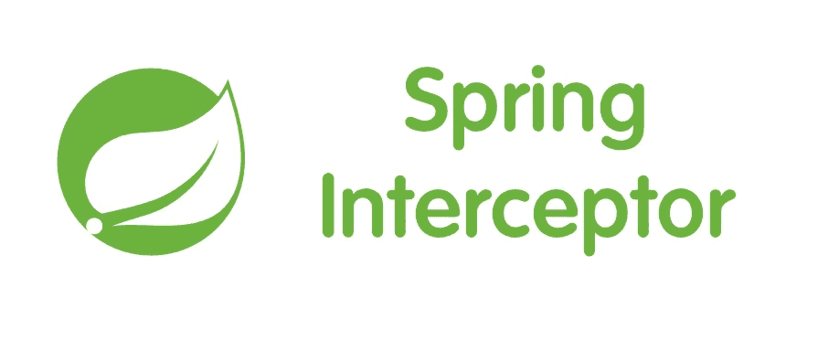

# Spring RestTemplate 请求和响应日志记录

> 原文：<https://medium.com/javarevisited/spring-resttemplate-request-response-logging-f021be66c2c0?source=collection_archive---------1----------------------->



记录请求和响应的拦截器

使用 Spring RestTemplate 时，记录 HTTP 请求和响应有时很有用。如果需要精确控制记录的内容，可以使用定制的拦截器在远程调用之前和之后添加日志记录。

# 创建拦截器

您需要创建一个扩展***clienthttp request interceptor***的类，并实现 ***intercept*** 方法，如下所示。

```
[@Component](http://twitter.com/Component)
public class LoggingInterceptor implements ClientHttpRequestInterceptor {

    [@Override](http://twitter.com/Override)
    public ClientHttpResponse intercept(HttpRequest request, byte[] body, ClientHttpRequestExecution execution) throws IOException {

  logRequest(request, body);
        ClientHttpResponse response = execution.execute(request, body);
        logResponse(response);

        return response;
    } 

    private void logRequest(HttpRequest request, byte[] body) throws IOException {

      if (log.isDebugEnabled()) {
            log.debug("===log request start===");
            log.debug("URI: {}", request.getURI());
            log.debug("Method: {}", request.getMethod());
            log.debug("Headers: {}", request.getHeaders());
            log.debug("Request body: {}", new String(body, "UTF-8"));
            log.debug("===log request end===");
        }
    }

    private void logResponse(ClientHttpResponse response) throws IOException {

      if (log.isDebugEnabled()) {
            log.debug("===log response start===");
            log.debug("Status code: {}", response.getStatusCode());
            log.debug("Status text: {}", response.getStatusText());
            log.debug("Headers: {}", response.getHeaders());
            log.debug("Response body: {}", StreamUtils.copyToString(response.getBody(), Charset.defaultCharset()));
           log.debug("===log response end===");
        }
    }
}
```

当这个类用[***rest template***](https://javarevisited.blogspot.com/2017/02/how-to-consume-json-from-restful-web-services-Spring-RESTTemplate-Example.html)注册时，Spring 将在请求被分派之前调用 ***intercept*** 方法，这允许您记录请求。在 ***logRequest*** 方法中，我从请求中获取了我想要记录的信息。显然，您可以在这里随意记录。

记录请求后，我调用***client http request execution***对象上的 ***execute*** 方法来分派请求。当收到响应时，我记录状态、标题和正文。

# 配置 RestTemplate

为了确保拦截器被调用，你需要用 ***RestTemplate*** 注册它。在下面的例子中，我只添加了***logging interceptor***，但是你可以自由添加多个拦截器，Spring 会在运行时将它们链接在一起。

```
 [@Bean](http://twitter.com/Bean)
public RestTemplate createRestTemplate(LoggingInterceptor loggingInterceptor, RestErrorHandler restErrorHandler) {

  RestTemplate restTemplate = new RestTemplate();
  restTemplate.setInterceptors(Collections.singletonList(loggingInterceptor));

  return restTemplate;
}
```

你当然可以在 ***RestTemplate*** 包中启用调试日志记录，但是我喜欢使用一个拦截器，就好像给你一个细粒度的控制来记录你想要的东西。

快乐编码..