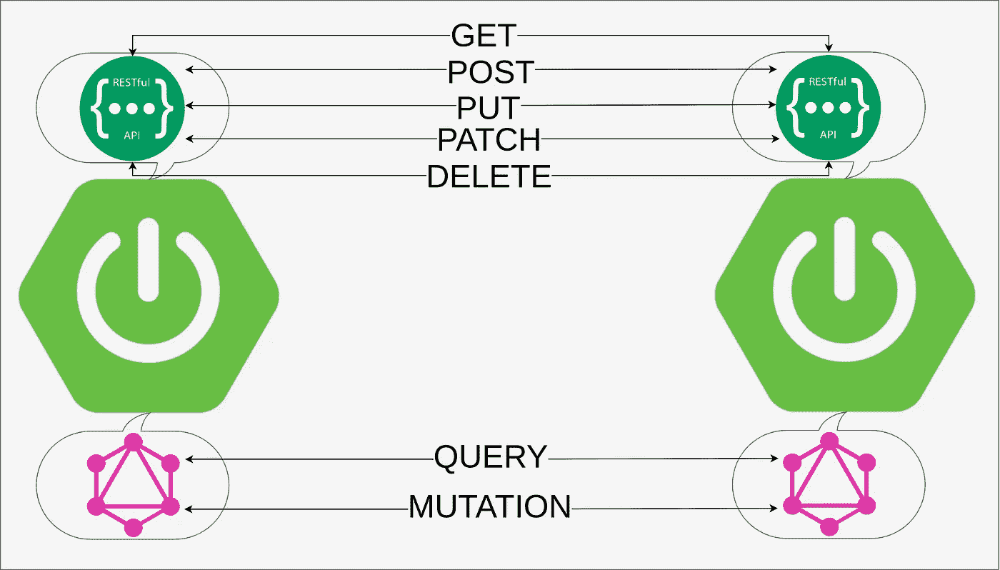

# Spring RestTemplate vs GraphQL 客户端

> 原文：<https://medium.com/javarevisited/spring-resttemplate-vs-graphql-client-177bd6770843?source=collection_archive---------0----------------------->

## 本教程主要面向 REST API 开发人员，他们希望学习如何开发 GraphQL 客户端。这是 RestTemplate 和 GraphQL 客户端的比较。

让我们考虑一个用例，我们有一个应用程序，我们称之为“生产者”，它管理关于客户的信息。这个…