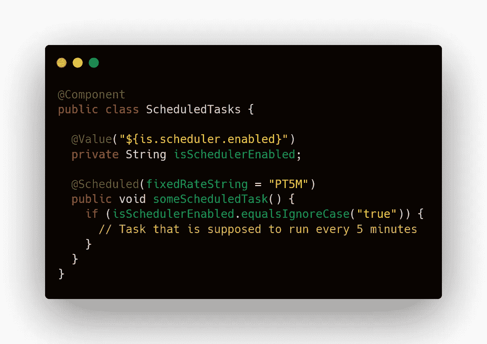
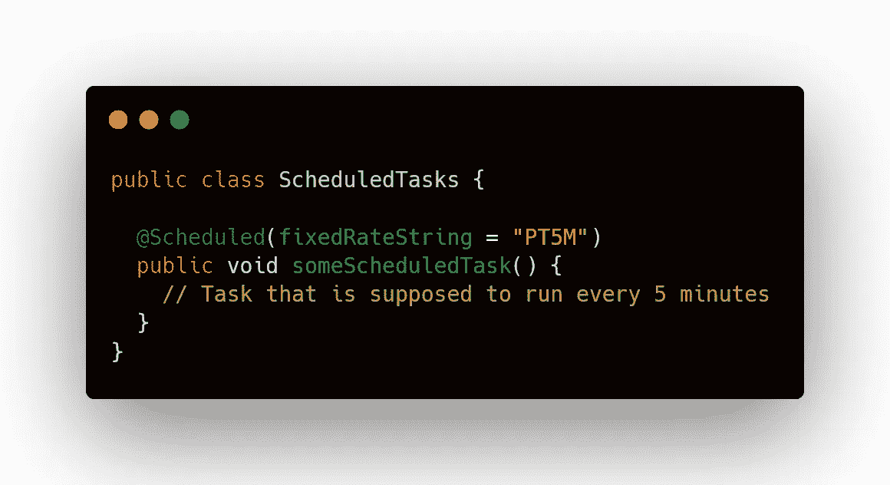
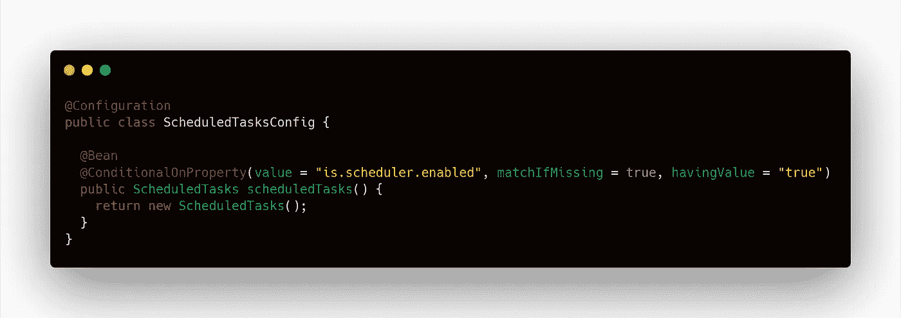
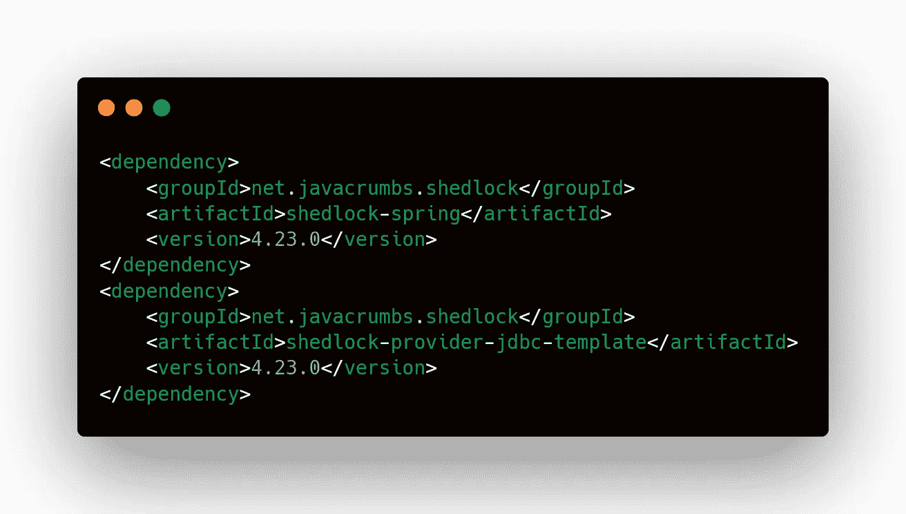
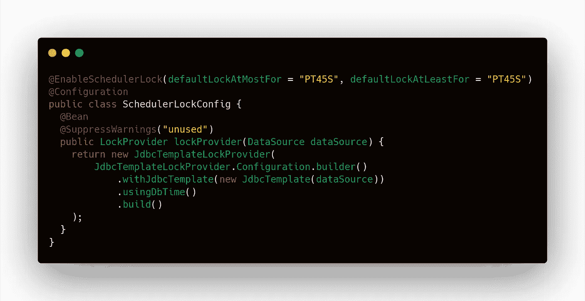
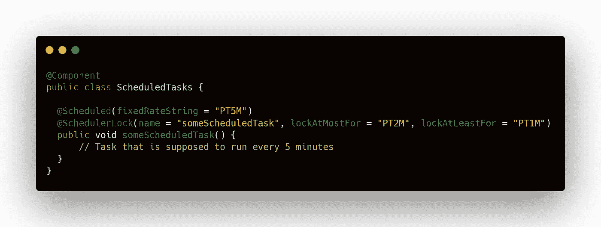
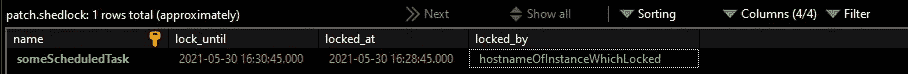
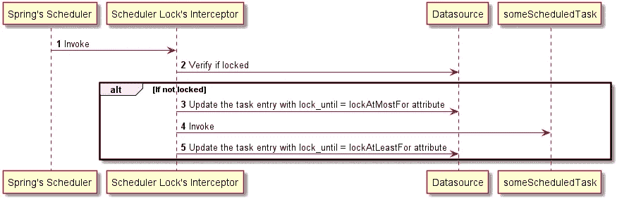

# Spring Scheduler —负载平衡的问题

> 原文：<https://medium.com/javarevisited/spring-scheduler-issues-with-load-balanced-application-eda92720e3dd?source=collection_archive---------2----------------------->


照片由[马克西姆·梅尔尼科夫](https://unsplash.com/@bbsody?utm_source=medium&utm_medium=referral)在 [Unsplash](https://unsplash.com?utm_source=medium&utm_medium=referral) 上拍摄

好吧！我们都开发过带有调度器方法的应用程序，主要用于处理一些与用户/其他服务交互无关的后台任务。在本文中，我们将研究当您开始使用调度程序水平扩展应用程序时出现的问题。水平缩放也称为 **X 轴缩放**。这是为了确保我们的应用程序的高可用性，以防某个节点由于某种未知原因而关闭。


Chris Richardson 所著的《微服务模式》(第 1 章:逃离巨大的地狱)一书中对扩展的描述。由曼宁出版。

**问题:**
我们的扩展应用程序中的调度流程将并行运行多次(基于实例的数量)。但是，大多数时候，这可能不是我们所期望的。下面是我确保一个预定任务只运行一次的一些思考过程。

**思考过程#1 —有条件地启用调度程序方法:** 一个简单而强力的方法是定义一个新的属性，它将告诉是否启用调度程序。下面的代码片段是一个例子。

[](https://javarevisited.blogspot.com/2019/02/difference-between-contextconfiguration-and-springapplicationConfiguration-annotations-in-spring-boot-testing.html)

ScheduledTasks.java

并使用以下命令启动应用程序。

```
root@XYZ-$ java -jar -Dis.scheduler.enabled=true my-app.jar
```

如果你传入`true`, scheduler 方法将为任何其他的字符串执行，传入的 schedule 将不被执行。
但是，这是有条件地启用特定调度程序的最佳方式吗？答案是**不会！**。上面这种方法的问题是，调度将一直被调用，然后我们手动添加一个条件来启用或禁用。如果我们有多个调度器方法，那么这可能会导致在所有调度器方法中添加 If 条件的样板代码。
更好的方法是利用`@ConditionalOnProperty`注释，在启动时将调度器对象作为 bean 注入到 [spring 容器池](https://javarevisited.blogspot.com/2018/11/top-20-spring-mvc-interview-questions-answers-for-java-developers.html)中。要做到这一点，您需要从 scheduler 类的顶部删除`@Component` 注释。如果你想知道这是如何工作的，这很简单。只有当 Spring 的容器池中有该方法的实例时，Spring 的调度程序才会执行任务。



改良 ScheduledTasks.java



ScheduledTasksConfig.java

因此，通过这种方式，我们可以确保基于给定的属性启用调度程序。这样，我们可以在一个负载平衡的实例中激活调度程序。但是这种方法存在一些问题。你听说过著名的墨菲定律吗？


墨菲定律—图片取自 MD+DI

因此，具有启用调度程序的实例的节点很有可能会关闭，这可能会导致服务连续性丧失，从而导致停机。

**思考过程# 2——分离关注点又名功能分解:** 如果你从事微服务架构，那么你可能会遇到这个原则，关注点分离也称为功能分解。功能分解意味着将一个大的复杂应用程序分解成小的功能部分。这也称为 Y 轴缩放，正如我们在顶部看到的图中提到的。我们可以将我们的应用程序分成多个更小的部分。这样，我们可以在一个单独的[微服务](/javarevisited/10-best-java-microservices-courses-with-spring-boot-and-spring-cloud-6d04556bdfed)中安排任务。我们可以在单个实例中运行它，因为我们不需要为后台任务分担负载。
但这是总体上的最佳解决方案吗？我会说这是一个很好的解决方案，但我们仍然有一个问题。记得法律吗？如果运行我们的单个实例的节点出现故障，那么这将再次导致停机。

**思考过程#3 —基于公共数据源的锁:** 类似于我们在并行计算中如何锁定资源，我们可以使用基于公共数据源的锁来确保调度的任务只执行一次。这是迄今为止我遇到的最好的方法。正是为了这个目的，[卢克 Křečan](https://github.com/lukas-krecan) 创建了一个名为 [ShedLock](https://github.com/lukas-krecan/ShedLock) 的插件。ShedLock 的高级概念非常简单。当给定的实例正在执行应用程序的调度程序方法时，将使用提供的配置进行数据源更新调用。该配置将包含调度程序的唯一的`name` ，它还包含其他 3 列`lock_until`、`locked_at`和`locked_by`。如果另一个实例试图运行相同的调度程序方法，第一步是检查它是否被锁定，如果被锁定，那么它将不会被执行。让我们看看如何实现这一点。第一步，我们需要以下依赖项。



pom.xml

对于这种情况，我将使用基于 MySQL 的数据源，但是 ShedLock 支持许多数据源。我们需要在数据库中有一个名为`shedlock`的表。它可以用下面的 DDL 创建。

```
CREATE TABLE shedlock(name VARCHAR(64) NOT NULL, lock_until TIMESTAMP(3) NOT NULL,
    locked_at TIMESTAMP(3) NOT NULL DEFAULT CURRENT_TIMESTAMP(3), locked_by VARCHAR(255) NOT NULL, PRIMARY KEY (name));
```



SchedulerLockConfig.java

这里，`defaultLockAtMostFor` 和`defaultLockAtLeastFor`是我们的应用程序中使用的所有调度器锁的默认配置。“最多锁定”配置指定了从锁定到锁定有效的最长时间。类似地,“至少锁定”配置指定了从锁定到锁定有效的最短时间。
现在让我们看看我们的调度器实现。



改良 ScheduledTasks.java

一旦我们运行这个，我们将能够在我们的`shedlock` 表中看到这个条目。



执行后关闭

下面是 ShedLock 如何工作的高级序列图。



shedlock —序列图

如果你想更深入地了解谢德洛克，你可以试着阅读这篇文章，作者是[达南杰·克尔(Dhananjay Kr)。](https://medium.com/u/265903511564?source=post_page-----eda92720e3dd--------------------------------)也可以直接访问 ShedLock 的 GitHub [资源库](https://github.com/lukas-krecan/ShedLock)。

因此，在我的 3 个不同的思考过程中，如果你问我哪一个是最好的方法，那么我的建议是使用数字 2 和 3 的组合。为每个问题提供不同的微服务总是更好，如果后台进程需要高可用性，那么我们可以继续进行扩展和基于数据源的锁定。

**参考文献:**
1。[弹簧调度器](https://docs.spring.io/spring-framework/docs/3.2.x/spring-framework-reference/html/scheduling.html)
2。[Spring 任务调度器指南](https://www.baeldung.com/spring-task-scheduler)
3。[微服务模式](https://microservices.io/book)
4。[谢德洛克](https://github.com/lukas-krecan/ShedLock)
5。[用谢德洛克和 Spring Boot 锁定@预定任务](https://dhananjay4058.medium.com/lock-scheduled-tasks-with-shedlock-and-spring-boot-f67200dad675)