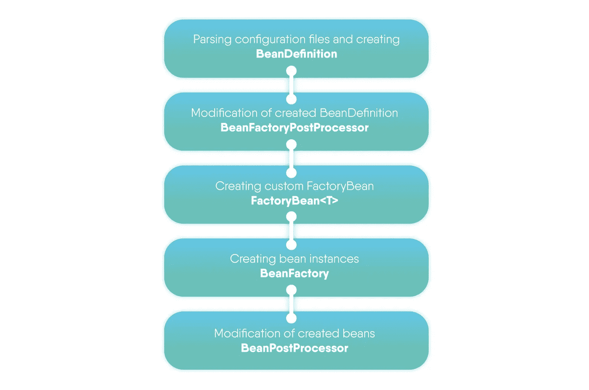
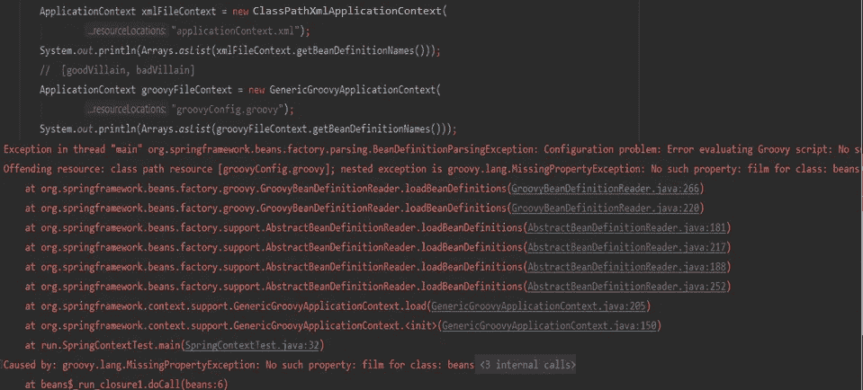
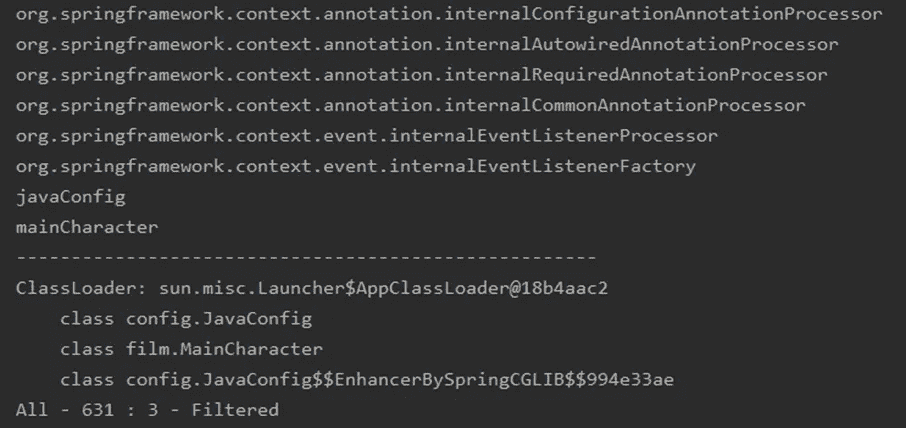
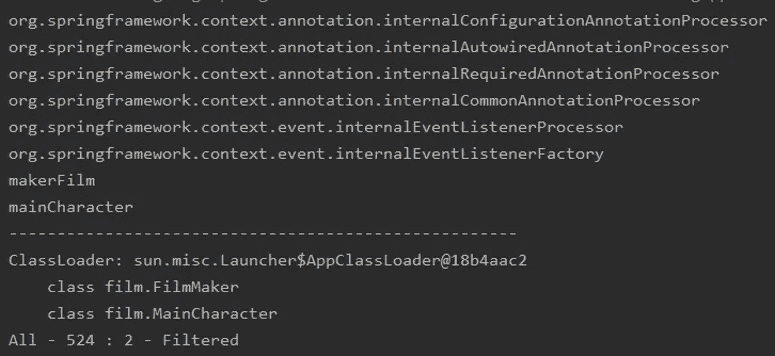

# 春天:寻找背景

> 原文：<https://medium.com/javarevisited/spring-searching-for-context-df08d5b562e?source=collection_archive---------0----------------------->


几个月前，我分享了一份关于 Java 虚拟机上[类加载的详细指南。报告结束后，我的同事问 Spring 使用什么机制来解析配置，以及它如何从上下文中加载类。](/swlh/tools-for-launching-and-developing-products-on-jvm-94a29d502d11)

经过几个小时的 Spring 源代码调试，我的同事实验性地了解了这个非常简单明了的事实。

# 一点理论

**ApplicationContext** 是 Spring app 中的主接口，为应用程序提供配置信息。

在直接进行演示之前，让我们看一下*应用上下文*创建的步骤:



在本文中，我们将分析第一个阶段，因为我们对读取配置文件和创建 *BeanDefinition* 感兴趣。

**BeanDefinition** 是一个描述 bean、其属性、构造函数参数和其他元信息的接口。

至于 beans 本身的配置，Spring 有 4 种配置方法:

1.  **XML 配置**—*classpathmlaplicationcontext(" context . XML ")；*
2.  **Groovy 配置**—*GenericGroovyApplicationContext(" context . Groovy ")；*
3.  **基于注释的配置**，其中您指定要扫描的包—*AnnotationConfigApplicationContext(" package . name ")；*
4.  **JavaConfig** —基于注释的配置，指示用**@ Configuration**—*AnnotationConfigApplicationContext(Java config . class)注释的(Java)类(或类的数组)。*

<https://javarevisited.blogspot.com/2018/08/how-to-crack-spring-core-professional-certification-exam-java-latest.html#axzz5j90KOik7>  

# XML 配置

我们以一个简单的项目为基础:

```
public class SpringContextTest{
       private static String classFilter = "film.";

       public static void main(String[] args){

             printLoadedClasses(classFilter);
             /* Classloader: sun.misc.Launcher$AppClassLoader@18b4aac2
                All - 5 : 0 - Filtered      /*
            doSomething(MainCharacter.num); doSomething(FilmMaker.class);
            printLoadedClasses(classFilter);
            /* Classloader: sun.misc.Launcher$AppClassLoader@18b4aac2
                   class film.MainCharacter
                   class film.FilmMaker
                All - 7 : 2 - Filtered     /*
```

这里我们应该解释使用了什么方法以及它们的用途:

*   *printLoadedClasses(String…filters)*方法显示从包中加载的加载程序和 JVM 类的名称，作为参数传输到控制台。此外，还有关于所有已加载类的数量的信息
*   *doSomething(Object o)* 是一种执行原始工作的方法，但不允许在编译阶段的优化过程中排除所提到的类

我们将 Spring 连接到我们的项目(以下使用 Spring 4):

```
 11 public class SpringContextTest{
    12    private static String calssFilter = "film.";
    13    
    14    public static void main(String[] args){
    15        
    16        printLoadedClasses(classFilter);
    17       /* Classloader: sun.misc.Launcher$AppClassLoader@18b4aac2
    18           All - 5 : 0 - Filtered      /*
    19        doSomething(MainCharacter.num); doSomething(FilmMaker.class);
    20        printLoadedClasses(classFilter);
    21        /* Classloader: sun.misc.Launcher$AppClassLoader@18b4aac2
    22               class film.MainCharacter
    23               class film.FilmMaker
    24               All - 7 : 2 - Filtered   /*
    25        ApplicationContext context = new ClassPathXmlApplicationContext(
    26         configLocation: "applicationContext.xml");
    27        printLoadedClasses(classFilter);
```

第 25 行是通过 XML 配置对 ApplicationContext 的声明和初始化

配置 XML 文件如下所示:

```
<beans xmlns = "[http://www.spingframework.org/schema/beans](http://www.spingframework.org/schema/beans)" xmlns:xsi = "link">
    <bean id = "villain" class = "film.Villain" lazy-init= "true">
    <property name = "name" value = "Vasily"/>
    </bean>
```

当配置一个 bean 时，我们指定一个真正存在的类。注意给定的属性 *lazy-init = "true"* :在这种情况下，只有在从上下文中请求 bean 之后，才会创建它。

让我们看看 Spring 在解析上下文时如何处理配置文件中声明的类的情况:

```
public class SpringContextTest {
    private static String classFilter = "film.";

    public static void main(String[] args) {

           printLoadedClasses(classFilter);
        /* Classloader: sun.misc.Launcher$AppClassLoader@18b4aac2
           All - 5 : 0 - Filtered      /*
        doSomething(MainCharacther.num); doSomething(FilmMaker.class);
        printLoadedClasses(classFilter);
        /* Classloader: sun.misc.Launcher$AppClassLoader@18b4aac2
               class film.MainCharacter
               class film.FilmMaker
            All - 7 : 2 - Filtered     /*
        ApplicationContext context = new ClassPathXmlApplicationContext(
                  configLocation: "applicationContext.xml");
        printLoadedClasses(classFilter);
        /* Classloader: sun.misc.Launcher$AppClassLoader@18b4aac2
               class film.MainCharacter
               class film.FilmMaker
               class film.Villain

            All - 343 : 3- Filtered     /*
```

在执行*printLoadedClasses(calss filter)*之后，343 个类与上下文一起被加载，其中 3 个是我们的包中的类。这意味着在以前使用的类中又增加了一个类，在配置 XML 文件中被称为*电影。薇莉安*级。

让我们来看看 XML 配置的细节:

*   配置文件由 **XmlBeanDefinitionReader** 类读取，该类实现了 *BeanDefinitionReader* 接口。
*   **XmlBeanDefinitionReader**在输入端接收 InputStream，并通过 *DefaultDocumentLoader* 加载*文档*:

```
Document doc = doLoadDocument(inputSource, resource);
    return registerBeanDefinitions(doc, resource);
```

*   之后，处理该文档的每个元素，如果是 bean，则根据填充的数据(id、名称、类、别名、init-method、destroy-method 等)创建 BeanDefinition。):

```
this.beanDefinitionMap.put(beanName, beanDefinition);
        this.beanDefinitionNames.add(beanName);
```

*   每个 *BeanDefinition* 都放在 Map 中，Map 存储在*DefaultListableBeanFactory*类中:

```
this.beanDefinitionMap.put(beanName, beanDefinition);
        this.beanDefinitionNames.add(beanName);
```

代码中的 Map 如下所示:

```
/** Map of bean definition objects, keyed by bean name */
    private final Map beanDefinitionMap = new ConcurrentHashMap(64);
```

现在让我们添加另一个包含 film 的 bean 声明。bad 小人类添加到同一个配置文件:

```
<beans xmlns = "[http://www.spingframework.org/schema/beans](http://www.spingframework.org/schema/beans)" xmlns:xsi = "link">
    <bean id = "goodVillain" class = "film.Villain" lazy-init= "true">
    <property name = "name" value = "Good Vasily"/>
    </bean>
    <bean id = "badVillain" class = "film.BadVillain" lazy-init= "true">
    <property name = "name" value = "Bad Vasily"/>
    </bean>
```

我们将会看到如果打印一个创建的*bean defension names*和加载的类的列表会发生什么:

```
ApplicationContext context = new ClassPathXmlApplicationContext(
    configLocation: "applicationContext.xml");
System.out.println(Arrays.asList(context.getBeanDefinitionNames()));

printLoadedClasses(calssFilter);
```

尽管那班*电影。配置文件中指定的 bad victor*不存在，Spring 工作正常，没有错误:

```
ApplicationContext context = new ClassPathXmlApplicationContext(
    configLocation: "applicationContext.xml");
System.out.println(Arrays.asList(context.getBeanDefinitionNames()));
//  [goodVillain, badVillain]
printLoadedClasses(calssFilter);
/* Classloader: sun.misc.Launcher$AppClassLoader@18b4aac2
           class film.MainCharacter
           class film.FilmMaker
           class film.Villain
All - 343 : 3- Filtered   /*
```

*bean defension names*的列表包含 2 个元素；也就是说，我们的文件中配置的那两个 bean 定义已经创建。

两个 beans 的配置基本相同。但是，加载了现有的类，没有出现任何问题。这就是为什么我们可以得出结论，也有人试图加载一个不存在的类，但失败的尝试不会影响任何事情。

让我们试着用它们的名字得到豆子本身:

```
ApplicationContext context = new ClassPathXmlApplicationContext(
    configLocation: "applicationContext.xml");
System.out.println(Arrays.asList(context.getBeanDefinitionNames()));
//  [goodVillain, badVillain]
System.out.println(context.getBean( name: "goodVillain"));

System.out.println(context.getBean( name: "badVillain"));
```

以下是我们得到的结果:


如果在第一种情况下收到了有效的 bean，那么在第二种情况下我们会遇到一个异常。

请注意堆栈跟踪:惰性加载开始起作用了。为了在以前加载的类中找到我们要找的类，所有的类加载器都被绕过了。并且在没有找到必要的类之后，有人试图使用 *Utils.forName* 方法来找到一个不存在的类，这导致了一个逻辑错误。

当提升上下文时，只加载了一个类，但是，试图加载一个不存在的文件不会导致错误。为什么会这样？

这是因为我们声明了 *lazy-init:true* 并禁止 Spring 创建一个 bean 实例，之前收到的异常就是在这个实例中生成的。如果我们从配置中删除这个属性，或者将它的值改为 *lazy-init:false* ，那么上面描述的错误也会出现，但是不会被忽略，应用程序会停止。在我们的例子中，上下文被初始化，但是我们不能创建一个 bean 实例，因为没有找到指定的类。

</javarevisited/top-10-courses-to-learn-spring-boot-in-2020-best-of-lot-6ffce88a1b6e>  

# Groovy 配置

在借助 Groovy-file 配置上下文时，需要形成*groovybeanditionreader*，它在输入上接收带有上下文配置的字符串。在这种情况下，*groovybean definition reader*类参与了上下文的读取。事实上，这种配置与 XML 的工作方式相同，只是使用 Groovy 文件。此外，*groovyaplicationcontext*也能很好地处理 XML 文件。

下面是一个简单的配置 Groovy 文件示例:

```
beans {
    goodOperator(film.Operator){bean - >
            bean.lazyInit = 'true' >
            name = 'Good Oleg' 
         }
    badOperator(film.BadOperator){bean - >
            bean.lazyInit = 'true' >
            name = 'Bad Oleg' / >
        }
  }
```

让我们试着用 XML 做同样的事情:



错误立即出现:Groovy 和 XML 一样，创建 bean 定义，但是在这种情况下，后处理器立即给出错误。

</javarevisited/top-5-books-to-learn-spring-boot-and-microservices-for-experienced-java-developers-499a9d921d18>  

# 基于注释的配置，指示要扫描的包或 JavaConfig

这种配置不同于以前的配置。在基于注释的配置中使用了两种变体，即 JavaConfig 和类上的注释。

这里使用了相同的上下文:*AnnotationConfigApplicationContext(" package "/javaconfig . class)*。它的工作取决于传递给构造函数的内容。

在*AnnotationConfigApplicationContext*中有两个私有字段:

*   private final*annotatedbeanditionreader*reader(与 JavaConfig 一起使用)
*   私有最终*classpathbeanditionscanner*扫描仪(扫描包裹)

**annotatedbeanditionreader**的独特之处在于它分几个阶段工作:

1.  注册*@配置文件*用于进一步解析；
2.  注册特殊的*bean factorypostprocessor*，即*BeanDefinition registry postprocessor*，使用*configuration classparser*类解析 JavaConfig 并创建 bean definition。

这里有一个简单的例子:

```
@Configuration
    public class JavaConfig {

        @Bean
        @Lazy
        public MainCharacter mainCharacter(){
            MainCharacter mainCharacter = new MainCharacter();
            mainCharacter.name = "Patric";
            return mainCharacter;        
       }    
    }public static void main(String[] args) {

             ApplicationContext javaConfigContext = 
                       new AnnotationConfigApplicationContext(JavaConfig.class);
             for (String str : javaConfigContext.getBeanDefinitionNames()){
                  System.out.println(str);
             }
             printLoadedClasses(classFilter);
```

我们用最简单的 bean 创建一个配置文件。看看会加载什么:



如果在 XML 和 Groovy 的情况下，加载的 bean 定义与声明的一样多，那么在这种情况下，声明的和附加的 bean 定义都在提升上下文的过程中加载。在通过 JavaConfig 实现的情况下，所有的类都被立即加载，包括 JavaConfig 本身的类，因为它是一个 bean。

此外，还有一件事。在 XML 和 [Groovy](https://javarevisited.blogspot.com/2017/08/top-5-books-to-learn-groovy-for-java.html#axzz5dPh77Fzl) 配置的情况下，上传了 343 个文件；这里出现了 631 个额外文件的更“沉重”的负载。

</javarevisited/10-advanced-spring-boot-courses-for-experienced-java-developers-5e57606816bd>  

**classpathbeanditionscanner**操作阶段:

*   指定的包决定了要扫描的文件列表。所有文件都放在目录中；
*   扫描器遍历每个文件，接收输入流，并使用*org . spring framework . ASM . class reader . class 扫描它们；*
*   在第三阶段，扫描器检查找到的对象是否通过了*org . spring framework . core . type . filter . annotationtypefilter*批注的过滤器。Spring 搜索用 *@Component* 注释的类，或者默认包含 *@Component* 的任何其他注释；
*   如果验证成功，将创建并注册新的 BeanDefinition。

与 XML 和 Groovy 一样，使用注释的所有“魔力”恰恰在于来自 *springframework.asm* 包的 *ClassReader.class* 。这个阅读器的特殊性在于它可以处理字节码。也就是说，阅读器从字节码中获取 InputStream，扫描它并在那里寻找注释。

让我们用一个简单的例子来看看扫描仪是如何工作的。我们创建一个自定义注释来查找适当的类:

```
import org.springframework.stereotype.Component
    import java.lang.annotation.*;
    @Target({ElementType.TYPE})
    @Retention(RetentionPolicy.RUNTIME)
    @Documented
    @Component
    public @interface MyBeanLoader{
           String value() default "";
```

然后我们创建两个类:一个带有标准的@Component 注释，另一个带有自定义注释。

```
MyBeanLoader("makerFilm")
    @Lazy 
    public class FilmMaker {
          public static int staticInt = 1;
          @Value("Silence")
          public String filmName;
          public FilmMaker(){}@Component 
    public class MainCharacter {
          public static int num = 1;
          @Value("Silence")
          public String name;
          public MainCharacter() { }
```

结果，我们得到了为这些类生成的 bean 定义，并且成功地加载了类。

```
ApplicationContext annotationConfigContext =
           new AnnotationConfigApplicationContext(...basePackages: "film");
    for (String str : annotationConfigContext.getBeanDefinitionNames()){
         System.out.println(str);
    }
    printLoadedClasses(classFilter);
```



# 结论

综上所述，提出的问题可以回答如下:

## 1.Spring 使用什么机制来解析配置？

每个上下文实现都有自己的工具包，但主要使用扫描。在创建 BeanDefinition 之前，我们不会尝试加载类:首先，根据指定的参数进行扫描，然后根据扫描结果创建合适的 bean 定义。然后，后处理器试图自己“调整”BeanDefinition，向它加载一个类，等等。

## 2.Spring 如何从上下文中加载类？

使用标准的 Java 类加载机制:类加载器被绕过，试图在先前加载的类中找到所需的类，如果找不到该类，就尝试加载它。

<https://javarevisited.blogspot.com/2018/06/top-6-spring-framework-online-courses-Java-programmers.html>  

您可能喜欢的其他 **Java 和 Spring 文章**

*   每个 Java 开发者都应该知道的 5 个 Spring Boot 特性([特性](https://javarevisited.blogspot.com/2018/11/top-5-spring-boot-features-java.html#axzz5YFjHrt5j))
*   学习春天和 Spring Boot 的五大免费课程([课程](http://www.java67.com/2017/11/top-5-free-core-spring-mvc-courses-learn-online.html))
*   掌握 Spring Boot 在线课程([课程](https://javarevisited.blogspot.com/2018/05/top-5-courses-to-learn-spring-boot-in.html))
*   Java 开发人员应该学习的 10 件事([目标](https://javarevisited.blogspot.com/2017/12/10-things-java-programmers-should-learn.html#axzz5atl0BngO))
*   Java 开发人员在日常生活中使用的 10 个工具([工具](http://javarevisited.blogspot.sg/2017/03/10-tools-used-by-java-programming-Developers.html#axzz55lrMRnNC))
*   成为更好的 Java 开发人员的 10 个技巧
*   学习 Java 微服务的 Top 5 课程？([课程](/javarevisited/top-5-courses-to-learn-microservices-in-java-and-spring-framework-e9fed1ba804d))
*   Java 程序员可以从 Spring 学习的 3 个最佳实践([最佳实践](https://javarevisited.blogspot.com/2018/06/3-best-practices-java-programmers-can-learn-from-spring-framework.html#axzz5K0PIOpHD))
*   学习 Spring Boot 和春云的 5 门课程([门课程](https://javarevisited.blogspot.com/2018/07/top-5-books-to-learn-spring-boot-and-spring-cloud-java.html))
*   改变 Spring Boot Tomcat 端口的 3 种方法([教程](https://www.java67.com/2019/07/spring-boot-3-ways-to-change-port-of-tomcat.html))
*   Java 程序员的 10 门高级 Spring Boot 课程([课程](/javarevisited/10-advanced-spring-boot-courses-for-experienced-java-developers-5e57606816bd))
*   Java 开发者应该学习的 10 个 Spring MVC 注解([注解](https://www.java67.com/2019/04/top-10-spring-mvc-and-rest-annotations-examples-java.html))
*   15 Spring Boot Java 程序员面试问题([问题](https://www.java67.com/2018/06/top-15-spring-boot-interview-questions-answers-java-jee-programmers.html))

感谢您阅读本文。如果你觉得这篇文章有用，那么请与你的朋友和同事分享。如果您有任何问题或反馈，请留言。

【https://intexsoft.com】原载于 2020 年 3 月 5 日<https://intexsoft.com/>**。**