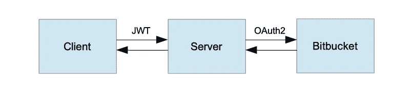
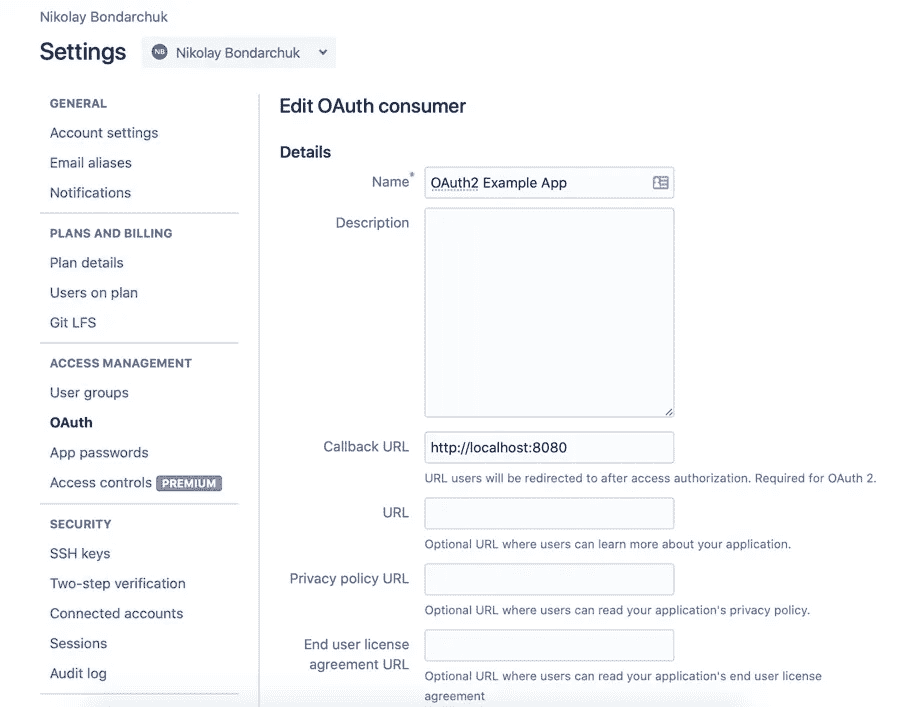
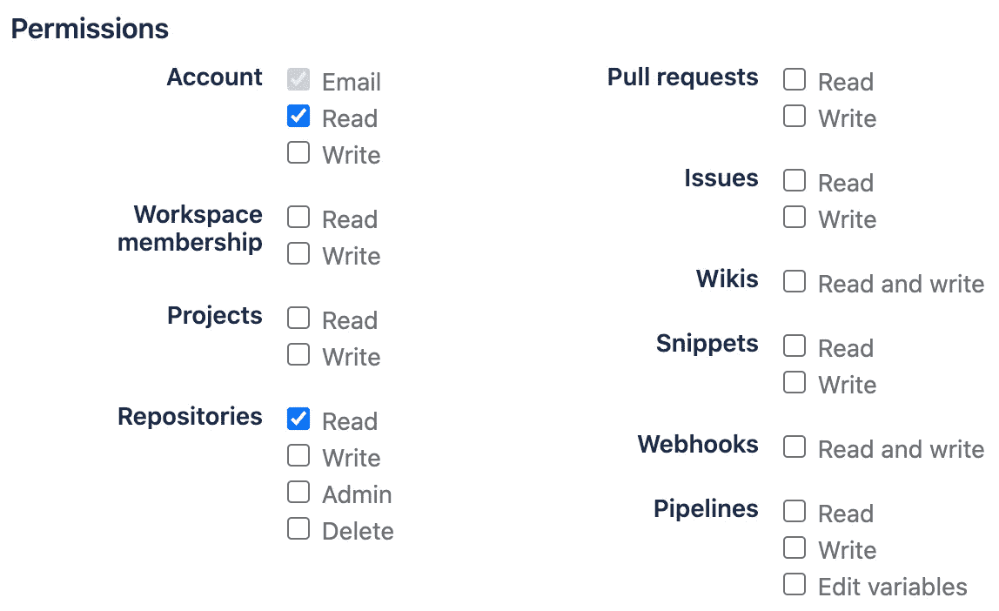

# Spring Security:用 OAuth2、Bitbucket 和 JWT 开发一个安全的 REST 服务

> 原文：<https://medium.com/javarevisited/spring-security-develop-a-rest-service-secured-with-oauth2-bitbucket-and-jwt-aab95dc0c55?source=collection_archive---------1----------------------->

如何使用 Spring Security 开发一个由 OAuth2、Bitbucket 授权服务器和 JWT 保护的 REST-service


照片由[飞:D](https://unsplash.com/@flyd2069?utm_source=medium&utm_medium=referral) 在 [Unsplash](https://unsplash.com?utm_source=medium&utm_medium=referral)

我们将开发一个小型的 REST-service，使用 OAuth2 协议保护，使用 Bitbucket 作为授权服务器。起初，使用第三方授权服务器似乎不太常见，但是想象一下，您正在开发一个 CI(持续集成)服务器，并且想要访问版本控制系统中的用户资源(例如项目、存储库)。比如在 [Drone.io](https://www.drone.io) 和 [Travis CI](https://travis-ci.com) 中使用了同样的方法。

# 理论

在开始之前，让我们回忆一下一些理论。

**认证**是识别用户身份的过程。这通常是通过要求一组凭证来完成的，比如用户名和密码。一旦通过验证，客户端将获得有关用户身份和访问权限的信息。

**授权**是授予或拒绝访问网络资源的过程，它允许用户基于用户的身份访问各种资源。

授权有两种类型:**基于 cookie 的**和**基于令牌的**。让我们详细看看每种类型的授权是如何工作的。

基于 Cookie 的授权是有状态的，这意味着服务器必须管理一个会话才能授权用户请求。基于 Cookie 的授权工作方式如下:

*   用户通过提供凭据登录。
*   服务器创建 HTTP 会话并将其与用户相关联。它还创建了一个名为 [JSESSIONID](http://javarevisited.blogspot.sg/2012/08/what-is-jsessionid-in-j2ee-web.html#axzz5Dgr5hofT) 的 cookie，用于存储会话标识符。
*   cookie 被传递给客户机并存储在那里。
*   cookie 被附加到对服务器的每个后续请求中。
*   服务器使用 cookie 找到一个会话，并检查用户是否有权访问所请求的资源。
*   当用户从应用程序中注销时，会从服务器中删除一个会话。

因为 REST 架构约束之一是无状态，所以基于 cookie 的授权不是我们示例的选项。让我们看看基于令牌的授权有何不同。

基于令牌的授权是无状态的，这意味着服务器不必存储任何会话信息来授权客户端请求。基于令牌的授权是这样工作的:

*   用户通过提供凭据登录。
*   服务器发布用秘密密钥签名的访问令牌。然后将令牌返回给客户端。令牌包含用户标识符和用户角色。
*   令牌存储在客户端，并随每个后续请求一起传递给服务器。通常令牌在`Authorization` HTTP 头中被传递给服务器。
*   服务器验证签名，提取用户 id、角色，并检查用户是否有执行呼叫的权限。
*   当用户注销时，只需从客户端删除一个令牌就足够了，甚至无需联系服务器。

JSON Web Token (JWT)是目前流行的令牌格式。它包含三个以逗号分隔的数据块:报头、有效载荷和签名。前两个块是 base64 编码的 JSON 文档。有效负载可以包含一些保留的键/值对，如`iss`、`iat`、`exp`，以及自定义的用户定义的键/值对。对称和非对称算法可用于对令牌进行签名。

我们将使用 **OAuth2** 协议来授权我们的用户，所以让我们看一下它。OAuth2 是一种协议，允许用户向第三方应用程序授予对用户受保护资源的访问权限，而不暴露他们的凭据。OAuth2 协议定义了 4 个授权流:授权码、隐式、资源所有者密码凭证和客户端凭证。我们将使用授权代码流类型。授权代码流类型由两个后续请求组成:

*   授权请求；
*   访问令牌请求。

授权请求用于对用户进行身份验证，并为我们的应用程序请求授权以访问资源服务器上的用户资源。这只是一个带有以下参数的 GET 请求:

*   response_type —必须设置为`code`；
*   client_id —从授权服务器获得的值；
*   redirect_uri —回调 uri
*   scope —可选参数，指定访问级别。
*   state 用于响应验证的随机字符串。

请求示例:

```
GET https://server.example.com/authorize?response_type=code&client_id=CLIENT_ID&state=xyz&redirect_uri=REDIRECT_URI
```

如果授权成功，用户代理将被重定向到请求中提供的回调 URL。`code`参数包含授权码，而`state`参数包含请求中提供的值。

响应电话示例:

```
GET https://client.example.com/cb?code=AUTH_CODE_HERE&state=xyz
```

访问令牌请求用于交换授权码以访问令牌。这是一个带有以下参数的 [POST 请求](https://www.java67.com/2019/03/7-examples-of-httpurlconnection-in-java.html):

*   grant_type —必须是`authorization_code`；
*   code —上一步获得的授权码；
*   redirect_uri —必须与上一步相同；
*   client_id —从授权服务器获得的值；
*   client_secret —从授权服务器获得的值。

请求示例:

```
POST https://server.example.com/token     grant_type=authorization_code&
code=AUTH_CODE&
redirect_uri=REDIRECT_URI&
client_id=CLIENT_ID&
client_secret=CLIENT_SECRET
```

响应包含访问令牌及其生存期以及刷新令牌:

```
{
   "access_token": "2YotnFZFEjr1zCsicMWpAA",
   "expires_in": 3600,
   "refresh_token": "tGzv3JOkF0XG5Qx2TlKWIA"
}
```

好消息是，所有这些流程都是由 [Spring Security](/javarevisited/top-10-courses-to-learn-spring-security-and-oauth2-with-spring-boot-for-java-developers-8f0222d6066d?source=---------5-----------------------) 实现的，我们不必担心实现的问题。

# 履行

我们将开发一个 REST 服务，公开以下 API:

*   GET /auth/login —启动身份验证过程；
*   POST /auth/token —请求一对新的访问/刷新令牌；
*   GET /api/repositories —请求当前用户的存储库列表。

[](https://javarevisited.blogspot.com/2021/02/spring-security-interview-questions-answers-java.html#axzz6lIcZ8tnd)

解决方案的高级概述

请注意，因为应用程序由三个组件组成，所以不仅客户端对服务器的请求应该被授权，服务器对 Bitbucket 的请求也应该被授权。为了简化这个例子，我们不打算设置基于角色的授权。每个经过身份验证的客户端都被允许访问`/api/repositories`端点。允许服务器向 Bitbucket 发出在 OAuth2 客户端注册期间被授权的任何请求。我们将使用 Spring Boot 版本 2.2.2.RELEASE 和 [Spring Security](https://www.java67.com/2017/12/top-5-spring-security-online-training-courses.html) 版本 5.2.1.RELEASE

## 注册 OAuth2 消费者

首先，我们必须在 Bitbucket 上将我们的应用程序注册为 OAuth2 消费者。为此，请打开您的用户帐户设置并添加一个消费者，如下所示:

[](https://www.java67.com/2017/11/top-5-free-core-spring-mvc-courses-learn-online.html)

填写名称和回拨 URL，然后授予以下权限:

[](https://javarevisited.blogspot.com/2018/04/top-5-spring-cloud-courses-for-java.html#axzz6jsdEHyTp)

您将获得 2 个属性，将它们存储在`application.properties`文件中。

```
client_id=ZJsdANfWkJ7jcktw2x
client_secret=28uUrJ9m43svbkcnXVNj8qeBjFtd8jaD
```

## 认证入口点

当在 web 应用程序中访问受保护的资源，并且在安全上下文中没有经过身份验证的用户时，用户被重定向到登录页面。然而，这种行为对于静止应用来说是不可接受的。在这种情况下，最好返回 HTTP 401(未授权)错误。这就是我们`RestAuthenticationEntryPoint`班所做的。

## 创建登录和刷新令牌端点

我们将使用 OAuth2 授权代码流对用户进行身份验证，但是我们在上一步中覆盖了一个默认的 AuthenticationEntryPoint，这就是为什么我们需要一种显式的方法来触发身份验证。我们将把用户重定向到`/auth/login`端点处理程序中的位桶认证页面。此端点需要在查询参数中传递一个回调 URL，该参数将用于在成功身份验证后向客户端提供 JWT。

出于安全目的，访问令牌的生命周期通常非常有限。在这种情况下，如果它被盗，第三方将无法使用它很长一段时间。为了不使用户在每次令牌到期时重新登录，使用刷新令牌来获得新的访问令牌。刷新令牌由服务器与访问令牌一起发出，并且它具有更长的寿命。存储和传输刷新令牌的推荐方法是使用 HttpOnly cookies。

## 认证成功处理程序

`AuthenticationSuccessHandler`认证成功后调用。这是生成一对访问/刷新令牌并将用户重定向到登录步骤中提供的回调 URL 的好地方。使用查询参数返回访问令牌，使用 HttpOnly cookie 返回刷新令牌。

## 令牌认证过滤器

该过滤器的目的是从授权头中提取访问令牌，并初始化安全上下文。

## 授权申请存储库

Spring Security 使用一个`AuthorizationRequestRepository`的实例在认证期间保存`OAuth2AuthorizationRequest`对象。默认实现是使用`HttpSession`作为存储器的`HttpSessionOAuth2AuthorizationRequestRepository`。这个实现不适合我们的需求，因为我们的服务是无状态的。这就是为什么我们必须实现我们自己的请求存储库，它将使用 cookies 作为存储。

## 配置 Spring 安全性

最后，让我们将所有部分组合在一起，创建一个配置类。

## 存储库端点

现在，我们可以利用与 Bitbucket 集成的优势。让我们使用 Bitbucket repositories API 来获取用户的存储库列表。

## 测试

我们需要一个小的 HTTP 服务器来模拟一个真实的客户端。它将被用作返回令牌的目的地。

首先，让我们尝试在认证之前调用存储库端点，并检查我们是否得到了 401 错误。

然后我们执行认证。为此，我们需要启动我们的服务器，并在浏览器中打开[http://localhost:8080/auth/log in](http://localhost:8080/auth/login)URL。

认证成功后，客户机将收到一个令牌，并将再次调用存储库端点。之后，请求一个新的令牌，然后用它来调用存储库端点。

## 源代码

这个例子的源代码可以在 [Github](https://github.com/nbondarchuk/oauth2-bitbucket-jwt-example) 上找到。

## 资源

*   [OAuth —维基百科](https://en.wikipedia.org/wiki/OAuth)
*   [春季安全参考](https://docs.spring.io/spring-security/site/docs/5.2.3.RELEASE/reference/htmlsingle/#oauth2login-advanced-userinfo-endpoint)
*   [JSON Web 令牌(JWT)](https://tools.ietf.org/html/rfc7519)
*   [OAuth 2.0 授权框架](https://tools.ietf.org/html/rfc6749#section-4.1.1)

为了简单起见，这个例子通过 HTTP 连接工作。但是请注意，我们的令牌没有加密，一般来说，最好切换到安全连接(HTTPS)。