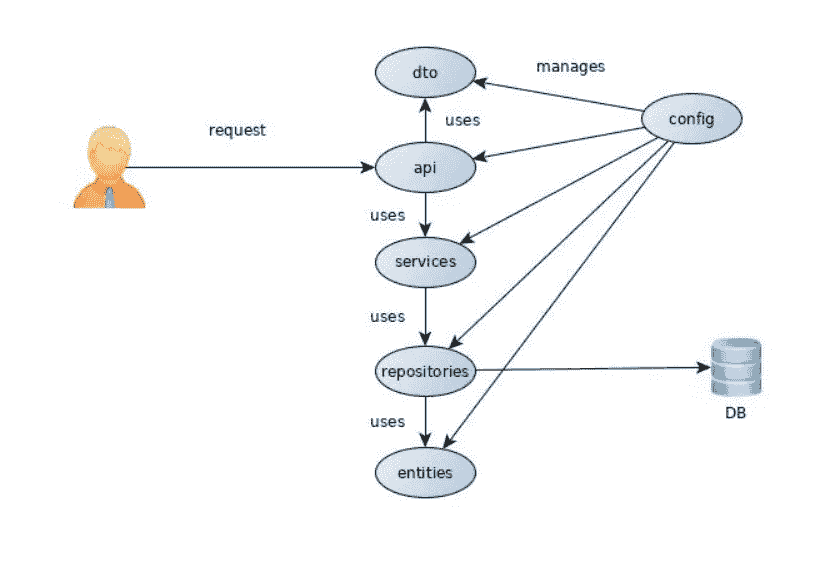

# Spring 安全 OAuth2

> 原文：<https://medium.com/javarevisited/spring-security-oauth2-9e47921766fa?source=collection_archive---------2----------------------->

*   在本文中，我的目标是通过使用 spring OAuth2 来解释 OAuth2 的基础。
*   如今，在构建 web 应用程序时，授权和认证是必须做的事情。当然是出于安全考虑。但是想象一下这个任务是多么的乏味、混乱和昂贵，幸运的是，我们得到了像 [spring security](/javarevisited/top-10-courses-to-learn-spring-security-and-oauth2-with-spring-boot-for-java-developers-8f0222d6066d?source=---------5-----------------------) 和 [spring boot](/javarevisited/10-advanced-spring-boot-courses-for-experienced-java-developers-5e57606816bd?source=collection_home---4------0-----------------------) 这样的服务，在它们的帮助下，我们可以用 OAuth2 实现我们的 web 应用。不要忘记，所有这些功能都很容易实现。
*   假设您是一名为多个客户端开发 REST apis 的 Spring 开发人员。所谓客户端，我们指的是前端 web 应用、移动应用，基本上就是任何一个有互联网，能消耗你资源的人。
*   现在，您应该保护这些端点。记录谁在使用它们，并检查它是否得到授权。一个例子是“我的帐户页面”，我们如何知道为哪个用户发送什么信息？我们如何限制恶意用户访问这些端点？我们如何将整个世界与我们希望用数据养活的人们隔离开来？
*   虽然我们不会在这个例子中保护端点，但是从一开始就理解整个流程是很重要的。

**申请流程如下:**

1.  一个用户进来注册它的客户端
2.  客户端注册后，用户可以在数据库中注册为属于该客户端的用户。
3.  在 post 请求中加入两对凭证:client-id & secret 和 username & password，就生成了一个刷新和访问令牌。
4.  access_token 可以用作授权当前会话中所有其他请求的手段。如果用户选择“记住我”而不是一直进行身份验证，refresh_token 可以存储为 cookie 或会话中的某个位置。为这些令牌留出的时间将在客户注册时指定。

**项目结构**

1.  api:包含相关的操作。它公开了两个 rest 控制器以及一些映射到 Http rest 代码的异常。在我们的例子中，一个端点用于注册客户端，另一个端点用于注册用户
2.  config: OAuth2 自定义配置，从其他库(如模型映射器)创建 bean，一个 swagger 配置和一个用于[基本认证的 last spring 安全配置。](https://javarevisited.blogspot.com/2018/01/how-http-basic-authentication-works-in.html#axzz6hhgr3Uqg)
3.  dto:包含传输对象和验证器。我正在尝试过滤这个级别的所有无效数据，目的是在服务级别不出现无效数据。
4.  实体:更像是 [Postgres 数据库](/javarevisited/7-best-free-postgresql-courses-for-beginners-to-learn-in-2021-3bf369d73794)的传输对象。在这种情况下，我们只有用户；spring OAuth2 实现很好地完成了客户端管理。
5.  存储库:编写时考虑了扩展，它有两个 [spring 数据](https://javarevisited.blogspot.com/2021/08/top-5-spring-data-jpa-courses-for-java.html)接口，一个不是 spring bean，但为另一个提供基本操作。
6.  服务:大部分数据操作和转换发生的层次。

**这是关于 AOuth2 的第一部分。应用程序演示部分将在下一篇文章中写。**

**编码愉快，保持安全……**