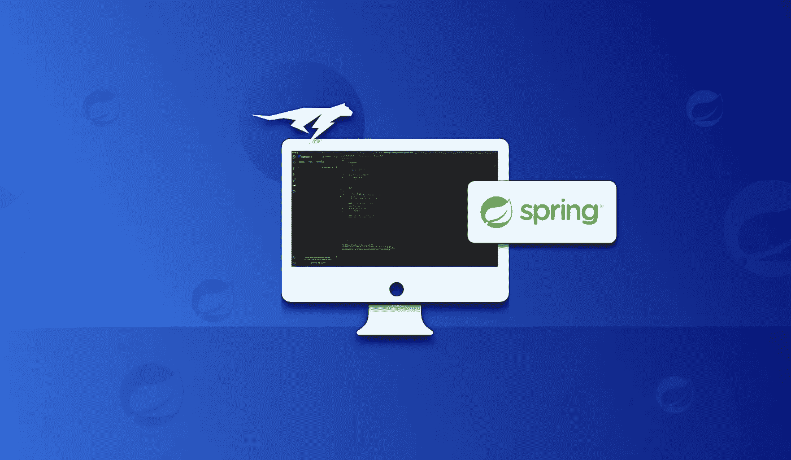
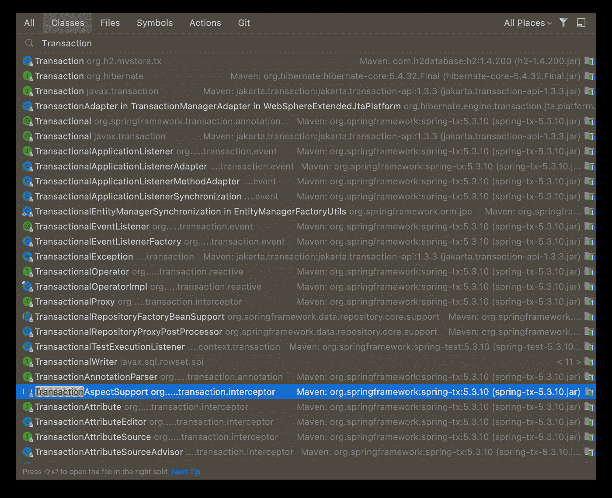
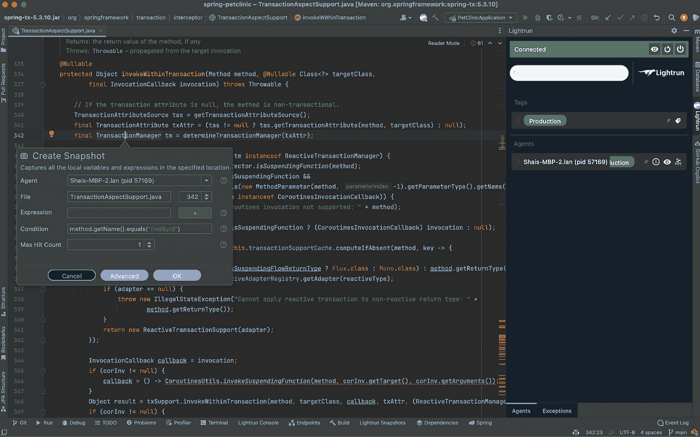

# 使用 Lightrun 在生产中调试 Spring 事务

> 原文：<https://medium.com/javarevisited/spring-transaction-debugging-in-production-with-lightrun-755cfb5dbba8?source=collection_archive---------2----------------------->

[](https://www.java67.com/2021/04/5-free-microservice-courses-for-java.html)

由于其声明式事务管理，Spring 使得构建可靠的应用程序变得更加容易。它还支持编程式事务管理，但这并不常见。在本文中，我想把重点放在声明性事务管理的角度，因为与编程方法相比，它似乎更难调试。

这是部分正确的。我们不能在事务性注释上设置断点。但是我想得太多了。

# Spring 的方法声明式事务管理是什么？

在编写 spring 方法或类时，我们可以使用注释来声明一个方法或一个 [bean](https://javarevisited.blogspot.com/2022/03/how-autowiring-of-beans-works-in-spring.html) (类)是[事务性的](https://javarevisited.blogspot.com/2021/08/spring-transactional-example-how-to.html)。这个注释让我们可以使用属性来调整事务语义。这让我们可以定义如下行为:

*   事务隔离级别—让我们能够解决脏读、不可重复读、幻像读等问题。
*   事务管理程序
*   传播行为——我们可以定义事务是强制的还是必需的，等等。这显示了该方法是否期望接收一个事务以及它的行为方式
*   只读属性—数据库并不总是支持只读事务。但是当它被支持时，它是一个优秀的性能/可靠性调优特性

还有更多。

# 事务不是和数据库驱动有关吗？

事务方法的概念对于 spring 的新开发者来说是非常混乱的。事务是[数据库驱动/JDBC 连接](https://javarevisited.blogspot.com/2012/05/different-types-of-jdbc-drivers-in-java.html)的一个特性，而不是一个方法。为什么要在方法中声明？

还有更多。其他特性，比如消息队列，也是事务性的。我们可能会使用多个数据库。在这些情况下，如果回滚一个事务，我们需要回滚所有底层的[事务](https://javarevisited.blogspot.com/2011/11/database-transaction-tutorial-example.html)。因此，我们在用户代码中进行事务管理，spring 将它无缝地传播到各种底层事务资源中。

# 如果不使用数据库 API，如何编写编程式事务管理？

Spring 包含了一个事务管理器，它公开了我们通常期望看到的 API:begin、commit 和 rollback。这个管理器包括协调各种资源的所有逻辑。

您可以将该管理器注入到一个典型的 spring 类中，但是像这样编写声明性事务管理要容易得多:

```
@Transactional
public void myMethod() {
    // ...
}
```

我在方法级别使用了注释，但是我也可以把它放在类级别。该类定义了默认值，方法可以[覆盖](https://www.java67.com/2012/08/can-we-override-static-method-in-java.html)它。

这提供了极大的灵活性，对于将业务代码从低级 JDBC 事务细节中分离出来非常有用。

# 动态代理、面向方面的编程和注释

调试事务的关键是 spring 实现这个逻辑的方式。 [Spring](/javarevisited/top-10-free-courses-to-learn-spring-framework-for-java-developers-639db9348d25) 使用代理机制来实现[面向方面编程](https://javarevisited.blogspot.com/2021/03/spring-aop-interview-questions-answers.html)的声明能力。实际上，这意味着当您调用`MyObject`或`MyClass`上的`myMethod`时，spring 会在它们之间创建一个代理类和一个代理对象实例。

Spring 通过实现所有声明性注释的代理类型路由您的调用。因此，事务代理负责验证事务状态并执行它。

# 使用 Lightrun 调试 Spring 事务管理

重要提示:我假设你熟悉 Lightrun 的基础知识。如果没有，请阅读 [**本**](https://docs.lightrun.com/) **。**

程序化的事务管理是琐碎的。我们可以将快照放在它开始或回滚的地方来获取状态。

但是如果一个注释失败了，这个方法就不会被调用，我们也不会得到回调。

然而，注释并不神奇。如前所述，Spring 使用了一个代理对象。该代理机制调用通用代码，我们可以用它来绑定快照。一旦我们在那里绑定了快照，我们就可以检测堆栈中的代理类型。

不幸的是，调试代理机制是有问题的，因为没有要调试的物理代码。代理机制中的一切都是在运行时动态生成的。幸运的是，这没什么大不了的。没有这个，我们有足够的钩子来调试。

# 查找实际的事务处理类

我们需要做的第一件事是寻找实现事务功能的类。打开 [IntelliJ/IDEA](/javarevisited/7-best-courses-to-learn-intellij-idea-for-beginners-and-experienced-java-programmers-2e9aa9bb0c05) 类视图(Command-O 或 CTRL-O)让我们通过名字定位一个类。键入“Transaction”会出现以下视图:

[](https://javarevisited.blogspot.com/2011/07/java-debugging-tutorial-example-tips.html#axzz6bYzaddcE)

这可能看起来很多，但是我们需要一个具体的公共类。所以注释和接口可以忽略。因为我们只关心 Spring 类，所以我们可以忽略其他包。尽管如此，我们要找的类在列表中相对较低，所以我花了一些时间才找到它。

这种情况下，有趣的类是`TransactionAspectSupport`。一旦我们打开类，我们需要选择下载类源代码的选项。

一旦这样做了，我们就可以寻找一个适用的公共方法。看起来很完美，但有点太光秃秃了。在那里放一张快照给了我一个提示:

[](https://javarevisited.blogspot.com/2021/12/ow-to-fix-spring-data-jpa-no-property-.html)

我这里没有太多的信息，但是栈上的`invokeWithinTransaction`方法是完美的！

继续讨论这个方法，我想在`findById`方法上跟踪特定于事务的信息:



为了将范围仅限于`findById`我们添加了条件:

```
method.getName().equals("findById")
```

一旦方法被命中，我们可以在堆栈中看到事务的细节。

如果您在方法中进一步滚动，您可以看到在线程中发生异常时设置快照的理想位置，等等。这是调试事务失败的一个很好的中心点。

快照的好处之一是它们可以很容易地调试并发事务。它们的非阻塞特性使它们成为实现这一目标的理想工具。

# TL；速度三角形定位法(dead reckoning)

Spring 中的声明式配置使得事务性操作变得更加容易。这大大简化了应用程序的开发，并将对象逻辑与低级事务行为细节分离开来。

Spring 使用基于类的代理来实现注释。因为它们是生成的，所以我们不能直接调试它们，但是我们可以调试它们内部使用的类。具体来说:`TransactionAspectSupport`就是一个很好的例子。

Lightrun 的一个巨大优势是它不会挂起当前线程。这意味着与并发性相关的问题可以在 Lightrun 中重现。这里讨论的一切都可以用 Lightrun 的免费版本[来完成。](https://lightrun.com/free)