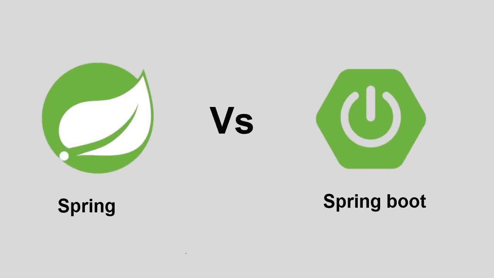
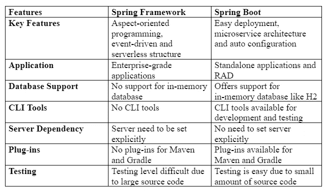

# 春天 Spring vs:势均力敌的比较

> 原文：<https://medium.com/javarevisited/spring-vs-spring-boot-a-head-to-head-comparison-ca27da65ff3?source=collection_archive---------0----------------------->

Java 已经度过了它的 25 周年纪念日，它已经为软件开发行业服务了 27 年(现在仍然如此)。它支持大约 5000 万个网站，其中包括亚马逊、LinkedIn、Stack Overflow 和谷歌等知名网站。

Java 一直是 T2 安卓 T3 背后的主要技术。现在，Java 的广泛流行有几个原因，但它的可靠性、安全性和[框架](/javarevisited/25-spring-framework-interview-questions-for-1-to-3-years-experienced-java-programmers-567f268ed897)的可用性是几个主要原因。

在这里，我们讨论两个流行的 Java 框架， [Spring](/javarevisited/top-10-free-courses-to-learn-spring-framework-for-java-developers-639db9348d25) 和 [Spring Boot](/javarevisited/top-10-courses-to-learn-spring-boot-in-2020-best-of-lot-6ffce88a1b6e) ，它们被广泛用于包括移动应用、云计算和大数据在内的应用的全面开发。

这两个平台都被认为适合这些工作，但是为了做出正确的选择，我们必须知道它们之间的细微差别。所以我们来个头头比较，看看哪个适合什么。

# **什么是春天和 Spring Boot？**

Spring 是一个轻量级的开源框架，可在 Java EE 7 平台上使用，使开发人员能够创建可靠、安全和高度可伸缩的企业级应用程序。这个框架的 USP 在于它的现代编程技术，如 [*依赖注入*](https://javarevisited.blogspot.com/2022/02/how-to-fix-autowired-no-qualifying-bean.html) 和 [*面向方面编程*](https://javarevisited.blogspot.com/2021/03/spring-aop-interview-questions-answers.html) 。

Spring 框架中企业应用的开发也可以通过模块进行，也称为层或子框架。在构建 web 应用程序的过程中，可以单独使用这些子框架。同时，可以将它们组合在一起以构建更好的功能。

[另一方面，Spring Boot](/javarevisited/10-free-spring-boot-tutorials-and-courses-for-java-developers-53dfe084587e) 构建在 Spring 框架之上，并拥有其所有的特性。Spring Boot 以其简单的配置、生产就绪的环境、丰富的文档以及庞大的技术生态系统迅速赢得了 Java 开发人员的青睐。

Spring Boot 也因其 [*微服务基础架构*](/javarevisited/10-best-java-microservices-courses-with-spring-boot-and-spring-cloud-6d04556bdfed) 而备受青睐。由于在 Spring Boot 一切都是自动配置的，开发人员只需要使用适当的配置来使用任何特定的功能。主要用于[REST API](https://javarevisited.blogspot.com/2021/04/top-5-tools-to-test-rest-apis-in-java.html)的开发。

然而，这只是对两个平台的概述。我们现在将看到这两者的更深入的比较。

# **春天和 Spring Boot 的主要区别**

## **关键特性**

Spring 和 Spring Boot 都是 Java 的分支，尽管后者是建立在前者的基础上，但这两个平台在关键特性上有所不同。虽然 Spring 以面向方面编程、事件驱动和无服务器结构等现代技术而闻名，但 Spring Boot 突出的特点是易于部署、微服务架构和自动配置。

**应用**

作为一个轻量级框架，Spring 是构建松耦合应用程序的首选。但是由于它的现代工具，它也被用于企业级应用程序的开发。它的主要目标是使核心编程更容易，从而提高开发人员的生产力。

另一方面，Spring Boot 被广泛用于 REST API 的开发。但是由于它有一个基于微服务的架构，它也被用来创建独立的应用程序。它还将 RAD 特性赋予了 Spring 框架。

**数据库支持**

Spring 框架不支持内存数据库，但是 Spring Boot 支持。它支持像 H2 这样的内存数据库。内存数据库有助于最小化响应时间，因为数据可以在主内存中管理和存储。

内存数据库对于游戏应用和实时分析等需要快速响应的应用来说至关重要。这意味着 Spring Boot 在创建这些应用程序时可以派上用场。

**CLI 工具**

Spring Boot 包含一个在应用程序开发和测试过程中使用的 CLI 工具，但是 Spring framework 没有任何用于开发或测试的 CLI 工具。

**对服务器的依赖性**

为了运行 Spring 应用程序，开发人员需要显式地设置服务器。另一方面，Spring Boot 有像 Tomcat 和 Jetty 这样的嵌入式服务器，所以没有必要显式地设置服务器。

**插件**

与没有任何插件的 Spring framework 相反，Spring Boot 为开发者提供了 Gradle 和 Maven 等开源工具的插件。这些插件为开发人员提供了一系列特性，包括可执行的 jar 包。

**测试**

与 Spring framework 相比，Spring Boot 应用程序更容易测试，因为源代码更短。前者的测试很困难，因为 Spring 框架通常有较长的源代码。

# **Spring 与 Spring boot 的正面对比**

**让我们来快速总结一下。**

**结论**

这两个平台的比较可能会令人迷惑。然而，通过比较可以看出，Spring Boot 在便利性方面似乎处于更高的水平。但是，Spring framework 有自己的软件开发客户。

对于一个初创公司或企业来说，决定雇佣 Java Spring Boot 开发人员还是 Spring 开发人员应该基于要开发的软件的目标。