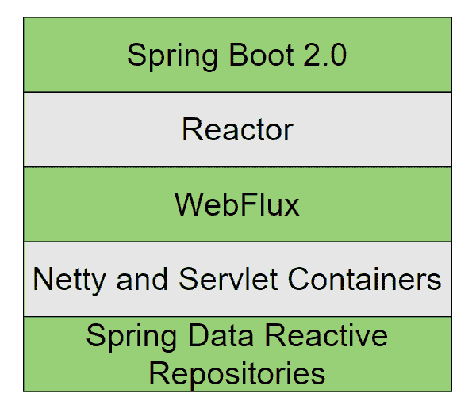
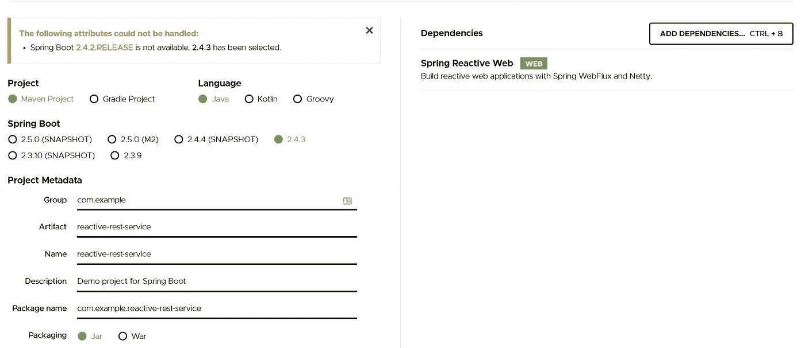

# Spring WebFlux 教程:如何构建一个反应式 web 应用程序

> 原文：<https://medium.com/javarevisited/spring-webflux-tutorial-how-to-build-a-reactive-web-app-1132e4255406?source=collection_archive---------1----------------------->

[](https://www.educative.io/courses/software-architecture-in-java-design-development?affiliate_id=5073518643380224)

图片来源:作者

反应式系统允许**无与伦比的响应性和可伸缩性**，这是我们在高数据流世界中所需要的。然而，反应式系统需要经过专门训练的工具和开发人员来实现这些独特的程序架构。spring web flux with Project Reactor 是一个专门为满足现代公司的反应需求而构建的框架。

今天，我们将帮助您开始使用 **WebFlux** ，向您解释它如何与其他反应式堆栈工具配合，有何不同，以及如何制作您的第一个应用。

**下面是我们今天要讲的内容:**

*   什么是反应式系统？
*   什么是项目反应堆？
*   什么是 Spring WebFlux？
*   Spring WebFlux 的显著特征
*   Spring WebFlux 入门
*   你学习的下一步

# 什么是反应式系统？

反应式系统是用反应式架构模式设计的系统，该模式优先使用松散耦合、灵活且可伸缩的组件。它们的设计还考虑到了**故障解决方案**，以确保即使一个系统出现故障，大部分系统仍将运行。

**反应式系统关注:**

*   最重要的是，反应式系统应该对任何用户输入做出快速响应。反应式系统的倡导者认为，反应性有助于优化系统的所有其他部分，从数据收集到用户体验。
*   **弹性**:反应式系统的设计应能预见系统故障。反应式系统预计组件最终会发生故障，并设计松散耦合的系统，即使几个单独的部分停止工作，这些系统也可以保持活动。
*   **弹性**:反应式系统应该通过伸缩来适应工作负载的大小，以满足需求。许多反应式系统还将使用预测性缩放来预测和准备突然转变。实现弹性的关键是消除任何瓶颈，并构建可以按需共享或复制组件的系统。
*   **消息驱动的通信**:反应式系统的所有组件都是松散耦合的，每个组件之间都有严格的边界。您的系统应该通过显式消息传递跨越这些界限进行通信。这些消息让不同的组件了解失败，并帮助它们将工作流委托给可以处理它的组件。

反应式和其他 web 模式之间最显著的区别是反应式系统可以一次执行多个未阻塞的调用，而不是让一些调用等待其他调用。因此，反应式系统加快了性能和响应速度，因为 web 应用程序的每一部分都可以比等待另一部分更快地完成自己的工作。

> *简而言之，反应式系统使用松散耦合、无阻塞的组件来提高性能、用户体验和错误处理。*

# 什么是项目反应堆？

Project Reactor 是一个由 Pivotal 构建的框架，由 Spring 提供动力。它实现了反应式 API 模式，最著名的是反应式流规范。

如果你熟悉 [Java 8 Streams](https://www.educative.io/courses/java-8-lambdas-stream-api-beyond?affiliate_id=5073518643380224) ，你会很快发现 Stream 和 Flux(或者它的单元素版本，Mono)之间有很多相似之处。它们之间的主要区别在于，Fluxes 和 Monos 遵循一种`publisher-subscriber`模式并实现背压，而 Stream API 则不是。

> ***背压*** *是数据端点向数据生产者发出信号，告知其正在接收过多数据的一种方式。这允许更好的流量管理和分配，因为它防止单个组件超负荷工作。*

使用反应器的主要优点是您可以完全控制数据流。当订阅者准备好处理信息时，您可以依靠订阅者请求更多信息的能力，或者在发布者端缓冲一些结果，甚至使用无背压的完全推送方法。

在我们的反应堆中，它位于 Spring Boot 2.0 之下，WebFlux 之上:

[](https://www.java67.com/2018/06/5-best-courses-to-learn-spring-boot-in.html)

图片来源:作者

> ***Stack:****tech Stack 是由* [*软件工具*](/javarevisited/10-tools-and-libraries-every-software-developers-should-learn-e05e636a5577) *和* [*编程语言*](/javarevisited/top-5-programming-languages-for-web-development-in-2021-f6fd4f564eb6) *组合而成，用于创建 web 或移动应用程序。反应式堆栈是相同的，但用于创建反应式应用程序。*

# 什么是 Spring WebFlux？

Spring WebFlux 是一个完全非阻塞的、基于注释的 web 框架，构建在 Project Reactor 之上，使得在 HTTP 层上构建反应式应用成为可能。WebFlux 使用一个新的**路由器功能**特性来将函数式编程应用到 web 层，并绕过声明式控制器和 RequestMappings。WebFlux 要求您导入 Reactor 作为核心依赖项。

WebFlux 是在 Spring 5 中添加的，作为对 Spring MVC[的一种反应式替代，增加了对以下内容的支持:](/javarevisited/21-spring-mvc-rest-interview-questions-answers-for-beginners-and-experienced-developers-21ad3d4c9b82)

*   **非阻塞线程**:完成指定任务而不等待前面任务完成的并发线程。
*   **反应式流 API** :一个标准化的工具，包括了带有非阻塞背压的异步流处理选项。
*   **异步数据处理**:在后台处理数据，用户可以继续使用正常的应用功能而不会中断。

最终，WebFlux 放弃了 SpringMVCs 的每请求线程模型，而是使用多事件循环无阻塞模型来实现反应式、可伸缩的应用。由于支持 Netty、Undertow 和 Servlet 3.1+容器等流行的服务器，WebFlux 已经成为反应式堆栈的关键部分。

# Spring WebFlux 的显著特征

# 路由器功能

`RouterFunction`是标准 Spring MVC 中使用的`@RequestMapping`和`@Controller`注释样式的功能替代。

我们可以使用它将请求路由到处理函数:

```
@RestController
public class ProductController {
    @RequestMapping("/product")
    public List<Product> productListing() {
        return ps.findAll();
    }
}@Bean
public RouterFunction<ServerResponse> productListing(ProductService ps) {
    return route().GET("/product", req -> ok().body(ps.findAll()))
      .build();
}
```

您可以使用`RouterFunctions.route()`来创建路由，而不是编写一个完整的路由器函数。路由被注册为 Spring beans，因此可以在任何配置类中创建。

路由器功能避免了由请求映射的多步骤过程引起的潜在副作用，而是将其简化为直接的路由器/处理程序链。这允许反应式编程的函数式编程实现。

> `*RequestMapping*` *和* `*Controller*` *注释样式在 WebFlux 中仍然有效，如果你更习惯旧的样式，* `*RouterFunctions*` *只是你的解决方案的一个新选项。*

# 网络客户端

WebClient 是 WebFlux 的反应式 web 客户端，构建自众所周知的`RestTemplate`。它是一个接口，表示 web 请求的主要入口点，支持同步和异步操作。WebClient 主要用于被动的后端到后端通信。

您可以通过使用 Maven 导入标准 WebFlux 依赖项来构建和创建 WebClient 实例:

```
<dependency>
    <groupId>org.springframework.boot</groupId>
    <artifactId>spring-boot-starter-webflux</artifactId>
</dependency>WebClient client = WebClient.create();
```

# 活性蒸汽 API

反应流 API 是一个导入的函数集合，允许更智能的数据流。它具有对背压和异步处理的内置支持，确保应用程序最有效地利用计算机和组件资源。

**反应流 API 中有四个主要接口:**

*   **发布者**:根据链接`Subscribers`的需求向其发出事件。充当`subscribers`可以观察事件的中心链接点。
*   **订阅方**:接收并处理`Publisher`发出的事件。多个`Subscribers`可以链接到单个`Publisher`，对同一事件做出不同的响应。可以将订户设置为做出反应:
*   `onNext`，当它接收到下一个事件时。
*   `onSubscribe`，当添加新用户时
*   `onError`，当另一个用户出现错误时
*   `onComplete`，当另一个用户完成其任务时
*   **订阅**:定义选中的`Publisher`和`Subscriber`之间的关系。每个`Subscriber`只能链接到一个`Publisher`。
*   **处理器**:表示`Subscriber`的加工阶段

# 服务器

Tomcat、Jetty、Servlet 3.1+容器以及 Netty 和 Undertow 等非 Servlet 运行时都支持 WebFlux。Netty 最常用于**异步和非阻塞设计**，因此 WebFlux 将默认使用它。只需对你的 [Maven](/javarevisited/6-best-maven-courses-for-beginners-in-2020-23ea3cba89) 或 [Gradle](/javarevisited/5-best-gradle-courses-and-books-to-learn-in-2021-93f49ce8ff8e) 构建软件进行简单的改动，你就可以在这些服务器选项之间轻松切换。

这使得 WebFlux 在它可以使用的技术方面具有高度的通用性，并允许您在现有基础设施上轻松实现它。

# 并发模型

WebFlux 是基于非阻塞思想构建的，因此使用了与 Spring MVC 不同的并发编程模型。

Spring MVC 假设线程将被阻塞，并使用一个大的线程池在阻塞期间保持移动。这个更大的线程池使得 MVC 更加资源密集，因为计算机硬件必须同时保持更多的线程运行。

WebFlux 使用一个小型线程池,因为它假设你永远不需要为了避免阻塞而放弃工作。这些被称为**事件循环工作线程**的线程数量固定，循环处理传入请求的速度比 MVC 线程更快。这意味着 WebFlux 更有效地使用计算机资源，因为活动线程总是在工作。

# Spring WebFlux 安全性

WebFlux 使用 Spring Security 来实现认证和授权协议。Spring Security 使用`WebFilter`根据经过认证的用户列表检查请求，或者可以设置为自动拒绝符合标准(如来源或请求类型)的请求。

```
@EnableWebFluxSecurity
public class HelloWebFluxSecurityConfig {
    @Bean
    public MapReactiveUserDetailsService userDetailsService() {
        UserDetails user = User.withDefaultPasswordEncoder()
            .username("user")
            .password("user")
            .roles("USER")
            .build();
        return new MapReactiveUserDetailsService(user);
    }
}
```

这是将所有设置设置为默认值的最小实现。这里我们可以看到用户有一个`username`、一个`password`和一个或多个`roles`标签，这些标签允许他们进行一定级别的访问。

# Spring WebFlux 入门

现在让我们动手操作 WebFlux。首先，我们需要建立一个项目。
我们将使用`Spring Initializr`生成一个带有`Spring Reactive Web`依赖项的 Maven 构建。

[](https://www.educative.io/courses/software-architecture-in-java-design-development?affiliate_id=5073518643380224)

图片来源:作者

这将生成一个类似于以下内容的`pom.xml`文件:

```
<?xml version="1.0" encoding="UTF-8"?>
<project  xmlns:xsi="http://www.w3.org/2001/XMLSchema-instance"
    xsi:schemaLocation="http://maven.apache.org/POM/4.0.0 https://maven.apache.org/xsd/maven-4.0.0.xsd">
    <modelVersion>4.0.0</modelVersion>
    <parent>
        <groupId>org.springframework.boot</groupId>
        <artifactId>spring-boot-starter-parent</artifactId>
        <version>2.4.2</version>
        <relativePath/> <!-- lookup parent from repository -->
    </parent>
    <groupId>com.example</groupId>
    <artifactId>reactive-rest-service</artifactId>
    <version>0.0.1-SNAPSHOT</version>
    <name>reactive-rest-service</name>
    <description>Demo project for Spring Boot</description>
    <properties>
        <java.version>1.8</java.version>
    </properties>
    <dependencies>
        <dependency>
            <groupId>org.springframework.boot</groupId>
            <artifactId>spring-boot-starter-webflux</artifactId>
        </dependency>
        <dependency>
            <groupId>org.springframework.boot</groupId>
            <artifactId>spring-boot-starter-test</artifactId>
            <scope>test</scope>
        </dependency>
        <dependency>
            <groupId>io.projectreactor</groupId>
            <artifactId>reactor-test</artifactId>
            <scope>test</scope>
        </dependency>
    </dependencies>
    <build>
        <plugins>
            <plugin>
                <groupId>org.springframework.boot</groupId>
                <artifactId>spring-boot-maven-plugin</artifactId>
            </plugin>
        </plugins>
    </build>
</project>
```

现在，您已经拥有了继续工作所需的一切！从这里我们将添加一些组件来制作一个`Hello-World`应用程序。我们将只添加一个路由器和一个处理器，这是创建我们的基本 WebFlux 应用程序的最低要求。

# 路由器

首先，我们将创建一个示例路由器，在 URL `http://localhost:8080/example`显示一次我们的文本。这定义了用户如何请求我们将在处理程序中定义的数据。

```
@Configuration
public class ExampleRouter {
  @Bean
  public RouterFunction<ServerResponse> routeExample (ExampleHandler exampleHandler) {
    return RouterFunctions
        .route(RequestPredicates.GET("/example").and(RequestPredicates.accept(MediaType.TEXT_PLAIN)), exampleHandler::hello);
  }
}
```

# 处理者

现在我们将添加一个处理程序来监听任何请求`/example`路由的用户。一旦路由器识别出请求的路径匹配，它就将用户发送给处理程序。我们的处理程序接收消息，并把用户带到一个带有我们问候的页面。

```
@Component
public class ExampleHandler {
  public Mono<ServerResponse> hello(ServerRequest request) {
    return ServerResponse.ok().contentType(MediaType.TEXT_PLAIN)
         .body(BodyInserters.fromObject("Hello, Spring WebFlux Example!"));
  }
}
```

# 运行应用程序

现在我们将通过执行 Maven 目标`spring-boot:run`来运行我们的应用程序。您现在可以在浏览器中访问`http://localhost:8080/example`,找到:

```
Hello, Spring WebFlux Example!
```

# 你学习的下一步

现在你已经完成了你的第一个基础应用，你已经准备好进入一些更高级的主题和应用。

**接下来要探讨的一些概念是:**

*   反应控制器
*   储存库层
*   [带 WebFlux 的角度](https://www.educative.io/blog/angularjs-tutorial)
*   MongoDB 和 WebFlux
*   经典和功能端点

*快乐学习！*